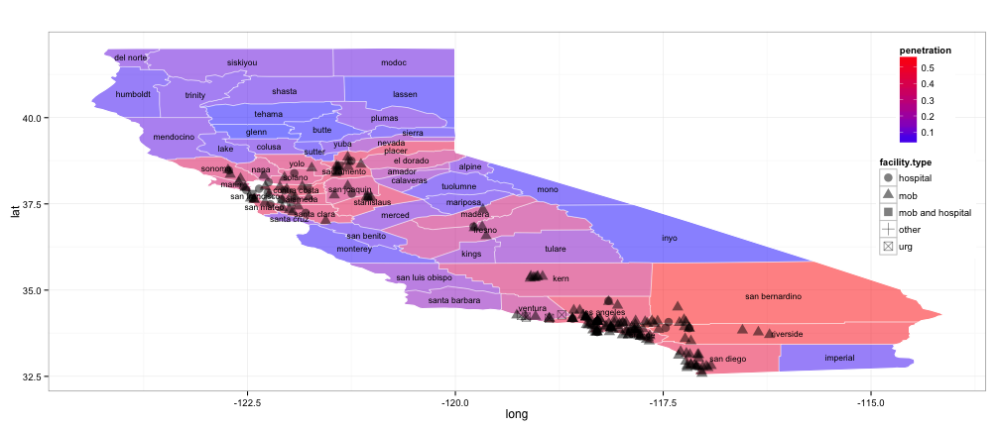
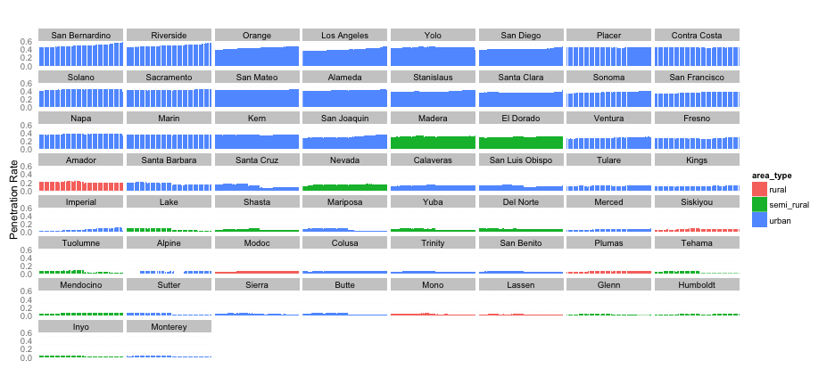

## Data

- CMS.gov
    + Built an automated web scraper to gather MA CMS data
        + 80 zip files
        + Unzips, compiles, and outputs all data in one csv file
    + Data frame 254,566 x 12

- Other
    + Geo code data

--- .class #id 

## Exploratory Data Analysis

 

--- .class #id 

## Heat Map of MA Penetration Rates by CA County: Jan 2015

 

--- .class #id 

## MA Penetration Rates by CA Counties by Time: 
## 2008 to 2015

 

--- .class #id 

## Many Dimensions to Consider...

### It would be interesting to see how each county has changed over time in several dimensions simultaneously.  
 
### Let's look at a motion chart... 

--- .class #id 

## Let's Look at a Motion Chart

<!-- MotionChart generated in R 3.1.2 by googleVis 0.5.8 package -->
<!-- Tue Feb  3 10:52:29 2015 -->

<!-- jsHeader -->
<script type="text/javascript">
 
// jsData 
function gvisDataMotionChartID234034051d4d () {
var data = new google.visualization.DataTable();
var datajson =
[
 [
 "San Bernardino",
new Date(2015,0,1),
256302,
147615,
0.5759416626,
"urban",
"SoCal" 
],
[
 "San Bernardino",
new Date(2014,10,1),
253434,
144046,
0.5683767766,
"urban",
"SoCal" 
],
[
 "San Bernardino",
new Date(2014,11,1),
255492,
144921,
0.5672232399,
"urban",
"SoCal" 
],
[
 "San Bernardino",
new Date(2014,9,1),
253759,
143012,
0.5635740998,
"urban",
"SoCal" 
],
[
 "San Bernardino",
new Date(2014,7,1),
250696,
140852,
0.5618438268,
"urban",
"SoCal" 
],
[
 "San Bernardino",
new Date(2014,8,1),
252884,
141845,
0.5609093497,
"urban",
"SoCal" 
],
[
 "Riverside",
new Date(2015,0,1),
319748,
179114,
0.5601723858,
"urban",
"SoCal" 
],
[
 "San Bernardino",
new Date(2014,6,1),
250995,
139640,
0.5563457439,
"urban",
"SoCal" 
],
[
 "Riverside",
new Date(2014,10,1),
316113,
175438,
0.5549850844,
"urban",
"SoCal" 
],
[
 "San Bernardino",
new Date(2014,5,1),
250026,
138751,
0.5549462856,
"urban",
"SoCal" 
],
[
 "Riverside",
new Date(2014,11,1),
318513,
176506,
0.5541563453,
"urban",
"SoCal" 
],
[
 "San Bernardino",
new Date(2014,4,1),
249528,
137517,
0.5511084928,
"urban",
"SoCal" 
],
[
 "Riverside",
new Date(2014,9,1),
316461,
174350,
0.5509367663,
"urban",
"SoCal" 
],
[
 "Riverside",
new Date(2014,7,1),
313139,
172203,
0.5499251131,
"urban",
"SoCal" 
],
[
 "Riverside",
new Date(2014,8,1),
315591,
173300,
0.5491284606,
"urban",
"SoCal" 
],
[
 "Riverside",
new Date(2014,6,1),
313518,
170999,
0.5454200397,
"urban",
"SoCal" 
],
[
 "Riverside",
new Date(2014,5,1),
312509,
169655,
0.542880365,
"urban",
"SoCal" 
],
[
 "Riverside",
new Date(2014,4,1),
311931,
168305,
0.539558428,
"urban",
"SoCal" 
],
[
 "San Bernardino",
new Date(2014,3,1),
248553,
132817,
0.5343608808,
"urban",
"SoCal" 
],
[
 "San Bernardino",
new Date(2014,2,1),
247626,
132112,
0.5335142513,
"urban",
"SoCal" 
],
[
 "San Bernardino",
new Date(2014,1,1),
246844,
131596,
0.5331140315,
"urban",
"SoCal" 
],
[
 "San Bernardino",
new Date(2014,0,1),
246362,
130213,
0.528543363,
"urban",
"SoCal" 
],
[
 "Riverside",
new Date(2014,3,1),
310705,
163883,
0.5274553033,
"urban",
"SoCal" 
],
[
 "Riverside",
new Date(2014,2,1),
309763,
163121,
0.5265993679,
"urban",
"SoCal" 
],
[
 "Riverside",
new Date(2014,1,1),
308803,
162571,
0.5264553777,
"urban",
"SoCal" 
],
[
 "San Bernardino",
new Date(2013,10,1),
243578,
128045,
0.5256837645,
"urban",
"SoCal" 
],
[
 "San Bernardino",
new Date(2013,11,1),
245571,
128630,
0.5237996343,
"urban",
"SoCal" 
],
[
 "San Bernardino",
new Date(2013,9,1),
243947,
127673,
0.5233636815,
"urban",
"SoCal" 
],
[
 "San Bernardino",
new Date(2013,5,1),
239336,
125095,
0.5226752348,
"urban",
"SoCal" 
],
[
 "San Bernardino",
new Date(2013,8,1),
243249,
127086,
0.522452302,
"urban",
"SoCal" 
],
[
 "San Bernardino",
new Date(2013,7,1),
242667,
126503,
0.5213028554,
"urban",
"SoCal" 
],
[
 "San Bernardino",
new Date(2013,6,1),
241496,
125843,
0.5210976579,
"urban",
"SoCal" 
],
[
 "Riverside",
new Date(2014,0,1),
308052,
160494,
0.5209964551,
"urban",
"SoCal" 
],
[
 "San Bernardino",
new Date(2013,4,1),
239668,
124528,
0.5195854265,
"urban",
"SoCal" 
],
[
 "San Bernardino",
new Date(2013,3,1),
238935,
123966,
0.5188272961,
"urban",
"SoCal" 
],
[
 "Riverside",
new Date(2013,10,1),
304699,
158045,
0.5186922176,
"urban",
"SoCal" 
],
[
 "San Bernardino",
new Date(2013,2,1),
238582,
123475,
0.5175369475,
"urban",
"SoCal" 
],
[
 "Riverside",
new Date(2013,5,1),
299682,
155062,
0.5174218004,
"urban",
"SoCal" 
],
[
 "San Bernardino",
new Date(2013,1,1),
237603,
122871,
0.517127309,
"urban",
"SoCal" 
],
[
 "Riverside",
new Date(2013,11,1),
307225,
158834,
0.5169956872,
"urban",
"SoCal" 
],
[
 "Riverside",
new Date(2013,9,1),
305084,
157639,
0.5167068742,
"urban",
"SoCal" 
],
[
 "Riverside",
new Date(2013,8,1),
304053,
157061,
0.5165579685,
"urban",
"SoCal" 
],
[
 "Riverside",
new Date(2013,7,1),
303348,
156580,
0.5161728444,
"urban",
"SoCal" 
],
[
 "Riverside",
new Date(2013,6,1),
301979,
155851,
0.5160988016,
"urban",
"SoCal" 
],
[
 "Riverside",
new Date(2013,4,1),
300121,
154512,
0.514832351,
"urban",
"SoCal" 
],
[
 "Riverside",
new Date(2013,3,1),
299069,
153946,
0.5147507766,
"urban",
"SoCal" 
],
[
 "Riverside",
new Date(2013,2,1),
298581,
153384,
0.5137098476,
"urban",
"SoCal" 
],
[
 "Riverside",
new Date(2013,1,1),
297609,
152872,
0.5136672614,
"urban",
"SoCal" 
],
[
 "San Bernardino",
new Date(2013,0,1),
236675,
120647,
0.5097581071,
"urban",
"SoCal" 
],
[
 "Riverside",
new Date(2013,0,1),
296323,
150899,
0.5092382299,
"urban",
"SoCal" 
],
[
 "San Bernardino",
new Date(2012,11,1),
235695,
119420,
0.506671758,
"urban",
"SoCal" 
],
[
 "San Bernardino",
new Date(2012,10,1),
235000,
118674,
0.5049957447,
"urban",
"SoCal" 
],
[
 "San Bernardino",
new Date(2012,9,1),
234125,
118183,
0.504785905,
"urban",
"SoCal" 
],
[
 "San Bernardino",
new Date(2012,8,1),
233144,
117597,
0.5043964245,
"urban",
"SoCal" 
],
[
 "San Bernardino",
new Date(2012,4,1),
228047,
115007,
0.5043127075,
"urban",
"SoCal" 
],
[
 "San Bernardino",
new Date(2012,7,1),
232239,
117001,
0.5037956588,
"urban",
"SoCal" 
],
[
 "Riverside",
new Date(2012,4,1),
286258,
143839,
0.50248028,
"urban",
"SoCal" 
],
[
 "Riverside",
new Date(2012,11,1),
295334,
148382,
0.5024209878,
"urban",
"SoCal" 
],
[
 "San Bernardino",
new Date(2012,6,1),
231257,
116181,
0.5023891169,
"urban",
"SoCal" 
],
[
 "Riverside",
new Date(2012,9,1),
293233,
147157,
0.5018432441,
"urban",
"SoCal" 
],
[
 "San Bernardino",
new Date(2012,3,1),
228272,
114523,
0.5016953459,
"urban",
"SoCal" 
],
[
 "Riverside",
new Date(2012,8,1),
292224,
146538,
0.5014577858,
"urban",
"SoCal" 
],
[
 "Riverside",
new Date(2012,10,1),
294481,
147609,
0.5012513541,
"urban",
"SoCal" 
],
[
 "Riverside",
new Date(2012,7,1),
291101,
145843,
0.5010048059,
"urban",
"SoCal" 
],
[
 "San Bernardino",
new Date(2012,2,1),
227497,
113937,
0.5008285824,
"urban",
"SoCal" 
],
[
 "Riverside",
new Date(2012,6,1),
289891,
145091,
0.5005019128,
"urban",
"SoCal" 
],
[
 "San Bernardino",
new Date(2012,1,1),
226645,
113429,
0.5004698979,
"urban",
"SoCal" 
],
[
 "San Bernardino",
new Date(2012,5,1),
230979,
115569,
0.5003441871,
"urban",
"SoCal" 
],
[
 "Riverside",
new Date(2012,2,1),
285633,
142784,
0.4998862176,
"urban",
"SoCal" 
],
[
 "Riverside",
new Date(2012,3,1),
286627,
143269,
0.499844746,
"urban",
"SoCal" 
],
[
 "Riverside",
new Date(2012,1,1),
284695,
142161,
0.499344913,
"urban",
"SoCal" 
],
[
 "Riverside",
new Date(2012,5,1),
289738,
144497,
0.4987160814,
"urban",
"SoCal" 
],
[
 "Riverside",
new Date(2011,4,1),
274234,
135666,
0.4947088982,
"urban",
"SoCal" 
],
[
 "Riverside",
new Date(2011,1,1),
273435,
134893,
0.4933274819,
"urban",
"SoCal" 
],
[
 "San Bernardino",
new Date(2012,0,1),
225715,
111342,
0.4932857807,
"urban",
"SoCal" 
],
[
 "Riverside",
new Date(2011,8,1),
278839,
137409,
0.4927897461,
"urban",
"SoCal" 
],
[
 "Riverside",
new Date(2011,3,1),
274784,
135403,
0.4927615873,
"urban",
"SoCal" 
],
[
 "Riverside",
new Date(2011,9,1),
279905,
137790,
0.4922741644,
"urban",
"SoCal" 
],
[
 "Riverside",
new Date(2011,5,1),
276285,
135887,
0.4918363284,
"urban",
"SoCal" 
],
[
 "Riverside",
new Date(2011,6,1),
277291,
136345,
0.4917036615,
"urban",
"SoCal" 
],
[
 "Riverside",
new Date(2011,7,1),
278433,
136855,
0.4915186059,
"urban",
"SoCal" 
],
[
 "San Bernardino",
new Date(2011,4,1),
217707,
106969,
0.4913438704,
"urban",
"SoCal" 
],
[
 "Riverside",
new Date(2011,11,1),
282353,
138727,
0.4913246893,
"urban",
"SoCal" 
],
[
 "Riverside",
new Date(2011,10,1),
281174,
138126,
0.4912474126,
"urban",
"SoCal" 
],
[
 "San Bernardino",
new Date(2011,11,1),
224851,
110352,
0.4907783377,
"urban",
"SoCal" 
],
[
 "San Bernardino",
new Date(2011,8,1),
221612,
108705,
0.4905194665,
"urban",
"SoCal" 
],
[
 "Riverside",
new Date(2012,0,1),
283673,
139032,
0.4901136167,
"urban",
"SoCal" 
],
[
 "San Bernardino",
new Date(2011,9,1),
222779,
109162,
0.4900013017,
"urban",
"SoCal" 
],
[
 "San Bernardino",
new Date(2011,10,1),
223850,
109628,
0.4897386643,
"urban",
"SoCal" 
],
[
 "San Bernardino",
new Date(2011,7,1),
221244,
108298,
0.4894957603,
"urban",
"SoCal" 
],
[
 "San Bernardino",
new Date(2011,1,1),
216819,
106116,
0.4894220525,
"urban",
"SoCal" 
],
[
 "San Bernardino",
new Date(2011,3,1),
217976,
106653,
0.4892878115,
"urban",
"SoCal" 
],
[
 "San Bernardino",
new Date(2011,6,1),
220353,
107745,
0.4889654327,
"urban",
"SoCal" 
],
[
 "San Bernardino",
new Date(2011,5,1),
219521,
107260,
0.4886092902,
"urban",
"SoCal" 
],
[
 "Riverside",
new Date(2011,0,1),
270462,
131135,
0.4848555435,
"urban",
"SoCal" 
],
[
 "San Bernardino",
new Date(2011,0,1),
214464,
103807,
0.4840299537,
"urban",
"SoCal" 
],
[
 "Riverside",
new Date(2010,10,1),
269696,
130436,
0.4836408401,
"urban",
"SoCal" 
],
[
 "Riverside",
new Date(2010,7,1),
267782,
129501,
0.4836060676,
"urban",
"SoCal" 
],
[
 "Riverside",
new Date(2010,4,1),
266071,
128636,
0.4834649398,
"urban",
"SoCal" 
],
[
 "Riverside",
new Date(2010,11,1),
270532,
130703,
0.4831332338,
"urban",
"SoCal" 
],
[
 "Riverside",
new Date(2010,6,1),
267413,
129100,
0.4827738367,
"urban",
"SoCal" 
],
[
 "Riverside",
new Date(2010,5,1),
266735,
128738,
0.4826438225,
"urban",
"SoCal" 
],
[
 "Riverside",
new Date(2010,8,1),
268928,
129790,
0.4826198834,
"urban",
"SoCal" 
],
[
 "Riverside",
new Date(2010,9,1),
269666,
130076,
0.4823596597,
"urban",
"SoCal" 
],
[
 "San Bernardino",
new Date(2010,11,1),
214624,
103448,
0.4819964216,
"urban",
"SoCal" 
],
[
 "Riverside",
new Date(2010,3,1),
265353,
127850,
0.4818110215,
"urban",
"SoCal" 
],
[
 "San Bernardino",
new Date(2010,10,1),
213977,
103012,
0.481416227,
"urban",
"SoCal" 
],
[
 "San Bernardino",
new Date(2010,7,1),
212411,
102055,
0.4804600515,
"urban",
"SoCal" 
],
[
 "San Bernardino",
new Date(2010,9,1),
213873,
102705,
0.4802148939,
"urban",
"SoCal" 
],
[
 "San Bernardino",
new Date(2010,8,1),
213303,
102385,
0.4799979372,
"urban",
"SoCal" 
],
[
 "San Bernardino",
new Date(2010,5,1),
211342,
101395,
0.4797673912,
"urban",
"SoCal" 
],
[
 "San Bernardino",
new Date(2010,4,1),
210724,
101080,
0.4796795809,
"urban",
"SoCal" 
],
[
 "San Bernardino",
new Date(2010,6,1),
211965,
101666,
0.4796357889,
"urban",
"SoCal" 
],
[
 "San Bernardino",
new Date(2010,3,1),
210105,
100556,
0.4785987958,
"urban",
"SoCal" 
],
[
 "Riverside",
new Date(2010,2,1),
266731,
126895,
0.4757414774,
"urban",
"SoCal" 
],
[
 "Riverside",
new Date(2010,1,1),
265765,
126072,
0.474373977,
"urban",
"SoCal" 
],
[
 "San Bernardino",
new Date(2010,2,1),
210181,
99629,
0.4740152535,
"urban",
"SoCal" 
],
[
 "San Bernardino",
new Date(2010,1,1),
209463,
99099,
0.4731098094,
"urban",
"SoCal" 
],
[
 "Orange",
new Date(2015,0,1),
441419,
208034,
0.4712846525,
"urban",
"SoCal" 
],
[
 "Los Angeles",
new Date(2015,0,1),
1340595,
630187,
0.4700800764,
"urban",
"SoCal" 
],
[
 "Orange",
new Date(2014,1,1),
426617,
200534,
0.47005628,
"urban",
"SoCal" 
],
[
 "Orange",
new Date(2014,2,1),
428029,
200975,
0.4695359427,
"urban",
"SoCal" 
],
[
 "Orange",
new Date(2014,7,1),
432723,
203128,
0.4694180804,
"urban",
"SoCal" 
],
[
 "Orange",
new Date(2014,3,1),
429279,
201439,
0.4692496022,
"urban",
"SoCal" 
],
[
 "Orange",
new Date(2014,10,1),
436723,
204717,
0.468757084,
"urban",
"SoCal" 
],
[
 "Orange",
new Date(2014,4,1),
430877,
201823,
0.4684004948,
"urban",
"SoCal" 
],
[
 "Los Angeles",
new Date(2014,11,1),
1336467,
625754,
0.4682150775,
"urban",
"SoCal" 
],
[
 "Orange",
new Date(2014,6,1),
433177,
202810,
0.4681919862,
"urban",
"SoCal" 
],
[
 "Orange",
new Date(2014,5,1),
431769,
202147,
0.4681832183,
"urban",
"SoCal" 
],
[
 "Los Angeles",
new Date(2014,10,1),
1327911,
621087,
0.4677173395,
"urban",
"SoCal" 
],
[
 "Yolo",
new Date(2010,10,1),
22625,
10580,
0.4676243094,
"urban",
"NorCal" 
],
[
 "Yolo",
new Date(2010,11,1),
22688,
10602,
0.4672954866,
"urban",
"NorCal" 
],
[
 "Orange",
new Date(2014,8,1),
436037,
203678,
0.4671117359,
"urban",
"SoCal" 
],
[
 "Orange",
new Date(2014,9,1),
437311,
204229,
0.4670108916,
"urban",
"SoCal" 
],
[
 "Riverside",
new Date(2010,0,1),
266182,
124182,
0.466530419,
"urban",
"SoCal" 
],
[
 "Orange",
new Date(2014,11,1),
439930,
205160,
0.4663469188,
"urban",
"SoCal" 
],
[
 "Riverside",
new Date(2009,8,1),
262197,
122191,
0.4660274526,
"urban",
"SoCal" 
],
[
 "Yolo",
new Date(2011,11,1),
23644,
11018,
0.4659956014,
"urban",
"NorCal" 
],
[
 "Riverside",
new Date(2009,10,1),
263581,
122815,
0.465947849,
"urban",
"SoCal" 
],
[
 "Orange",
new Date(2014,0,1),
425764,
198263,
0.4656640768,
"urban",
"SoCal" 
],
[
 "San Bernardino",
new Date(2010,0,1),
209889,
97707,
0.4655174878,
"urban",
"SoCal" 
],
[
 "Yolo",
new Date(2010,9,1),
22632,
10532,
0.465358784,
"urban",
"NorCal" 
],
[
 "Riverside",
new Date(2009,11,1),
264440,
123034,
0.4652624414,
"urban",
"SoCal" 
],
[
 "Yolo",
new Date(2011,9,1),
23414,
10891,
0.4651490561,
"urban",
"NorCal" 
],
[
 "Yolo",
new Date(2011,10,1),
23541,
10946,
0.4649759993,
"urban",
"NorCal" 
],
[
 "Yolo",
new Date(2011,8,1),
23329,
10839,
0.464614857,
"urban",
"NorCal" 
],
[
 "San Diego",
new Date(2015,0,1),
461705,
214492,
0.4645650361,
"urban",
"SoCal" 
],
[
 "Riverside",
new Date(2009,7,1),
262601,
121958,
0.4644232124,
"urban",
"SoCal" 
],
[
 "Yolo",
new Date(2010,8,1),
22566,
10480,
0.4644154923,
"urban",
"NorCal" 
],
[
 "Riverside",
new Date(2009,9,1),
263978,
122552,
0.4642508088,
"urban",
"SoCal" 
],
[
 "Yolo",
new Date(2011,4,1),
22946,
10649,
0.4640896017,
"urban",
"NorCal" 
],
[
 "Riverside",
new Date(2009,6,1),
261798,
121460,
0.4639454847,
"urban",
"SoCal" 
],
[
 "Yolo",
new Date(2010,7,1),
22463,
10418,
0.4637848907,
"urban",
"NorCal" 
],
[
 "Riverside",
new Date(2009,4,1),
260355,
120703,
0.4636093027,
"urban",
"SoCal" 
],
[
 "San Bernardino",
new Date(2009,8,1),
206758,
95853,
0.4635999574,
"urban",
"SoCal" 
],
[
 "Riverside",
new Date(2009,5,1),
260907,
120950,
0.4635751436,
"urban",
"SoCal" 
],
[
 "San Bernardino",
new Date(2009,11,1),
208469,
96635,
0.4635461388,
"urban",
"SoCal" 
],
[
 "Orange",
new Date(2013,10,1),
421273,
195218,
0.4634002179,
"urban",
"SoCal" 
],
[
 "Los Angeles",
new Date(2014,9,1),
1329731,
615884,
0.4631643543,
"urban",
"SoCal" 
],
[
 "Yolo",
new Date(2011,6,1),
23172,
10731,
0.4631020197,
"urban",
"NorCal" 
],
[
 "San Bernardino",
new Date(2009,10,1),
207923,
96273,
0.4630223689,
"urban",
"SoCal" 
],
[
 "Yolo",
new Date(2011,7,1),
23286,
10774,
0.4626814395,
"urban",
"NorCal" 
],
[
 "Riverside",
new Date(2009,1,1),
257183,
118965,
0.4625694544,
"urban",
"SoCal" 
],
[
 "Yolo",
new Date(2011,5,1),
23066,
10666,
0.4624122084,
"urban",
"NorCal" 
],
[
 "Riverside",
new Date(2009,3,1),
259646,
120020,
0.4622447486,
"urban",
"SoCal" 
],
[
 "Yolo",
new Date(2012,4,1),
23920,
11053,
0.4620819398,
"urban",
"NorCal" 
],
[
 "Orange",
new Date(2013,11,1),
424551,
196123,
0.4619539231,
"urban",
"SoCal" 
],
[
 "Orange",
new Date(2013,9,1),
421851,
194825,
0.4618336806,
"urban",
"SoCal" 
],
[
 "Yolo",
new Date(2011,3,1),
22965,
10605,
0.4617896799,
"urban",
"NorCal" 
],
[
 "Placer",
new Date(2010,3,1),
57296,
26456,
0.46174253,
"urban",
"NorCal" 
],
[
 "Riverside",
new Date(2009,2,1),
259064,
119620,
0.4617391841,
"urban",
"SoCal" 
],
[
 "Yolo",
new Date(2010,4,1),
22342,
10316,
0.4617312685,
"urban",
"NorCal" 
],
[
 "Orange",
new Date(2013,5,1),
414709,
191469,
0.461694827,
"urban",
"SoCal" 
],
[
 "Placer",
new Date(2010,4,1),
57518,
26552,
0.461629403,
"urban",
"NorCal" 
],
[
 "San Bernardino",
new Date(2009,9,1),
208301,
96093,
0.4613179966,
"urban",
"SoCal" 
],
[
 "San Bernardino",
new Date(2009,7,1),
207183,
95575,
0.4613071536,
"urban",
"SoCal" 
],
[
 "Orange",
new Date(2013,8,1),
420628,
194038,
0.4613054766,
"urban",
"SoCal" 
],
[
 "Yolo",
new Date(2010,6,1),
22452,
10357,
0.4612952076,
"urban",
"NorCal" 
],
[
 "Yolo",
new Date(2013,1,1),
24978,
11518,
0.4611257907,
"urban",
"NorCal" 
],
[
 "Orange",
new Date(2013,7,1),
419565,
193333,
0.4607939175,
"urban",
"SoCal" 
],
[
 "Orange",
new Date(2013,6,1),
417746,
192488,
0.4607776017,
"urban",
"SoCal" 
],
[
 "San Bernardino",
new Date(2009,5,1),
205716,
94777,
0.4607176885,
"urban",
"SoCal" 
],
[
 "Yolo",
new Date(2011,1,1),
22785,
10497,
0.4606978275,
"urban",
"NorCal" 
],
[
 "San Bernardino",
new Date(2009,6,1),
206448,
95109,
0.4606922809,
"urban",
"SoCal" 
],
[
 "San Bernardino",
new Date(2009,4,1),
205235,
94549,
0.4606865301,
"urban",
"SoCal" 
],
[
 "Yolo",
new Date(2013,5,1),
25128,
11575,
0.4606415154,
"urban",
"NorCal" 
],
[
 "Yolo",
new Date(2013,0,1),
24860,
11450,
0.4605792438,
"urban",
"NorCal" 
],
[
 "Placer",
new Date(2010,5,1),
57723,
26576,
0.4604057308,
"urban",
"NorCal" 
],
[
 "Yolo",
new Date(2010,3,1),
22269,
10252,
0.4603709192,
"urban",
"NorCal" 
],
[
 "San Bernardino",
new Date(2009,1,1),
202740,
93322,
0.4603038374,
"urban",
"SoCal" 
],
[
 "Yolo",
new Date(2013,2,1),
25010,
11502,
0.4598960416,
"urban",
"NorCal" 
],
[
 "San Bernardino",
new Date(2009,3,1),
204705,
94096,
0.4596663491,
"urban",
"SoCal" 
],
[
 "Orange",
new Date(2013,4,1),
415222,
190831,
0.4595878831,
"urban",
"SoCal" 
],
[
 "Yolo",
new Date(2012,11,1),
24761,
11379,
0.4595533298,
"urban",
"NorCal" 
],
[
 "Orange",
new Date(2013,3,1),
414022,
190189,
0.4593693089,
"urban",
"SoCal" 
],
[
 "Yolo",
new Date(2012,3,1),
23948,
11000,
0.4593285452,
"urban",
"NorCal" 
],
[
 "Yolo",
new Date(2014,1,1),
26032,
11955,
0.4592424708,
"urban",
"NorCal" 
],
[
 "Placer",
new Date(2010,6,1),
57950,
26610,
0.459188956,
"urban",
"NorCal" 
],
[
 "Yolo",
new Date(2012,9,1),
24546,
11265,
0.4589342459,
"urban",
"NorCal" 
],
[
 "Placer",
new Date(2010,7,1),
58180,
26697,
0.4588690272,
"urban",
"NorCal" 
],
[
 "San Bernardino",
new Date(2009,2,1),
204201,
93682,
0.4587734634,
"urban",
"SoCal" 
],
[
 "Yolo",
new Date(2013,3,1),
25075,
11503,
0.4587437687,
"urban",
"NorCal" 
],
[
 "Yolo",
new Date(2012,6,1),
24229,
11114,
0.4587065087,
"urban",
"NorCal" 
],
[
 "Yolo",
new Date(2012,7,1),
24313,
11152,
0.4586846543,
"urban",
"NorCal" 
],
[
 "Yolo",
new Date(2012,2,1),
23873,
10949,
0.4586352783,
"urban",
"NorCal" 
],
[
 "Yolo",
new Date(2012,8,1),
24417,
11198,
0.4586148995,
"urban",
"NorCal" 
],
[
 "Contra Costa",
new Date(2014,10,1),
172684,
79186,
0.4585601445,
"urban",
"NorCal" 
],
[
 "Yolo",
new Date(2013,4,1),
25146,
11529,
0.4584824624,
"urban",
"NorCal" 
],
[
 "Orange",
new Date(2013,1,1),
412299,
189009,
0.4584270153,
"urban",
"SoCal" 
],
[
 "Orange",
new Date(2013,2,1),
413650,
189622,
0.4584117007,
"urban",
"SoCal" 
],
[
 "Contra Costa",
new Date(2014,7,1),
171070,
78411,
0.4583562284,
"urban",
"NorCal" 
],
[
 "Yolo",
new Date(2013,10,1),
25672,
11766,
0.458320349,
"urban",
"NorCal" 
],
[
 "Yolo",
new Date(2014,0,1),
26002,
11915,
0.458233982,
"urban",
"NorCal" 
],
[
 "Yolo",
new Date(2012,5,1),
24211,
11092,
0.4581388625,
"urban",
"NorCal" 
],
[
 "Yolo",
new Date(2012,10,1),
24663,
11298,
0.4580951222,
"urban",
"NorCal" 
],
[
 "Yolo",
new Date(2014,2,1),
26146,
11969,
0.457775568,
"urban",
"NorCal" 
],
[
 "Yolo",
new Date(2013,6,1),
25357,
11601,
0.4575068029,
"urban",
"NorCal" 
],
[
 "Contra Costa",
new Date(2015,0,1),
174560,
79858,
0.4574816682,
"urban",
"NorCal" 
],
[
 "Placer",
new Date(2010,10,1),
58684,
26846,
0.457467112,
"urban",
"NorCal" 
],
[
 "Placer",
new Date(2010,8,1),
58505,
26760,
0.4573968037,
"urban",
"NorCal" 
],
[
 "Placer",
new Date(2009,8,1),
56512,
25840,
0.4572480181,
"urban",
"NorCal" 
],
[
 "Yolo",
new Date(2014,3,1),
26233,
11988,
0.4569816643,
"urban",
"NorCal" 
],
[
 "Yolo",
new Date(2009,11,1),
22096,
10096,
0.4569152788,
"urban",
"NorCal" 
],
[
 "Placer",
new Date(2010,9,1),
58677,
26804,
0.4568059035,
"urban",
"NorCal" 
],
[
 "Placer",
new Date(2010,11,1),
58841,
26877,
0.4567733383,
"urban",
"NorCal" 
],
[
 "Yolo",
new Date(2013,9,1),
25740,
11757,
0.4567599068,
"urban",
"NorCal" 
],
[
 "Contra Costa",
new Date(2014,9,1),
172878,
78949,
0.4566746492,
"urban",
"NorCal" 
],
[
 "Contra Costa",
new Date(2014,11,1),
173910,
79415,
0.4566442413,
"urban",
"NorCal" 
],
[
 "Contra Costa",
new Date(2014,8,1),
172350,
78699,
0.4566231506,
"urban",
"NorCal" 
],
[
 "Placer",
new Date(2009,1,1),
55151,
25177,
0.4565103081,
"urban",
"NorCal" 
],
[
 "Yolo",
new Date(2012,1,1),
23822,
10874,
0.4564688103,
"urban",
"NorCal" 
],
[
 "Yolo",
new Date(2014,7,1),
26426,
12059,
0.4563308862,
"urban",
"NorCal" 
],
[
 "Yolo",
new Date(2013,11,1),
25922,
11828,
0.4562919528,
"urban",
"NorCal" 
],
[
 "Placer",
new Date(2009,4,1),
55939,
25512,
0.4560682172,
"urban",
"NorCal" 
],
[
 "Placer",
new Date(2009,5,1),
56122,
25593,
0.4560243755,
"urban",
"NorCal" 
],
[
 "Placer",
new Date(2009,10,1),
56945,
25968,
0.4560189657,
"urban",
"NorCal" 
],
[
 "Placer",
new Date(2009,3,1),
55746,
25408,
0.4557815807,
"urban",
"NorCal" 
],
[
 "Yolo",
new Date(2013,7,1),
25550,
11645,
0.4557729941,
"urban",
"NorCal" 
],
[
 "San Diego",
new Date(2014,10,1),
456719,
208150,
0.4557506913,
"urban",
"SoCal" 
],
[
 "Contra Costa",
new Date(2014,6,1),
171311,
78075,
0.4557500686,
"urban",
"NorCal" 
],
[
 "Placer",
new Date(2009,7,1),
56537,
25765,
0.4557192635,
"urban",
"NorCal" 
],
[
 "Yolo",
new Date(2014,5,1),
26392,
12027,
0.4557062746,
"urban",
"NorCal" 
],
[
 "Placer",
new Date(2009,11,1),
57174,
26054,
0.4556966453,
"urban",
"NorCal" 
],
[
 "Yolo",
new Date(2013,8,1),
25651,
11687,
0.4556157655,
"urban",
"NorCal" 
],
[
 "San Bernardino",
new Date(2008,10,1),
201117,
91622,
0.4555656658,
"urban",
"SoCal" 
],
[
 "Riverside",
new Date(2008,10,1),
255254,
116243,
0.4554012866,
"urban",
"SoCal" 
],
[
 "Yolo",
new Date(2014,4,1),
26373,
12008,
0.455314147,
"urban",
"NorCal" 
],
[
 "Contra Costa",
new Date(2014,5,1),
170733,
77732,
0.4552839814,
"urban",
"NorCal" 
],
[
 "Placer",
new Date(2009,6,1),
56368,
25663,
0.4552760431,
"urban",
"NorCal" 
],
[
 "San Diego",
new Date(2014,11,1),
460117,
209452,
0.4552146519,
"urban",
"SoCal" 
],
[
 "Yolo",
new Date(2009,10,1),
22006,
10017,
0.455194038,
"urban",
"NorCal" 
],
[
 "Placer",
new Date(2009,2,1),
55564,
25290,
0.4551508171,
"urban",
"NorCal" 
],
[
 "Riverside",
new Date(2008,9,1),
254303,
115711,
0.4550123278,
"urban",
"SoCal" 
],
[
 "San Bernardino",
new Date(2008,9,1),
200666,
91280,
0.4548852322,
"urban",
"SoCal" 
],
[
 "Riverside",
new Date(2008,8,1),
253639,
115360,
0.4548196452,
"urban",
"SoCal" 
],
[
 "Contra Costa",
new Date(2014,3,1),
169570,
77119,
0.4547915315,
"urban",
"NorCal" 
],
[
 "Yolo",
new Date(2010,2,1),
22286,
10134,
0.4547249394,
"urban",
"NorCal" 
],
[
 "San Bernardino",
new Date(2008,8,1),
199947,
90915,
0.4546954943,
"urban",
"SoCal" 
],
[
 "Placer",
new Date(2010,2,1),
57807,
26284,
0.4546854187,
"urban",
"NorCal" 
],
[
 "Contra Costa",
new Date(2014,4,1),
170325,
77444,
0.4546836929,
"urban",
"NorCal" 
],
[
 "Riverside",
new Date(2008,11,1),
255915,
116356,
0.4546665885,
"urban",
"SoCal" 
],
[
 "Yolo",
new Date(2011,0,1),
22557,
10254,
0.4545817263,
"urban",
"NorCal" 
],
[
 "San Bernardino",
new Date(2008,11,1),
201737,
91702,
0.4545621279,
"urban",
"SoCal" 
],
[
 "Yolo",
new Date(2014,10,1),
26688,
12130,
0.4545113909,
"urban",
"NorCal" 
],
[
 "Placer",
new Date(2010,1,1),
57574,
26168,
0.4545107166,
"urban",
"NorCal" 
],
[
 "Placer",
new Date(2009,9,1),
57016,
25911,
0.4544513821,
"urban",
"NorCal" 
],
[
 "Yolo",
new Date(2014,8,1),
26626,
12097,
0.4543303538,
"urban",
"NorCal" 
],
[
 "Riverside",
new Date(2009,0,1),
257665,
117054,
0.4542875439,
"urban",
"SoCal" 
],
[
 "Riverside",
new Date(2008,5,1),
251482,
114234,
0.454243246,
"urban",
"SoCal" 
],
[
 "San Bernardino",
new Date(2008,5,1),
198284,
89999,
0.4538893708,
"urban",
"SoCal" 
],
[
 "Yolo",
new Date(2014,6,1),
26480,
12018,
0.4538519637,
"urban",
"NorCal" 
],
[
 "Contra Costa",
new Date(2014,2,1),
169154,
76765,
0.4538172316,
"urban",
"NorCal" 
],
[
 "Yolo",
new Date(2014,9,1),
26710,
12119,
0.4537251966,
"urban",
"NorCal" 
],
[
 "Orange",
new Date(2013,0,1),
411056,
186471,
0.4536389202,
"urban",
"SoCal" 
],
[
 "San Bernardino",
new Date(2009,0,1),
203175,
92088,
0.4532447398,
"urban",
"SoCal" 
],
[
 "Riverside",
new Date(2008,7,1),
253974,
115063,
0.4530503122,
"urban",
"SoCal" 
],
[
 "Yolo",
new Date(2010,1,1),
22221,
10061,
0.4527699023,
"urban",
"NorCal" 
],
[
 "San Bernardino",
new Date(2008,7,1),
200230,
90656,
0.4527593268,
"urban",
"SoCal" 
],
[
 "Contra Costa",
new Date(2013,10,1),
166390,
75325,
0.4527014845,
"urban",
"NorCal" 
],
[
 "Solano",
new Date(2014,7,1),
65675,
29729,
0.4526684431,
"urban",
"NorCal" 
],
[
 "Contra Costa",
new Date(2014,1,1),
168647,
76310,
0.45248359,
"urban",
"NorCal" 
],
[
 "Riverside",
new Date(2008,6,1),
253423,
114642,
0.4523740939,
"urban",
"SoCal" 
],
[
 "Placer",
new Date(2008,10,1),
54666,
24727,
0.4523286869,
"urban",
"NorCal" 
],
[
 "Placer",
new Date(2011,4,1),
59857,
27072,
0.4522779291,
"urban",
"NorCal" 
],
[
 "Yolo",
new Date(2010,5,1),
22396,
10128,
0.4522236114,
"urban",
"NorCal" 
],
[
 "Yolo",
new Date(2009,8,1),
21849,
9879,
0.4521488398,
"urban",
"NorCal" 
],
[
 "Placer",
new Date(2011,1,1),
59539,
26920,
0.4521406137,
"urban",
"NorCal" 
],
[
 "Los Angeles",
new Date(2014,7,1),
1317222,
595506,
0.452092358,
"urban",
"SoCal" 
],
[
 "San Bernardino",
new Date(2008,6,1),
199729,
90288,
0.4520525312,
"urban",
"SoCal" 
],
[
 "Yolo",
new Date(2009,9,1),
22019,
9952,
0.4519732958,
"urban",
"NorCal" 
],
[
 "San Diego",
new Date(2014,9,1),
457307,
206673,
0.4519349146,
"urban",
"SoCal" 
],
[
 "Solano",
new Date(2014,1,1),
64397,
29092,
0.4517601752,
"urban",
"NorCal" 
],
[
 "Placer",
new Date(2008,11,1),
54858,
24782,
0.4517481498,
"urban",
"NorCal" 
],
[
 "Contra Costa",
new Date(2013,9,1),
166538,
75223,
0.4516867021,
"urban",
"NorCal" 
],
[
 "Solano",
new Date(2014,10,1),
66570,
30068,
0.4516749286,
"urban",
"NorCal" 
],
[
 "Contra Costa",
new Date(2013,8,1),
165977,
74902,
0.4512793941,
"urban",
"NorCal" 
],
[
 "Solano",
new Date(2014,2,1),
64680,
29185,
0.4512213976,
"urban",
"NorCal" 
],
[
 "Contra Costa",
new Date(2013,5,1),
163409,
73714,
0.4511012245,
"urban",
"NorCal" 
],
[
 "Solano",
new Date(2014,5,1),
65466,
29531,
0.451089115,
"urban",
"NorCal" 
],
[
 "Placer",
new Date(2011,3,1),
59938,
27031,
0.4509826821,
"urban",
"NorCal" 
],
[
 "San Diego",
new Date(2014,7,1),
452477,
204058,
0.4509798288,
"urban",
"SoCal" 
],
[
 "Solano",
new Date(2014,3,1),
64943,
29287,
0.4509646921,
"urban",
"NorCal" 
],
[
 "Los Angeles",
new Date(2014,8,1),
1326420,
598167,
0.4509634957,
"urban",
"SoCal" 
],
[
 "Contra Costa",
new Date(2013,11,1),
167822,
75681,
0.4509599457,
"urban",
"NorCal" 
],
[
 "Solano",
new Date(2014,4,1),
65273,
29411,
0.4505844683,
"urban",
"NorCal" 
],
[
 "San Diego",
new Date(2014,8,1),
455938,
205433,
0.4505722269,
"urban",
"SoCal" 
],
[
 "Solano",
new Date(2013,10,1),
63404,
28565,
0.4505236263,
"urban",
"NorCal" 
],
[
 "Solano",
new Date(2014,8,1),
66316,
29867,
0.4503739671,
"urban",
"NorCal" 
],
[
 "Contra Costa",
new Date(2013,7,1),
165579,
74560,
0.450298649,
"urban",
"NorCal" 
],
[
 "Solano",
new Date(2014,6,1),
65741,
29601,
0.4502669567,
"urban",
"NorCal" 
],
[
 "Yolo",
new Date(2014,11,1),
26931,
12121,
0.4500761205,
"urban",
"NorCal" 
],
[
 "Yolo",
new Date(2012,0,1),
23728,
10679,
0.450059002,
"urban",
"NorCal" 
],
[
 "Placer",
new Date(2011,8,1),
61022,
27463,
0.4500508014,
"urban",
"NorCal" 
],
[
 "Solano",
new Date(2014,9,1),
66620,
29976,
0.4499549685,
"urban",
"NorCal" 
],
[
 "Solano",
new Date(2013,11,1),
64019,
28801,
0.4498820663,
"urban",
"NorCal" 
],
[
 "Solano",
new Date(2014,0,1),
64221,
28887,
0.4498061382,
"urban",
"NorCal" 
],
[
 "Los Angeles",
new Date(2014,6,1),
1318812,
592992,
0.4496410406,
"urban",
"SoCal" 
],
[
 "Placer",
new Date(2011,6,1),
60626,
27257,
0.449592584,
"urban",
"NorCal" 
],
[
 "Placer",
new Date(2008,5,1),
52777,
23720,
0.4494382022,
"urban",
"NorCal" 
],
[
 "Placer",
new Date(2011,5,1),
60370,
27131,
0.4494119596,
"urban",
"NorCal" 
],
[
 "Solano",
new Date(2014,11,1),
67117,
30163,
0.4494092406,
"urban",
"NorCal" 
],
[
 "Contra Costa",
new Date(2013,6,1),
164806,
74039,
0.4492494205,
"urban",
"NorCal" 
],
[
 "Solano",
new Date(2013,9,1),
63439,
28491,
0.4491085925,
"urban",
"NorCal" 
],
[
 "Contra Costa",
new Date(2011,4,1),
148094,
66499,
0.4490323713,
"urban",
"NorCal" 
],
[
 "Placer",
new Date(2009,0,1),
55265,
24813,
0.4489821768,
"urban",
"NorCal" 
],
[
 "Placer",
new Date(2008,8,1),
53402,
23975,
0.4489532227,
"urban",
"NorCal" 
],
[
 "Contra Costa",
new Date(2009,8,1),
138804,
62291,
0.4487694879,
"urban",
"NorCal" 
],
[
 "Contra Costa",
new Date(2013,4,1),
163530,
73373,
0.448682199,
"urban",
"NorCal" 
],
[
 "Placer",
new Date(2011,7,1),
60945,
27344,
0.4486668307,
"urban",
"NorCal" 
],
[
 "Contra Costa",
new Date(2013,3,1),
162883,
73076,
0.4486410491,
"urban",
"NorCal" 
],
[
 "Contra Costa",
new Date(2011,1,1),
147542,
66167,
0.4484621328,
"urban",
"NorCal" 
],
[
 "Placer",
new Date(2011,9,1),
61406,
27536,
0.4484252353,
"urban",
"NorCal" 
],
[
 "Contra Costa",
new Date(2010,2,1),
141544,
63465,
0.4483764766,
"urban",
"NorCal" 
],
[
 "Contra Costa",
new Date(2010,1,1),
140977,
63206,
0.4483426375,
"urban",
"NorCal" 
],
[
 "Placer",
new Date(2008,9,1),
53667,
24056,
0.4482456631,
"urban",
"NorCal" 
],
[
 "Contra Costa",
new Date(2009,1,1),
136049,
60975,
0.4481841101,
"urban",
"NorCal" 
],
[
 "Solano",
new Date(2013,8,1),
63159,
28293,
0.4479646606,
"urban",
"NorCal" 
],
[
 "Contra Costa",
new Date(2013,1,1),
161938,
72535,
0.4479183391,
"urban",
"NorCal" 
],
[
 "Sacramento",
new Date(2014,10,1),
222997,
99873,
0.4478670117,
"urban",
"NorCal" 
],
[
 "Contra Costa",
new Date(2010,11,1),
146173,
65456,
0.447798157,
"urban",
"NorCal" 
],
[
 "Contra Costa",
new Date(2011,3,1),
148337,
66416,
0.4477372469,
"urban",
"NorCal" 
],
[
 "Placer",
new Date(2011,10,1),
61719,
27633,
0.4477227434,
"urban",
"NorCal" 
],
[
 "Orange",
new Date(2012,11,1),
409719,
183434,
0.447706843,
"urban",
"SoCal" 
],
[
 "Contra Costa",
new Date(2009,10,1),
139836,
62601,
0.4476744186,
"urban",
"NorCal" 
],
[
 "Solano",
new Date(2013,5,1),
61876,
27692,
0.4475402418,
"urban",
"NorCal" 
],
[
 "Contra Costa",
new Date(2010,10,1),
145787,
65237,
0.4474815999,
"urban",
"NorCal" 
],
[
 "Contra Costa",
new Date(2011,0,1),
146004,
65334,
0.4474808909,
"urban",
"NorCal" 
],
[
 "Contra Costa",
new Date(2010,7,1),
144769,
64779,
0.4474645815,
"urban",
"NorCal" 
],
[
 "Solano",
new Date(2010,10,1),
53895,
24115,
0.4474441043,
"urban",
"NorCal" 
],
[
 "Contra Costa",
new Date(2013,2,1),
162600,
72746,
0.4473923739,
"urban",
"NorCal" 
],
[
 "Contra Costa",
new Date(2010,8,1),
145369,
65030,
0.4473443444,
"urban",
"NorCal" 
],
[
 "Contra Costa",
new Date(2011,8,1),
150632,
67376,
0.4472887567,
"urban",
"NorCal" 
],
[
 "Contra Costa",
new Date(2009,11,1),
140333,
62736,
0.4470509431,
"urban",
"NorCal" 
],
[
 "Solano",
new Date(2010,11,1),
54004,
24139,
0.4469854085,
"urban",
"NorCal" 
],
[
 "Placer",
new Date(2008,7,1),
53431,
23878,
0.4468941251,
"urban",
"NorCal" 
],
[
 "Placer",
new Date(2008,6,1),
53247,
23795,
0.4468796364,
"urban",
"NorCal" 
],
[
 "Contra Costa",
new Date(2010,9,1),
145710,
65113,
0.4468670647,
"urban",
"NorCal" 
],
[
 "Solano",
new Date(2013,7,1),
62908,
28111,
0.4468589051,
"urban",
"NorCal" 
],
[
 "Contra Costa",
new Date(2009,7,1),
138959,
62090,
0.446822444,
"urban",
"NorCal" 
],
[
 "Contra Costa",
new Date(2009,4,1),
137680,
61512,
0.4467751307,
"urban",
"NorCal" 
],
[
 "Contra Costa",
new Date(2009,2,1),
136969,
61192,
0.4467580255,
"urban",
"NorCal" 
],
[
 "Placer",
new Date(2011,11,1),
62113,
27743,
0.4466536796,
"urban",
"NorCal" 
],
[
 "Placer",
new Date(2014,7,1),
69814,
31182,
0.4466439396,
"urban",
"NorCal" 
],
[
 "Placer",
new Date(2010,0,1),
57686,
25763,
0.4466074958,
"urban",
"NorCal" 
],
[
 "Contra Costa",
new Date(2010,6,1),
144434,
64498,
0.4465569049,
"urban",
"NorCal" 
],
[
 "Orange",
new Date(2012,10,1),
408462,
182395,
0.4465409267,
"urban",
"SoCal" 
],
[
 "Sacramento",
new Date(2014,7,1),
220658,
98528,
0.4465190476,
"urban",
"NorCal" 
],
[
 "Contra Costa",
new Date(2008,9,1),
134912,
60240,
0.4465132827,
"urban",
"NorCal" 
],
[
 "Placer",
new Date(2015,0,1),
71629,
31983,
0.4465090955,
"urban",
"NorCal" 
],
[
 "Contra Costa",
new Date(2009,3,1),
137322,
61315,
0.4465052941,
"urban",
"NorCal" 
],
[
 "Solano",
new Date(2013,6,1),
62479,
27896,
0.4464860193,
"urban",
"NorCal" 
],
[
 "San Diego",
new Date(2014,6,1),
453013,
202243,
0.4464397269,
"urban",
"SoCal" 
],
[
 "Contra Costa",
new Date(2010,4,1),
143455,
64040,
0.4464117668,
"urban",
"NorCal" 
],
[
 "Orange",
new Date(2012,9,1),
407039,
181704,
0.4464043986,
"urban",
"SoCal" 
],
[
 "Orange",
new Date(2012,4,1),
397738,
177546,
0.4463893317,
"urban",
"SoCal" 
],
[
 "Contra Costa",
new Date(2011,5,1),
149215,
66605,
0.4463693328,
"urban",
"NorCal" 
],
[
 "Contra Costa",
new Date(2011,7,1),
150346,
67107,
0.4463504184,
"urban",
"NorCal" 
],
[
 "Contra Costa",
new Date(2009,5,1),
138066,
61625,
0.4463445019,
"urban",
"NorCal" 
],
[
 "Orange",
new Date(2012,8,1),
405683,
181012,
0.446190745,
"urban",
"SoCal" 
],
[
 "Contra Costa",
new Date(2011,6,1),
149741,
66804,
0.4461303183,
"urban",
"NorCal" 
],
[
 "Contra Costa",
new Date(2009,6,1),
138492,
61775,
0.4460546458,
"urban",
"NorCal" 
],
[
 "Contra Costa",
new Date(2010,3,1),
143040,
63797,
0.4460081096,
"urban",
"NorCal" 
],
[
 "Sacramento",
new Date(2014,11,1),
224838,
100274,
0.4459833302,
"urban",
"NorCal" 
],
[
 "Solano",
new Date(2010,9,1),
53893,
24035,
0.4459762863,
"urban",
"NorCal" 
],
[
 "Placer",
new Date(2014,5,1),
69662,
31067,
0.4459676725,
"urban",
"NorCal" 
],
[
 "Placer",
new Date(2014,1,1),
68804,
30684,
0.445962444,
"urban",
"NorCal" 
],
[
 "Placer",
new Date(2014,2,1),
69037,
30782,
0.4458768486,
"urban",
"NorCal" 
],
[
 "Contra Costa",
new Date(2009,9,1),
140027,
62432,
0.4458568705,
"urban",
"NorCal" 
],
[
 "Placer",
new Date(2014,4,1),
69493,
30981,
0.4458146864,
"urban",
"NorCal" 
],
[
 "Contra Costa",
new Date(2008,8,1),
134547,
59972,
0.4457327179,
"urban",
"NorCal" 
],
[
 "Sacramento",
new Date(2014,9,1),
223204,
99488,
0.4457267791,
"urban",
"NorCal" 
],
[
 "Placer",
new Date(2014,3,1),
69253,
30867,
0.4457135431,
"urban",
"NorCal" 
],
[
 "Contra Costa",
new Date(2010,5,1),
143939,
64140,
0.4456054301,
"urban",
"NorCal" 
],
[
 "Yolo",
new Date(2009,7,1),
21874,
9747,
0.445597513,
"urban",
"NorCal" 
],
[
 "Placer",
new Date(2014,10,1),
70810,
31552,
0.4455867815,
"urban",
"NorCal" 
],
[
 "Contra Costa",
new Date(2008,10,1),
135037,
60170,
0.4455815813,
"urban",
"NorCal" 
],
[
 "Orange",
new Date(2012,7,1),
404410,
180190,
0.4455626715,
"urban",
"SoCal" 
],
[
 "Contra Costa",
new Date(2011,9,1),
151726,
67579,
0.4454015792,
"urban",
"NorCal" 
],
[
 "Placer",
new Date(2013,5,1),
66529,
29627,
0.4453245953,
"urban",
"NorCal" 
],
[
 "Contra Costa",
new Date(2008,5,1),
133274,
59332,
0.4451881087,
"urban",
"NorCal" 
],
[
 "Contra Costa",
new Date(2008,11,1),
135424,
60280,
0.4451205104,
"urban",
"NorCal" 
],
[
 "Solano",
new Date(2010,8,1),
53672,
23887,
0.4450551498,
"urban",
"NorCal" 
],
[
 "Sacramento",
new Date(2014,8,1),
222465,
98999,
0.4450093273,
"urban",
"NorCal" 
],
[
 "Orange",
new Date(2012,6,1),
402874,
179224,
0.4448636546,
"urban",
"SoCal" 
],
[
 "Yolo",
new Date(2009,6,1),
21828,
9710,
0.444841488,
"urban",
"NorCal" 
],
[
 "San Mateo",
new Date(2014,3,1),
113694,
50574,
0.4448255845,
"urban",
"NorCal" 
],
[
 "Sacramento",
new Date(2015,0,1),
225632,
100366,
0.4448216565,
"urban",
"NorCal" 
],
[
 "Placer",
new Date(2014,6,1),
69877,
31082,
0.4448101664,
"urban",
"NorCal" 
],
[
 "Placer",
new Date(2013,10,1),
67817,
30158,
0.4446967575,
"urban",
"NorCal" 
],
[
 "Contra Costa",
new Date(2011,10,1),
152470,
67765,
0.4444480881,
"urban",
"NorCal" 
],
[
 "Placer",
new Date(2011,0,1),
58851,
26156,
0.4444444444,
"urban",
"NorCal" 
],
[
 "Contra Costa",
new Date(2013,0,1),
161217,
71651,
0.4444382416,
"urban",
"NorCal" 
],
[
 "Contra Costa",
new Date(2008,7,1),
134685,
59834,
0.4442514014,
"urban",
"NorCal" 
],
[
 "San Diego",
new Date(2014,5,1),
451203,
200426,
0.4442036068,
"urban",
"SoCal" 
],
[
 "Orange",
new Date(2012,3,1),
398296,
176920,
0.444192259,
"urban",
"SoCal" 
],
[
 "Placer",
new Date(2014,9,1),
70858,
31468,
0.4440994665,
"urban",
"NorCal" 
],
[
 "Orange",
new Date(2012,2,1),
396978,
176280,
0.4440548343,
"urban",
"SoCal" 
],
[
 "Contra Costa",
new Date(2011,11,1),
153172,
68006,
0.4439845403,
"urban",
"NorCal" 
],
[
 "Placer",
new Date(2014,8,1),
70518,
31304,
0.4439150288,
"urban",
"NorCal" 
],
[
 "Sacramento",
new Date(2014,6,1),
220950,
98081,
0.4439058611,
"urban",
"NorCal" 
],
[
 "Orange",
new Date(2012,1,1),
395664,
175628,
0.4438816774,
"urban",
"SoCal" 
],
[
 "Placer",
new Date(2014,11,1),
71355,
31672,
0.4438651811,
"urban",
"NorCal" 
],
[
 "Placer",
new Date(2013,9,1),
67912,
30135,
0.4437360113,
"urban",
"NorCal" 
],
[
 "Placer",
new Date(2013,6,1),
67088,
29763,
0.4436411877,
"urban",
"NorCal" 
],
[
 "Contra Costa",
new Date(2012,4,1),
155461,
68965,
0.4436160838,
"urban",
"NorCal" 
],
[
 "Contra Costa",
new Date(2008,6,1),
134303,
59574,
0.4435790712,
"urban",
"NorCal" 
],
[
 "Sacramento",
new Date(2014,5,1),
220221,
97673,
0.4435226432,
"urban",
"NorCal" 
],
[
 "Placer",
new Date(2013,8,1),
67681,
30015,
0.44347749,
"urban",
"NorCal" 
],
[
 "Solano",
new Date(2010,7,1),
53447,
23701,
0.4434486501,
"urban",
"NorCal" 
],
[
 "Yolo",
new Date(2009,4,1),
21737,
9639,
0.4434374569,
"urban",
"NorCal" 
],
[
 "Yolo",
new Date(2009,5,1),
21820,
9673,
0.4433088909,
"urban",
"NorCal" 
],
[
 "Contra Costa",
new Date(2009,0,1),
136297,
60418,
0.4432819504,
"urban",
"NorCal" 
],
[
 "Solano",
new Date(2013,4,1),
61964,
27463,
0.44320896,
"urban",
"NorCal" 
],
[
 "Placer",
new Date(2013,7,1),
67476,
29905,
0.4431946173,
"urban",
"NorCal" 
],
[
 "Orange",
new Date(2012,5,1),
402540,
178310,
0.4429621901,
"urban",
"SoCal" 
],
[
 "Placer",
new Date(2014,0,1),
68659,
30402,
0.4427970113,
"urban",
"NorCal" 
],
[
 "Sacramento",
new Date(2014,3,1),
218819,
96890,
0.4427860469,
"urban",
"NorCal" 
],
[
 "Sacramento",
new Date(2014,4,1),
219703,
97270,
0.4427340546,
"urban",
"NorCal" 
],
[
 "Placer",
new Date(2013,3,1),
66347,
29372,
0.4427027597,
"urban",
"NorCal" 
],
[
 "Placer",
new Date(2013,4,1),
66584,
29471,
0.4426138412,
"urban",
"NorCal" 
],
[
 "Solano",
new Date(2010,6,1),
53317,
23590,
0.4424479997,
"urban",
"NorCal" 
],
[
 "Solano",
new Date(2011,11,1),
57475,
25427,
0.4424010439,
"urban",
"NorCal" 
],
[
 "Solano",
new Date(2013,3,1),
61706,
27298,
0.4423880984,
"urban",
"NorCal" 
],
[
 "Placer",
new Date(2012,4,1),
63004,
27870,
0.4423528665,
"urban",
"NorCal" 
],
[
 "Solano",
new Date(2010,5,1),
53166,
23511,
0.4422187112,
"urban",
"NorCal" 
],
[
 "Solano",
new Date(2012,11,1),
60671,
26820,
0.4420563366,
"urban",
"NorCal" 
],
[
 "Solano",
new Date(2011,4,1),
55276,
24434,
0.4420363268,
"urban",
"NorCal" 
],
[
 "Sacramento",
new Date(2014,2,1),
218209,
96454,
0.4420257643,
"urban",
"NorCal" 
],
[
 "Placer",
new Date(2013,1,1),
65934,
29138,
0.4419267753,
"urban",
"NorCal" 
],
[
 "San Mateo",
new Date(2014,4,1),
114062,
50386,
0.4417422104,
"urban",
"NorCal" 
],
[
 "Solano",
new Date(2010,4,1),
52984,
23405,
0.4417371282,
"urban",
"NorCal" 
],
[
 "Contra Costa",
new Date(2010,0,1),
141203,
62373,
0.4417257424,
"urban",
"NorCal" 
],
[
 "Placer",
new Date(2013,11,1),
68428,
30220,
0.4416320804,
"urban",
"NorCal" 
],
[
 "Placer",
new Date(2013,2,1),
66199,
29228,
0.4415172435,
"urban",
"NorCal" 
],
[
 "Contra Costa",
new Date(2012,2,1),
155056,
68457,
0.4414985554,
"urban",
"NorCal" 
],
[
 "Sacramento",
new Date(2014,1,1),
217588,
96056,
0.4414581686,
"urban",
"NorCal" 
],
[
 "Contra Costa",
new Date(2012,1,1),
154549,
68205,
0.4413163463,
"urban",
"NorCal" 
],
[
 "Contra Costa",
new Date(2012,3,1),
155655,
68686,
0.4412707591,
"urban",
"NorCal" 
],
[
 "Solano",
new Date(2013,2,1),
61566,
27166,
0.4412500406,
"urban",
"NorCal" 
],
[
 "San Mateo",
new Date(2014,7,1),
114426,
50488,
0.4412283921,
"urban",
"NorCal" 
],
[
 "San Diego",
new Date(2014,4,1),
450235,
198616,
0.4411385166,
"urban",
"SoCal" 
],
[
 "Placer",
new Date(2012,1,1),
62545,
27581,
0.4409784955,
"urban",
"NorCal" 
],
[
 "Solano",
new Date(2011,8,1),
56455,
24893,
0.4409352582,
"urban",
"NorCal" 
],
[
 "San Mateo",
new Date(2014,5,1),
114258,
50360,
0.4407568835,
"urban",
"NorCal" 
],
[
 "Placer",
new Date(2013,0,1),
65682,
28946,
0.4406991261,
"urban",
"NorCal" 
],
[
 "Placer",
new Date(2012,2,1),
62814,
27680,
0.4406660935,
"urban",
"NorCal" 
],
[
 "Solano",
new Date(2011,10,1),
57202,
25205,
0.4406314465,
"urban",
"NorCal" 
],
[
 "Placer",
new Date(2012,3,1),
63074,
27792,
0.4406252973,
"urban",
"NorCal" 
],
[
 "Contra Costa",
new Date(2012,8,1),
158703,
69918,
0.4405587796,
"urban",
"NorCal" 
],
[
 "Solano",
new Date(2013,1,1),
61295,
27001,
0.4405090138,
"urban",
"NorCal" 
],
[
 "Contra Costa",
new Date(2012,9,1),
159420,
70193,
0.440302346,
"urban",
"NorCal" 
],
[
 "Contra Costa",
new Date(2012,11,1),
160627,
70717,
0.4402559968,
"urban",
"NorCal" 
],
[
 "Contra Costa",
new Date(2012,6,1),
157450,
69316,
0.4402413465,
"urban",
"NorCal" 
],
[
 "Contra Costa",
new Date(2012,7,1),
158122,
69607,
0.4402107234,
"urban",
"NorCal" 
],
[
 "Solano",
new Date(2010,3,1),
52871,
23272,
0.4401656863,
"urban",
"NorCal" 
],
[
 "Yolo",
new Date(2010,0,1),
22255,
9794,
0.4400808807,
"urban",
"NorCal" 
],
[
 "Contra Costa",
new Date(2012,10,1),
160064,
70428,
0.4399990004,
"urban",
"NorCal" 
],
[
 "Solano",
new Date(2011,5,1),
55754,
24529,
0.4399504968,
"urban",
"NorCal" 
],
[
 "Solano",
new Date(2011,6,1),
56047,
24656,
0.4399164987,
"urban",
"NorCal" 
],
[
 "Solano",
new Date(2012,10,1),
60476,
26600,
0.439843905,
"urban",
"NorCal" 
],
[
 "Solano",
new Date(2011,3,1),
55371,
24350,
0.4397608857,
"urban",
"NorCal" 
],
[
 "Solano",
new Date(2011,9,1),
56882,
25014,
0.43975247,
"urban",
"NorCal" 
],
[
 "Yolo",
new Date(2009,1,1),
21419,
9419,
0.4397497549,
"urban",
"NorCal" 
],
[
 "San Mateo",
new Date(2014,6,1),
114600,
50391,
0.4397120419,
"urban",
"NorCal" 
],
[
 "San Mateo",
new Date(2015,0,1),
116167,
51080,
0.4397117942,
"urban",
"NorCal" 
],
[
 "Yolo",
new Date(2009,3,1),
21693,
9538,
0.4396810031,
"urban",
"NorCal" 
],
[
 "Solano",
new Date(2012,9,1),
60184,
26459,
0.439635119,
"urban",
"NorCal" 
],
[
 "San Mateo",
new Date(2014,10,1),
115135,
50612,
0.4395883094,
"urban",
"NorCal" 
],
[
 "Placer",
new Date(2012,7,1),
64237,
28230,
0.4394663512,
"urban",
"NorCal" 
],
[
 "Solano",
new Date(2012,4,1),
58418,
25672,
0.4394535931,
"urban",
"NorCal" 
],
[
 "Placer",
new Date(2012,9,1),
64825,
28486,
0.4394292325,
"urban",
"NorCal" 
],
[
 "Contra Costa",
new Date(2012,5,1),
157363,
69149,
0.4394234985,
"urban",
"NorCal" 
],
[
 "Placer",
new Date(2012,6,1),
63945,
28090,
0.4392837595,
"urban",
"NorCal" 
],
[
 "Solano",
new Date(2011,7,1),
56361,
24745,
0.4390447295,
"urban",
"NorCal" 
],
[
 "Yolo",
new Date(2009,2,1),
21624,
9491,
0.4389104698,
"urban",
"NorCal" 
],
[
 "Placer",
new Date(2012,8,1),
64546,
28325,
0.4388343197,
"urban",
"NorCal" 
],
[
 "San Mateo",
new Date(2014,8,1),
115059,
50488,
0.438800963,
"urban",
"NorCal" 
],
[
 "Solano",
new Date(2012,8,1),
59849,
26257,
0.4387207806,
"urban",
"NorCal" 
],
[
 "Placer",
new Date(2012,5,1),
63791,
27979,
0.4386041918,
"urban",
"NorCal" 
],
[
 "Placer",
new Date(2012,10,1),
65151,
28572,
0.4385504444,
"urban",
"NorCal" 
],
[
 "Placer",
new Date(2012,11,1),
65436,
28691,
0.4384589523,
"urban",
"NorCal" 
],
[
 "San Mateo",
new Date(2014,9,1),
115298,
50549,
0.4384204409,
"urban",
"NorCal" 
],
[
 "Contra Costa",
new Date(2014,0,1),
168352,
73805,
0.4383969302,
"urban",
"NorCal" 
],
[
 "Solano",
new Date(2012,7,1),
59544,
26079,
0.4379786376,
"urban",
"NorCal" 
],
[
 "Yolo",
new Date(2008,8,1),
21207,
9287,
0.437921441,
"urban",
"NorCal" 
],
[
 "Solano",
new Date(2011,1,1),
54994,
24083,
0.4379205004,
"urban",
"NorCal" 
],
[
 "Yolo",
new Date(2008,9,1),
21280,
9309,
0.4374530075,
"urban",
"NorCal" 
],
[
 "Solano",
new Date(2012,3,1),
58489,
25571,
0.4371933184,
"urban",
"NorCal" 
],
[
 "Alameda",
new Date(2014,10,1),
215727,
94297,
0.437112647,
"urban",
"NorCal" 
],
[
 "Solano",
new Date(2011,0,1),
54353,
23747,
0.4369032068,
"urban",
"NorCal" 
],
[
 "Yolo",
new Date(2008,11,1),
21311,
9309,
0.4368166674,
"urban",
"NorCal" 
],
[
 "Alameda",
new Date(2014,7,1),
213917,
93433,
0.436772206,
"urban",
"NorCal" 
],
[
 "San Mateo",
new Date(2014,11,1),
115900,
50617,
0.4367299396,
"urban",
"NorCal" 
],
[
 "Solano",
new Date(2012,6,1),
59275,
25879,
0.4365921552,
"urban",
"NorCal" 
],
[
 "Sacramento",
new Date(2013,10,1),
214456,
93606,
0.436481143,
"urban",
"NorCal" 
],
[
 "Contra Costa",
new Date(2012,0,1),
153902,
67173,
0.4364660628,
"urban",
"NorCal" 
],
[
 "Sacramento",
new Date(2014,0,1),
217056,
94626,
0.4359520124,
"urban",
"NorCal" 
],
[
 "Solano",
new Date(2012,5,1),
59139,
25773,
0.4358037843,
"urban",
"NorCal" 
],
[
 "Orange",
new Date(2012,0,1),
394332,
171847,
0.4357926823,
"urban",
"SoCal" 
],
[
 "Yolo",
new Date(2008,10,1),
21250,
9260,
0.4357647059,
"urban",
"NorCal" 
],
[
 "Solano",
new Date(2012,2,1),
58277,
25395,
0.4357636804,
"urban",
"NorCal" 
],
[
 "Solano",
new Date(2013,0,1),
60943,
26556,
0.4357514399,
"urban",
"NorCal" 
],
[
 "Alameda",
new Date(2014,9,1),
216024,
94047,
0.4353544051,
"urban",
"NorCal" 
],
[
 "Yolo",
new Date(2008,7,1),
21229,
9242,
0.4353478732,
"urban",
"NorCal" 
],
[
 "Sacramento",
new Date(2013,11,1),
216269,
94140,
0.4352912345,
"urban",
"NorCal" 
],
[
 "Placer",
new Date(2012,0,1),
62339,
27135,
0.4352812846,
"urban",
"NorCal" 
],
[
 "Alameda",
new Date(2014,8,1),
215339,
93723,
0.4352346765,
"urban",
"NorCal" 
],
[
 "Sacramento",
new Date(2013,9,1),
214711,
93431,
0.4351477102,
"urban",
"NorCal" 
],
[
 "Alameda",
new Date(2014,11,1),
217221,
94488,
0.4349855677,
"urban",
"NorCal" 
],
[
 "Solano",
new Date(2010,2,1),
52851,
22984,
0.4348829729,
"urban",
"NorCal" 
],
[
 "Yolo",
new Date(2009,0,1),
21452,
9329,
0.4348778669,
"urban",
"NorCal" 
],
[
 "Yolo",
new Date(2008,5,1),
20994,
9129,
0.4348385253,
"urban",
"NorCal" 
],
[
 "Solano",
new Date(2012,1,1),
58002,
25219,
0.4347953519,
"urban",
"NorCal" 
],
[
 "Solano",
new Date(2009,11,1),
52252,
22713,
0.4346819261,
"urban",
"NorCal" 
],
[
 "Los Angeles",
new Date(2014,5,1),
1314888,
571224,
0.4344278752,
"urban",
"SoCal" 
],
[
 "Alameda",
new Date(2014,6,1),
214187,
93013,
0.4342607161,
"urban",
"NorCal" 
],
[
 "Alameda",
new Date(2014,5,1),
213377,
92629,
0.4341095807,
"urban",
"NorCal" 
],
[
 "Sacramento",
new Date(2013,8,1),
213901,
92779,
0.4337473878,
"urban",
"NorCal" 
],
[
 "Alameda",
new Date(2014,4,1),
212815,
92303,
0.4337241266,
"urban",
"NorCal" 
],
[
 "San Mateo",
new Date(2011,4,1),
102741,
44559,
0.4337022221,
"urban",
"NorCal" 
],
[
 "Orange",
new Date(2011,4,1),
380604,
165052,
0.4336580803,
"urban",
"SoCal" 
],
[
 "Yolo",
new Date(2008,6,1),
21166,
9176,
0.4335254654,
"urban",
"NorCal" 
],
[
 "Orange",
new Date(2011,8,1),
387258,
167812,
0.4333338498,
"urban",
"SoCal" 
],
[
 "San Mateo",
new Date(2010,10,1),
101570,
43998,
0.4331790883,
"urban",
"NorCal" 
],
[
 "Los Angeles",
new Date(2014,4,1),
1312458,
568476,
0.4331384319,
"urban",
"SoCal" 
],
[
 "San Mateo",
new Date(2010,11,1),
101757,
44055,
0.4329431882,
"urban",
"NorCal" 
],
[
 "Sacramento",
new Date(2013,7,1),
213214,
92309,
0.4329406137,
"urban",
"NorCal" 
],
[
 "Sacramento",
new Date(2013,5,1),
210568,
91154,
0.4328957866,
"urban",
"NorCal" 
],
[
 "San Mateo",
new Date(2011,1,1),
102480,
44355,
0.4328161593,
"urban",
"NorCal" 
],
[
 "Orange",
new Date(2011,9,1),
389201,
168444,
0.4327943659,
"urban",
"SoCal" 
],
[
 "Solano",
new Date(2009,10,1),
52054,
22528,
0.4327813425,
"urban",
"NorCal" 
],
[
 "Alameda",
new Date(2014,3,1),
212134,
91806,
0.4327736242,
"urban",
"NorCal" 
],
[
 "San Mateo",
new Date(2011,8,1),
104354,
45154,
0.4327002319,
"urban",
"NorCal" 
],
[
 "Orange",
new Date(2011,10,1),
390953,
169128,
0.4326044307,
"urban",
"SoCal" 
],
[
 "Solano",
new Date(2010,1,1),
52632,
22767,
0.4325695394,
"urban",
"NorCal" 
],
[
 "San Mateo",
new Date(2010,9,1),
101609,
43938,
0.4324223248,
"urban",
"NorCal" 
],
[
 "Orange",
new Date(2011,11,1),
392778,
169845,
0.4324198402,
"urban",
"SoCal" 
],
[
 "Los Angeles",
new Date(2014,3,1),
1307871,
565508,
0.4323882095,
"urban",
"SoCal" 
],
[
 "Orange",
new Date(2011,1,1),
379292,
164000,
0.4323845481,
"urban",
"SoCal" 
],
[
 "San Mateo",
new Date(2011,3,1),
102902,
44483,
0.4322850868,
"urban",
"NorCal" 
],
[
 "Alameda",
new Date(2014,2,1),
211522,
91415,
0.4321772676,
"urban",
"NorCal" 
],
[
 "Sacramento",
new Date(2013,6,1),
212264,
91716,
0.4320845739,
"urban",
"NorCal" 
],
[
 "Orange",
new Date(2011,3,1),
381199,
164690,
0.4320315636,
"urban",
"SoCal" 
],
[
 "Alameda",
new Date(2014,1,1),
210964,
91142,
0.4320263173,
"urban",
"NorCal" 
],
[
 "San Mateo",
new Date(2011,7,1),
104175,
45003,
0.4319942405,
"urban",
"NorCal" 
],
[
 "San Mateo",
new Date(2010,8,1),
101496,
43835,
0.4318889414,
"urban",
"NorCal" 
],
[
 "Los Angeles",
new Date(2014,2,1),
1304030,
563110,
0.4318228875,
"urban",
"SoCal" 
],
[
 "Orange",
new Date(2011,7,1),
386606,
166945,
0.4318220617,
"urban",
"SoCal" 
],
[
 "Orange",
new Date(2011,6,1),
384963,
166160,
0.4316258965,
"urban",
"SoCal" 
],
[
 "Los Angeles",
new Date(2014,1,1),
1300353,
561173,
0.4315543549,
"urban",
"SoCal" 
],
[
 "San Mateo",
new Date(2011,6,1),
103824,
44802,
0.431518724,
"urban",
"NorCal" 
],
[
 "Orange",
new Date(2011,5,1),
383530,
165456,
0.4314030193,
"urban",
"SoCal" 
],
[
 "San Mateo",
new Date(2011,9,1),
105078,
45324,
0.4313367213,
"urban",
"NorCal" 
],
[
 "San Mateo",
new Date(2011,5,1),
103533,
44626,
0.4310316517,
"urban",
"NorCal" 
],
[
 "San Mateo",
new Date(2010,7,1),
101231,
43622,
0.430915431,
"urban",
"NorCal" 
],
[
 "San Mateo",
new Date(2011,10,1),
105538,
45469,
0.4308306013,
"urban",
"NorCal" 
],
[
 "San Mateo",
new Date(2011,11,1),
105834,
45591,
0.4307783888,
"urban",
"NorCal" 
],
[
 "Solano",
new Date(2009,8,1),
51693,
22260,
0.4306192328,
"urban",
"NorCal" 
],
[
 "San Mateo",
new Date(2011,0,1),
101667,
43779,
0.4306117029,
"urban",
"NorCal" 
],
[
 "Solano",
new Date(2009,9,1),
52113,
22410,
0.4300270566,
"urban",
"NorCal" 
],
[
 "Sacramento",
new Date(2013,4,1),
210834,
90659,
0.4300018024,
"urban",
"NorCal" 
],
[
 "San Mateo",
new Date(2010,6,1),
101182,
43456,
0.429483505,
"urban",
"NorCal" 
],
[
 "Sacramento",
new Date(2013,3,1),
210154,
90116,
0.4288093493,
"urban",
"NorCal" 
],
[
 "Solano",
new Date(2012,0,1),
57758,
24766,
0.4287890855,
"urban",
"NorCal" 
],
[
 "Alameda",
new Date(2014,0,1),
210738,
90333,
0.4286507417,
"urban",
"NorCal" 
],
[
 "Sacramento",
new Date(2008,5,1),
174684,
74732,
0.4278125072,
"urban",
"NorCal" 
],
[
 "San Mateo",
new Date(2012,4,1),
106917,
45717,
0.4275933668,
"urban",
"NorCal" 
],
[
 "Alameda",
new Date(2013,10,1),
208575,
89136,
0.4273570658,
"urban",
"NorCal" 
],
[
 "Sacramento",
new Date(2009,1,1),
178058,
76074,
0.4272428085,
"urban",
"NorCal" 
],
[
 "Sacramento",
new Date(2013,2,1),
209816,
89629,
0.4271790521,
"urban",
"NorCal" 
],
[
 "Los Angeles",
new Date(2014,0,1),
1298879,
554640,
0.4270143716,
"urban",
"SoCal" 
],
[
 "Alameda",
new Date(2013,11,1),
210062,
89587,
0.4264788491,
"urban",
"NorCal" 
],
[
 "Sacramento",
new Date(2013,1,1),
209106,
89179,
0.4264774803,
"urban",
"NorCal" 
],
[
 "San Mateo",
new Date(2012,1,1),
106390,
45364,
0.426393458,
"urban",
"NorCal" 
],
[
 "Alameda",
new Date(2013,9,1),
208828,
89031,
0.4263365066,
"urban",
"NorCal" 
],
[
 "Stanislaus",
new Date(2015,0,1),
77747,
33141,
0.4262672515,
"urban",
"NorCal" 
],
[
 "San Mateo",
new Date(2012,2,1),
106742,
45492,
0.4261865058,
"urban",
"NorCal" 
],
[
 "San Mateo",
new Date(2012,3,1),
107079,
45622,
0.4260592647,
"urban",
"NorCal" 
],
[
 "Sacramento",
new Date(2008,6,1),
175738,
74843,
0.4258782961,
"urban",
"NorCal" 
],
[
 "Sacramento",
new Date(2009,2,1),
179192,
76300,
0.4258002589,
"urban",
"NorCal" 
],
[
 "Solano",
new Date(2009,7,1),
51744,
22032,
0.4257884972,
"urban",
"NorCal" 
],
[
 "San Mateo",
new Date(2012,11,1),
109577,
46641,
0.4256458928,
"urban",
"NorCal" 
],
[
 "Sacramento",
new Date(2009,8,1),
181925,
77411,
0.4255105126,
"urban",
"NorCal" 
],
[
 "San Mateo",
new Date(2012,10,1),
109312,
46486,
0.4252598068,
"urban",
"NorCal" 
],
[
 "San Mateo",
new Date(2012,8,1),
108762,
46248,
0.4252220445,
"urban",
"NorCal" 
],
[
 "San Mateo",
new Date(2012,9,1),
109066,
46373,
0.4251829168,
"urban",
"NorCal" 
],
[
 "Sacramento",
new Date(2008,8,1),
176372,
74988,
0.425169528,
"urban",
"NorCal" 
],
[
 "Alameda",
new Date(2013,8,1),
208116,
88468,
0.4250898537,
"urban",
"NorCal" 
],
[
 "San Mateo",
new Date(2012,7,1),
108435,
46091,
0.4250564855,
"urban",
"NorCal" 
],
[
 "Sacramento",
new Date(2009,4,1),
180735,
76804,
0.4249536614,
"urban",
"NorCal" 
],
[
 "San Mateo",
new Date(2010,3,1),
100525,
42715,
0.4249191743,
"urban",
"NorCal" 
],
[
 "Sacramento",
new Date(2009,10,1),
182913,
77722,
0.42491239,
"urban",
"NorCal" 
],
[
 "Sacramento",
new Date(2009,6,1),
181498,
77111,
0.4248586761,
"urban",
"NorCal" 
],
[
 "Alameda",
new Date(2013,7,1),
207607,
88196,
0.4248218991,
"urban",
"NorCal" 
],
[
 "Los Angeles",
new Date(2013,10,1),
1286082,
546343,
0.4248119482,
"urban",
"SoCal" 
],
[
 "Sacramento",
new Date(2009,5,1),
181066,
76908,
0.4247511957,
"urban",
"NorCal" 
],
[
 "Sacramento",
new Date(2008,9,1),
176977,
75163,
0.4247049052,
"urban",
"NorCal" 
],
[
 "Alameda",
new Date(2013,5,1),
205248,
87167,
0.4246911054,
"urban",
"NorCal" 
],
[
 "San Mateo",
new Date(2012,6,1),
108133,
45918,
0.4246437258,
"urban",
"NorCal" 
],
[
 "San Mateo",
new Date(2010,4,1),
100804,
42803,
0.4246160867,
"urban",
"NorCal" 
],
[
 "Sacramento",
new Date(2008,7,1),
176429,
74913,
0.4246070657,
"urban",
"NorCal" 
],
[
 "Los Angeles",
new Date(2013,11,1),
1294997,
549662,
0.4244504041,
"urban",
"SoCal" 
],
[
 "San Diego",
new Date(2014,3,1),
448417,
190324,
0.4244352913,
"urban",
"SoCal" 
],
[
 "Sacramento",
new Date(2009,7,1),
182138,
77303,
0.4244199453,
"urban",
"NorCal" 
],
[
 "Sacramento",
new Date(2009,3,1),
180392,
76561,
0.4244146082,
"urban",
"NorCal" 
],
[
 "San Diego",
new Date(2014,1,1),
445717,
189069,
0.424190686,
"urban",
"SoCal" 
],
[
 "San Mateo",
new Date(2010,5,1),
101043,
42859,
0.4241659492,
"urban",
"NorCal" 
],
[
 "San Mateo",
new Date(2010,2,1),
100247,
42516,
0.4241124423,
"urban",
"NorCal" 
],
[
 "San Mateo",
new Date(2010,1,1),
100031,
42421,
0.4240785357,
"urban",
"NorCal" 
],
[
 "San Diego",
new Date(2014,2,1),
447110,
189582,
0.4240164613,
"urban",
"SoCal" 
],
[
 "Sacramento",
new Date(2009,11,1),
183445,
77778,
0.4239853907,
"urban",
"NorCal" 
],
[
 "Orange",
new Date(2010,4,1),
369437,
156574,
0.4238178634,
"urban",
"SoCal" 
],
[
 "San Mateo",
new Date(2008,5,1),
96369,
40841,
0.4237981094,
"urban",
"NorCal" 
],
[
 "San Mateo",
new Date(2012,5,1),
108129,
45818,
0.4237346133,
"urban",
"NorCal" 
],
[
 "Alameda",
new Date(2013,6,1),
206848,
87631,
0.4236492497,
"urban",
"NorCal" 
],
[
 "Sacramento",
new Date(2008,10,1),
176862,
74923,
0.4236240685,
"urban",
"NorCal" 
],
[
 "Solano",
new Date(2009,6,1),
51554,
21832,
0.4234782946,
"urban",
"NorCal" 
],
[
 "San Mateo",
new Date(2013,5,1),
110502,
46795,
0.4234764982,
"urban",
"NorCal" 
],
[
 "Sacramento",
new Date(2009,9,1),
183198,
77568,
0.4234107359,
"urban",
"NorCal" 
],
[
 "Sacramento",
new Date(2008,11,1),
177216,
75027,
0.4233647075,
"urban",
"NorCal" 
],
[
 "Los Angeles",
new Date(2013,9,1),
1287822,
544928,
0.4231392227,
"urban",
"SoCal" 
],
[
 "San Mateo",
new Date(2013,10,1),
112165,
47460,
0.4231266438,
"urban",
"NorCal" 
],
[
 "Orange",
new Date(2010,7,1),
372372,
157552,
0.4231037779,
"urban",
"SoCal" 
],
[
 "Orange",
new Date(2010,5,1),
370577,
156755,
0.4230025069,
"urban",
"SoCal" 
],
[
 "Orange",
new Date(2011,0,1),
375716,
158876,
0.4228619489,
"urban",
"SoCal" 
],
[
 "Orange",
new Date(2010,10,1),
374970,
158544,
0.4228178254,
"urban",
"SoCal" 
],
[
 "Sacramento",
new Date(2013,0,1),
208316,
88066,
0.422751973,
"urban",
"NorCal" 
],
[
 "Orange",
new Date(2010,6,1),
371571,
157072,
0.4227240554,
"urban",
"SoCal" 
],
[
 "San Mateo",
new Date(2009,11,1),
99684,
42123,
0.4225653064,
"urban",
"NorCal" 
],
[
 "Orange",
new Date(2010,8,1),
373669,
157894,
0.422550439,
"urban",
"SoCal" 
],
[
 "Orange",
new Date(2010,3,1),
368347,
155645,
0.4225499325,
"urban",
"SoCal" 
],
[
 "San Mateo",
new Date(2012,0,1),
106131,
44845,
0.4225438373,
"urban",
"NorCal" 
],
[
 "San Mateo",
new Date(2009,10,1),
99469,
42019,
0.4224331199,
"urban",
"NorCal" 
],
[
 "San Mateo",
new Date(2013,9,1),
112327,
47450,
0.4224273772,
"urban",
"NorCal" 
],
[
 "San Mateo",
new Date(2009,8,1),
98956,
41799,
0.4223998545,
"urban",
"NorCal" 
],
[
 "Sacramento",
new Date(2010,4,1),
186316,
78694,
0.4223684493,
"urban",
"NorCal" 
],
[
 "Orange",
new Date(2010,11,1),
376093,
158846,
0.4223582997,
"urban",
"SoCal" 
],
[
 "Sacramento",
new Date(2010,3,1),
185841,
78490,
0.4223502887,
"urban",
"NorCal" 
],
[
 "Alameda",
new Date(2013,4,1),
205503,
86794,
0.4223490655,
"urban",
"NorCal" 
],
[
 "San Mateo",
new Date(2013,6,1),
111328,
47000,
0.4221759126,
"urban",
"NorCal" 
],
[
 "Sacramento",
new Date(2009,0,1),
178367,
75300,
0.4221632925,
"urban",
"NorCal" 
],
[
 "Sacramento",
new Date(2010,8,1),
188703,
79662,
0.4221554506,
"urban",
"NorCal" 
],
[
 "San Mateo",
new Date(2008,8,1),
97163,
41016,
0.4221359983,
"urban",
"NorCal" 
],
[
 "Sacramento",
new Date(2010,10,1),
189317,
79908,
0.4220857081,
"urban",
"NorCal" 
],
[
 "San Mateo",
new Date(2013,11,1),
112894,
47650,
0.4220773469,
"urban",
"NorCal" 
],
[
 "San Mateo",
new Date(2013,8,1),
111965,
47255,
0.422051534,
"urban",
"NorCal" 
],
[
 "San Mateo",
new Date(2013,7,1),
111683,
47134,
0.4220337921,
"urban",
"NorCal" 
],
[
 "Orange",
new Date(2010,9,1),
374764,
158144,
0.4219829012,
"urban",
"SoCal" 
],
[
 "Solano",
new Date(2009,5,1),
51343,
21664,
0.4219465166,
"urban",
"NorCal" 
],
[
 "Sacramento",
new Date(2010,11,1),
189823,
80095,
0.4219457073,
"urban",
"NorCal" 
],
[
 "Los Angeles",
new Date(2013,8,1),
1284403,
541840,
0.4218613628,
"urban",
"SoCal" 
],
[
 "San Mateo",
new Date(2008,9,1),
97408,
41086,
0.4217928712,
"urban",
"NorCal" 
],
[
 "Sacramento",
new Date(2010,7,1),
187924,
79261,
0.4217715672,
"urban",
"NorCal" 
],
[
 "San Mateo",
new Date(2013,4,1),
110675,
46679,
0.4217664333,
"urban",
"NorCal" 
],
[
 "San Mateo",
new Date(2008,7,1),
97258,
41020,
0.4217647906,
"urban",
"NorCal" 
],
[
 "Sacramento",
new Date(2010,9,1),
189201,
79792,
0.4217313862,
"urban",
"NorCal" 
],
[
 "Sacramento",
new Date(2012,4,1),
201056,
84786,
0.421703406,
"urban",
"NorCal" 
],
[
 "San Mateo",
new Date(2013,3,1),
110464,
46583,
0.4217029983,
"urban",
"NorCal" 
],
[
 "Alameda",
new Date(2013,3,1),
204899,
86385,
0.421597958,
"urban",
"NorCal" 
],
[
 "Solano",
new Date(2009,4,1),
51123,
21551,
0.4215519434,
"urban",
"NorCal" 
],
[
 "San Mateo",
new Date(2008,6,1),
97037,
40903,
0.4215196265,
"urban",
"NorCal" 
],
[
 "Sacramento",
new Date(2012,11,1),
207508,
87441,
0.4213861634,
"urban",
"NorCal" 
],
[
 "San Mateo",
new Date(2009,1,1),
97560,
41105,
0.4213304633,
"urban",
"NorCal" 
],
[
 "San Mateo",
new Date(2013,1,1),
110100,
46374,
0.4211989101,
"urban",
"NorCal" 
],
[
 "Sacramento",
new Date(2010,6,1),
187395,
78916,
0.4211211612,
"urban",
"NorCal" 
],
[
 "Sacramento",
new Date(2011,4,1),
192314,
80987,
0.4211185873,
"urban",
"NorCal" 
],
[
 "San Mateo",
new Date(2013,2,1),
110376,
46478,
0.4210879177,
"urban",
"NorCal" 
],
[
 "Sacramento",
new Date(2010,5,1),
186905,
78698,
0.4210588267,
"urban",
"NorCal" 
],
[
 "Los Angeles",
new Date(2013,7,1),
1281771,
539681,
0.4210432285,
"urban",
"SoCal" 
],
[
 "Los Angeles",
new Date(2013,5,1),
1267486,
533659,
0.4210373921,
"urban",
"SoCal" 
],
[
 "San Mateo",
new Date(2008,10,1),
96912,
40759,
0.4205774311,
"urban",
"NorCal" 
],
[
 "San Mateo",
new Date(2009,9,1),
99587,
41883,
0.4205669415,
"urban",
"NorCal" 
],
[
 "Los Angeles",
new Date(2013,6,1),
1277200,
537081,
0.4205144065,
"urban",
"SoCal" 
],
[
 "Sacramento",
new Date(2012,10,1),
206854,
86973,
0.4204559738,
"urban",
"NorCal" 
],
[
 "San Mateo",
new Date(2009,7,1),
99148,
41673,
0.4203110501,
"urban",
"NorCal" 
],
[
 "San Mateo",
new Date(2009,2,1),
98162,
41257,
0.4202950225,
"urban",
"NorCal" 
],
[
 "San Mateo",
new Date(2009,3,1),
98352,
41329,
0.4202151456,
"urban",
"NorCal" 
],
[
 "San Mateo",
new Date(2009,4,1),
98559,
41415,
0.4202051563,
"urban",
"NorCal" 
],
[
 "Sacramento",
new Date(2012,9,1),
206043,
86580,
0.4202035497,
"urban",
"NorCal" 
],
[
 "Sacramento",
new Date(2010,2,1),
185006,
77739,
0.4201971828,
"urban",
"NorCal" 
],
[
 "Stanislaus",
new Date(2014,7,1),
76293,
32047,
0.420051643,
"urban",
"NorCal" 
],
[
 "Stanislaus",
new Date(2014,10,1),
76960,
32320,
0.41995842,
"urban",
"NorCal" 
],
[
 "Sacramento",
new Date(2011,1,1),
191536,
80426,
0.4199001754,
"urban",
"NorCal" 
],
[
 "San Diego",
new Date(2013,10,1),
439550,
184567,
0.4198998976,
"urban",
"SoCal" 
],
[
 "Alameda",
new Date(2013,2,1),
204714,
85957,
0.4198882343,
"urban",
"NorCal" 
],
[
 "Sacramento",
new Date(2012,3,1),
201357,
84531,
0.4198066121,
"urban",
"NorCal" 
],
[
 "Sacramento",
new Date(2012,7,1),
204418,
85803,
0.4197428798,
"urban",
"NorCal" 
],
[
 "Sacramento",
new Date(2010,1,1),
184347,
77377,
0.4197356073,
"urban",
"NorCal" 
],
[
 "San Mateo",
new Date(2009,5,1),
98657,
41408,
0.4197167966,
"urban",
"NorCal" 
],
[
 "Sacramento",
new Date(2011,3,1),
192601,
80826,
0.419655142,
"urban",
"NorCal" 
],
[
 "Alameda",
new Date(2011,8,1),
191998,
80564,
0.4196085376,
"urban",
"NorCal" 
],
[
 "San Mateo",
new Date(2008,11,1),
97146,
40762,
0.4195952484,
"urban",
"NorCal" 
],
[
 "San Diego",
new Date(2014,0,1),
444863,
186652,
0.4195718682,
"urban",
"SoCal" 
],
[
 "Alameda",
new Date(2011,4,1),
188623,
79136,
0.4195458666,
"urban",
"NorCal" 
],
[
 "Sacramento",
new Date(2012,8,1),
205334,
86141,
0.4195164951,
"urban",
"NorCal" 
],
[
 "Sacramento",
new Date(2011,8,1),
195663,
82078,
0.4194865662,
"urban",
"NorCal" 
],
[
 "Sacramento",
new Date(2012,6,1),
203742,
85450,
0.4194029704,
"urban",
"NorCal" 
],
[
 "San Mateo",
new Date(2009,6,1),
98887,
41468,
0.4193473358,
"urban",
"NorCal" 
],
[
 "Alameda",
new Date(2013,1,1),
204005,
85521,
0.4192103135,
"urban",
"NorCal" 
],
[
 "Alameda",
new Date(2011,9,1),
192849,
80842,
0.4191984402,
"urban",
"NorCal" 
],
[
 "Alameda",
new Date(2011,10,1),
193551,
81135,
0.4191918409,
"urban",
"NorCal" 
],
[
 "Sacramento",
new Date(2012,2,1),
200641,
84088,
0.4190967948,
"urban",
"NorCal" 
],
[
 "Alameda",
new Date(2011,11,1),
194214,
81392,
0.4190841031,
"urban",
"NorCal" 
],
[
 "Orange",
new Date(2010,2,1),
368854,
154559,
0.4190248716,
"urban",
"SoCal" 
],
[
 "Alameda",
new Date(2012,11,1),
202631,
84892,
0.4189487295,
"urban",
"NorCal" 
],
[
 "Sacramento",
new Date(2012,1,1),
199845,
83719,
0.4189196627,
"urban",
"NorCal" 
],
[
 "Solano",
new Date(2010,0,1),
52720,
22085,
0.4189112291,
"urban",
"NorCal" 
],
[
 "Sacramento",
new Date(2011,5,1),
193767,
81159,
0.4188484107,
"urban",
"NorCal" 
],
[
 "Sacramento",
new Date(2011,6,1),
194506,
81464,
0.4188251262,
"urban",
"NorCal" 
],
[
 "Stanislaus",
new Date(2014,8,1),
76832,
32172,
0.4187317784,
"urban",
"NorCal" 
],
[
 "Solano",
new Date(2009,3,1),
50998,
21353,
0.4187026942,
"urban",
"NorCal" 
],
[
 "San Mateo",
new Date(2010,0,1),
100307,
41998,
0.4186946076,
"urban",
"NorCal" 
],
[
 "Sacramento",
new Date(2011,7,1),
195321,
81753,
0.4185571444,
"urban",
"NorCal" 
],
[
 "Sacramento",
new Date(2011,9,1),
196757,
82353,
0.4185518177,
"urban",
"NorCal" 
],
[
 "Los Angeles",
new Date(2013,4,1),
1269332,
531223,
0.4185059543,
"urban",
"SoCal" 
],
[
 "San Diego",
new Date(2013,9,1),
440138,
184192,
0.4184869291,
"urban",
"SoCal" 
],
[
 "Orange",
new Date(2010,1,1),
367799,
153901,
0.418437788,
"urban",
"SoCal" 
],
[
 "Alameda",
new Date(2011,1,1),
187746,
78556,
0.4184163711,
"urban",
"NorCal" 
],
[
 "Stanislaus",
new Date(2014,11,1),
77509,
32428,
0.4183772207,
"urban",
"NorCal" 
],
[
 "Alameda",
new Date(2011,7,1),
191619,
80144,
0.4182466248,
"urban",
"NorCal" 
],
[
 "Alameda",
new Date(2011,3,1),
188807,
78963,
0.4182207227,
"urban",
"NorCal" 
],
[
 "Solano",
new Date(2009,1,1),
50564,
21146,
0.4182026738,
"urban",
"NorCal" 
],
[
 "Alameda",
new Date(2012,10,1),
201986,
84471,
0.4182022516,
"urban",
"NorCal" 
],
[
 "Stanislaus",
new Date(2014,9,1),
77066,
32228,
0.4181870085,
"urban",
"NorCal" 
],
[
 "San Diego",
new Date(2013,11,1),
443273,
185368,
0.4181802185,
"urban",
"SoCal" 
],
[
 "Stanislaus",
new Date(2014,6,1),
76389,
31944,
0.4181753917,
"urban",
"NorCal" 
],
[
 "Sacramento",
new Date(2011,10,1),
197497,
82574,
0.4181025535,
"urban",
"NorCal" 
],
[
 "San Diego",
new Date(2013,5,1),
432178,
180686,
0.4180823642,
"urban",
"SoCal" 
],
[
 "Sacramento",
new Date(2012,5,1),
203553,
85089,
0.4180188943,
"urban",
"NorCal" 
],
[
 "Alameda",
new Date(2012,9,1),
201379,
84176,
0.4179979044,
"urban",
"NorCal" 
],
[
 "Sacramento",
new Date(2011,11,1),
198379,
82920,
0.417987791,
"urban",
"NorCal" 
],
[
 "San Diego",
new Date(2013,8,1),
438703,
183339,
0.4179114344,
"urban",
"SoCal" 
],
[
 "Los Angeles",
new Date(2013,3,1),
1266388,
529104,
0.4178056014,
"urban",
"SoCal" 
],
[
 "Solano",
new Date(2009,2,1),
50858,
21248,
0.4177907114,
"urban",
"NorCal" 
],
[
 "Stanislaus",
new Date(2014,5,1),
76171,
31817,
0.4177049008,
"urban",
"NorCal" 
],
[
 "Alameda",
new Date(2011,5,1),
190089,
79399,
0.4176938171,
"urban",
"NorCal" 
],
[
 "Alameda",
new Date(2012,8,1),
200578,
83769,
0.4176380261,
"urban",
"NorCal" 
],
[
 "Alameda",
new Date(2011,6,1),
190823,
79683,
0.4175754495,
"urban",
"NorCal" 
],
[
 "San Mateo",
new Date(2009,0,1),
97699,
40766,
0.4172611797,
"urban",
"NorCal" 
],
[
 "San Diego",
new Date(2013,7,1),
437581,
182490,
0.4170427875,
"urban",
"SoCal" 
],
[
 "San Diego",
new Date(2013,6,1),
435519,
181604,
0.416982956,
"urban",
"SoCal" 
],
[
 "Alameda",
new Date(2012,7,1),
199895,
83343,
0.4169338903,
"urban",
"NorCal" 
],
[
 "Stanislaus",
new Date(2014,4,1),
76087,
31693,
0.4165363334,
"urban",
"NorCal" 
],
[
 "Los Angeles",
new Date(2013,2,1),
1265783,
527203,
0.4165034607,
"urban",
"SoCal" 
],
[
 "Los Angeles",
new Date(2013,1,1),
1261724,
525479,
0.4164769791,
"urban",
"SoCal" 
],
[
 "Alameda",
new Date(2012,4,1),
196603,
81875,
0.4164483757,
"urban",
"NorCal" 
],
[
 "San Mateo",
new Date(2014,2,1),
113484,
47249,
0.4163494413,
"urban",
"NorCal" 
],
[
 "San Mateo",
new Date(2014,1,1),
113232,
47128,
0.4162074325,
"urban",
"NorCal" 
],
[
 "Stanislaus",
new Date(2014,3,1),
75783,
31527,
0.4160167848,
"urban",
"NorCal" 
],
[
 "Alameda",
new Date(2011,0,1),
186059,
77386,
0.4159218312,
"urban",
"NorCal" 
],
[
 "San Diego",
new Date(2013,3,1),
431622,
179519,
0.4159171683,
"urban",
"SoCal" 
],
[
 "San Diego",
new Date(2013,4,1),
432848,
180017,
0.4158896426,
"urban",
"SoCal" 
],
[
 "Stanislaus",
new Date(2014,2,1),
75508,
31399,
0.4158367325,
"urban",
"NorCal" 
],
[
 "Alameda",
new Date(2010,11,1),
186240,
77424,
0.4157216495,
"urban",
"NorCal" 
],
[
 "San Mateo",
new Date(2013,0,1),
109900,
45683,
0.415677889,
"urban",
"NorCal" 
],
[
 "Alameda",
new Date(2013,0,1),
203396,
84516,
0.4155243958,
"urban",
"NorCal" 
],
[
 "Alameda",
new Date(2012,6,1),
199127,
82731,
0.4154685201,
"urban",
"NorCal" 
],
[
 "Stanislaus",
new Date(2014,1,1),
75280,
31260,
0.4152497343,
"urban",
"NorCal" 
],
[
 "San Diego",
new Date(2013,2,1),
431029,
178956,
0.4151832011,
"urban",
"SoCal" 
],
[
 "Alameda",
new Date(2015,0,1),
217873,
90456,
0.4151776494,
"urban",
"NorCal" 
],
[
 "San Diego",
new Date(2013,1,1),
429727,
178364,
0.4150635171,
"urban",
"SoCal" 
],
[
 "Alameda",
new Date(2010,10,1),
185785,
77106,
0.4150281239,
"urban",
"NorCal" 
],
[
 "San Mateo",
new Date(2014,0,1),
113131,
46931,
0.4148376661,
"urban",
"NorCal" 
],
[
 "Santa Clara",
new Date(2015,0,1),
244821,
101434,
0.4143190331,
"urban",
"NorCal" 
],
[
 "Alameda",
new Date(2012,3,1),
196822,
81519,
0.4141762608,
"urban",
"NorCal" 
],
[
 "Sacramento",
new Date(2011,0,1),
189424,
78425,
0.414018287,
"urban",
"NorCal" 
],
[
 "Alameda",
new Date(2010,9,1),
185790,
76895,
0.4138812638,
"urban",
"NorCal" 
],
[
 "Alameda",
new Date(2012,1,1),
195466,
80844,
0.4135962265,
"urban",
"NorCal" 
],
[
 "Alameda",
new Date(2010,8,1),
185260,
76605,
0.413499946,
"urban",
"NorCal" 
],
[
 "Alameda",
new Date(2012,5,1),
198952,
82261,
0.4134715911,
"urban",
"NorCal" 
],
[
 "Alameda",
new Date(2012,2,1),
196230,
81132,
0.4134536004,
"urban",
"NorCal" 
],
[
 "Alameda",
new Date(2010,7,1),
184549,
76206,
0.4129309831,
"urban",
"NorCal" 
],
[
 "Solano",
new Date(2009,0,1),
50615,
20887,
0.41266423,
"urban",
"NorCal" 
],
[
 "Solano",
new Date(2008,10,1),
50092,
20666,
0.412560888,
"urban",
"NorCal" 
],
[
 "Solano",
new Date(2008,11,1),
50262,
20736,
0.4125581951,
"urban",
"NorCal" 
],
[
 "Sacramento",
new Date(2012,0,1),
199132,
81975,
0.4116616114,
"urban",
"NorCal" 
],
[
 "Alameda",
new Date(2010,5,1),
183749,
75624,
0.4115614235,
"urban",
"NorCal" 
],
[
 "Los Angeles",
new Date(2013,0,1),
1258321,
517710,
0.4114291981,
"urban",
"SoCal" 
],
[
 "Alameda",
new Date(2010,4,1),
183169,
75321,
0.4112104122,
"urban",
"NorCal" 
],
[
 "Alameda",
new Date(2010,6,1),
184272,
75763,
0.4111476513,
"urban",
"NorCal" 
],
[
 "San Diego",
new Date(2012,4,1),
414643,
170380,
0.4109076965,
"urban",
"SoCal" 
],
[
 "San Diego",
new Date(2012,11,1),
426740,
175340,
0.4108825046,
"urban",
"SoCal" 
],
[
 "San Diego",
new Date(2012,9,1),
423814,
174003,
0.4105645401,
"urban",
"SoCal" 
],
[
 "Orange",
new Date(2010,0,1),
368447,
151250,
0.4105068029,
"urban",
"SoCal" 
],
[
 "San Diego",
new Date(2012,10,1),
425425,
174615,
0.4104483752,
"urban",
"SoCal" 
],
[
 "Alameda",
new Date(2010,3,1),
182672,
74944,
0.4102653937,
"urban",
"NorCal" 
],
[
 "San Diego",
new Date(2012,8,1),
422403,
173230,
0.4101059888,
"urban",
"SoCal" 
],
[
 "Stanislaus",
new Date(2014,0,1),
75226,
30839,
0.4099513466,
"urban",
"NorCal" 
],
[
 "San Diego",
new Date(2012,7,1),
420979,
172507,
0.4097757845,
"urban",
"SoCal" 
],
[
 "San Diego",
new Date(2012,1,1),
412586,
168914,
0.4094031305,
"urban",
"SoCal" 
],
[
 "San Diego",
new Date(2012,6,1),
419510,
171682,
0.4092441181,
"urban",
"SoCal" 
],
[
 "San Diego",
new Date(2012,3,1),
415237,
169914,
0.4091976389,
"urban",
"SoCal" 
],
[
 "San Diego",
new Date(2012,2,1),
413894,
169362,
0.4091917254,
"urban",
"SoCal" 
],
[
 "Solano",
new Date(2008,9,1),
49601,
20261,
0.4084796677,
"urban",
"NorCal" 
],
[
 "Sacramento",
new Date(2010,0,1),
184686,
75433,
0.4084391887,
"urban",
"NorCal" 
],
[
 "Orange",
new Date(2009,11,1),
365937,
149377,
0.4082041444,
"urban",
"SoCal" 
],
[
 "Orange",
new Date(2009,8,1),
362787,
148088,
0.4081954425,
"urban",
"SoCal" 
],
[
 "Orange",
new Date(2009,10,1),
364948,
148960,
0.408167739,
"urban",
"SoCal" 
],
[
 "Alameda",
new Date(2012,0,1),
194972,
79536,
0.4079354984,
"urban",
"NorCal" 
],
[
 "San Diego",
new Date(2012,5,1),
419365,
171055,
0.4078905011,
"urban",
"SoCal" 
],
[
 "Solano",
new Date(2008,8,1),
49377,
20130,
0.4076796889,
"urban",
"NorCal" 
],
[
 "Alameda",
new Date(2010,2,1),
182077,
74216,
0.4076077703,
"urban",
"NorCal" 
],
[
 "San Diego",
new Date(2011,1,1),
397140,
161802,
0.407418039,
"urban",
"SoCal" 
],
[
 "Alameda",
new Date(2010,1,1),
181451,
73905,
0.4073000424,
"urban",
"NorCal" 
],
[
 "San Diego",
new Date(2013,0,1),
428251,
174397,
0.4072308062,
"urban",
"SoCal" 
],
[
 "San Diego",
new Date(2011,4,1),
398374,
162230,
0.4072303915,
"urban",
"SoCal" 
],
[
 "Orange",
new Date(2009,4,1),
359979,
146480,
0.4069126255,
"urban",
"SoCal" 
],
[
 "Solano",
new Date(2008,5,1),
48837,
19866,
0.4067817434,
"urban",
"NorCal" 
],
[
 "Orange",
new Date(2009,9,1),
365448,
148535,
0.4064463344,
"urban",
"SoCal" 
],
[
 "Orange",
new Date(2009,5,1),
360856,
146666,
0.4064391336,
"urban",
"SoCal" 
],
[
 "Alameda",
new Date(2009,10,1),
180003,
73157,
0.4064210041,
"urban",
"NorCal" 
],
[
 "Orange",
new Date(2009,6,1),
362065,
147137,
0.4063828318,
"urban",
"SoCal" 
],
[
 "Orange",
new Date(2009,7,1),
363214,
147587,
0.4063362095,
"urban",
"SoCal" 
],
[
 "Alameda",
new Date(2009,11,1),
180521,
73334,
0.4062352856,
"urban",
"NorCal" 
],
[
 "Alameda",
new Date(2009,8,1),
178965,
72701,
0.4062302685,
"urban",
"NorCal" 
],
[
 "San Diego",
new Date(2011,3,1),
399072,
162036,
0.4060319942,
"urban",
"SoCal" 
],
[
 "Stanislaus",
new Date(2013,10,1),
74609,
30284,
0.4059027731,
"urban",
"NorCal" 
],
[
 "Orange",
new Date(2009,3,1),
359038,
145713,
0.4058428356,
"urban",
"SoCal" 
],
[
 "Solano",
new Date(2008,7,1),
49447,
20053,
0.4055453314,
"urban",
"NorCal" 
],
[
 "San Diego",
new Date(2011,8,1),
404660,
164035,
0.4053649978,
"urban",
"SoCal" 
],
[
 "Solano",
new Date(2008,6,1),
49261,
19963,
0.4052495889,
"urban",
"NorCal" 
],
[
 "Stanislaus",
new Date(2013,11,1),
75041,
30402,
0.4051385243,
"urban",
"NorCal" 
],
[
 "San Diego",
new Date(2010,4,1),
388374,
157311,
0.4050502866,
"urban",
"SoCal" 
],
[
 "Orange",
new Date(2009,2,1),
358195,
145084,
0.4050419464,
"urban",
"SoCal" 
],
[
 "Los Angeles",
new Date(2012,11,1),
1254353,
508040,
0.4050215529,
"urban",
"SoCal" 
],
[
 "San Diego",
new Date(2010,3,1),
387497,
156929,
0.4049811999,
"urban",
"SoCal" 
],
[
 "Orange",
new Date(2009,1,1),
355904,
144113,
0.4049209899,
"urban",
"SoCal" 
],
[
 "San Diego",
new Date(2011,9,1),
406369,
164535,
0.404890629,
"urban",
"SoCal" 
],
[
 "San Diego",
new Date(2011,5,1),
401197,
162389,
0.404761252,
"urban",
"SoCal" 
],
[
 "San Diego",
new Date(2011,6,1),
402565,
162939,
0.4047520276,
"urban",
"SoCal" 
],
[
 "Alameda",
new Date(2009,9,1),
180282,
72968,
0.4047436793,
"urban",
"NorCal" 
],
[
 "San Diego",
new Date(2012,0,1),
411418,
166412,
0.4044840041,
"urban",
"SoCal" 
],
[
 "San Diego",
new Date(2011,7,1),
404083,
163428,
0.4044416617,
"urban",
"SoCal" 
],
[
 "Alameda",
new Date(2009,7,1),
179199,
72439,
0.4042377469,
"urban",
"NorCal" 
],
[
 "Stanislaus",
new Date(2013,9,1),
74702,
30196,
0.4042194319,
"urban",
"NorCal" 
],
[
 "San Diego",
new Date(2010,5,1),
389330,
157291,
0.4040043151,
"urban",
"SoCal" 
],
[
 "San Diego",
new Date(2011,10,1),
408269,
164940,
0.4039983442,
"urban",
"SoCal" 
],
[
 "San Diego",
new Date(2010,7,1),
390654,
157762,
0.4038407389,
"urban",
"SoCal" 
],
[
 "San Diego",
new Date(2011,11,1),
409903,
165409,
0.4035320551,
"urban",
"SoCal" 
],
[
 "San Diego",
new Date(2010,6,1),
390141,
157395,
0.4034310672,
"urban",
"SoCal" 
],
[
 "San Diego",
new Date(2010,10,1),
393115,
158532,
0.4032713074,
"urban",
"SoCal" 
],
[
 "San Diego",
new Date(2011,0,1),
393516,
158689,
0.4032593338,
"urban",
"SoCal" 
],
[
 "Stanislaus",
new Date(2013,8,1),
74467,
30025,
0.4031987323,
"urban",
"NorCal" 
],
[
 "San Diego",
new Date(2010,8,1),
392175,
158049,
0.403006311,
"urban",
"SoCal" 
],
[
 "San Diego",
new Date(2010,9,1),
393100,
158400,
0.4029509031,
"urban",
"SoCal" 
],
[
 "San Diego",
new Date(2010,1,1),
386264,
155622,
0.4028902512,
"urban",
"SoCal" 
],
[
 "San Diego",
new Date(2010,2,1),
387336,
156052,
0.4028853502,
"urban",
"SoCal" 
],
[
 "Stanislaus",
new Date(2013,5,1),
73286,
29521,
0.4028190923,
"urban",
"NorCal" 
],
[
 "San Diego",
new Date(2010,11,1),
394067,
158726,
0.4027893734,
"urban",
"SoCal" 
],
[
 "Los Angeles",
new Date(2012,10,1),
1251020,
503866,
0.4027641445,
"urban",
"SoCal" 
],
[
 "Los Angeles",
new Date(2012,9,1),
1246848,
501726,
0.4023954804,
"urban",
"SoCal" 
],
[
 "Stanislaus",
new Date(2013,7,1),
74263,
29874,
0.4022730027,
"urban",
"NorCal" 
],
[
 "Alameda",
new Date(2009,6,1),
178642,
71841,
0.4021506701,
"urban",
"NorCal" 
],
[
 "Stanislaus",
new Date(2013,6,1),
73925,
29717,
0.4019885019,
"urban",
"NorCal" 
],
[
 "Alameda",
new Date(2009,1,1),
175737,
70627,
0.4018903247,
"urban",
"NorCal" 
],
[
 "San Diego",
new Date(2009,10,1),
383740,
154219,
0.4018840882,
"urban",
"SoCal" 
],
[
 "Alameda",
new Date(2009,4,1),
177629,
71360,
0.401736203,
"urban",
"NorCal" 
],
[
 "San Diego",
new Date(2009,8,1),
381992,
153438,
0.4016785692,
"urban",
"SoCal" 
],
[
 "Alameda",
new Date(2009,2,1),
176706,
70908,
0.4012766969,
"urban",
"NorCal" 
],
[
 "Alameda",
new Date(2009,3,1),
177213,
71109,
0.401262887,
"urban",
"NorCal" 
],
[
 "Alameda",
new Date(2009,5,1),
178129,
71472,
0.4012373055,
"urban",
"NorCal" 
],
[
 "San Diego",
new Date(2009,11,1),
384816,
154361,
0.4011293709,
"urban",
"SoCal" 
],
[
 "Los Angeles",
new Date(2012,8,1),
1242925,
498463,
0.401040288,
"urban",
"SoCal" 
],
[
 "Alameda",
new Date(2010,0,1),
181748,
72876,
0.4009727755,
"urban",
"NorCal" 
],
[
 "Stanislaus",
new Date(2013,4,1),
73339,
29368,
0.400441784,
"urban",
"NorCal" 
],
[
 "San Diego",
new Date(2009,9,1),
384416,
153933,
0.4004333847,
"urban",
"SoCal" 
],
[
 "Los Angeles",
new Date(2012,7,1),
1239130,
496095,
0.4003575089,
"urban",
"SoCal" 
],
[
 "Los Angeles",
new Date(2012,4,1),
1221232,
488045,
0.3996333211,
"urban",
"SoCal" 
],
[
 "San Diego",
new Date(2009,7,1),
382671,
152911,
0.3995886806,
"urban",
"SoCal" 
],
[
 "Stanislaus",
new Date(2013,3,1),
73140,
29225,
0.3995761553,
"urban",
"NorCal" 
],
[
 "San Diego",
new Date(2009,1,1),
376543,
150321,
0.3992133701,
"urban",
"SoCal" 
],
[
 "San Diego",
new Date(2009,4,1),
379984,
151666,
0.3991378584,
"urban",
"SoCal" 
],
[
 "San Diego",
new Date(2009,6,1),
381744,
152351,
0.3990920617,
"urban",
"SoCal" 
],
[
 "Los Angeles",
new Date(2012,6,1),
1235208,
492763,
0.3989311922,
"urban",
"SoCal" 
],
[
 "San Diego",
new Date(2009,5,1),
380760,
151869,
0.3988575481,
"urban",
"SoCal" 
],
[
 "San Diego",
new Date(2009,3,1),
379231,
151256,
0.3988492502,
"urban",
"SoCal" 
],
[
 "San Diego",
new Date(2009,2,1),
378538,
150857,
0.3985253792,
"urban",
"SoCal" 
],
[
 "Alameda",
new Date(2008,10,1),
174405,
69470,
0.3983257361,
"urban",
"NorCal" 
],
[
 "San Diego",
new Date(2010,0,1),
387054,
154137,
0.3982312546,
"urban",
"SoCal" 
],
[
 "Stanislaus",
new Date(2013,1,1),
72808,
28993,
0.398211735,
"urban",
"NorCal" 
],
[
 "Stanislaus",
new Date(2013,2,1),
73065,
29085,
0.3980702115,
"urban",
"NorCal" 
],
[
 "Los Angeles",
new Date(2012,3,1),
1222764,
486713,
0.3980432855,
"urban",
"SoCal" 
],
[
 "Alameda",
new Date(2008,11,1),
174953,
69607,
0.3978611398,
"urban",
"NorCal" 
],
[
 "Los Angeles",
new Date(2012,2,1),
1219636,
485172,
0.3978006553,
"urban",
"SoCal" 
],
[
 "Los Angeles",
new Date(2012,1,1),
1216089,
483463,
0.3975556065,
"urban",
"SoCal" 
],
[
 "Sonoma",
new Date(2014,10,1),
91445,
36353,
0.3975395046,
"urban",
"NorCal" 
],
[
 "Sonoma",
new Date(2014,7,1),
90382,
35919,
0.3974132017,
"urban",
"NorCal" 
],
[
 "Alameda",
new Date(2009,0,1),
176089,
69924,
0.397094651,
"urban",
"NorCal" 
],
[
 "Los Angeles",
new Date(2012,5,1),
1234776,
489957,
0.3967982857,
"urban",
"SoCal" 
],
[
 "Alameda",
new Date(2008,9,1),
173702,
68880,
0.3965412027,
"urban",
"NorCal" 
],
[
 "Orange",
new Date(2008,5,1),
347565,
137732,
0.3962769554,
"urban",
"SoCal" 
],
[
 "Orange",
new Date(2008,10,1),
353149,
139847,
0.3959999887,
"urban",
"SoCal" 
],
[
 "Sonoma",
new Date(2014,9,1),
91534,
36246,
0.3959840059,
"urban",
"NorCal" 
],
[
 "Sonoma",
new Date(2015,0,1),
92603,
36669,
0.3959806918,
"urban",
"NorCal" 
],
[
 "San Diego",
new Date(2008,5,1),
369998,
146487,
0.3959129509,
"urban",
"SoCal" 
],
[
 "Sonoma",
new Date(2014,11,1),
92253,
36517,
0.3958353658,
"urban",
"NorCal" 
],
[
 "San Diego",
new Date(2008,10,1),
374212,
148091,
0.3957409169,
"urban",
"SoCal" 
],
[
 "San Diego",
new Date(2008,9,1),
373630,
147851,
0.3957150122,
"urban",
"SoCal" 
],
[
 "Orange",
new Date(2008,9,1),
351655,
139139,
0.3956690506,
"urban",
"SoCal" 
],
[
 "Orange",
new Date(2009,0,1),
356569,
141078,
0.3956541371,
"urban",
"SoCal" 
],
[
 "Orange",
new Date(2008,8,1),
350705,
138747,
0.395623102,
"urban",
"SoCal" 
],
[
 "Sonoma",
new Date(2014,8,1),
91238,
36089,
0.3955479077,
"urban",
"NorCal" 
],
[
 "Orange",
new Date(2008,11,1),
354143,
140069,
0.3955153709,
"urban",
"SoCal" 
],
[
 "Alameda",
new Date(2008,8,1),
173203,
68501,
0.3954954591,
"urban",
"NorCal" 
],
[
 "San Diego",
new Date(2008,8,1),
372771,
147407,
0.3954358038,
"urban",
"SoCal" 
],
[
 "Sonoma",
new Date(2014,6,1),
90474,
35724,
0.3948537701,
"urban",
"NorCal" 
],
[
 "San Diego",
new Date(2008,11,1),
375156,
148113,
0.3948037616,
"urban",
"SoCal" 
],
[
 "Alameda",
new Date(2008,5,1),
171934,
67814,
0.3944187886,
"urban",
"NorCal" 
],
[
 "Orange",
new Date(2008,7,1),
351127,
138450,
0.3943017768,
"urban",
"SoCal" 
],
[
 "Orange",
new Date(2008,6,1),
350160,
138032,
0.3941969385,
"urban",
"SoCal" 
],
[
 "Alameda",
new Date(2008,7,1),
173435,
68358,
0.3941418975,
"urban",
"NorCal" 
],
[
 "San Diego",
new Date(2009,0,1),
377319,
148655,
0.3939769797,
"urban",
"SoCal" 
],
[
 "San Diego",
new Date(2008,6,1),
372504,
146680,
0.3937675837,
"urban",
"SoCal" 
],
[
 "Sonoma",
new Date(2014,5,1),
90147,
35494,
0.3937346778,
"urban",
"NorCal" 
],
[
 "Alameda",
new Date(2008,6,1),
173000,
68042,
0.3933063584,
"urban",
"NorCal" 
],
[
 "San Diego",
new Date(2008,7,1),
373286,
146605,
0.3927417583,
"urban",
"SoCal" 
],
[
 "Stanislaus",
new Date(2010,4,1),
66077,
25930,
0.3924209634,
"urban",
"NorCal" 
],
[
 "Stanislaus",
new Date(2013,0,1),
72620,
28481,
0.3921922335,
"urban",
"NorCal" 
],
[
 "Stanislaus",
new Date(2010,5,1),
66212,
25966,
0.3921645623,
"urban",
"NorCal" 
],
[
 "Sonoma",
new Date(2014,4,1),
89927,
35265,
0.3921514117,
"urban",
"NorCal" 
],
[
 "Sonoma",
new Date(2014,3,1),
89486,
35055,
0.391737255,
"urban",
"NorCal" 
],
[
 "Sonoma",
new Date(2014,2,1),
89188,
34904,
0.3913530968,
"urban",
"NorCal" 
],
[
 "Stanislaus",
new Date(2010,3,1),
65889,
25756,
0.3908998467,
"urban",
"NorCal" 
],
[
 "Stanislaus",
new Date(2010,6,1),
66387,
25946,
0.3908295299,
"urban",
"NorCal" 
],
[
 "Stanislaus",
new Date(2010,7,1),
66452,
25959,
0.39064287,
"urban",
"NorCal" 
],
[
 "Sonoma",
new Date(2014,1,1),
88895,
34711,
0.3904719051,
"urban",
"NorCal" 
],
[
 "Los Angeles",
new Date(2012,0,1),
1213162,
473614,
0.3903963362,
"urban",
"SoCal" 
],
[
 "Stanislaus",
new Date(2011,1,1),
67538,
26335,
0.3899286328,
"urban",
"NorCal" 
],
[
 "Stanislaus",
new Date(2011,4,1),
67728,
26364,
0.3892629341,
"urban",
"NorCal" 
],
[
 "Stanislaus",
new Date(2012,4,1),
70386,
27384,
0.3890546415,
"urban",
"NorCal" 
],
[
 "Stanislaus",
new Date(2010,8,1),
66723,
25958,
0.3890412601,
"urban",
"NorCal" 
],
[
 "Stanislaus",
new Date(2010,11,1),
66999,
26056,
0.3889013269,
"urban",
"NorCal" 
],
[
 "Stanislaus",
new Date(2010,10,1),
66873,
26001,
0.388811628,
"urban",
"NorCal" 
],
[
 "Stanislaus",
new Date(2010,9,1),
66880,
25983,
0.3885017943,
"urban",
"NorCal" 
],
[
 "Solano",
new Date(2015,0,1),
67385,
26176,
0.3884544038,
"urban",
"NorCal" 
],
[
 "Los Angeles",
new Date(2011,4,1),
1175409,
456386,
0.3882784631,
"urban",
"SoCal" 
],
[
 "Stanislaus",
new Date(2011,3,1),
67825,
26333,
0.3882491707,
"urban",
"NorCal" 
],
[
 "Stanislaus",
new Date(2011,5,1),
68231,
26474,
0.3880054521,
"urban",
"NorCal" 
],
[
 "Stanislaus",
new Date(2011,6,1),
68458,
26559,
0.3879605013,
"urban",
"NorCal" 
],
[
 "Stanislaus",
new Date(2011,8,1),
68799,
26686,
0.3878835448,
"urban",
"NorCal" 
],
[
 "Stanislaus",
new Date(2011,7,1),
68709,
26625,
0.3875038205,
"urban",
"NorCal" 
],
[
 "Los Angeles",
new Date(2011,1,1),
1172647,
454390,
0.3874908647,
"urban",
"SoCal" 
],
[
 "Stanislaus",
new Date(2011,9,1),
69100,
26775,
0.3874819103,
"urban",
"NorCal" 
],
[
 "Stanislaus",
new Date(2012,6,1),
71221,
27589,
0.3873717022,
"urban",
"NorCal" 
],
[
 "Stanislaus",
new Date(2012,7,1),
71439,
27672,
0.3873514467,
"urban",
"NorCal" 
],
[
 "Sonoma",
new Date(2013,10,1),
87431,
33863,
0.3873111368,
"urban",
"NorCal" 
],
[
 "Stanislaus",
new Date(2009,4,1),
64820,
25101,
0.3872415921,
"urban",
"NorCal" 
],
[
 "Stanislaus",
new Date(2012,3,1),
70490,
27296,
0.3872322315,
"urban",
"NorCal" 
],
[
 "Stanislaus",
new Date(2012,1,1),
70049,
27118,
0.3871290097,
"urban",
"NorCal" 
],
[
 "Los Angeles",
new Date(2011,8,1),
1193953,
462198,
0.3871157407,
"urban",
"SoCal" 
],
[
 "Los Angeles",
new Date(2011,11,1),
1209358,
467871,
0.3868755158,
"urban",
"SoCal" 
],
[
 "Stanislaus",
new Date(2009,1,1),
64068,
24782,
0.3868077667,
"urban",
"NorCal" 
],
[
 "Los Angeles",
new Date(2011,3,1),
1177260,
455231,
0.3866868831,
"urban",
"SoCal" 
],
[
 "Stanislaus",
new Date(2011,10,1),
69372,
26825,
0.3866833881,
"urban",
"NorCal" 
],
[
 "Stanislaus",
new Date(2012,8,1),
71658,
27706,
0.3866421056,
"urban",
"NorCal" 
],
[
 "Stanislaus",
new Date(2010,2,1),
65991,
25514,
0.3866284796,
"urban",
"NorCal" 
],
[
 "Stanislaus",
new Date(2009,3,1),
64635,
24988,
0.3866016864,
"urban",
"NorCal" 
],
[
 "Stanislaus",
new Date(2012,2,1),
70281,
27165,
0.3865198275,
"urban",
"NorCal" 
],
[
 "Sonoma",
new Date(2014,0,1),
88612,
34245,
0.3864600731,
"urban",
"NorCal" 
],
[
 "Los Angeles",
new Date(2011,7,1),
1191688,
460427,
0.3863653909,
"urban",
"SoCal" 
],
[
 "Stanislaus",
new Date(2012,5,1),
71236,
27523,
0.3863636364,
"urban",
"NorCal" 
],
[
 "Sonoma",
new Date(2013,11,1),
88323,
34123,
0.3863433081,
"urban",
"NorCal" 
],
[
 "Stanislaus",
new Date(2009,5,1),
64971,
25095,
0.3862492497,
"urban",
"NorCal" 
],
[
 "Los Angeles",
new Date(2011,9,1),
1200676,
463750,
0.386240751,
"urban",
"SoCal" 
],
[
 "Stanislaus",
new Date(2009,2,1),
64486,
24902,
0.3861613373,
"urban",
"NorCal" 
],
[
 "Los Angeles",
new Date(2011,5,1),
1183458,
457004,
0.3861598806,
"urban",
"SoCal" 
],
[
 "Los Angeles",
new Date(2011,6,1),
1187593,
458551,
0.3861179714,
"urban",
"SoCal" 
],
[
 "Los Angeles",
new Date(2011,10,1),
1205661,
465444,
0.3860488147,
"urban",
"SoCal" 
],
[
 "Sonoma",
new Date(2013,9,1),
87525,
33782,
0.3859697229,
"urban",
"NorCal" 
],
[
 "Stanislaus",
new Date(2009,6,1),
65142,
25135,
0.3858493752,
"urban",
"NorCal" 
],
[
 "Stanislaus",
new Date(2012,9,1),
71928,
27752,
0.3858302747,
"urban",
"NorCal" 
],
[
 "Stanislaus",
new Date(2011,11,1),
69582,
26846,
0.3858181714,
"urban",
"NorCal" 
],
[
 "Stanislaus",
new Date(2009,7,1),
65285,
25181,
0.3857088152,
"urban",
"NorCal" 
],
[
 "Stanislaus",
new Date(2012,11,1),
72342,
27902,
0.3856957231,
"urban",
"NorCal" 
],
[
 "Stanislaus",
new Date(2011,0,1),
66880,
25789,
0.3856010766,
"urban",
"NorCal" 
],
[
 "Stanislaus",
new Date(2010,1,1),
65873,
25400,
0.3855904544,
"urban",
"NorCal" 
],
[
 "Stanislaus",
new Date(2009,8,1),
65200,
25138,
0.3855521472,
"urban",
"NorCal" 
],
[
 "Stanislaus",
new Date(2012,10,1),
72199,
27812,
0.3852130916,
"urban",
"NorCal" 
],
[
 "Stanislaus",
new Date(2009,10,1),
65432,
25202,
0.3851632229,
"urban",
"NorCal" 
],
[
 "Sonoma",
new Date(2013,8,1),
87163,
33567,
0.3851060656,
"urban",
"NorCal" 
],
[
 "Sonoma",
new Date(2013,7,1),
86879,
33409,
0.384546323,
"urban",
"NorCal" 
],
[
 "Sonoma",
new Date(2013,5,1),
85669,
32924,
0.3843163805,
"urban",
"NorCal" 
],
[
 "Stanislaus",
new Date(2009,9,1),
65565,
25195,
0.3842751468,
"urban",
"NorCal" 
],
[
 "Stanislaus",
new Date(2009,11,1),
65622,
25205,
0.384093749,
"urban",
"NorCal" 
],
[
 "Sonoma",
new Date(2013,6,1),
86471,
33188,
0.3838049751,
"urban",
"NorCal" 
],
[
 "San Francisco",
new Date(2014,10,1),
135575,
52028,
0.3837580675,
"urban",
"NorCal" 
],
[
 "San Francisco",
new Date(2015,0,1),
136633,
52378,
0.3833480931,
"urban",
"NorCal" 
],
[
 "San Francisco",
new Date(2014,7,1),
134687,
51539,
0.382657569,
"urban",
"NorCal" 
],
[
 "San Francisco",
new Date(2014,9,1),
135763,
51924,
0.3824606115,
"urban",
"NorCal" 
],
[
 "San Francisco",
new Date(2014,8,1),
135514,
51784,
0.3821302596,
"urban",
"NorCal" 
],
[
 "San Francisco",
new Date(2014,11,1),
136413,
52113,
0.3820237074,
"urban",
"NorCal" 
],
[
 "Stanislaus",
new Date(2008,9,1),
63704,
24307,
0.3815615974,
"urban",
"NorCal" 
],
[
 "Stanislaus",
new Date(2008,8,1),
63585,
24255,
0.381457891,
"urban",
"NorCal" 
],
[
 "Sonoma",
new Date(2013,4,1),
85771,
32718,
0.3814576022,
"urban",
"NorCal" 
],
[
 "Sonoma",
new Date(2013,3,1),
85456,
32577,
0.381213724,
"urban",
"NorCal" 
],
[
 "Stanislaus",
new Date(2009,0,1),
64234,
24482,
0.3811377152,
"urban",
"NorCal" 
],
[
 "Yolo",
new Date(2015,0,1),
27001,
10283,
0.3808377468,
"urban",
"NorCal" 
],
[
 "San Francisco",
new Date(2014,6,1),
134834,
51337,
0.380742246,
"urban",
"NorCal" 
],
[
 "Stanislaus",
new Date(2008,5,1),
63128,
24035,
0.3807343809,
"urban",
"NorCal" 
],
[
 "San Francisco",
new Date(2014,5,1),
134422,
51179,
0.3807338085,
"urban",
"NorCal" 
],
[
 "San Francisco",
new Date(2013,10,1),
132455,
50427,
0.38071043,
"urban",
"NorCal" 
],
[
 "San Francisco",
new Date(2014,4,1),
134252,
51077,
0.3804561571,
"urban",
"NorCal" 
],
[
 "Stanislaus",
new Date(2008,10,1),
63695,
24233,
0.3804537248,
"urban",
"NorCal" 
],
[
 "Stanislaus",
new Date(2012,0,1),
69799,
26533,
0.3801343859,
"urban",
"NorCal" 
],
[
 "San Francisco",
new Date(2014,3,1),
133963,
50917,
0.3800825601,
"urban",
"NorCal" 
],
[
 "Stanislaus",
new Date(2008,7,1),
63703,
24209,
0.380029198,
"urban",
"NorCal" 
],
[
 "Stanislaus",
new Date(2008,11,1),
63867,
24271,
0.3800241126,
"urban",
"NorCal" 
],
[
 "Sonoma",
new Date(2013,2,1),
85302,
32409,
0.3799324752,
"urban",
"NorCal" 
],
[
 "Sonoma",
new Date(2012,11,1),
84235,
31997,
0.3798539799,
"urban",
"NorCal" 
],
[
 "Los Angeles",
new Date(2010,11,1),
1162768,
441450,
0.3796544109,
"urban",
"SoCal" 
],
[
 "Stanislaus",
new Date(2008,6,1),
63561,
24129,
0.379619578,
"urban",
"NorCal" 
],
[
 "San Francisco",
new Date(2013,9,1),
132696,
50371,
0.3795969735,
"urban",
"NorCal" 
],
[
 "Los Angeles",
new Date(2010,10,1),
1159995,
440113,
0.379409394,
"urban",
"SoCal" 
],
[
 "San Francisco",
new Date(2013,11,1),
133200,
50530,
0.3793543544,
"urban",
"NorCal" 
],
[
 "San Francisco",
new Date(2014,1,1),
133426,
50614,
0.3793413578,
"urban",
"NorCal" 
],
[
 "San Francisco",
new Date(2014,2,1),
133646,
50695,
0.3793229876,
"urban",
"NorCal" 
],
[
 "Los Angeles",
new Date(2010,4,1),
1147209,
434752,
0.3789649488,
"urban",
"SoCal" 
],
[
 "Sonoma",
new Date(2013,1,1),
85025,
32194,
0.378641576,
"urban",
"NorCal" 
],
[
 "Sonoma",
new Date(2012,9,1),
83545,
31628,
0.378574421,
"urban",
"NorCal" 
],
[
 "Los Angeles",
new Date(2010,7,1),
1154335,
436950,
0.3785296296,
"urban",
"SoCal" 
],
[
 "San Francisco",
new Date(2013,8,1),
132389,
50108,
0.3784906601,
"urban",
"NorCal" 
],
[
 "Los Angeles",
new Date(2011,0,1),
1162193,
439867,
0.3784801664,
"urban",
"SoCal" 
],
[
 "San Francisco",
new Date(2013,5,1),
130841,
49519,
0.3784669943,
"urban",
"NorCal" 
],
[
 "Los Angeles",
new Date(2010,5,1),
1150288,
435330,
0.3784530483,
"urban",
"SoCal" 
],
[
 "Sonoma",
new Date(2012,10,1),
83984,
31773,
0.3783220613,
"urban",
"NorCal" 
],
[
 "Los Angeles",
new Date(2010,9,1),
1160510,
438988,
0.378271622,
"urban",
"SoCal" 
],
[
 "San Francisco",
new Date(2013,7,1),
132113,
49970,
0.3782368124,
"urban",
"NorCal" 
],
[
 "Los Angeles",
new Date(2010,8,1),
1158169,
437858,
0.3780605421,
"urban",
"SoCal" 
],
[
 "Los Angeles",
new Date(2010,3,1),
1145184,
432882,
0.3780021376,
"urban",
"SoCal" 
],
[
 "Sonoma",
new Date(2012,8,1),
83194,
31437,
0.3778758084,
"urban",
"NorCal" 
],
[
 "Los Angeles",
new Date(2010,6,1),
1153034,
435548,
0.3777408125,
"urban",
"SoCal" 
],
[
 "San Francisco",
new Date(2013,6,1),
131715,
49735,
0.3775955662,
"urban",
"NorCal" 
],
[
 "Sonoma",
new Date(2012,4,1),
81128,
30612,
0.3773296519,
"urban",
"NorCal" 
],
[
 "Napa",
new Date(2011,8,1),
23886,
9004,
0.3769572134,
"urban",
"NorCal" 
],
[
 "Santa Clara",
new Date(2009,8,1),
205277,
77380,
0.3769540669,
"urban",
"NorCal" 
],
[
 "Napa",
new Date(2011,4,1),
23513,
8859,
0.3767702973,
"urban",
"NorCal" 
],
[
 "Sonoma",
new Date(2012,7,1),
82849,
31212,
0.3767335755,
"urban",
"NorCal" 
],
[
 "Napa",
new Date(2011,9,1),
23950,
9021,
0.3766597077,
"urban",
"NorCal" 
],
[
 "Napa",
new Date(2011,7,1),
23850,
8978,
0.3764360587,
"urban",
"NorCal" 
],
[
 "San Francisco",
new Date(2013,4,1),
131039,
49314,
0.3763307107,
"urban",
"NorCal" 
],
[
 "Sonoma",
new Date(2012,6,1),
82409,
31000,
0.3761725054,
"urban",
"NorCal" 
],
[
 "Santa Clara",
new Date(2009,10,1),
206380,
77608,
0.3760441903,
"urban",
"NorCal" 
],
[
 "Santa Clara",
new Date(2009,7,1),
205460,
77177,
0.375630293,
"urban",
"NorCal" 
],
[
 "San Francisco",
new Date(2013,3,1),
130838,
49141,
0.3755866033,
"urban",
"NorCal" 
],
[
 "Santa Clara",
new Date(2009,11,1),
206917,
77642,
0.3752325812,
"urban",
"NorCal" 
],
[
 "Santa Clara",
new Date(2009,6,1),
204889,
76862,
0.3751397098,
"urban",
"NorCal" 
],
[
 "Santa Clara",
new Date(2009,9,1),
206647,
77520,
0.3751324723,
"urban",
"NorCal" 
],
[
 "Napa",
new Date(2011,10,1),
24062,
9025,
0.3750727288,
"urban",
"NorCal" 
],
[
 "Sonoma",
new Date(2012,3,1),
81248,
30457,
0.3748646121,
"urban",
"NorCal" 
],
[
 "Napa",
new Date(2014,10,1),
26352,
9876,
0.3747723133,
"urban",
"NorCal" 
],
[
 "Santa Clara",
new Date(2009,5,1),
204235,
76533,
0.3747300903,
"urban",
"NorCal" 
],
[
 "Napa",
new Date(2011,11,1),
24143,
9046,
0.3746841735,
"urban",
"NorCal" 
],
[
 "Napa",
new Date(2014,7,1),
26137,
9790,
0.3745647932,
"urban",
"NorCal" 
],
[
 "Los Angeles",
new Date(2010,2,1),
1145113,
428801,
0.3744617343,
"urban",
"SoCal" 
],
[
 "Santa Clara",
new Date(2009,4,1),
203844,
76324,
0.3744235788,
"urban",
"NorCal" 
],
[
 "Napa",
new Date(2011,3,1),
23573,
8826,
0.3744114029,
"urban",
"NorCal" 
],
[
 "Sonoma",
new Date(2012,2,1),
80905,
30291,
0.3744020765,
"urban",
"NorCal" 
],
[
 "Napa",
new Date(2011,6,1),
23781,
8903,
0.3743745007,
"urban",
"NorCal" 
],
[
 "San Francisco",
new Date(2013,2,1),
130824,
48968,
0.374304409,
"urban",
"NorCal" 
],
[
 "Sonoma",
new Date(2013,0,1),
84589,
31661,
0.3742921656,
"urban",
"NorCal" 
],
[
 "Sonoma",
new Date(2012,1,1),
80552,
30148,
0.3742675539,
"urban",
"NorCal" 
],
[
 "Napa",
new Date(2011,5,1),
23683,
8860,
0.37410801,
"urban",
"NorCal" 
],
[
 "Santa Clara",
new Date(2014,10,1),
242616,
90757,
0.3740767303,
"urban",
"NorCal" 
],
[
 "San Francisco",
new Date(2013,1,1),
130585,
48837,
0.3739862925,
"urban",
"NorCal" 
],
[
 "Sonoma",
new Date(2012,5,1),
82309,
30779,
0.3739445261,
"urban",
"NorCal" 
],
[
 "Los Angeles",
new Date(2010,1,1),
1142045,
427050,
0.3739344772,
"urban",
"SoCal" 
],
[
 "Stanislaus",
new Date(2010,0,1),
66057,
24692,
0.3737983862,
"urban",
"NorCal" 
],
[
 "Santa Clara",
new Date(2009,1,1),
201429,
75293,
0.3737942402,
"urban",
"NorCal" 
],
[
 "Napa",
new Date(2014,8,1),
26297,
9827,
0.3736928167,
"urban",
"NorCal" 
],
[
 "Santa Clara",
new Date(2009,3,1),
203235,
75932,
0.3736167491,
"urban",
"NorCal" 
],
[
 "Napa",
new Date(2014,11,1),
26532,
9908,
0.373435851,
"urban",
"NorCal" 
],
[
 "Santa Clara",
new Date(2014,11,1),
244093,
91150,
0.3734232444,
"urban",
"NorCal" 
],
[
 "Napa",
new Date(2014,9,1),
26360,
9841,
0.3733308042,
"urban",
"NorCal" 
],
[
 "Napa",
new Date(2011,1,1),
23501,
8770,
0.3731756095,
"urban",
"NorCal" 
],
[
 "Napa",
new Date(2014,6,1),
26159,
9761,
0.3731411751,
"urban",
"NorCal" 
],
[
 "Napa",
new Date(2014,5,1),
26110,
9739,
0.372998851,
"urban",
"NorCal" 
],
[
 "San Francisco",
new Date(2012,4,1),
127347,
47497,
0.3729730579,
"urban",
"NorCal" 
],
[
 "Santa Clara",
new Date(2009,2,1),
202642,
75552,
0.3728348516,
"urban",
"NorCal" 
],
[
 "Napa",
new Date(2013,11,1),
25898,
9648,
0.37253842,
"urban",
"NorCal" 
],
[
 "Napa",
new Date(2014,4,1),
26109,
9724,
0.3724386227,
"urban",
"NorCal" 
],
[
 "Napa",
new Date(2014,2,1),
26040,
9696,
0.3723502304,
"urban",
"NorCal" 
],
[
 "Napa",
new Date(2014,3,1),
26058,
9702,
0.3723232788,
"urban",
"NorCal" 
],
[
 "Santa Clara",
new Date(2014,7,1),
240771,
89608,
0.3721710671,
"urban",
"NorCal" 
],
[
 "Santa Clara",
new Date(2014,9,1),
242985,
90431,
0.3721670062,
"urban",
"NorCal" 
],
[
 "Napa",
new Date(2013,10,1),
25771,
9589,
0.3720849016,
"urban",
"NorCal" 
],
[
 "San Francisco",
new Date(2012,11,1),
130021,
48376,
0.3720629744,
"urban",
"NorCal" 
],
[
 "San Francisco",
new Date(2012,1,1),
127011,
47230,
0.3718575556,
"urban",
"NorCal" 
],
[
 "San Francisco",
new Date(2012,9,1),
129341,
48093,
0.3718310513,
"urban",
"NorCal" 
],
[
 "Sonoma",
new Date(2011,4,1),
76817,
28561,
0.3718057201,
"urban",
"NorCal" 
],
[
 "San Francisco",
new Date(2012,3,1),
127523,
47407,
0.3717525466,
"urban",
"NorCal" 
],
[
 "San Francisco",
new Date(2012,8,1),
129088,
47979,
0.3716766857,
"urban",
"NorCal" 
],
[
 "San Francisco",
new Date(2012,10,1),
129722,
48207,
0.3716177672,
"urban",
"NorCal" 
],
[
 "San Francisco",
new Date(2012,2,1),
127296,
47301,
0.3715827677,
"urban",
"NorCal" 
],
[
 "Napa",
new Date(2014,1,1),
25972,
9649,
0.3715154782,
"urban",
"NorCal" 
],
[
 "San Francisco",
new Date(2012,7,1),
128775,
47830,
0.3714230247,
"urban",
"NorCal" 
],
[
 "Napa",
new Date(2013,9,1),
25801,
9583,
0.3714197124,
"urban",
"NorCal" 
],
[
 "Santa Clara",
new Date(2014,8,1),
242248,
89914,
0.371165087,
"urban",
"NorCal" 
],
[
 "Napa",
new Date(2010,11,1),
23395,
8683,
0.3711476811,
"urban",
"NorCal" 
],
[
 "Napa",
new Date(2014,0,1),
25934,
9621,
0.3709801805,
"urban",
"NorCal" 
],
[
 "San Francisco",
new Date(2014,0,1),
133441,
49472,
0.3707406269,
"urban",
"NorCal" 
],
[
 "San Francisco",
new Date(2012,6,1),
128491,
47629,
0.3706796585,
"urban",
"NorCal" 
],
[
 "Sonoma",
new Date(2011,8,1),
78465,
29079,
0.370598356,
"urban",
"NorCal" 
],
[
 "San Francisco",
new Date(2013,0,1),
130322,
48297,
0.3705974433,
"urban",
"NorCal" 
],
[
 "Santa Clara",
new Date(2014,6,1),
241139,
89275,
0.370222154,
"urban",
"NorCal" 
],
[
 "Napa",
new Date(2013,8,1),
25716,
9520,
0.3701975424,
"urban",
"NorCal" 
],
[
 "Napa",
new Date(2010,10,1),
23356,
8644,
0.3700976195,
"urban",
"NorCal" 
],
[
 "Sonoma",
new Date(2011,3,1),
76939,
28457,
0.3698644381,
"urban",
"NorCal" 
],
[
 "San Francisco",
new Date(2012,5,1),
128594,
47557,
0.3698228533,
"urban",
"NorCal" 
],
[
 "Santa Clara",
new Date(2014,5,1),
240488,
88899,
0.3696608563,
"urban",
"NorCal" 
],
[
 "Sonoma",
new Date(2011,1,1),
76522,
28273,
0.369475445,
"urban",
"NorCal" 
],
[
 "Sonoma",
new Date(2011,11,1),
79827,
29492,
0.3694489333,
"urban",
"NorCal" 
],
[
 "Sonoma",
new Date(2011,9,1),
79025,
29195,
0.3694400506,
"urban",
"NorCal" 
],
[
 "Napa",
new Date(2013,5,1),
25463,
9405,
0.3693594627,
"urban",
"NorCal" 
],
[
 "Sonoma",
new Date(2011,6,1),
77860,
28755,
0.3693167223,
"urban",
"NorCal" 
],
[
 "Napa",
new Date(2011,0,1),
23345,
8621,
0.3692867852,
"urban",
"NorCal" 
],
[
 "Napa",
new Date(2013,7,1),
25699,
9488,
0.369197245,
"urban",
"NorCal" 
],
[
 "Sonoma",
new Date(2011,10,1),
79438,
29310,
0.3689669931,
"urban",
"NorCal" 
],
[
 "Santa Clara",
new Date(2014,4,1),
240164,
88603,
0.3689270665,
"urban",
"NorCal" 
],
[
 "Sonoma",
new Date(2011,7,1),
78336,
28898,
0.3688980801,
"urban",
"NorCal" 
],
[
 "Napa",
new Date(2010,9,1),
23344,
8611,
0.3688742289,
"urban",
"NorCal" 
],
[
 "Napa",
new Date(2013,6,1),
25601,
9439,
0.3686965353,
"urban",
"NorCal" 
],
[
 "Santa Clara",
new Date(2008,10,1),
199804,
73667,
0.3686963224,
"urban",
"NorCal" 
],
[
 "Santa Clara",
new Date(2008,11,1),
200421,
73861,
0.3685292459,
"urban",
"NorCal" 
],
[
 "Santa Clara",
new Date(2014,3,1),
239386,
88165,
0.3682963916,
"urban",
"NorCal" 
],
[
 "Sonoma",
new Date(2011,5,1),
77520,
28550,
0.3682920537,
"urban",
"NorCal" 
],
[
 "Napa",
new Date(2013,3,1),
25362,
9333,
0.3679914833,
"urban",
"NorCal" 
],
[
 "Santa Clara",
new Date(2008,9,1),
198886,
73145,
0.3677734984,
"urban",
"NorCal" 
],
[
 "Napa",
new Date(2010,8,1),
23286,
8562,
0.36768874,
"urban",
"NorCal" 
],
[
 "Napa",
new Date(2013,4,1),
25471,
9364,
0.3676337796,
"urban",
"NorCal" 
],
[
 "Los Angeles",
new Date(2010,0,1),
1144278,
420598,
0.3675662732,
"urban",
"SoCal" 
],
[
 "Santa Clara",
new Date(2011,4,1),
215455,
79185,
0.3675245411,
"urban",
"NorCal" 
],
[
 "Santa Clara",
new Date(2008,5,1),
196636,
72267,
0.3675166297,
"urban",
"NorCal" 
],
[
 "Santa Clara",
new Date(2008,8,1),
198214,
72846,
0.3675118811,
"urban",
"NorCal" 
],
[
 "Santa Clara",
new Date(2014,2,1),
238811,
87730,
0.3673616374,
"urban",
"NorCal" 
],
[
 "Napa",
new Date(2013,2,1),
25341,
9309,
0.3673493548,
"urban",
"NorCal" 
],
[
 "Napa",
new Date(2013,1,1),
25273,
9269,
0.366755035,
"urban",
"NorCal" 
],
[
 "Santa Clara",
new Date(2014,1,1),
238219,
87350,
0.3666794,
"urban",
"NorCal" 
],
[
 "Sonoma",
new Date(2011,0,1),
75799,
27792,
0.3666539136,
"urban",
"NorCal" 
],
[
 "Santa Clara",
new Date(2008,7,1),
198368,
72709,
0.3665359332,
"urban",
"NorCal" 
],
[
 "Napa",
new Date(2010,7,1),
23215,
8506,
0.3664010338,
"urban",
"NorCal" 
],
[
 "Santa Clara",
new Date(2011,1,1),
214563,
78602,
0.3663352955,
"urban",
"NorCal" 
],
[
 "Santa Clara",
new Date(2008,6,1),
197883,
72491,
0.3663326309,
"urban",
"NorCal" 
],
[
 "Santa Clara",
new Date(2009,0,1),
201823,
73932,
0.3663209842,
"urban",
"NorCal" 
],
[
 "Sonoma",
new Date(2010,11,1),
75905,
27805,
0.3663131546,
"urban",
"NorCal" 
],
[
 "Santa Clara",
new Date(2011,3,1),
215675,
78983,
0.366213052,
"urban",
"NorCal" 
],
[
 "Napa",
new Date(2012,11,1),
25080,
9183,
0.3661483254,
"urban",
"NorCal" 
],
[
 "Napa",
new Date(2010,6,1),
23163,
8478,
0.3660147649,
"urban",
"NorCal" 
],
[
 "Sonoma",
new Date(2012,0,1),
80203,
29341,
0.3658341957,
"urban",
"NorCal" 
],
[
 "Sonoma",
new Date(2010,10,1),
75757,
27710,
0.3657747799,
"urban",
"NorCal" 
],
[
 "Los Angeles",
new Date(2009,11,1),
1137603,
415999,
0.3656802944,
"urban",
"SoCal" 
],
[
 "Santa Clara",
new Date(2013,10,1),
235811,
86210,
0.3655893915,
"urban",
"NorCal" 
],
[
 "San Francisco",
new Date(2010,7,1),
122244,
44691,
0.3655884951,
"urban",
"NorCal" 
],
[
 "Los Angeles",
new Date(2009,10,1),
1135459,
414998,
0.3654891986,
"urban",
"SoCal" 
],
[
 "Santa Clara",
new Date(2011,5,1),
217019,
79309,
0.365447265,
"urban",
"NorCal" 
],
[
 "Napa",
new Date(2010,5,1),
23140,
8455,
0.3653846154,
"urban",
"NorCal" 
],
[
 "Los Angeles",
new Date(2009,8,1),
1130225,
412899,
0.3653246035,
"urban",
"SoCal" 
],
[
 "Santa Clara",
new Date(2011,9,1),
219345,
80116,
0.3652510885,
"urban",
"NorCal" 
],
[
 "Napa",
new Date(2012,9,1),
24908,
9096,
0.3651838767,
"urban",
"NorCal" 
],
[
 "Napa",
new Date(2013,0,1),
25178,
9194,
0.3651600604,
"urban",
"NorCal" 
],
[
 "Sonoma",
new Date(2010,7,1),
75234,
27472,
0.3651540527,
"urban",
"NorCal" 
],
[
 "Napa",
new Date(2012,10,1),
25019,
9135,
0.3651225069,
"urban",
"NorCal" 
],
[
 "Santa Clara",
new Date(2011,6,1),
217804,
79504,
0.3650254357,
"urban",
"NorCal" 
],
[
 "San Francisco",
new Date(2011,4,1),
124195,
45333,
0.3650146946,
"urban",
"NorCal" 
],
[
 "San Francisco",
new Date(2011,1,1),
124211,
45335,
0.3649837776,
"urban",
"NorCal" 
],
[
 "Sonoma",
new Date(2010,4,1),
74555,
27206,
0.3649118101,
"urban",
"NorCal" 
],
[
 "Santa Clara",
new Date(2011,8,1),
218980,
79907,
0.3649054708,
"urban",
"NorCal" 
],
[
 "Santa Clara",
new Date(2013,9,1),
236182,
86152,
0.3647695421,
"urban",
"NorCal" 
],
[
 "San Francisco",
new Date(2011,3,1),
124423,
45382,
0.3647396382,
"urban",
"NorCal" 
],
[
 "Santa Clara",
new Date(2011,7,1),
218605,
79733,
0.3647354818,
"urban",
"NorCal" 
],
[
 "Santa Clara",
new Date(2013,11,1),
237428,
86581,
0.3646621292,
"urban",
"NorCal" 
],
[
 "San Francisco",
new Date(2011,11,1),
126546,
46142,
0.3646263019,
"urban",
"NorCal" 
],
[
 "Napa",
new Date(2012,4,1),
24384,
8891,
0.3646243438,
"urban",
"NorCal" 
],
[
 "Napa",
new Date(2010,4,1),
23040,
8400,
0.3645833333,
"urban",
"NorCal" 
],
[
 "San Francisco",
new Date(2011,9,1),
125869,
45888,
0.3645695127,
"urban",
"NorCal" 
],
[
 "Santa Clara",
new Date(2011,10,1),
220299,
80310,
0.364549998,
"urban",
"NorCal" 
],
[
 "San Francisco",
new Date(2011,8,1),
125710,
45826,
0.3645374274,
"urban",
"NorCal" 
],
[
 "Sonoma",
new Date(2010,8,1),
75545,
27538,
0.3645244556,
"urban",
"NorCal" 
],
[
 "Sonoma",
new Date(2010,9,1),
75784,
27625,
0.3645228544,
"urban",
"NorCal" 
],
[
 "Sonoma",
new Date(2010,5,1),
74811,
27267,
0.3644784858,
"urban",
"NorCal" 
],
[
 "San Francisco",
new Date(2011,7,1),
125508,
45727,
0.3643353412,
"urban",
"NorCal" 
],
[
 "San Francisco",
new Date(2011,10,1),
126330,
46015,
0.3642444392,
"urban",
"NorCal" 
],
[
 "Sonoma",
new Date(2010,6,1),
75056,
27338,
0.3642347048,
"urban",
"NorCal" 
],
[
 "Santa Clara",
new Date(2013,8,1),
235461,
85763,
0.3642344167,
"urban",
"NorCal" 
],
[
 "Napa",
new Date(2012,8,1),
24826,
9041,
0.3641746556,
"urban",
"NorCal" 
],
[
 "Los Angeles",
new Date(2009,9,1),
1137560,
414148,
0.3640669503,
"urban",
"SoCal" 
],
[
 "Sonoma",
new Date(2010,3,1),
74342,
27059,
0.3639799844,
"urban",
"NorCal" 
],
[
 "Santa Clara",
new Date(2011,11,1),
221196,
80509,
0.3639713196,
"urban",
"NorCal" 
],
[
 "San Francisco",
new Date(2010,10,1),
123330,
44885,
0.3639422687,
"urban",
"NorCal" 
],
[
 "San Francisco",
new Date(2011,6,1),
125221,
45568,
0.3639006237,
"urban",
"NorCal" 
],
[
 "San Francisco",
new Date(2010,11,1),
123447,
44920,
0.3638808558,
"urban",
"NorCal" 
],
[
 "Napa",
new Date(2010,3,1),
22983,
8361,
0.3637906279,
"urban",
"NorCal" 
],
[
 "San Francisco",
new Date(2011,5,1),
124853,
45400,
0.3636276261,
"urban",
"NorCal" 
],
[
 "San Francisco",
new Date(2010,8,1),
123366,
44855,
0.3635928862,
"urban",
"NorCal" 
],
[
 "Los Angeles",
new Date(2009,7,1),
1132626,
411807,
0.3635860381,
"urban",
"SoCal" 
],
[
 "Santa Clara",
new Date(2013,7,1),
234904,
85402,
0.3635612846,
"urban",
"NorCal" 
],
[
 "San Francisco",
new Date(2010,9,1),
123442,
44869,
0.3634824452,
"urban",
"NorCal" 
],
[
 "Santa Clara",
new Date(2013,5,1),
232385,
84441,
0.3633668266,
"urban",
"NorCal" 
],
[
 "Los Angeles",
new Date(2009,4,1),
1124810,
408557,
0.3632231221,
"urban",
"SoCal" 
],
[
 "Santa Clara",
new Date(2010,3,1),
209125,
75943,
0.3631464435,
"urban",
"NorCal" 
],
[
 "Santa Clara",
new Date(2010,4,1),
209660,
76125,
0.3630878565,
"urban",
"NorCal" 
],
[
 "Santa Clara",
new Date(2013,6,1),
234108,
84993,
0.363050387,
"urban",
"NorCal" 
],
[
 "Napa",
new Date(2012,7,1),
24782,
8997,
0.363045759,
"urban",
"NorCal" 
],
[
 "Los Angeles",
new Date(2009,6,1),
1129784,
410138,
0.3630233744,
"urban",
"SoCal" 
],
[
 "Los Angeles",
new Date(2009,5,1),
1126635,
408787,
0.3628388964,
"urban",
"SoCal" 
],
[
 "Los Angeles",
new Date(2009,1,1),
1114034,
404194,
0.3628201653,
"urban",
"SoCal" 
],
[
 "San Francisco",
new Date(2012,0,1),
126819,
46005,
0.3627611005,
"urban",
"NorCal" 
],
[
 "Napa",
new Date(2012,3,1),
24430,
8860,
0.3626688498,
"urban",
"NorCal" 
],
[
 "Napa",
new Date(2012,6,1),
24705,
8958,
0.3625986642,
"urban",
"NorCal" 
],
[
 "Sonoma",
new Date(2010,2,1),
74026,
26831,
0.3624537325,
"urban",
"NorCal" 
],
[
 "Santa Clara",
new Date(2010,5,1),
210233,
76176,
0.3623408314,
"urban",
"NorCal" 
],
[
 "Los Angeles",
new Date(2009,3,1),
1122479,
406363,
0.3620228084,
"urban",
"SoCal" 
],
[
 "San Francisco",
new Date(2010,6,1),
123046,
44543,
0.3620028282,
"urban",
"NorCal" 
],
[
 "Napa",
new Date(2012,2,1),
24337,
8810,
0.3620002465,
"urban",
"NorCal" 
],
[
 "Los Angeles",
new Date(2009,2,1),
1119780,
405345,
0.361986283,
"urban",
"SoCal" 
],
[
 "San Francisco",
new Date(2011,0,1),
123361,
44653,
0.3619701526,
"urban",
"NorCal" 
],
[
 "Napa",
new Date(2012,5,1),
24678,
8930,
0.3618607667,
"urban",
"NorCal" 
],
[
 "Sonoma",
new Date(2010,1,1),
73792,
26679,
0.3615432567,
"urban",
"NorCal" 
],
[
 "Santa Clara",
new Date(2013,4,1),
232625,
84058,
0.3613455132,
"urban",
"NorCal" 
],
[
 "Santa Clara",
new Date(2013,3,1),
231907,
83750,
0.3611361451,
"urban",
"NorCal" 
],
[
 "Napa",
new Date(2010,2,1),
22959,
8291,
0.3611220001,
"urban",
"NorCal" 
],
[
 "Napa",
new Date(2012,1,1),
24258,
8759,
0.3610767582,
"urban",
"NorCal" 
],
[
 "Santa Clara",
new Date(2013,2,1),
231720,
83652,
0.3610046608,
"urban",
"NorCal" 
],
[
 "Santa Clara",
new Date(2013,1,1),
231000,
83376,
0.3609350649,
"urban",
"NorCal" 
],
[
 "Marin",
new Date(2015,0,1),
52992,
19123,
0.3608657911,
"urban",
"NorCal" 
],
[
 "Marin",
new Date(2014,10,1),
52506,
18919,
0.3603207253,
"urban",
"NorCal" 
],
[
 "Napa",
new Date(2010,1,1),
22882,
8244,
0.360283192,
"urban",
"NorCal" 
],
[
 "Santa Clara",
new Date(2012,4,1),
223585,
80478,
0.3599436456,
"urban",
"NorCal" 
],
[
 "Napa",
new Date(2009,11,1),
22801,
8184,
0.3589316258,
"urban",
"NorCal" 
],
[
 "Santa Clara",
new Date(2012,1,1),
222575,
79889,
0.3589306975,
"urban",
"NorCal" 
],
[
 "Santa Clara",
new Date(2012,2,1),
223141,
80091,
0.3589255224,
"urban",
"NorCal" 
],
[
 "Santa Clara",
new Date(2010,7,1),
211212,
75765,
0.3587154139,
"urban",
"NorCal" 
],
[
 "Santa Clara",
new Date(2012,3,1),
223839,
80283,
0.3586640398,
"urban",
"NorCal" 
],
[
 "Marin",
new Date(2014,11,1),
52809,
18940,
0.3586509875,
"urban",
"NorCal" 
],
[
 "Los Angeles",
new Date(2008,5,1),
1097382,
393555,
0.3586308141,
"urban",
"SoCal" 
],
[
 "Santa Clara",
new Date(2010,8,1),
211976,
75989,
0.3584792618,
"urban",
"NorCal" 
],
[
 "Los Angeles",
new Date(2008,9,1),
1107689,
397013,
0.3584155842,
"urban",
"SoCal" 
],
[
 "Los Angeles",
new Date(2008,8,1),
1104838,
395982,
0.3584072959,
"urban",
"SoCal" 
],
[
 "Los Angeles",
new Date(2008,10,1),
1107478,
396881,
0.3583646808,
"urban",
"SoCal" 
],
[
 "Marin",
new Date(2014,7,1),
52126,
18679,
0.3583432452,
"urban",
"NorCal" 
],
[
 "Santa Clara",
new Date(2010,6,1),
210764,
75518,
0.3583059726,
"urban",
"NorCal" 
],
[
 "Marin",
new Date(2014,9,1),
52582,
18840,
0.3582975163,
"urban",
"NorCal" 
],
[
 "Santa Clara",
new Date(2011,0,1),
212945,
76274,
0.3581863862,
"urban",
"NorCal" 
],
[
 "Sonoma",
new Date(2009,11,1),
73382,
26282,
0.3581532256,
"urban",
"NorCal" 
],
[
 "Santa Clara",
new Date(2010,10,1),
212628,
76144,
0.3581089979,
"urban",
"NorCal" 
],
[
 "Santa Clara",
new Date(2010,9,1),
212566,
76103,
0.3580205677,
"urban",
"NorCal" 
],
[
 "Santa Clara",
new Date(2014,0,1),
237991,
85202,
0.3580051346,
"urban",
"NorCal" 
],
[
 "Santa Clara",
new Date(2010,2,1),
208706,
74710,
0.3579676674,
"urban",
"NorCal" 
],
[
 "Santa Clara",
new Date(2010,1,1),
208085,
74485,
0.357954682,
"urban",
"NorCal" 
],
[
 "Napa",
new Date(2012,0,1),
24194,
8659,
0.3578986526,
"urban",
"NorCal" 
],
[
 "Sonoma",
new Date(2009,10,1),
73183,
26191,
0.3578836615,
"urban",
"NorCal" 
],
[
 "Santa Clara",
new Date(2012,7,1),
226847,
81177,
0.357849123,
"urban",
"NorCal" 
],
[
 "Santa Clara",
new Date(2010,11,1),
213100,
76254,
0.3578320038,
"urban",
"NorCal" 
],
[
 "Marin",
new Date(2014,8,1),
52456,
18769,
0.3578046363,
"urban",
"NorCal" 
],
[
 "Santa Clara",
new Date(2012,6,1),
226055,
80882,
0.357797881,
"urban",
"NorCal" 
],
[
 "Los Angeles",
new Date(2008,11,1),
1109931,
396996,
0.357676288,
"urban",
"SoCal" 
],
[
 "Los Angeles",
new Date(2008,7,1),
1106155,
395548,
0.3575882223,
"urban",
"SoCal" 
],
[
 "Santa Clara",
new Date(2012,8,1),
227602,
81329,
0.3573299004,
"urban",
"NorCal" 
],
[
 "Santa Clara",
new Date(2012,9,1),
228426,
81622,
0.3573235971,
"urban",
"NorCal" 
],
[
 "Los Angeles",
new Date(2009,0,1),
1116688,
398818,
0.3571436247,
"urban",
"SoCal" 
],
[
 "Los Angeles",
new Date(2008,6,1),
1104306,
394334,
0.3570876188,
"urban",
"SoCal" 
],
[
 "Santa Clara",
new Date(2012,10,1),
229134,
81816,
0.3570661709,
"urban",
"NorCal" 
],
[
 "Santa Clara",
new Date(2013,0,1),
230517,
82300,
0.3570235601,
"urban",
"NorCal" 
],
[
 "Sonoma",
new Date(2009,8,1),
72785,
25985,
0.357010373,
"urban",
"NorCal" 
],
[
 "Napa",
new Date(2009,10,1),
22757,
8124,
0.3569890583,
"urban",
"NorCal" 
],
[
 "Santa Clara",
new Date(2012,11,1),
229849,
82048,
0.3569647899,
"urban",
"NorCal" 
],
[
 "Santa Clara",
new Date(2012,5,1),
226048,
80673,
0.3568843785,
"urban",
"NorCal" 
],
[
 "Marin",
new Date(2014,6,1),
52208,
18596,
0.3561906221,
"urban",
"NorCal" 
],
[
 "Marin",
new Date(2014,3,1),
51775,
18429,
0.3559439884,
"urban",
"NorCal" 
],
[
 "Kern",
new Date(2015,0,1),
104144,
37064,
0.3558918421,
"urban",
"SoCal" 
],
[
 "Marin",
new Date(2014,5,1),
52057,
18518,
0.3557254548,
"urban",
"NorCal" 
],
[
 "Marin",
new Date(2014,2,1),
51668,
18375,
0.3556359836,
"urban",
"NorCal" 
],
[
 "Sonoma",
new Date(2009,7,1),
72851,
25898,
0.355492718,
"urban",
"NorCal" 
],
[
 "Sonoma",
new Date(2009,9,1),
73341,
26066,
0.3554082982,
"urban",
"NorCal" 
],
[
 "Marin",
new Date(2014,4,1),
51940,
18457,
0.3553523296,
"urban",
"NorCal" 
],
[
 "Marin",
new Date(2014,1,1),
51503,
18301,
0.355338524,
"urban",
"NorCal" 
],
[
 "Sonoma",
new Date(2009,6,1),
72601,
25765,
0.3548849189,
"urban",
"NorCal" 
],
[
 "Sonoma",
new Date(2009,4,1),
72099,
25581,
0.3548038114,
"urban",
"NorCal" 
],
[
 "Sonoma",
new Date(2009,5,1),
72355,
25665,
0.3547094188,
"urban",
"NorCal" 
],
[
 "Napa",
new Date(2009,9,1),
22831,
8089,
0.3542989795,
"urban",
"NorCal" 
],
[
 "Sonoma",
new Date(2010,0,1),
73943,
26169,
0.3539077397,
"urban",
"NorCal" 
],
[
 "Sonoma",
new Date(2009,3,1),
71893,
25430,
0.3537201118,
"urban",
"NorCal" 
],
[
 "Kern",
new Date(2014,7,1),
102706,
36326,
0.353689171,
"urban",
"SoCal" 
],
[
 "Marin",
new Date(2011,4,1),
45678,
16145,
0.3534524279,
"urban",
"NorCal" 
],
[
 "Napa",
new Date(2009,8,1),
22744,
8037,
0.3533679212,
"urban",
"NorCal" 
],
[
 "Kern",
new Date(2014,3,1),
102368,
36130,
0.3529423257,
"urban",
"SoCal" 
],
[
 "Kern",
new Date(2014,4,1),
102654,
36224,
0.3528747053,
"urban",
"SoCal" 
],
[
 "Kern",
new Date(2014,10,1),
103366,
36471,
0.3528336203,
"urban",
"SoCal" 
],
[
 "Santa Clara",
new Date(2012,0,1),
222038,
78328,
0.352768445,
"urban",
"NorCal" 
],
[
 "Marin",
new Date(2011,1,1),
45490,
16047,
0.3527588481,
"urban",
"NorCal" 
],
[
 "Sonoma",
new Date(2009,1,1),
71143,
25094,
0.3527261993,
"urban",
"NorCal" 
],
[
 "Marin",
new Date(2011,8,1),
46533,
16410,
0.352652956,
"urban",
"NorCal" 
],
[
 "Kern",
new Date(2014,5,1),
102741,
36230,
0.352634294,
"urban",
"SoCal" 
],
[
 "Kern",
new Date(2014,2,1),
102153,
35991,
0.3523244545,
"urban",
"SoCal" 
],
[
 "Kern",
new Date(2014,1,1),
101884,
35894,
0.3523026187,
"urban",
"SoCal" 
],
[
 "Kern",
new Date(2014,8,1),
103349,
36410,
0.3523014253,
"urban",
"SoCal" 
],
[
 "Kern",
new Date(2014,11,1),
103910,
36598,
0.3522086421,
"urban",
"SoCal" 
],
[
 "Kern",
new Date(2014,9,1),
103544,
36467,
0.3521884416,
"urban",
"SoCal" 
],
[
 "Kern",
new Date(2014,6,1),
103014,
36276,
0.3521463102,
"urban",
"SoCal" 
],
[
 "Marin",
new Date(2010,1,1),
43582,
15343,
0.3520490111,
"urban",
"NorCal" 
],
[
 "Marin",
new Date(2011,9,1),
46757,
16460,
0.3520328507,
"urban",
"NorCal" 
],
[
 "Marin",
new Date(2011,5,1),
46061,
16213,
0.3519897527,
"urban",
"NorCal" 
],
[
 "Marin",
new Date(2011,3,1),
45782,
16112,
0.3519287056,
"urban",
"NorCal" 
],
[
 "Sonoma",
new Date(2009,2,1),
71694,
25225,
0.3518425531,
"urban",
"NorCal" 
],
[
 "Santa Clara",
new Date(2010,0,1),
208355,
73290,
0.3517554174,
"urban",
"NorCal" 
],
[
 "Marin",
new Date(2011,6,1),
46246,
16267,
0.3517493405,
"urban",
"NorCal" 
],
[
 "Marin",
new Date(2011,7,1),
46454,
16334,
0.351616653,
"urban",
"NorCal" 
],
[
 "San Joaquin",
new Date(2015,0,1),
98361,
34583,
0.3515926028,
"urban",
"NorCal" 
],
[
 "Marin",
new Date(2014,0,1),
51441,
18086,
0.3515872553,
"urban",
"NorCal" 
],
[
 "Marin",
new Date(2010,10,1),
45066,
15842,
0.3515288688,
"urban",
"NorCal" 
],
[
 "Marin",
new Date(2010,11,1),
45190,
15873,
0.3512502766,
"urban",
"NorCal" 
],
[
 "Marin",
new Date(2010,7,1),
44640,
15677,
0.351187276,
"urban",
"NorCal" 
],
[
 "Marin",
new Date(2011,10,1),
46995,
16500,
0.351101181,
"urban",
"NorCal" 
],
[
 "Marin",
new Date(2010,9,1),
45042,
15813,
0.3510723325,
"urban",
"NorCal" 
],
[
 "Marin",
new Date(2010,2,1),
43746,
15357,
0.3510492388,
"urban",
"NorCal" 
],
[
 "Marin",
new Date(2011,11,1),
47172,
16551,
0.3508649199,
"urban",
"NorCal" 
],
[
 "Marin",
new Date(2010,8,1),
44866,
15736,
0.3507332947,
"urban",
"NorCal" 
],
[
 "Marin",
new Date(2010,6,1),
44508,
15608,
0.3506785297,
"urban",
"NorCal" 
],
[
 "Napa",
new Date(2009,7,1),
22804,
7994,
0.3505525346,
"urban",
"NorCal" 
],
[
 "Marin",
new Date(2010,3,1),
44057,
15434,
0.3503189051,
"urban",
"NorCal" 
],
[
 "Marin",
new Date(2011,0,1),
45114,
15802,
0.3502682094,
"urban",
"NorCal" 
],
[
 "Napa",
new Date(2010,0,1),
22912,
8025,
0.3502531425,
"urban",
"NorCal" 
],
[
 "Marin",
new Date(2009,8,1),
42865,
15003,
0.3500058323,
"urban",
"NorCal" 
],
[
 "Marin",
new Date(2010,5,1),
44392,
15536,
0.3499729681,
"urban",
"NorCal" 
],
[
 "Marin",
new Date(2010,4,1),
44244,
15484,
0.3499683573,
"urban",
"NorCal" 
],
[
 "Marin",
new Date(2009,10,1),
43165,
15106,
0.3499594579,
"urban",
"NorCal" 
],
[
 "Marin",
new Date(2009,1,1),
41828,
14634,
0.3498613369,
"urban",
"NorCal" 
],
[
 "Kern",
new Date(2011,1,1),
93733,
32754,
0.349439365,
"urban",
"SoCal" 
],
[
 "Marin",
new Date(2009,11,1),
43366,
15147,
0.3492828483,
"urban",
"NorCal" 
],
[
 "Kern",
new Date(2011,4,1),
93819,
32744,
0.3490124602,
"urban",
"SoCal" 
],
[
 "Kern",
new Date(2011,3,1),
94017,
32783,
0.3486922578,
"urban",
"SoCal" 
],
[
 "Kern",
new Date(2010,4,1),
91760,
31984,
0.3485614647,
"urban",
"SoCal" 
],
[
 "Marin",
new Date(2009,2,1),
42175,
14699,
0.3485240071,
"urban",
"NorCal" 
],
[
 "Napa",
new Date(2008,9,1),
22707,
7913,
0.3484828467,
"urban",
"NorCal" 
],
[
 "Napa",
new Date(2008,7,1),
22723,
7916,
0.3483694935,
"urban",
"NorCal" 
],
[
 "Marin",
new Date(2009,7,1),
42903,
14946,
0.348367247,
"urban",
"NorCal" 
],
[
 "Napa",
new Date(2009,6,1),
22748,
7923,
0.3482943555,
"urban",
"NorCal" 
],
[
 "Napa",
new Date(2009,5,1),
22704,
7907,
0.348264623,
"urban",
"NorCal" 
],
[
 "San Francisco",
new Date(2010,4,1),
122799,
42762,
0.3482275914,
"urban",
"NorCal" 
],
[
 "Napa",
new Date(2008,8,1),
22681,
7898,
0.3482209779,
"urban",
"NorCal" 
],
[
 "Marin",
new Date(2013,10,1),
50924,
17732,
0.3482051685,
"urban",
"NorCal" 
],
[
 "Marin",
new Date(2009,9,1),
43205,
15041,
0.3481310034,
"urban",
"NorCal" 
],
[
 "Kern",
new Date(2010,3,1),
91584,
31878,
0.3480738994,
"urban",
"SoCal" 
],
[
 "Marin",
new Date(2009,3,1),
42310,
14727,
0.3480737414,
"urban",
"NorCal" 
],
[
 "Marin",
new Date(2009,5,1),
42605,
14823,
0.3479169112,
"urban",
"NorCal" 
],
[
 "Marin",
new Date(2009,4,1),
42480,
14777,
0.3478578154,
"urban",
"NorCal" 
],
[
 "Marin",
new Date(2009,6,1),
42758,
14871,
0.3477945648,
"urban",
"NorCal" 
],
[
 "San Francisco",
new Date(2010,5,1),
122881,
42722,
0.3476696967,
"urban",
"NorCal" 
],
[
 "Marin",
new Date(2013,9,1),
50991,
17727,
0.3476495852,
"urban",
"NorCal" 
],
[
 "Kern",
new Date(2010,5,1),
92024,
31984,
0.3475615057,
"urban",
"SoCal" 
],
[
 "Marin",
new Date(2013,11,1),
51309,
17827,
0.3474439182,
"urban",
"NorCal" 
],
[
 "Marin",
new Date(2013,5,1),
50047,
17388,
0.3474334126,
"urban",
"NorCal" 
],
[
 "Napa",
new Date(2008,6,1),
22717,
7891,
0.3473610072,
"urban",
"NorCal" 
],
[
 "San Francisco",
new Date(2010,3,1),
122682,
42611,
0.3473288665,
"urban",
"NorCal" 
],
[
 "Napa",
new Date(2009,4,1),
22691,
7881,
0.34731832,
"urban",
"NorCal" 
],
[
 "Kern",
new Date(2013,11,1),
101532,
35248,
0.347161486,
"urban",
"SoCal" 
],
[
 "Kern",
new Date(2011,5,1),
94280,
32727,
0.3471255834,
"urban",
"SoCal" 
],
[
 "Sonoma",
new Date(2008,11,1),
70787,
24560,
0.346956362,
"urban",
"NorCal" 
],
[
 "San Joaquin",
new Date(2014,10,1),
97257,
33738,
0.3468953392,
"urban",
"NorCal" 
],
[
 "Napa",
new Date(2008,5,1),
22570,
7825,
0.3466991582,
"urban",
"NorCal" 
],
[
 "Kern",
new Date(2013,5,1),
99679,
34558,
0.3466928842,
"urban",
"SoCal" 
],
[
 "Marin",
new Date(2013,8,1),
50819,
17616,
0.346642004,
"urban",
"NorCal" 
],
[
 "Kern",
new Date(2014,0,1),
101792,
35271,
0.3465007073,
"urban",
"SoCal" 
],
[
 "Marin",
new Date(2010,0,1),
43689,
15135,
0.3464258738,
"urban",
"NorCal" 
],
[
 "Kern",
new Date(2010,7,1),
92345,
31989,
0.3464074936,
"urban",
"SoCal" 
],
[
 "San Francisco",
new Date(2009,1,1),
120842,
41852,
0.3463365386,
"urban",
"NorCal" 
],
[
 "Marin",
new Date(2013,6,1),
50475,
17480,
0.3463100545,
"urban",
"NorCal" 
],
[
 "Sonoma",
new Date(2008,10,1),
70560,
24433,
0.3462726757,
"urban",
"NorCal" 
],
[
 "Marin",
new Date(2008,5,1),
40760,
14113,
0.3462463199,
"urban",
"NorCal" 
],
[
 "Kern",
new Date(2010,6,1),
92252,
31938,
0.3462038763,
"urban",
"SoCal" 
],
[
 "Marin",
new Date(2013,7,1),
50680,
17545,
0.3461917916,
"urban",
"NorCal" 
],
[
 "San Joaquin",
new Date(2014,11,1),
98033,
33935,
0.3461589465,
"urban",
"NorCal" 
],
[
 "Kern",
new Date(2011,0,1),
92928,
32166,
0.3461389463,
"urban",
"SoCal" 
],
[
 "Marin",
new Date(2008,8,1),
41206,
14260,
0.3460661069,
"urban",
"NorCal" 
],
[
 "Kern",
new Date(2010,2,1),
91503,
31665,
0.3460542277,
"urban",
"SoCal" 
],
[
 "Kern",
new Date(2011,6,1),
94535,
32710,
0.3460094145,
"urban",
"SoCal" 
],
[
 "Sonoma",
new Date(2009,0,1),
71316,
24675,
0.3459952886,
"urban",
"NorCal" 
],
[
 "Marin",
new Date(2008,10,1),
41493,
14356,
0.3459860699,
"urban",
"NorCal" 
],
[
 "Sonoma",
new Date(2008,9,1),
70246,
24299,
0.3459129345,
"urban",
"NorCal" 
],
[
 "Marin",
new Date(2008,11,1),
41636,
14402,
0.3459025843,
"urban",
"NorCal" 
],
[
 "Napa",
new Date(2009,2,1),
22597,
7814,
0.3457981148,
"urban",
"NorCal" 
],
[
 "Kern",
new Date(2011,7,1),
94800,
32779,
0.3457700422,
"urban",
"SoCal" 
],
[
 "San Joaquin",
new Date(2014,9,1),
97371,
33667,
0.3457600312,
"urban",
"NorCal" 
],
[
 "Kern",
new Date(2011,8,1),
94959,
32833,
0.3457597489,
"urban",
"SoCal" 
],
[
 "San Joaquin",
new Date(2014,7,1),
96354,
33312,
0.3457251386,
"urban",
"NorCal" 
],
[
 "Kern",
new Date(2010,10,1),
92812,
32086,
0.3457096065,
"urban",
"SoCal" 
],
[
 "Marin",
new Date(2008,9,1),
41382,
14306,
0.3457058625,
"urban",
"NorCal" 
],
[
 "San Francisco",
new Date(2008,9,1),
120831,
41768,
0.345672882,
"urban",
"NorCal" 
],
[
 "Napa",
new Date(2009,3,1),
22617,
7817,
0.3456249724,
"urban",
"NorCal" 
],
[
 "Kern",
new Date(2010,1,1),
91207,
31523,
0.3456204019,
"urban",
"SoCal" 
],
[
 "San Francisco",
new Date(2009,2,1),
121172,
41869,
0.3455336216,
"urban",
"NorCal" 
],
[
 "Kern",
new Date(2010,11,1),
93030,
32136,
0.3454369558,
"urban",
"SoCal" 
],
[
 "Marin",
new Date(2013,1,1),
49634,
17143,
0.3453882419,
"urban",
"NorCal" 
],
[
 "Marin",
new Date(2013,3,1),
49924,
17243,
0.3453849852,
"urban",
"NorCal" 
],
[
 "Marin",
new Date(2013,4,1),
50116,
17309,
0.3453787214,
"urban",
"NorCal" 
],
[
 "Sonoma",
new Date(2008,8,1),
69975,
24164,
0.3453233298,
"urban",
"NorCal" 
],
[
 "Kern",
new Date(2013,6,1),
100406,
34669,
0.3452881302,
"urban",
"SoCal" 
],
[
 "San Francisco",
new Date(2009,3,1),
121249,
41865,
0.3452811982,
"urban",
"NorCal" 
],
[
 "San Francisco",
new Date(2008,8,1),
120627,
41650,
0.3452792493,
"urban",
"NorCal" 
],
[
 "Kern",
new Date(2013,4,1),
99896,
34487,
0.3452290382,
"urban",
"SoCal" 
],
[
 "San Francisco",
new Date(2009,4,1),
121362,
41892,
0.3451821822,
"urban",
"NorCal" 
],
[
 "Kern",
new Date(2011,9,1),
95205,
32863,
0.3451814506,
"urban",
"SoCal" 
],
[
 "San Joaquin",
new Date(2014,8,1),
97097,
33513,
0.3451496957,
"urban",
"NorCal" 
],
[
 "Kern",
new Date(2013,3,1),
99668,
34390,
0.3450455512,
"urban",
"SoCal" 
],
[
 "Kern",
new Date(2013,7,1),
100756,
34764,
0.3450315614,
"urban",
"SoCal" 
],
[
 "Kern",
new Date(2010,8,1),
92690,
31980,
0.3450210379,
"urban",
"SoCal" 
],
[
 "San Francisco",
new Date(2008,10,1),
120335,
41516,
0.3450035318,
"urban",
"NorCal" 
],
[
 "Napa",
new Date(2009,1,1),
22497,
7761,
0.3449793306,
"urban",
"NorCal" 
],
[
 "Kern",
new Date(2013,10,1),
100869,
34788,
0.344882967,
"urban",
"SoCal" 
],
[
 "Marin",
new Date(2009,0,1),
41925,
14458,
0.3448539058,
"urban",
"NorCal" 
],
[
 "Sonoma",
new Date(2008,5,1),
69304,
23899,
0.3448430105,
"urban",
"NorCal" 
],
[
 "Marin",
new Date(2013,2,1),
49810,
17175,
0.3448102791,
"urban",
"NorCal" 
],
[
 "Marin",
new Date(2008,6,1),
41081,
14163,
0.3447579173,
"urban",
"NorCal" 
],
[
 "Kern",
new Date(2010,9,1),
92872,
32007,
0.3446356275,
"urban",
"SoCal" 
],
[
 "San Francisco",
new Date(2009,5,1),
121480,
41866,
0.3446328614,
"urban",
"NorCal" 
],
[
 "Kern",
new Date(2013,8,1),
100943,
34779,
0.3445409786,
"urban",
"SoCal" 
],
[
 "Marin",
new Date(2013,0,1),
49461,
17041,
0.3445340774,
"urban",
"NorCal" 
],
[
 "San Francisco",
new Date(2010,2,1),
122585,
42234,
0.3445282865,
"urban",
"NorCal" 
],
[
 "San Francisco",
new Date(2008,11,1),
120551,
41524,
0.3444517258,
"urban",
"NorCal" 
],
[
 "San Francisco",
new Date(2010,1,1),
122358,
42145,
0.3444400857,
"urban",
"NorCal" 
],
[
 "Marin",
new Date(2012,11,1),
49286,
16975,
0.3444182932,
"urban",
"NorCal" 
],
[
 "Kern",
new Date(2013,1,1),
99391,
34229,
0.3443873188,
"urban",
"SoCal" 
],
[
 "Kern",
new Date(2013,9,1),
101062,
34795,
0.3442936019,
"urban",
"SoCal" 
],
[
 "Kern",
new Date(2011,10,1),
95573,
32901,
0.3442499451,
"urban",
"SoCal" 
],
[
 "Marin",
new Date(2008,7,1),
41254,
14199,
0.3441848063,
"urban",
"NorCal" 
],
[
 "San Francisco",
new Date(2009,11,1),
122089,
42006,
0.3440604805,
"urban",
"NorCal" 
],
[
 "Kern",
new Date(2013,2,1),
99727,
34305,
0.3439890902,
"urban",
"SoCal" 
],
[
 "Kern",
new Date(2011,11,1),
95872,
32969,
0.3438855975,
"urban",
"SoCal" 
],
[
 "San Francisco",
new Date(2008,7,1),
120792,
41534,
0.3438472747,
"urban",
"NorCal" 
],
[
 "Sonoma",
new Date(2008,7,1),
70082,
24092,
0.3437687281,
"urban",
"NorCal" 
],
[
 "Marin",
new Date(2012,9,1),
48955,
16822,
0.3436216934,
"urban",
"NorCal" 
],
[
 "San Joaquin",
new Date(2014,6,1),
96511,
33162,
0.3436085006,
"urban",
"NorCal" 
],
[
 "San Francisco",
new Date(2009,10,1),
122019,
41923,
0.3435776395,
"urban",
"NorCal" 
],
[
 "Marin",
new Date(2012,10,1),
49183,
16897,
0.3435536669,
"urban",
"NorCal" 
],
[
 "Marin",
new Date(2012,8,1),
48769,
16752,
0.3434968935,
"urban",
"NorCal" 
],
[
 "San Francisco",
new Date(2009,8,1),
121654,
41780,
0.3434330149,
"urban",
"NorCal" 
],
[
 "San Francisco",
new Date(2008,5,1),
120151,
41257,
0.3433762516,
"urban",
"NorCal" 
],
[
 "Sonoma",
new Date(2008,6,1),
69874,
23992,
0.3433609068,
"urban",
"NorCal" 
],
[
 "San Francisco",
new Date(2009,0,1),
121114,
41577,
0.3432881418,
"urban",
"NorCal" 
],
[
 "Marin",
new Date(2012,4,1),
47823,
16415,
0.3432448822,
"urban",
"NorCal" 
],
[
 "Kern",
new Date(2009,8,1),
90334,
30996,
0.343126619,
"urban",
"SoCal" 
],
[
 "San Francisco",
new Date(2008,6,1),
120631,
41391,
0.3431207567,
"urban",
"NorCal" 
],
[
 "Kern",
new Date(2009,4,1),
89928,
30855,
0.3431078196,
"urban",
"SoCal" 
],
[
 "Kern",
new Date(2009,5,1),
90063,
30874,
0.3428044813,
"urban",
"SoCal" 
],
[
 "San Joaquin",
new Date(2014,5,1),
96296,
33001,
0.3427037468,
"urban",
"NorCal" 
],
[
 "Marin",
new Date(2012,7,1),
48643,
16670,
0.3427009025,
"urban",
"NorCal" 
],
[
 "Kern",
new Date(2008,5,1),
87639,
30031,
0.3426670774,
"urban",
"SoCal" 
],
[
 "Kern",
new Date(2009,3,1),
89743,
30733,
0.342455679,
"urban",
"SoCal" 
],
[
 "Kern",
new Date(2009,1,1),
89137,
30519,
0.3423830732,
"urban",
"SoCal" 
],
[
 "Kern",
new Date(2009,6,1),
90331,
30922,
0.3423188053,
"urban",
"SoCal" 
],
[
 "San Francisco",
new Date(2009,9,1),
122284,
41838,
0.3421379739,
"urban",
"NorCal" 
],
[
 "San Francisco",
new Date(2009,7,1),
121896,
41701,
0.3421031043,
"urban",
"NorCal" 
],
[
 "Marin",
new Date(2012,2,1),
47659,
16302,
0.3420550158,
"urban",
"NorCal" 
],
[
 "Napa",
new Date(2008,10,1),
22389,
7657,
0.3419983027,
"urban",
"NorCal" 
],
[
 "Kern",
new Date(2009,7,1),
90553,
30966,
0.3419654788,
"urban",
"SoCal" 
],
[
 "Kern",
new Date(2013,0,1),
99153,
33892,
0.3418151745,
"urban",
"SoCal" 
],
[
 "Kern",
new Date(2009,2,1),
89602,
30623,
0.3417669248,
"urban",
"SoCal" 
],
[
 "Marin",
new Date(2012,3,1),
47846,
16346,
0.3416377545,
"urban",
"NorCal" 
],
[
 "Marin",
new Date(2012,1,1),
47536,
16239,
0.3416147762,
"urban",
"NorCal" 
],
[
 "Kern",
new Date(2009,10,1),
90753,
31001,
0.3415975229,
"urban",
"SoCal" 
],
[
 "San Joaquin",
new Date(2014,4,1),
96108,
32818,
0.3414700129,
"urban",
"NorCal" 
],
[
 "Marin",
new Date(2012,6,1),
48495,
16558,
0.3414372616,
"urban",
"NorCal" 
],
[
 "San Joaquin",
new Date(2014,3,1),
95674,
32662,
0.341388465,
"urban",
"NorCal" 
],
[
 "Napa",
new Date(2008,11,1),
22432,
7657,
0.3413427247,
"urban",
"NorCal" 
],
[
 "Kern",
new Date(2008,10,1),
88621,
30245,
0.3412847971,
"urban",
"SoCal" 
],
[
 "Kern",
new Date(2008,8,1),
88221,
30107,
0.3412679521,
"urban",
"SoCal" 
],
[
 "Kern",
new Date(2009,11,1),
90965,
31039,
0.3412191502,
"urban",
"SoCal" 
],
[
 "Kern",
new Date(2008,7,1),
88334,
30140,
0.341204972,
"urban",
"SoCal" 
],
[
 "Kern",
new Date(2008,9,1),
88435,
30156,
0.3409962119,
"urban",
"SoCal" 
],
[
 "Kern",
new Date(2008,6,1),
88229,
30075,
0.3408743157,
"urban",
"SoCal" 
],
[
 "Marin",
new Date(2012,5,1),
48419,
16497,
0.3407133563,
"urban",
"NorCal" 
],
[
 "Kern",
new Date(2009,9,1),
90893,
30968,
0.3407083054,
"urban",
"SoCal" 
],
[
 "San Joaquin",
new Date(2014,2,1),
95398,
32479,
0.3404578712,
"urban",
"NorCal" 
],
[
 "Kern",
new Date(2008,11,1),
88780,
30222,
0.3404145078,
"urban",
"SoCal" 
],
[
 "San Francisco",
new Date(2010,0,1),
122620,
41715,
0.3401973577,
"urban",
"NorCal" 
],
[
 "San Francisco",
new Date(2009,6,1),
121657,
41385,
0.3401777127,
"urban",
"NorCal" 
],
[
 "Napa",
new Date(2009,0,1),
22565,
7676,
0.340172834,
"urban",
"NorCal" 
],
[
 "Kern",
new Date(2012,4,1),
96645,
32854,
0.3399451601,
"urban",
"SoCal" 
],
[
 "Kern",
new Date(2010,0,1),
91462,
31059,
0.3395836522,
"urban",
"SoCal" 
],
[
 "Marin",
new Date(2012,0,1),
47381,
16073,
0.3392288048,
"urban",
"NorCal" 
],
[
 "Kern",
new Date(2012,1,1),
96376,
32689,
0.339181954,
"urban",
"SoCal" 
],
[
 "San Joaquin",
new Date(2014,1,1),
95136,
32259,
0.339082997,
"urban",
"NorCal" 
],
[
 "Kern",
new Date(2012,2,1),
96627,
32759,
0.3390253242,
"urban",
"SoCal" 
],
[
 "Kern",
new Date(2012,3,1),
96857,
32833,
0.3389842758,
"urban",
"SoCal" 
],
[
 "Napa",
new Date(2015,0,1),
26624,
9022,
0.3388671875,
"urban",
"NorCal" 
],
[
 "Kern",
new Date(2012,6,1),
97713,
33007,
0.3377953803,
"urban",
"SoCal" 
],
[
 "Kern",
new Date(2012,7,1),
97962,
33065,
0.3375288377,
"urban",
"SoCal" 
],
[
 "Kern",
new Date(2012,11,1),
98895,
33370,
0.3374285859,
"urban",
"SoCal" 
],
[
 "Kern",
new Date(2012,8,1),
98274,
33158,
0.3374035859,
"urban",
"SoCal" 
],
[
 "Kern",
new Date(2012,9,1),
98542,
33196,
0.3368715877,
"urban",
"SoCal" 
],
[
 "Kern",
new Date(2012,5,1),
97730,
32898,
0.3366213036,
"urban",
"SoCal" 
],
[
 "Kern",
new Date(2012,10,1),
98763,
33245,
0.3366139141,
"urban",
"SoCal" 
],
[
 "Kern",
new Date(2009,0,1),
89405,
29989,
0.3354286673,
"urban",
"SoCal" 
],
[
 "Kern",
new Date(2012,0,1),
96130,
31988,
0.3327577239,
"urban",
"SoCal" 
],
[
 "San Joaquin",
new Date(2014,0,1),
94973,
31291,
0.3294725869,
"urban",
"NorCal" 
],
[
 "San Joaquin",
new Date(2013,10,1),
93823,
30644,
0.3266150091,
"urban",
"NorCal" 
],
[
 "San Joaquin",
new Date(2013,11,1),
94620,
30840,
0.3259353202,
"urban",
"NorCal" 
],
[
 "San Joaquin",
new Date(2013,9,1),
93970,
30518,
0.3247632223,
"urban",
"NorCal" 
],
[
 "San Joaquin",
new Date(2013,8,1),
93646,
30298,
0.3235375777,
"urban",
"NorCal" 
],
[
 "San Joaquin",
new Date(2013,7,1),
93489,
30159,
0.322594102,
"urban",
"NorCal" 
],
[
 "San Joaquin",
new Date(2013,6,1),
93073,
30014,
0.3224780549,
"urban",
"NorCal" 
],
[
 "San Joaquin",
new Date(2013,5,1),
92262,
29746,
0.3224079253,
"urban",
"NorCal" 
],
[
 "Madera",
new Date(2015,0,1),
22021,
7066,
0.3208755279,
"semi_rural",
"NorCal" 
],
[
 "San Joaquin",
new Date(2013,4,1),
92454,
29627,
0.3204512514,
"urban",
"NorCal" 
],
[
 "Madera",
new Date(2010,5,1),
19433,
6227,
0.3204343128,
"semi_rural",
"NorCal" 
],
[
 "Madera",
new Date(2010,8,1),
19474,
6237,
0.3202731848,
"semi_rural",
"NorCal" 
],
[
 "Madera",
new Date(2010,7,1),
19443,
6227,
0.3202695057,
"semi_rural",
"NorCal" 
],
[
 "Madera",
new Date(2010,4,1),
19396,
6206,
0.3199628789,
"semi_rural",
"NorCal" 
],
[
 "Madera",
new Date(2010,6,1),
19455,
6217,
0.3195579543,
"semi_rural",
"NorCal" 
],
[
 "Madera",
new Date(2010,10,1),
19486,
6223,
0.3193574874,
"semi_rural",
"NorCal" 
],
[
 "San Joaquin",
new Date(2013,3,1),
92158,
29422,
0.3192560602,
"urban",
"NorCal" 
],
[
 "Madera",
new Date(2010,9,1),
19522,
6226,
0.3189222416,
"semi_rural",
"NorCal" 
],
[
 "Madera",
new Date(2014,7,1),
21661,
6905,
0.3187756798,
"semi_rural",
"NorCal" 
],
[
 "Madera",
new Date(2010,11,1),
19518,
6217,
0.3185264884,
"semi_rural",
"NorCal" 
],
[
 "Madera",
new Date(2014,3,1),
21570,
6869,
0.3184515531,
"semi_rural",
"NorCal" 
],
[
 "Madera",
new Date(2014,4,1),
21595,
6875,
0.3183607317,
"semi_rural",
"NorCal" 
],
[
 "Madera",
new Date(2010,3,1),
19372,
6167,
0.3183460665,
"semi_rural",
"NorCal" 
],
[
 "Madera",
new Date(2014,5,1),
21654,
6884,
0.3179089314,
"semi_rural",
"NorCal" 
],
[
 "Madera",
new Date(2014,2,1),
21529,
6843,
0.3178503414,
"semi_rural",
"NorCal" 
],
[
 "Madera",
new Date(2014,10,1),
21807,
6931,
0.3178337231,
"semi_rural",
"NorCal" 
],
[
 "Madera",
new Date(2014,6,1),
21718,
6901,
0.3177548577,
"semi_rural",
"NorCal" 
],
[
 "Madera",
new Date(2014,1,1),
21490,
6823,
0.31749651,
"semi_rural",
"NorCal" 
],
[
 "Madera",
new Date(2014,8,1),
21795,
6915,
0.3172746043,
"semi_rural",
"NorCal" 
],
[
 "San Joaquin",
new Date(2013,2,1),
92108,
29222,
0.3172580015,
"urban",
"NorCal" 
],
[
 "San Joaquin",
new Date(2013,1,1),
91777,
29108,
0.3171600728,
"urban",
"NorCal" 
],
[
 "Madera",
new Date(2014,11,1),
21951,
6942,
0.3162498292,
"semi_rural",
"NorCal" 
],
[
 "Madera",
new Date(2014,0,1),
21431,
6769,
0.3158508702,
"semi_rural",
"NorCal" 
],
[
 "Madera",
new Date(2014,9,1),
21866,
6906,
0.3158327998,
"semi_rural",
"NorCal" 
],
[
 "Madera",
new Date(2013,5,1),
21003,
6630,
0.3156691901,
"semi_rural",
"NorCal" 
],
[
 "Madera",
new Date(2013,6,1),
21110,
6651,
0.3150639507,
"semi_rural",
"NorCal" 
],
[
 "Madera",
new Date(2013,10,1),
21286,
6704,
0.3149487926,
"semi_rural",
"NorCal" 
],
[
 "Madera",
new Date(2013,4,1),
21045,
6625,
0.3148016156,
"semi_rural",
"NorCal" 
],
[
 "Madera",
new Date(2013,3,1),
21015,
6614,
0.3147275755,
"semi_rural",
"NorCal" 
],
[
 "Madera",
new Date(2013,7,1),
21206,
6674,
0.3147222484,
"semi_rural",
"NorCal" 
],
[
 "Madera",
new Date(2013,8,1),
21263,
6689,
0.3145840192,
"semi_rural",
"NorCal" 
],
[
 "Madera",
new Date(2011,1,1),
19567,
6151,
0.3143558031,
"semi_rural",
"NorCal" 
],
[
 "Madera",
new Date(2013,9,1),
21318,
6698,
0.3141945774,
"semi_rural",
"NorCal" 
],
[
 "Madera",
new Date(2013,11,1),
21393,
6718,
0.3140279531,
"semi_rural",
"NorCal" 
],
[
 "Madera",
new Date(2013,1,1),
20991,
6582,
0.3135629556,
"semi_rural",
"NorCal" 
],
[
 "Madera",
new Date(2010,2,1),
19349,
6061,
0.3132461626,
"semi_rural",
"NorCal" 
],
[
 "Madera",
new Date(2011,4,1),
19653,
6152,
0.3130310894,
"semi_rural",
"NorCal" 
],
[
 "Madera",
new Date(2013,2,1),
21038,
6577,
0.3126247742,
"semi_rural",
"NorCal" 
],
[
 "San Joaquin",
new Date(2013,0,1),
91502,
28525,
0.3117418199,
"urban",
"NorCal" 
],
[
 "Madera",
new Date(2011,3,1),
19713,
6139,
0.3114188607,
"semi_rural",
"NorCal" 
],
[
 "El Dorado",
new Date(2015,0,1),
37080,
11544,
0.3113268608,
"semi_rural",
"NorCal" 
],
[
 "Madera",
new Date(2011,5,1),
19749,
6144,
0.3111043597,
"semi_rural",
"NorCal" 
],
[
 "El Dorado",
new Date(2014,10,1),
36637,
11389,
0.3108606054,
"semi_rural",
"NorCal" 
],
[
 "Madera",
new Date(2010,1,1),
19318,
6004,
0.3107982193,
"semi_rural",
"NorCal" 
],
[
 "Madera",
new Date(2011,7,1),
19928,
6189,
0.310568045,
"semi_rural",
"NorCal" 
],
[
 "El Dorado",
new Date(2014,7,1),
36277,
11263,
0.3104722,
"semi_rural",
"NorCal" 
],
[
 "Madera",
new Date(2011,8,1),
19956,
6194,
0.3103828423,
"semi_rural",
"NorCal" 
],
[
 "Madera",
new Date(2011,6,1),
19838,
6153,
0.3101623147,
"semi_rural",
"NorCal" 
],
[
 "El Dorado",
new Date(2014,11,1),
36909,
11434,
0.3097889404,
"semi_rural",
"NorCal" 
],
[
 "Madera",
new Date(2013,0,1),
20957,
6476,
0.3090136947,
"semi_rural",
"NorCal" 
],
[
 "Madera",
new Date(2011,9,1),
20094,
6208,
0.3089479447,
"semi_rural",
"NorCal" 
],
[
 "El Dorado",
new Date(2014,9,1),
36719,
11332,
0.308614069,
"semi_rural",
"NorCal" 
],
[
 "El Dorado",
new Date(2014,8,1),
36598,
11291,
0.3085141265,
"semi_rural",
"NorCal" 
],
[
 "El Dorado",
new Date(2014,6,1),
36343,
11209,
0.3084225298,
"semi_rural",
"NorCal" 
],
[
 "Madera",
new Date(2011,11,1),
20269,
6245,
0.3081059746,
"semi_rural",
"NorCal" 
],
[
 "Madera",
new Date(2011,10,1),
20202,
6224,
0.3080883081,
"semi_rural",
"NorCal" 
],
[
 "El Dorado",
new Date(2014,5,1),
36205,
11151,
0.3079961331,
"semi_rural",
"NorCal" 
],
[
 "El Dorado",
new Date(2014,1,1),
35680,
10989,
0.3079876682,
"semi_rural",
"NorCal" 
],
[
 "El Dorado",
new Date(2014,3,1),
35875,
11038,
0.3076794425,
"semi_rural",
"NorCal" 
],
[
 "El Dorado",
new Date(2014,2,1),
35813,
11005,
0.3072906486,
"semi_rural",
"NorCal" 
],
[
 "El Dorado",
new Date(2014,4,1),
36091,
11075,
0.3068632069,
"semi_rural",
"NorCal" 
],
[
 "Madera",
new Date(2009,8,1),
19031,
5835,
0.3066050129,
"semi_rural",
"NorCal" 
],
[
 "El Dorado",
new Date(2014,0,1),
35565,
10888,
0.3061436806,
"semi_rural",
"NorCal" 
],
[
 "San Joaquin",
new Date(2012,11,1),
91198,
27878,
0.3056865282,
"urban",
"NorCal" 
],
[
 "El Dorado",
new Date(2013,10,1),
35127,
10729,
0.305434566,
"semi_rural",
"NorCal" 
],
[
 "Madera",
new Date(2009,9,1),
19149,
5845,
0.3052378714,
"semi_rural",
"NorCal" 
],
[
 "Madera",
new Date(2009,3,1),
18828,
5747,
0.3052368812,
"semi_rural",
"NorCal" 
],
[
 "Madera",
new Date(2009,11,1),
19210,
5863,
0.3052056221,
"semi_rural",
"NorCal" 
],
[
 "Madera",
new Date(2009,10,1),
19135,
5840,
0.3051998955,
"semi_rural",
"NorCal" 
],
[
 "Madera",
new Date(2009,4,1),
18904,
5767,
0.3050677105,
"semi_rural",
"NorCal" 
],
[
 "Madera",
new Date(2009,6,1),
19039,
5804,
0.3048479437,
"semi_rural",
"NorCal" 
],
[
 "Madera",
new Date(2009,7,1),
19081,
5815,
0.3047534196,
"semi_rural",
"NorCal" 
],
[
 "Madera",
new Date(2012,11,1),
20908,
6371,
0.3047158982,
"semi_rural",
"NorCal" 
],
[
 "El Dorado",
new Date(2013,5,1),
34459,
10500,
0.3047099452,
"semi_rural",
"NorCal" 
],
[
 "El Dorado",
new Date(2013,11,1),
35443,
10797,
0.3046299692,
"semi_rural",
"NorCal" 
],
[
 "Madera",
new Date(2009,5,1),
18972,
5778,
0.3045540797,
"semi_rural",
"NorCal" 
],
[
 "El Dorado",
new Date(2013,8,1),
35043,
10664,
0.3043118454,
"semi_rural",
"NorCal" 
],
[
 "El Dorado",
new Date(2013,9,1),
35162,
10698,
0.3042489051,
"semi_rural",
"NorCal" 
],
[
 "El Dorado",
new Date(2013,6,1),
34765,
10572,
0.3040989501,
"semi_rural",
"NorCal" 
],
[
 "El Dorado",
new Date(2013,7,1),
34934,
10613,
0.3038014542,
"semi_rural",
"NorCal" 
],
[
 "Madera",
new Date(2012,4,1),
20421,
6202,
0.3037069683,
"semi_rural",
"NorCal" 
],
[
 "Madera",
new Date(2009,2,1),
18799,
5709,
0.3036863663,
"semi_rural",
"NorCal" 
],
[
 "Madera",
new Date(2009,1,1),
18683,
5671,
0.3035379757,
"semi_rural",
"NorCal" 
],
[
 "Madera",
new Date(2012,10,1),
20863,
6328,
0.3033120836,
"semi_rural",
"NorCal" 
],
[
 "San Joaquin",
new Date(2012,10,1),
90928,
27562,
0.3031189513,
"urban",
"NorCal" 
],
[
 "Madera",
new Date(2012,9,1),
20795,
6297,
0.3028131762,
"semi_rural",
"NorCal" 
],
[
 "Madera",
new Date(2012,3,1),
20473,
6199,
0.3027890392,
"semi_rural",
"NorCal" 
],
[
 "Madera",
new Date(2012,2,1),
20428,
6182,
0.3026238496,
"semi_rural",
"NorCal" 
],
[
 "San Joaquin",
new Date(2012,9,1),
90540,
27397,
0.3025955379,
"urban",
"NorCal" 
],
[
 "El Dorado",
new Date(2013,4,1),
34500,
10439,
0.3025797101,
"semi_rural",
"NorCal" 
],
[
 "Madera",
new Date(2012,8,1),
20758,
6277,
0.3023894402,
"semi_rural",
"NorCal" 
],
[
 "Madera",
new Date(2012,1,1),
20366,
6158,
0.3023666896,
"semi_rural",
"NorCal" 
],
[
 "El Dorado",
new Date(2013,3,1),
34368,
10385,
0.3021706238,
"semi_rural",
"NorCal" 
],
[
 "El Dorado",
new Date(2011,8,1),
31455,
9502,
0.3020823399,
"semi_rural",
"NorCal" 
],
[
 "Madera",
new Date(2012,6,1),
20625,
6230,
0.3020606061,
"semi_rural",
"NorCal" 
],
[
 "El Dorado",
new Date(2011,4,1),
30837,
9311,
0.3019424717,
"semi_rural",
"NorCal" 
],
[
 "San Joaquin",
new Date(2012,8,1),
90241,
27246,
0.3019248457,
"urban",
"NorCal" 
],
[
 "Madera",
new Date(2012,7,1),
20698,
6245,
0.3017199729,
"semi_rural",
"NorCal" 
],
[
 "El Dorado",
new Date(2013,2,1),
34239,
10319,
0.3013814656,
"semi_rural",
"NorCal" 
],
[
 "El Dorado",
new Date(2013,1,1),
34107,
10267,
0.3010232504,
"semi_rural",
"NorCal" 
],
[
 "El Dorado",
new Date(2011,9,1),
31716,
9541,
0.3008260815,
"semi_rural",
"NorCal" 
],
[
 "Madera",
new Date(2012,5,1),
20638,
6207,
0.3007558872,
"semi_rural",
"NorCal" 
],
[
 "San Joaquin",
new Date(2012,7,1),
89950,
27046,
0.3006781545,
"urban",
"NorCal" 
],
[
 "El Dorado",
new Date(2011,10,1),
31916,
9594,
0.3006015791,
"semi_rural",
"NorCal" 
],
[
 "El Dorado",
new Date(2011,11,1),
32107,
9646,
0.3004329274,
"semi_rural",
"NorCal" 
],
[
 "El Dorado",
new Date(2011,6,1),
31286,
9399,
0.300421914,
"semi_rural",
"NorCal" 
],
[
 "El Dorado",
new Date(2011,5,1),
31150,
9355,
0.3003210273,
"semi_rural",
"NorCal" 
],
[
 "El Dorado",
new Date(2011,3,1),
30868,
9269,
0.3002786057,
"semi_rural",
"NorCal" 
],
[
 "El Dorado",
new Date(2011,7,1),
31404,
9426,
0.3001528468,
"semi_rural",
"NorCal" 
],
[
 "El Dorado",
new Date(2011,1,1),
30689,
9197,
0.2996839258,
"semi_rural",
"NorCal" 
],
[
 "San Joaquin",
new Date(2012,6,1),
89615,
26792,
0.2989678067,
"urban",
"NorCal" 
],
[
 "Madera",
new Date(2008,10,1),
18595,
5558,
0.2988975531,
"semi_rural",
"NorCal" 
],
[
 "El Dorado",
new Date(2013,0,1),
33951,
10133,
0.2984595446,
"semi_rural",
"NorCal" 
],
[
 "Madera",
new Date(2008,11,1),
18626,
5556,
0.2982927091,
"semi_rural",
"NorCal" 
],
[
 "San Joaquin",
new Date(2012,4,1),
88599,
26402,
0.297994334,
"urban",
"NorCal" 
],
[
 "Ventura",
new Date(2014,10,1),
127480,
37939,
0.2976074678,
"urban",
"SoCal" 
],
[
 "Ventura",
new Date(2014,7,1),
126451,
37611,
0.2974353702,
"urban",
"SoCal" 
],
[
 "Ventura",
new Date(2014,11,1),
128467,
38105,
0.296613138,
"urban",
"SoCal" 
],
[
 "San Joaquin",
new Date(2012,5,1),
89711,
26609,
0.2966079968,
"urban",
"NorCal" 
],
[
 "Madera",
new Date(2008,5,1),
18605,
5516,
0.296479441,
"semi_rural",
"NorCal" 
],
[
 "Madera",
new Date(2008,8,1),
18721,
5550,
0.2964585225,
"semi_rural",
"NorCal" 
],
[
 "Ventura",
new Date(2014,9,1),
127679,
37837,
0.2963447395,
"urban",
"SoCal" 
],
[
 "Ventura",
new Date(2014,6,1),
126567,
37498,
0.2962699598,
"urban",
"SoCal" 
],
[
 "Madera",
new Date(2008,9,1),
18767,
5559,
0.296211435,
"semi_rural",
"NorCal" 
],
[
 "Ventura",
new Date(2014,8,1),
127333,
37716,
0.2961997283,
"urban",
"SoCal" 
],
[
 "El Dorado",
new Date(2010,11,1),
30422,
9010,
0.2961672474,
"semi_rural",
"NorCal" 
],
[
 "San Joaquin",
new Date(2012,3,1),
88688,
26235,
0.2958122858,
"urban",
"NorCal" 
],
[
 "El Dorado",
new Date(2010,10,1),
30358,
8980,
0.2958034126,
"semi_rural",
"NorCal" 
],
[
 "Ventura",
new Date(2014,5,1),
126168,
37303,
0.2956613404,
"urban",
"SoCal" 
],
[
 "Madera",
new Date(2008,6,1),
18721,
5533,
0.2955504514,
"semi_rural",
"NorCal" 
],
[
 "El Dorado",
new Date(2012,11,1),
33828,
9985,
0.2951696819,
"semi_rural",
"NorCal" 
],
[
 "Ventura",
new Date(2014,3,1),
125341,
36991,
0.2951229047,
"urban",
"SoCal" 
],
[
 "El Dorado",
new Date(2012,9,1),
33513,
9888,
0.2950496822,
"semi_rural",
"NorCal" 
],
[
 "Madera",
new Date(2008,7,1),
18746,
5531,
0.2950496106,
"semi_rural",
"NorCal" 
],
[
 "Ventura",
new Date(2014,4,1),
125901,
37144,
0.2950254565,
"urban",
"SoCal" 
],
[
 "Madera",
new Date(2009,0,1),
18742,
5529,
0.2950058692,
"semi_rural",
"NorCal" 
],
[
 "Ventura",
new Date(2014,2,1),
124920,
36828,
0.2948126801,
"urban",
"SoCal" 
],
[
 "Ventura",
new Date(2014,1,1),
124542,
36710,
0.2947600006,
"urban",
"SoCal" 
],
[
 "El Dorado",
new Date(2012,7,1),
33233,
9795,
0.2947371588,
"semi_rural",
"NorCal" 
],
[
 "El Dorado",
new Date(2012,8,1),
33399,
9842,
0.2946794814,
"semi_rural",
"NorCal" 
],
[
 "El Dorado",
new Date(2012,10,1),
33714,
9924,
0.2943584268,
"semi_rural",
"NorCal" 
],
[
 "San Joaquin",
new Date(2012,2,1),
88437,
26020,
0.2942207447,
"urban",
"NorCal" 
],
[
 "El Dorado",
new Date(2010,9,1),
30394,
8940,
0.2941370007,
"semi_rural",
"NorCal" 
],
[
 "El Dorado",
new Date(2012,6,1),
33106,
9736,
0.2940856642,
"semi_rural",
"NorCal" 
],
[
 "El Dorado",
new Date(2010,8,1),
30312,
8913,
0.2940419636,
"semi_rural",
"NorCal" 
],
[
 "El Dorado",
new Date(2012,4,1),
32587,
9578,
0.2939208887,
"semi_rural",
"NorCal" 
],
[
 "El Dorado",
new Date(2010,4,1),
29929,
8784,
0.2934946039,
"semi_rural",
"NorCal" 
],
[
 "El Dorado",
new Date(2010,5,1),
30032,
8814,
0.2934869473,
"semi_rural",
"NorCal" 
],
[
 "El Dorado",
new Date(2010,7,1),
30203,
8856,
0.2932159057,
"semi_rural",
"NorCal" 
],
[
 "San Joaquin",
new Date(2012,1,1),
88165,
25848,
0.2931775648,
"urban",
"NorCal" 
],
[
 "El Dorado",
new Date(2010,6,1),
30116,
8828,
0.2931332182,
"semi_rural",
"NorCal" 
],
[
 "El Dorado",
new Date(2010,3,1),
29841,
8739,
0.2928521162,
"semi_rural",
"NorCal" 
],
[
 "El Dorado",
new Date(2012,5,1),
33049,
9672,
0.2926563587,
"semi_rural",
"NorCal" 
],
[
 "El Dorado",
new Date(2012,3,1),
32615,
9524,
0.2920128775,
"semi_rural",
"NorCal" 
],
[
 "El Dorado",
new Date(2012,1,1),
32376,
9450,
0.2918828762,
"semi_rural",
"NorCal" 
],
[
 "El Dorado",
new Date(2012,2,1),
32495,
9479,
0.2917064164,
"semi_rural",
"NorCal" 
],
[
 "Madera",
new Date(2010,0,1),
19350,
5637,
0.2913178295,
"semi_rural",
"NorCal" 
],
[
 "Ventura",
new Date(2014,0,1),
124287,
36080,
0.2902958475,
"urban",
"SoCal" 
],
[
 "El Dorado",
new Date(2010,2,1),
29789,
8637,
0.2899392393,
"semi_rural",
"NorCal" 
],
[
 "Madera",
new Date(2011,0,1),
19417,
5628,
0.2898491013,
"semi_rural",
"NorCal" 
],
[
 "Fresno",
new Date(2015,0,1),
124519,
36073,
0.2896987608,
"urban",
"NorCal" 
],
[
 "El Dorado",
new Date(2011,0,1),
30423,
8802,
0.2893205798,
"semi_rural",
"NorCal" 
],
[
 "San Joaquin",
new Date(2009,8,1),
80634,
23304,
0.2890095989,
"urban",
"NorCal" 
],
[
 "Ventura",
new Date(2013,10,1),
122898,
35490,
0.2887760582,
"urban",
"SoCal" 
],
[
 "Ventura",
new Date(2013,11,1),
123920,
35742,
0.2884280181,
"urban",
"SoCal" 
],
[
 "San Joaquin",
new Date(2009,10,1),
81044,
23373,
0.2883988944,
"urban",
"NorCal" 
],
[
 "El Dorado",
new Date(2010,1,1),
29621,
8539,
0.2882752102,
"semi_rural",
"NorCal" 
],
[
 "Fresno",
new Date(2014,11,1),
124126,
35776,
0.288223257,
"urban",
"NorCal" 
],
[
 "Madera",
new Date(2012,0,1),
20318,
5854,
0.2881189093,
"semi_rural",
"NorCal" 
],
[
 "Fresno",
new Date(2014,10,1),
123307,
35500,
0.2878993082,
"urban",
"NorCal" 
],
[
 "San Joaquin",
new Date(2009,9,1),
81158,
23355,
0.2877720003,
"urban",
"NorCal" 
],
[
 "San Joaquin",
new Date(2009,7,1),
80764,
23229,
0.2876157694,
"urban",
"NorCal" 
],
[
 "Ventura",
new Date(2013,9,1),
123054,
35388,
0.287581062,
"urban",
"SoCal" 
],
[
 "San Joaquin",
new Date(2009,6,1),
80520,
23145,
0.2874441133,
"urban",
"NorCal" 
],
[
 "El Dorado",
new Date(2012,0,1),
32232,
9259,
0.287261107,
"semi_rural",
"NorCal" 
],
[
 "San Joaquin",
new Date(2009,5,1),
80303,
23064,
0.2872121839,
"urban",
"NorCal" 
],
[
 "El Dorado",
new Date(2009,11,1),
29481,
8465,
0.2871340864,
"semi_rural",
"NorCal" 
],
[
 "San Joaquin",
new Date(2009,11,1),
81299,
23328,
0.2869407988,
"urban",
"NorCal" 
],
[
 "San Joaquin",
new Date(2009,4,1),
80160,
22996,
0.2868762475,
"urban",
"NorCal" 
],
[
 "El Dorado",
new Date(2009,10,1),
29400,
8425,
0.2865646259,
"semi_rural",
"NorCal" 
],
[
 "El Dorado",
new Date(2009,8,1),
29216,
8363,
0.2862472618,
"semi_rural",
"NorCal" 
],
[
 "Fresno",
new Date(2014,9,1),
123512,
35338,
0.2861098517,
"urban",
"NorCal" 
],
[
 "El Dorado",
new Date(2009,9,1),
29462,
8395,
0.2849433168,
"semi_rural",
"NorCal" 
],
[
 "Ventura",
new Date(2015,0,1),
128800,
36681,
0.2847903727,
"urban",
"SoCal" 
],
[
 "San Joaquin",
new Date(2011,4,1),
84910,
24174,
0.2847014486,
"urban",
"NorCal" 
],
[
 "El Dorado",
new Date(2009,7,1),
29285,
8337,
0.2846849923,
"semi_rural",
"NorCal" 
],
[
 "San Joaquin",
new Date(2009,3,1),
79996,
22760,
0.2845142257,
"urban",
"NorCal" 
],
[
 "Ventura",
new Date(2013,8,1),
122676,
34881,
0.2843343441,
"urban",
"SoCal" 
],
[
 "San Joaquin",
new Date(2010,4,1),
82410,
23413,
0.2841038709,
"urban",
"NorCal" 
],
[
 "Ventura",
new Date(2013,7,1),
122431,
34761,
0.2839231894,
"urban",
"SoCal" 
],
[
 "San Joaquin",
new Date(2010,5,1),
82667,
23470,
0.2839101455,
"urban",
"NorCal" 
],
[
 "San Joaquin",
new Date(2010,3,1),
82203,
23329,
0.2837974283,
"urban",
"NorCal" 
],
[
 "El Dorado",
new Date(2009,5,1),
29001,
8228,
0.2837143547,
"semi_rural",
"NorCal" 
],
[
 "Ventura",
new Date(2013,6,1),
121896,
34579,
0.2836762486,
"urban",
"SoCal" 
],
[
 "El Dorado",
new Date(2009,4,1),
28877,
8191,
0.2836513488,
"semi_rural",
"NorCal" 
],
[
 "San Joaquin",
new Date(2011,5,1),
85563,
24252,
0.2834402721,
"urban",
"NorCal" 
],
[
 "El Dorado",
new Date(2009,6,1),
29161,
8265,
0.2834264943,
"semi_rural",
"NorCal" 
],
[
 "San Joaquin",
new Date(2011,3,1),
85002,
24090,
0.2834050964,
"urban",
"NorCal" 
],
[
 "Ventura",
new Date(2013,5,1),
121001,
34288,
0.2833695589,
"urban",
"SoCal" 
],
[
 "El Dorado",
new Date(2008,5,1),
28141,
7972,
0.2832877296,
"semi_rural",
"NorCal" 
],
[
 "Fresno",
new Date(2014,7,1),
122285,
34641,
0.2832808603,
"urban",
"NorCal" 
],
[
 "El Dorado",
new Date(2008,8,1),
28436,
8050,
0.2830918554,
"semi_rural",
"NorCal" 
],
[
 "San Joaquin",
new Date(2011,10,1),
87246,
24692,
0.2830158403,
"urban",
"NorCal" 
],
[
 "Fresno",
new Date(2014,8,1),
123203,
34866,
0.2829963556,
"urban",
"NorCal" 
],
[
 "San Joaquin",
new Date(2011,8,1),
86404,
24442,
0.2828804222,
"urban",
"NorCal" 
],
[
 "San Joaquin",
new Date(2011,9,1),
86868,
24567,
0.282808399,
"urban",
"NorCal" 
],
[
 "San Joaquin",
new Date(2010,7,1),
83026,
23476,
0.2827547997,
"urban",
"NorCal" 
],
[
 "San Joaquin",
new Date(2010,6,1),
82862,
23429,
0.2827472183,
"urban",
"NorCal" 
],
[
 "San Joaquin",
new Date(2011,6,1),
85876,
24280,
0.2827332433,
"urban",
"NorCal" 
],
[
 "El Dorado",
new Date(2008,9,1),
28526,
8064,
0.2826894763,
"semi_rural",
"NorCal" 
],
[
 "San Joaquin",
new Date(2011,11,1),
87661,
24766,
0.2825201629,
"urban",
"NorCal" 
],
[
 "El Dorado",
new Date(2009,3,1),
28830,
8145,
0.2825182102,
"semi_rural",
"NorCal" 
],
[
 "San Joaquin",
new Date(2010,8,1),
83287,
23526,
0.2824690528,
"urban",
"NorCal" 
],
[
 "San Joaquin",
new Date(2011,1,1),
84637,
23893,
0.2822997034,
"urban",
"NorCal" 
],
[
 "El Dorado",
new Date(2008,7,1),
28477,
8035,
0.2821575306,
"semi_rural",
"NorCal" 
],
[
 "San Joaquin",
new Date(2011,7,1),
86258,
24338,
0.2821535394,
"urban",
"NorCal" 
],
[
 "San Joaquin",
new Date(2010,11,1),
83726,
23621,
0.2821226381,
"urban",
"NorCal" 
],
[
 "El Dorado",
new Date(2008,6,1),
28357,
7999,
0.2820820256,
"semi_rural",
"NorCal" 
],
[
 "Fresno",
new Date(2014,5,1),
122091,
34423,
0.2819454341,
"urban",
"NorCal" 
],
[
 "San Joaquin",
new Date(2010,10,1),
83508,
23544,
0.2819370599,
"urban",
"NorCal" 
],
[
 "Fresno",
new Date(2014,1,1),
120682,
34012,
0.2818315905,
"urban",
"NorCal" 
],
[
 "Fresno",
new Date(2014,6,1),
122487,
34515,
0.2817850058,
"urban",
"NorCal" 
],
[
 "San Joaquin",
new Date(2010,9,1),
83537,
23535,
0.2817314483,
"urban",
"NorCal" 
],
[
 "Fresno",
new Date(2014,4,1),
121911,
34345,
0.2817219119,
"urban",
"NorCal" 
],
[
 "Ventura",
new Date(2013,4,1),
121244,
34145,
0.2816221834,
"urban",
"SoCal" 
],
[
 "Ventura",
new Date(2013,3,1),
120865,
34034,
0.2815868945,
"urban",
"SoCal" 
],
[
 "Fresno",
new Date(2014,2,1),
121086,
34094,
0.281568472,
"urban",
"NorCal" 
],
[
 "Ventura",
new Date(2013,2,1),
120717,
33955,
0.2812776991,
"urban",
"SoCal" 
],
[
 "Fresno",
new Date(2014,3,1),
121415,
34138,
0.2811678952,
"urban",
"NorCal" 
],
[
 "El Dorado",
new Date(2009,2,1),
28728,
8075,
0.2810846561,
"semi_rural",
"NorCal" 
],
[
 "San Joaquin",
new Date(2009,2,1),
80451,
22595,
0.2808541845,
"urban",
"NorCal" 
],
[
 "San Joaquin",
new Date(2010,2,1),
82026,
23017,
0.2806061493,
"urban",
"NorCal" 
],
[
 "Ventura",
new Date(2013,1,1),
120273,
33730,
0.2804453202,
"urban",
"SoCal" 
],
[
 "San Joaquin",
new Date(2009,1,1),
79908,
22407,
0.2804099715,
"urban",
"NorCal" 
],
[
 "El Dorado",
new Date(2009,1,1),
28485,
7973,
0.2799017027,
"semi_rural",
"NorCal" 
],
[
 "San Joaquin",
new Date(2010,1,1),
81681,
22689,
0.2777757373,
"urban",
"NorCal" 
],
[
 "Fresno",
new Date(2014,0,1),
120527,
33466,
0.2776639259,
"urban",
"NorCal" 
],
[
 "Ventura",
new Date(2012,4,1),
115503,
31930,
0.2764430361,
"urban",
"SoCal" 
],
[
 "Ventura",
new Date(2012,9,1),
118547,
32665,
0.2755447207,
"urban",
"SoCal" 
],
[
 "Ventura",
new Date(2012,8,1),
118093,
32536,
0.275511673,
"urban",
"SoCal" 
],
[
 "Ventura",
new Date(2012,11,1),
119422,
32899,
0.275485254,
"urban",
"SoCal" 
],
[
 "El Dorado",
new Date(2010,0,1),
29703,
8181,
0.2754267246,
"semi_rural",
"NorCal" 
],
[
 "Ventura",
new Date(2012,3,1),
115682,
31858,
0.2753928874,
"urban",
"SoCal" 
],
[
 "Ventura",
new Date(2012,2,1),
115312,
31737,
0.2752272097,
"urban",
"SoCal" 
],
[
 "San Joaquin",
new Date(2008,10,1),
79546,
21891,
0.2751992558,
"urban",
"NorCal" 
],
[
 "Ventura",
new Date(2012,6,1),
117110,
32227,
0.2751857228,
"urban",
"SoCal" 
],
[
 "Ventura",
new Date(2012,7,1),
117606,
32360,
0.2751560295,
"urban",
"SoCal" 
],
[
 "San Joaquin",
new Date(2008,11,1),
79714,
21926,
0.2750583335,
"urban",
"NorCal" 
],
[
 "Ventura",
new Date(2012,10,1),
119084,
32755,
0.2750579423,
"urban",
"SoCal" 
],
[
 "Ventura",
new Date(2012,1,1),
114892,
31571,
0.274788497,
"urban",
"SoCal" 
],
[
 "San Joaquin",
new Date(2008,9,1),
79282,
21771,
0.2746020534,
"urban",
"NorCal" 
],
[
 "Ventura",
new Date(2012,5,1),
117000,
32087,
0.2742478632,
"urban",
"SoCal" 
],
[
 "San Joaquin",
new Date(2008,8,1),
79087,
21681,
0.2741411357,
"urban",
"NorCal" 
],
[
 "Fresno",
new Date(2010,4,1),
106801,
29265,
0.2740142883,
"urban",
"NorCal" 
],
[
 "San Joaquin",
new Date(2009,0,1),
80163,
21945,
0.2737547247,
"urban",
"NorCal" 
],
[
 "San Joaquin",
new Date(2008,5,1),
78368,
21448,
0.273683136,
"urban",
"NorCal" 
],
[
 "Fresno",
new Date(2010,5,1),
107056,
29285,
0.2735484233,
"urban",
"NorCal" 
],
[
 "Fresno",
new Date(2010,3,1),
106576,
29140,
0.2734199069,
"urban",
"NorCal" 
],
[
 "San Joaquin",
new Date(2008,7,1),
79195,
21621,
0.2730096597,
"urban",
"NorCal" 
],
[
 "El Dorado",
new Date(2008,11,1),
28292,
7723,
0.2729746925,
"semi_rural",
"NorCal" 
],
[
 "El Dorado",
new Date(2008,10,1),
28194,
7682,
0.2724693197,
"semi_rural",
"NorCal" 
],
[
 "San Joaquin",
new Date(2008,6,1),
78937,
21506,
0.2724451145,
"urban",
"NorCal" 
],
[
 "Fresno",
new Date(2010,8,1),
107161,
29181,
0.2723098889,
"urban",
"NorCal" 
],
[
 "Fresno",
new Date(2010,9,1),
107407,
29209,
0.2719468936,
"urban",
"NorCal" 
],
[
 "Fresno",
new Date(2010,10,1),
107369,
29193,
0.2718941221,
"urban",
"NorCal" 
],
[
 "San Joaquin",
new Date(2012,0,1),
87896,
23890,
0.2717984891,
"urban",
"NorCal" 
],
[
 "Fresno",
new Date(2013,10,1),
119330,
32430,
0.2717673678,
"urban",
"NorCal" 
],
[
 "Fresno",
new Date(2010,6,1),
107254,
29139,
0.271682175,
"urban",
"NorCal" 
],
[
 "Fresno",
new Date(2010,7,1),
107326,
29157,
0.2716676295,
"urban",
"NorCal" 
],
[
 "Fresno",
new Date(2013,11,1),
120247,
32630,
0.2713581212,
"urban",
"NorCal" 
],
[
 "Fresno",
new Date(2010,11,1),
107640,
29200,
0.2712746191,
"urban",
"NorCal" 
],
[
 "Fresno",
new Date(2013,9,1),
119512,
32366,
0.2708179932,
"urban",
"NorCal" 
],
[
 "Fresno",
new Date(2013,8,1),
119194,
32231,
0.2704079064,
"urban",
"NorCal" 
],
[
 "El Dorado",
new Date(2009,0,1),
28543,
7703,
0.2698735242,
"semi_rural",
"NorCal" 
],
[
 "Fresno",
new Date(2013,7,1),
118937,
32096,
0.2698571513,
"urban",
"NorCal" 
],
[
 "Fresno",
new Date(2010,2,1),
106295,
28683,
0.2698433605,
"urban",
"NorCal" 
],
[
 "Fresno",
new Date(2013,6,1),
118432,
31860,
0.269015131,
"urban",
"NorCal" 
],
[
 "Fresno",
new Date(2013,5,1),
117589,
31606,
0.2687836447,
"urban",
"NorCal" 
],
[
 "Ventura",
new Date(2013,0,1),
119854,
32205,
0.2687019207,
"urban",
"SoCal" 
],
[
 "Ventura",
new Date(2010,4,1),
107345,
28812,
0.2684056081,
"urban",
"SoCal" 
],
[
 "Ventura",
new Date(2011,4,1),
110627,
29692,
0.2683974075,
"urban",
"SoCal" 
],
[
 "Ventura",
new Date(2010,5,1),
107662,
28889,
0.2683305159,
"urban",
"SoCal" 
],
[
 "Ventura",
new Date(2011,1,1),
110371,
29610,
0.2682769931,
"urban",
"SoCal" 
],
[
 "Fresno",
new Date(2010,1,1),
105990,
28407,
0.2680158506,
"urban",
"NorCal" 
],
[
 "Ventura",
new Date(2011,3,1),
110819,
29696,
0.2679684892,
"urban",
"SoCal" 
],
[
 "Ventura",
new Date(2010,3,1),
107066,
28685,
0.2679188538,
"urban",
"SoCal" 
],
[
 "Ventura",
new Date(2011,8,1),
112593,
30093,
0.2672723882,
"urban",
"SoCal" 
],
[
 "Ventura",
new Date(2011,5,1),
111542,
29785,
0.2670294598,
"urban",
"SoCal" 
],
[
 "Fresno",
new Date(2013,4,1),
117745,
31435,
0.2669752431,
"urban",
"NorCal" 
],
[
 "Ventura",
new Date(2011,9,1),
113104,
30188,
0.2669047956,
"urban",
"SoCal" 
],
[
 "Ventura",
new Date(2011,6,1),
111947,
29874,
0.2668584241,
"urban",
"SoCal" 
],
[
 "Ventura",
new Date(2010,7,1),
108215,
28867,
0.266755995,
"urban",
"SoCal" 
],
[
 "Ventura",
new Date(2011,7,1),
112413,
29984,
0.2667307162,
"urban",
"SoCal" 
],
[
 "Ventura",
new Date(2011,11,1),
114077,
30411,
0.2665830974,
"urban",
"SoCal" 
],
[
 "Ventura",
new Date(2010,8,1),
108710,
28979,
0.2665716125,
"urban",
"SoCal" 
],
[
 "Ventura",
new Date(2011,10,1),
113635,
30287,
0.2665287983,
"urban",
"SoCal" 
],
[
 "Ventura",
new Date(2012,0,1),
114478,
30487,
0.2663131781,
"urban",
"SoCal" 
],
[
 "Ventura",
new Date(2010,10,1),
109154,
29065,
0.2662751709,
"urban",
"SoCal" 
],
[
 "Fresno",
new Date(2009,8,1),
105038,
27965,
0.2662369809,
"urban",
"NorCal" 
],
[
 "Ventura",
new Date(2010,11,1),
109421,
29131,
0.2662286033,
"urban",
"SoCal" 
],
[
 "Ventura",
new Date(2010,9,1),
109002,
29008,
0.2661235574,
"urban",
"SoCal" 
],
[
 "Ventura",
new Date(2010,6,1),
107955,
28728,
0.2661108795,
"urban",
"SoCal" 
],
[
 "Fresno",
new Date(2013,3,1),
117516,
31270,
0.2660914258,
"urban",
"NorCal" 
],
[
 "Fresno",
new Date(2009,6,1),
104984,
27903,
0.2657833575,
"urban",
"NorCal" 
],
[
 "Fresno",
new Date(2009,4,1),
104484,
27761,
0.2656961831,
"urban",
"NorCal" 
],
[
 "Fresno",
new Date(2009,7,1),
105262,
27963,
0.2656514222,
"urban",
"NorCal" 
],
[
 "Fresno",
new Date(2009,10,1),
105403,
27985,
0.2655047769,
"urban",
"NorCal" 
],
[
 "Fresno",
new Date(2009,11,1),
105607,
28036,
0.2654748265,
"urban",
"NorCal" 
],
[
 "Fresno",
new Date(2009,5,1),
104685,
27786,
0.265424846,
"urban",
"NorCal" 
],
[
 "Fresno",
new Date(2009,3,1),
104237,
27649,
0.2652513023,
"urban",
"NorCal" 
],
[
 "Ventura",
new Date(2010,2,1),
106798,
28322,
0.2651922321,
"urban",
"SoCal" 
],
[
 "Fresno",
new Date(2009,9,1),
105599,
27996,
0.2651161469,
"urban",
"NorCal" 
],
[
 "Ventura",
new Date(2010,1,1),
106394,
28160,
0.2646765795,
"urban",
"SoCal" 
],
[
 "Fresno",
new Date(2009,2,1),
104054,
27479,
0.2640840333,
"urban",
"NorCal" 
],
[
 "Fresno",
new Date(2013,2,1),
117587,
31036,
0.2639407417,
"urban",
"NorCal" 
],
[
 "Fresno",
new Date(2009,1,1),
103529,
27230,
0.2630180915,
"urban",
"NorCal" 
],
[
 "Fresno",
new Date(2013,1,1),
117179,
30808,
0.2629140034,
"urban",
"NorCal" 
],
[
 "Fresno",
new Date(2011,1,1),
109327,
28742,
0.2628993753,
"urban",
"NorCal" 
],
[
 "Fresno",
new Date(2011,4,1),
109808,
28741,
0.2617386711,
"urban",
"NorCal" 
],
[
 "Fresno",
new Date(2011,3,1),
109952,
28759,
0.2615595896,
"urban",
"NorCal" 
],
[
 "Fresno",
new Date(2008,5,1),
101861,
26605,
0.2611892677,
"urban",
"NorCal" 
],
[
 "Fresno",
new Date(2011,5,1),
110481,
28795,
0.26063305,
"urban",
"NorCal" 
],
[
 "Fresno",
new Date(2011,8,1),
111481,
29054,
0.2606184013,
"urban",
"NorCal" 
],
[
 "Fresno",
new Date(2011,9,1),
111844,
29112,
0.2602911198,
"urban",
"NorCal" 
],
[
 "Fresno",
new Date(2011,7,1),
111305,
28967,
0.2602488657,
"urban",
"NorCal" 
],
[
 "Fresno",
new Date(2011,6,1),
110891,
28823,
0.2599219053,
"urban",
"NorCal" 
],
[
 "Fresno",
new Date(2008,6,1),
102558,
26633,
0.2596872014,
"urban",
"NorCal" 
],
[
 "Fresno",
new Date(2011,10,1),
112296,
29143,
0.2595194842,
"urban",
"NorCal" 
],
[
 "Fresno",
new Date(2008,8,1),
102652,
26619,
0.2593130187,
"urban",
"NorCal" 
],
[
 "Fresno",
new Date(2008,7,1),
102841,
26660,
0.25923513,
"urban",
"NorCal" 
],
[
 "Fresno",
new Date(2011,11,1),
112620,
29175,
0.2590570059,
"urban",
"NorCal" 
],
[
 "Fresno",
new Date(2008,9,1),
102925,
26637,
0.2588000972,
"urban",
"NorCal" 
],
[
 "Ventura",
new Date(2009,4,1),
104453,
27026,
0.2587383799,
"urban",
"SoCal" 
],
[
 "Ventura",
new Date(2009,8,1),
105106,
27183,
0.2586246266,
"urban",
"SoCal" 
],
[
 "Ventura",
new Date(2009,5,1),
104619,
27051,
0.2585667995,
"urban",
"SoCal" 
],
[
 "Ventura",
new Date(2009,3,1),
104197,
26936,
0.2585103218,
"urban",
"SoCal" 
],
[
 "Ventura",
new Date(2009,1,1),
103198,
26676,
0.2584933817,
"urban",
"SoCal" 
],
[
 "Ventura",
new Date(2009,6,1),
104899,
27111,
0.2584486029,
"urban",
"SoCal" 
],
[
 "Ventura",
new Date(2009,2,1),
103899,
26842,
0.2583470486,
"urban",
"SoCal" 
],
[
 "Fresno",
new Date(2008,10,1),
103021,
26608,
0.2582774386,
"urban",
"NorCal" 
],
[
 "Ventura",
new Date(2009,7,1),
105238,
27152,
0.2580056634,
"urban",
"SoCal" 
],
[
 "Ventura",
new Date(2010,0,1),
106591,
27492,
0.2579204623,
"urban",
"SoCal" 
],
[
 "Fresno",
new Date(2013,0,1),
116848,
30129,
0.2578478023,
"urban",
"NorCal" 
],
[
 "Fresno",
new Date(2008,11,1),
103233,
26614,
0.2578051592,
"urban",
"NorCal" 
],
[
 "Ventura",
new Date(2009,10,1),
105575,
27213,
0.2577598863,
"urban",
"SoCal" 
],
[
 "San Joaquin",
new Date(2010,0,1),
81822,
21076,
0.257583535,
"urban",
"NorCal" 
],
[
 "Ventura",
new Date(2009,9,1),
105732,
27205,
0.2573014792,
"urban",
"SoCal" 
],
[
 "Ventura",
new Date(2009,11,1),
105888,
27221,
0.2570735116,
"urban",
"SoCal" 
],
[
 "Ventura",
new Date(2011,0,1),
109325,
27907,
0.2552664075,
"urban",
"SoCal" 
],
[
 "San Joaquin",
new Date(2011,0,1),
83829,
21380,
0.2550430042,
"urban",
"NorCal" 
],
[
 "Fresno",
new Date(2009,0,1),
103780,
26414,
0.2545191752,
"urban",
"NorCal" 
],
[
 "Ventura",
new Date(2008,5,1),
100739,
25592,
0.254042625,
"urban",
"SoCal" 
],
[
 "Ventura",
new Date(2008,8,1),
101727,
25746,
0.2530891504,
"urban",
"SoCal" 
],
[
 "Ventura",
new Date(2008,6,1),
101503,
25636,
0.2525639636,
"urban",
"SoCal" 
],
[
 "Ventura",
new Date(2008,9,1),
102010,
25762,
0.2525438682,
"urban",
"SoCal" 
],
[
 "Ventura",
new Date(2008,10,1),
102434,
25830,
0.252162368,
"urban",
"SoCal" 
],
[
 "Ventura",
new Date(2008,7,1),
101846,
25672,
0.252066846,
"urban",
"SoCal" 
],
[
 "Fresno",
new Date(2012,4,1),
113523,
28605,
0.2519753706,
"urban",
"NorCal" 
],
[
 "Fresno",
new Date(2010,0,1),
106236,
26729,
0.2516002109,
"urban",
"NorCal" 
],
[
 "Ventura",
new Date(2008,11,1),
102697,
25833,
0.2515458095,
"urban",
"SoCal" 
],
[
 "Ventura",
new Date(2009,0,1),
103379,
25963,
0.2511438493,
"urban",
"SoCal" 
],
[
 "Fresno",
new Date(2012,3,1),
113699,
28546,
0.2510664122,
"urban",
"NorCal" 
],
[
 "Fresno",
new Date(2012,2,1),
113442,
28464,
0.2509123605,
"urban",
"NorCal" 
],
[
 "Fresno",
new Date(2012,6,1),
114758,
28746,
0.2504923404,
"urban",
"NorCal" 
],
[
 "Fresno",
new Date(2012,7,1),
115109,
28828,
0.2504408865,
"urban",
"NorCal" 
],
[
 "Fresno",
new Date(2012,1,1),
113187,
28337,
0.2503556062,
"urban",
"NorCal" 
],
[
 "Fresno",
new Date(2012,5,1),
114822,
28684,
0.2498127537,
"urban",
"NorCal" 
],
[
 "Fresno",
new Date(2012,8,1),
115472,
28828,
0.2496535957,
"urban",
"NorCal" 
],
[
 "Fresno",
new Date(2012,11,1),
116513,
29070,
0.2495000558,
"urban",
"NorCal" 
],
[
 "Fresno",
new Date(2012,9,1),
115796,
28888,
0.2494732115,
"urban",
"NorCal" 
],
[
 "Fresno",
new Date(2012,10,1),
116206,
28964,
0.2492470268,
"urban",
"NorCal" 
],
[
 "Fresno",
new Date(2011,0,1),
108208,
26266,
0.2427362117,
"urban",
"NorCal" 
],
[
 "Fresno",
new Date(2012,0,1),
112929,
27201,
0.2408681561,
"urban",
"NorCal" 
],
[
 "Amador",
new Date(2010,8,1),
8617,
1950,
0.2262968551,
"rural",
"NorCal" 
],
[
 "Amador",
new Date(2011,4,1),
8689,
1963,
0.2259178271,
"rural",
"NorCal" 
],
[
 "Amador",
new Date(2010,10,1),
8620,
1947,
0.2258700696,
"rural",
"NorCal" 
],
[
 "Amador",
new Date(2011,3,1),
8710,
1967,
0.2258323766,
"rural",
"NorCal" 
],
[
 "Amador",
new Date(2010,9,1),
8619,
1946,
0.2257802529,
"rural",
"NorCal" 
],
[
 "Amador",
new Date(2010,7,1),
8583,
1937,
0.2256786671,
"rural",
"NorCal" 
],
[
 "Amador",
new Date(2011,8,1),
8850,
1997,
0.2256497175,
"rural",
"NorCal" 
],
[
 "Amador",
new Date(2011,6,1),
8800,
1982,
0.2252272727,
"rural",
"NorCal" 
],
[
 "Amador",
new Date(2011,5,1),
8752,
1971,
0.2252056673,
"rural",
"NorCal" 
],
[
 "Amador",
new Date(2010,11,1),
8636,
1944,
0.2251042149,
"rural",
"NorCal" 
],
[
 "Amador",
new Date(2010,5,1),
8574,
1927,
0.2247492419,
"rural",
"NorCal" 
],
[
 "Amador",
new Date(2011,7,1),
8843,
1987,
0.2246975008,
"rural",
"NorCal" 
],
[
 "Amador",
new Date(2011,1,1),
8716,
1958,
0.2246443323,
"rural",
"NorCal" 
],
[
 "Amador",
new Date(2009,11,1),
8447,
1897,
0.2245767728,
"rural",
"NorCal" 
],
[
 "Amador",
new Date(2009,10,1),
8425,
1892,
0.2245697329,
"rural",
"NorCal" 
],
[
 "Amador",
new Date(2010,6,1),
8583,
1926,
0.224397064,
"rural",
"NorCal" 
],
[
 "Amador",
new Date(2011,9,1),
8940,
2005,
0.2242729306,
"rural",
"NorCal" 
],
[
 "Amador",
new Date(2010,3,1),
8545,
1915,
0.2241076653,
"rural",
"NorCal" 
],
[
 "Amador",
new Date(2011,10,1),
8998,
2016,
0.2240497888,
"rural",
"NorCal" 
],
[
 "Amador",
new Date(2011,11,1),
9045,
2025,
0.223880597,
"rural",
"NorCal" 
],
[
 "Amador",
new Date(2010,4,1),
8559,
1914,
0.2236242552,
"rural",
"NorCal" 
],
[
 "Amador",
new Date(2009,5,1),
8352,
1864,
0.2231800766,
"rural",
"NorCal" 
],
[
 "Amador",
new Date(2009,8,1),
8369,
1865,
0.2228462182,
"rural",
"NorCal" 
],
[
 "Amador",
new Date(2009,6,1),
8375,
1866,
0.2228059701,
"rural",
"NorCal" 
],
[
 "Amador",
new Date(2009,7,1),
8386,
1867,
0.2226329597,
"rural",
"NorCal" 
],
[
 "Amador",
new Date(2010,2,1),
8511,
1893,
0.2224180472,
"rural",
"NorCal" 
],
[
 "Amador",
new Date(2009,9,1),
8448,
1878,
0.2223011364,
"rural",
"NorCal" 
],
[
 "Amador",
new Date(2009,4,1),
8353,
1852,
0.2217167485,
"rural",
"NorCal" 
],
[
 "Amador",
new Date(2010,1,1),
8466,
1869,
0.2207654146,
"rural",
"NorCal" 
],
[
 "Amador",
new Date(2009,3,1),
8326,
1832,
0.2200336296,
"rural",
"NorCal" 
],
[
 "Amador",
new Date(2009,2,1),
8313,
1817,
0.2185733189,
"rural",
"NorCal" 
],
[
 "Amador",
new Date(2009,1,1),
8253,
1792,
0.2171331637,
"rural",
"NorCal" 
],
[
 "Amador",
new Date(2008,11,1),
8215,
1709,
0.208034084,
"rural",
"NorCal" 
],
[
 "Amador",
new Date(2008,10,1),
8191,
1700,
0.2075448663,
"rural",
"NorCal" 
],
[
 "Amador",
new Date(2008,9,1),
8152,
1691,
0.2074337586,
"rural",
"NorCal" 
],
[
 "Amador",
new Date(2009,0,1),
8268,
1714,
0.2073052733,
"rural",
"NorCal" 
],
[
 "Amador",
new Date(2008,5,1),
8084,
1674,
0.2070757051,
"rural",
"NorCal" 
],
[
 "Amador",
new Date(2008,6,1),
8142,
1686,
0.2070744289,
"rural",
"NorCal" 
],
[
 "Amador",
new Date(2008,8,1),
8144,
1686,
0.2070235756,
"rural",
"NorCal" 
],
[
 "Amador",
new Date(2008,7,1),
8150,
1684,
0.2066257669,
"rural",
"NorCal" 
],
[
 "Santa Barbara",
new Date(2009,4,1),
59958,
12315,
0.2053937756,
"urban",
"NoService" 
],
[
 "Amador",
new Date(2011,0,1),
8627,
1771,
0.2052857308,
"rural",
"NorCal" 
],
[
 "Santa Barbara",
new Date(2009,1,1),
59493,
12188,
0.2048644378,
"urban",
"NoService" 
],
[
 "Santa Barbara",
new Date(2009,3,1),
59866,
12262,
0.2048241072,
"urban",
"NoService" 
],
[
 "Santa Barbara",
new Date(2009,2,1),
59799,
12247,
0.2048027559,
"urban",
"NoService" 
],
[
 "Santa Barbara",
new Date(2009,5,1),
60028,
12278,
0.2045378823,
"urban",
"NoService" 
],
[
 "Santa Barbara",
new Date(2009,6,1),
60184,
12280,
0.2040409411,
"urban",
"NoService" 
],
[
 "Santa Barbara",
new Date(2009,8,1),
60184,
12277,
0.203991094,
"urban",
"NoService" 
],
[
 "Santa Barbara",
new Date(2009,7,1),
60304,
12279,
0.2036183338,
"urban",
"NoService" 
],
[
 "Santa Barbara",
new Date(2009,10,1),
60394,
12265,
0.2030830877,
"urban",
"NoService" 
],
[
 "Santa Barbara",
new Date(2009,9,1),
60512,
12271,
0.2027862242,
"urban",
"NoService" 
],
[
 "Santa Barbara",
new Date(2009,11,1),
60498,
12247,
0.2024364442,
"urban",
"NoService" 
],
[
 "Santa Barbara",
new Date(2008,5,1),
58762,
11774,
0.2003675845,
"urban",
"NoService" 
],
[
 "Amador",
new Date(2010,0,1),
8491,
1701,
0.2003297609,
"rural",
"NorCal" 
],
[
 "Santa Barbara",
new Date(2008,11,1),
59379,
11891,
0.2002559828,
"urban",
"NoService" 
],
[
 "Santa Barbara",
new Date(2008,8,1),
59121,
11814,
0.1998274725,
"urban",
"NoService" 
],
[
 "Santa Barbara",
new Date(2008,6,1),
59074,
11787,
0.1995294038,
"urban",
"NoService" 
],
[
 "Santa Barbara",
new Date(2008,10,1),
59265,
11819,
0.1994263056,
"urban",
"NoService" 
],
[
 "Santa Barbara",
new Date(2008,9,1),
59244,
11808,
0.1993113227,
"urban",
"NoService" 
],
[
 "Santa Barbara",
new Date(2008,7,1),
59227,
11798,
0.1991996893,
"urban",
"NoService" 
],
[
 "Santa Barbara",
new Date(2010,3,1),
60772,
12037,
0.1980681893,
"urban",
"NoService" 
],
[
 "Santa Barbara",
new Date(2010,4,1),
60863,
12052,
0.1980185006,
"urban",
"NoService" 
],
[
 "Santa Barbara",
new Date(2010,5,1),
61000,
12061,
0.1977213115,
"urban",
"NoService" 
],
[
 "Santa Barbara",
new Date(2009,0,1),
59667,
11777,
0.1973787856,
"urban",
"NoService" 
],
[
 "Santa Barbara",
new Date(2010,6,1),
61109,
11991,
0.1962231423,
"urban",
"NoService" 
],
[
 "Santa Barbara",
new Date(2010,7,1),
61200,
11986,
0.1958496732,
"urban",
"NoService" 
],
[
 "Santa Barbara",
new Date(2010,2,1),
60792,
11905,
0.1958316884,
"urban",
"NoService" 
],
[
 "Santa Barbara",
new Date(2010,1,1),
60639,
11816,
0.1948580946,
"urban",
"NoService" 
],
[
 "Santa Barbara",
new Date(2010,8,1),
61377,
11956,
0.1947960963,
"urban",
"NoService" 
],
[
 "Amador",
new Date(2015,0,1),
10153,
1977,
0.1947207722,
"rural",
"NorCal" 
],
[
 "Amador",
new Date(2014,10,1),
10027,
1950,
0.1944749177,
"rural",
"NorCal" 
],
[
 "Amador",
new Date(2014,7,1),
9906,
1924,
0.1942257218,
"rural",
"NorCal" 
],
[
 "Amador",
new Date(2014,1,1),
9695,
1880,
0.1939143889,
"rural",
"NorCal" 
],
[
 "Amador",
new Date(2014,9,1),
10019,
1941,
0.1937319094,
"rural",
"NorCal" 
],
[
 "Amador",
new Date(2014,8,1),
9975,
1930,
0.1934837093,
"rural",
"NorCal" 
],
[
 "Amador",
new Date(2014,2,1),
9717,
1880,
0.1934753525,
"rural",
"NorCal" 
],
[
 "Santa Barbara",
new Date(2010,9,1),
61485,
11894,
0.1934455558,
"urban",
"NoService" 
],
[
 "Amador",
new Date(2014,11,1),
10103,
1953,
0.1933089181,
"rural",
"NorCal" 
],
[
 "Amador",
new Date(2014,0,1),
9694,
1873,
0.1932122963,
"rural",
"NorCal" 
],
[
 "Santa Barbara",
new Date(2010,10,1),
61436,
11860,
0.1930464223,
"urban",
"NoService" 
],
[
 "Amador",
new Date(2014,6,1),
9930,
1914,
0.1927492447,
"rural",
"NorCal" 
],
[
 "Santa Barbara",
new Date(2010,11,1),
61525,
11846,
0.192539618,
"urban",
"NoService" 
],
[
 "Amador",
new Date(2014,4,1),
9862,
1896,
0.1922530927,
"rural",
"NorCal" 
],
[
 "Amador",
new Date(2014,5,1),
9879,
1898,
0.192124709,
"rural",
"NorCal" 
],
[
 "Amador",
new Date(2013,5,1),
9457,
1816,
0.1920270699,
"rural",
"NorCal" 
],
[
 "Amador",
new Date(2014,3,1),
9844,
1890,
0.1919951239,
"rural",
"NorCal" 
],
[
 "Amador",
new Date(2013,1,1),
9435,
1803,
0.1910969793,
"rural",
"NorCal" 
],
[
 "Amador",
new Date(2013,4,1),
9485,
1809,
0.1907221929,
"rural",
"NorCal" 
],
[
 "Amador",
new Date(2013,2,1),
9457,
1801,
0.1904409432,
"rural",
"NorCal" 
],
[
 "Amador",
new Date(2013,3,1),
9475,
1802,
0.1901846966,
"rural",
"NorCal" 
],
[
 "Amador",
new Date(2013,6,1),
9545,
1812,
0.1898376113,
"rural",
"NorCal" 
],
[
 "Amador",
new Date(2013,7,1),
9561,
1813,
0.1896245163,
"rural",
"NorCal" 
],
[
 "Amador",
new Date(2013,8,1),
9576,
1814,
0.1894319131,
"rural",
"NorCal" 
],
[
 "Amador",
new Date(2013,10,1),
9606,
1816,
0.1890485113,
"rural",
"NorCal" 
],
[
 "Amador",
new Date(2013,0,1),
9393,
1770,
0.1884381987,
"rural",
"NorCal" 
],
[
 "Amador",
new Date(2013,9,1),
9616,
1810,
0.1882279534,
"rural",
"NorCal" 
],
[
 "Santa Barbara",
new Date(2011,4,1),
61832,
11605,
0.1876859878,
"urban",
"NoService" 
],
[
 "Santa Barbara",
new Date(2011,1,1),
61816,
11577,
0.1872816099,
"urban",
"NoService" 
],
[
 "Santa Barbara",
new Date(2011,3,1),
61993,
11604,
0.1871824238,
"urban",
"NoService" 
],
[
 "Amador",
new Date(2013,11,1),
9667,
1807,
0.1869245888,
"rural",
"NorCal" 
],
[
 "Santa Barbara",
new Date(2011,5,1),
62141,
11598,
0.1866400605,
"urban",
"NoService" 
],
[
 "Santa Barbara",
new Date(2011,6,1),
62307,
11604,
0.1862391064,
"urban",
"NoService" 
],
[
 "Santa Barbara",
new Date(2011,7,1),
62464,
11610,
0.1858670594,
"urban",
"NoService" 
],
[
 "Amador",
new Date(2012,11,1),
9356,
1738,
0.1857631466,
"rural",
"NorCal" 
],
[
 "Amador",
new Date(2012,10,1),
9338,
1733,
0.1855857785,
"rural",
"NorCal" 
],
[
 "Santa Barbara",
new Date(2011,8,1),
62554,
11608,
0.1855676695,
"urban",
"NoService" 
],
[
 "Amador",
new Date(2012,6,1),
9231,
1711,
0.1853536995,
"rural",
"NorCal" 
],
[
 "Amador",
new Date(2012,8,1),
9291,
1721,
0.1852330212,
"rural",
"NorCal" 
],
[
 "Amador",
new Date(2012,7,1),
9268,
1716,
0.1851532154,
"rural",
"NorCal" 
],
[
 "Amador",
new Date(2012,9,1),
9318,
1725,
0.1851255634,
"rural",
"NorCal" 
],
[
 "Santa Barbara",
new Date(2011,9,1),
62708,
11592,
0.1848567966,
"urban",
"NoService" 
],
[
 "Amador",
new Date(2012,1,1),
9089,
1678,
0.1846187699,
"rural",
"NorCal" 
],
[
 "Amador",
new Date(2012,2,1),
9108,
1680,
0.1844532279,
"rural",
"NorCal" 
],
[
 "Amador",
new Date(2012,4,1),
9142,
1685,
0.1843141545,
"rural",
"NorCal" 
],
[
 "Amador",
new Date(2012,5,1),
9254,
1699,
0.1835962827,
"rural",
"NorCal" 
],
[
 "Santa Barbara",
new Date(2011,10,1),
62973,
11559,
0.1835548568,
"urban",
"NoService" 
],
[
 "Santa Barbara",
new Date(2011,11,1),
63161,
11545,
0.1827868463,
"urban",
"NoService" 
],
[
 "Amador",
new Date(2012,3,1),
9156,
1673,
0.1827217125,
"rural",
"NorCal" 
],
[
 "Amador",
new Date(2012,0,1),
9066,
1625,
0.1792411207,
"rural",
"NorCal" 
],
[
 "Santa Barbara",
new Date(2010,0,1),
60772,
10792,
0.1775817811,
"urban",
"NoService" 
],
[
 "Santa Barbara",
new Date(2011,0,1),
61423,
10579,
0.1722319001,
"urban",
"NoService" 
],
[
 "Santa Cruz",
new Date(2010,3,1),
33233,
5445,
0.1638431679,
"urban",
"NoService" 
],
[
 "Santa Cruz",
new Date(2010,5,1),
33502,
5480,
0.163572324,
"urban",
"NoService" 
],
[
 "Santa Cruz",
new Date(2010,4,1),
33360,
5452,
0.1634292566,
"urban",
"NoService" 
],
[
 "Santa Cruz",
new Date(2010,7,1),
33783,
5506,
0.1629813812,
"urban",
"NoService" 
],
[
 "Santa Cruz",
new Date(2010,6,1),
33639,
5470,
0.1626088766,
"urban",
"NoService" 
],
[
 "Santa Cruz",
new Date(2010,8,1),
34089,
5543,
0.1626037725,
"urban",
"NoService" 
],
[
 "Santa Cruz",
new Date(2010,10,1),
34203,
5533,
0.1617694354,
"urban",
"NoService" 
],
[
 "Santa Cruz",
new Date(2010,9,1),
34171,
5527,
0.1617453396,
"urban",
"NoService" 
],
[
 "Santa Cruz",
new Date(2010,11,1),
34301,
5537,
0.1614238652,
"urban",
"NoService" 
],
[
 "Santa Cruz",
new Date(2010,2,1),
33286,
5353,
0.1608183621,
"urban",
"NoService" 
],
[
 "Santa Cruz",
new Date(2010,1,1),
33162,
5325,
0.1605753573,
"urban",
"NoService" 
],
[
 "Santa Cruz",
new Date(2009,4,1),
32362,
5191,
0.1604041777,
"urban",
"NoService" 
],
[
 "Santa Cruz",
new Date(2009,5,1),
32451,
5200,
0.160241595,
"urban",
"NoService" 
],
[
 "Santa Cruz",
new Date(2009,3,1),
32237,
5162,
0.1601265626,
"urban",
"NoService" 
],
[
 "Santa Cruz",
new Date(2009,6,1),
32576,
5216,
0.1601178782,
"urban",
"NoService" 
],
[
 "Santa Cruz",
new Date(2009,8,1),
32628,
5219,
0.1599546402,
"urban",
"NoService" 
],
[
 "Santa Cruz",
new Date(2009,1,1),
31873,
5095,
0.1598531673,
"urban",
"NoService" 
],
[
 "Santa Cruz",
new Date(2009,2,1),
32106,
5132,
0.1598455117,
"urban",
"NoService" 
],
[
 "Santa Cruz",
new Date(2009,7,1),
32711,
5220,
0.1595793464,
"urban",
"NoService" 
],
[
 "Nevada",
new Date(2013,8,1),
24329,
3882,
0.1595626618,
"semi_rural",
"NoService" 
],
[
 "Nevada",
new Date(2013,5,1),
23945,
3819,
0.1594904991,
"semi_rural",
"NoService" 
],
[
 "Nevada",
new Date(2013,10,1),
24342,
3882,
0.1594774464,
"semi_rural",
"NoService" 
],
[
 "Santa Cruz",
new Date(2009,10,1),
32882,
5236,
0.1592360562,
"urban",
"NoService" 
],
[
 "Nevada",
new Date(2013,6,1),
24135,
3843,
0.159229335,
"semi_rural",
"NoService" 
],
[
 "Nevada",
new Date(2013,4,1),
23986,
3816,
0.1590928041,
"semi_rural",
"NoService" 
],
[
 "Santa Cruz",
new Date(2009,11,1),
32965,
5243,
0.1590474746,
"urban",
"NoService" 
],
[
 "Nevada",
new Date(2013,7,1),
24245,
3855,
0.1590018561,
"semi_rural",
"NoService" 
],
[
 "Nevada",
new Date(2013,3,1),
23910,
3800,
0.1589293183,
"semi_rural",
"NoService" 
],
[
 "Nevada",
new Date(2013,9,1),
24401,
3873,
0.1587230032,
"semi_rural",
"NoService" 
],
[
 "Nevada",
new Date(2013,1,1),
23790,
3774,
0.1586380832,
"semi_rural",
"NoService" 
],
[
 "Nevada",
new Date(2013,2,1),
23886,
3788,
0.1585866198,
"semi_rural",
"NoService" 
],
[
 "Santa Cruz",
new Date(2009,9,1),
32927,
5219,
0.1585021411,
"urban",
"NoService" 
],
[
 "Nevada",
new Date(2013,11,1),
24533,
3887,
0.1584396527,
"semi_rural",
"NoService" 
],
[
 "Nevada",
new Date(2012,1,1),
22773,
3597,
0.1579502042,
"semi_rural",
"NoService" 
],
[
 "Santa Cruz",
new Date(2008,10,1),
31500,
4948,
0.1570793651,
"urban",
"NoService" 
],
[
 "Santa Cruz",
new Date(2008,11,1),
31617,
4962,
0.1569408862,
"urban",
"NoService" 
],
[
 "Nevada",
new Date(2012,4,1),
22887,
3587,
0.156726526,
"semi_rural",
"NoService" 
],
[
 "Santa Cruz",
new Date(2008,8,1),
31072,
4868,
0.1566683831,
"urban",
"NoService" 
],
[
 "Nevada",
new Date(2013,0,1),
23693,
3711,
0.1566285401,
"semi_rural",
"NoService" 
],
[
 "Santa Cruz",
new Date(2008,9,1),
31192,
4879,
0.1564183124,
"urban",
"NoService" 
],
[
 "Santa Cruz",
new Date(2008,5,1),
30741,
4807,
0.1563709704,
"urban",
"NoService" 
],
[
 "Santa Cruz",
new Date(2010,0,1),
33233,
5188,
0.1561098908,
"urban",
"NoService" 
],
[
 "Nevada",
new Date(2012,3,1),
22934,
3580,
0.1561001134,
"semi_rural",
"NoService" 
],
[
 "Santa Cruz",
new Date(2008,7,1),
31080,
4849,
0.156016731,
"urban",
"NoService" 
],
[
 "Nevada",
new Date(2012,7,1),
23332,
3638,
0.1559231956,
"semi_rural",
"NoService" 
],
[
 "Santa Cruz",
new Date(2008,6,1),
31011,
4824,
0.1555577053,
"urban",
"NoService" 
],
[
 "Nevada",
new Date(2012,6,1),
23264,
3617,
0.1554762724,
"semi_rural",
"NoService" 
],
[
 "Nevada",
new Date(2012,2,1),
22872,
3549,
0.1551678909,
"semi_rural",
"NoService" 
],
[
 "Nevada",
new Date(2012,5,1),
23208,
3601,
0.1551620131,
"semi_rural",
"NoService" 
],
[
 "Nevada",
new Date(2012,8,1),
23394,
3621,
0.1547832778,
"semi_rural",
"NoService" 
],
[
 "Santa Cruz",
new Date(2009,0,1),
31936,
4943,
0.1547783066,
"urban",
"NoService" 
],
[
 "Nevada",
new Date(2012,9,1),
23486,
3629,
0.1545175849,
"semi_rural",
"NoService" 
],
[
 "Nevada",
new Date(2012,10,1),
23544,
3637,
0.1544767244,
"semi_rural",
"NoService" 
],
[
 "Nevada",
new Date(2012,11,1),
23596,
3645,
0.1544753348,
"semi_rural",
"NoService" 
],
[
 "Nevada",
new Date(2014,0,1),
24630,
3798,
0.1542021924,
"semi_rural",
"NoService" 
],
[
 "Nevada",
new Date(2014,1,1),
24724,
3811,
0.1541417246,
"semi_rural",
"NoService" 
],
[
 "Nevada",
new Date(2014,2,1),
24801,
3821,
0.1540663683,
"semi_rural",
"NoService" 
],
[
 "Nevada",
new Date(2014,5,1),
25110,
3860,
0.1537236161,
"semi_rural",
"NoService" 
],
[
 "Nevada",
new Date(2014,3,1),
24924,
3822,
0.1533461724,
"semi_rural",
"NoService" 
],
[
 "Nevada",
new Date(2014,4,1),
25033,
3838,
0.1533176207,
"semi_rural",
"NoService" 
],
[
 "Nevada",
new Date(2011,8,1),
22104,
3383,
0.1530492219,
"semi_rural",
"NoService" 
],
[
 "Nevada",
new Date(2014,6,1),
25232,
3858,
0.152901078,
"semi_rural",
"NoService" 
],
[
 "Nevada",
new Date(2011,4,1),
21693,
3313,
0.1527220762,
"semi_rural",
"NoService" 
],
[
 "Nevada",
new Date(2014,7,1),
25184,
3845,
0.1526763024,
"semi_rural",
"NoService" 
],
[
 "Nevada",
new Date(2011,5,1),
21861,
3327,
0.1521888294,
"semi_rural",
"NoService" 
],
[
 "Nevada",
new Date(2011,7,1),
22065,
3354,
0.1520054385,
"semi_rural",
"NoService" 
],
[
 "Nevada",
new Date(2011,6,1),
21961,
3334,
0.1518145804,
"semi_rural",
"NoService" 
],
[
 "Nevada",
new Date(2014,8,1),
25428,
3860,
0.1518011641,
"semi_rural",
"NoService" 
],
[
 "Nevada",
new Date(2011,3,1),
21764,
3300,
0.1516265392,
"semi_rural",
"NoService" 
],
[
 "Nevada",
new Date(2014,10,1),
25492,
3856,
0.1512631414,
"semi_rural",
"NoService" 
],
[
 "Nevada",
new Date(2011,9,1),
22441,
3394,
0.151241032,
"semi_rural",
"NoService" 
],
[
 "Nevada",
new Date(2014,9,1),
25512,
3851,
0.1509485732,
"semi_rural",
"NoService" 
],
[
 "Nevada",
new Date(2011,1,1),
21725,
3270,
0.1505178366,
"semi_rural",
"NoService" 
],
[
 "Nevada",
new Date(2014,11,1),
25663,
3860,
0.1504110977,
"semi_rural",
"NoService" 
],
[
 "Nevada",
new Date(2011,10,1),
22557,
3379,
0.1497982888,
"semi_rural",
"NoService" 
],
[
 "Nevada",
new Date(2011,11,1),
22647,
3381,
0.1492912969,
"semi_rural",
"NoService" 
],
[
 "Nevada",
new Date(2015,0,1),
25782,
3841,
0.1489799085,
"semi_rural",
"NoService" 
],
[
 "Nevada",
new Date(2010,10,1),
21551,
3170,
0.1470929423,
"semi_rural",
"NoService" 
],
[
 "Nevada",
new Date(2010,9,1),
21564,
3167,
0.1468651456,
"semi_rural",
"NoService" 
],
[
 "Nevada",
new Date(2010,11,1),
21561,
3165,
0.1467928204,
"semi_rural",
"NoService" 
],
[
 "Nevada",
new Date(2010,8,1),
21509,
3143,
0.146124878,
"semi_rural",
"NoService" 
],
[
 "Nevada",
new Date(2010,7,1),
21448,
3113,
0.1451417382,
"semi_rural",
"NoService" 
],
[
 "Nevada",
new Date(2010,6,1),
21396,
3102,
0.1449803702,
"semi_rural",
"NoService" 
],
[
 "Nevada",
new Date(2010,5,1),
21326,
3063,
0.143627497,
"semi_rural",
"NoService" 
],
[
 "Santa Barbara",
new Date(2015,0,1),
69274,
9947,
0.1435892254,
"urban",
"NoService" 
],
[
 "Nevada",
new Date(2010,4,1),
21274,
3052,
0.1434615023,
"semi_rural",
"NoService" 
],
[
 "Nevada",
new Date(2010,3,1),
21223,
3016,
0.142109975,
"semi_rural",
"NoService" 
],
[
 "Santa Barbara",
new Date(2014,1,1),
67335,
9532,
0.1415608525,
"urban",
"NoService" 
],
[
 "Santa Barbara",
new Date(2012,1,1),
63499,
8971,
0.1412778154,
"urban",
"NoService" 
],
[
 "Santa Barbara",
new Date(2014,2,1),
67510,
9522,
0.141045771,
"urban",
"NoService" 
],
[
 "Santa Barbara",
new Date(2013,3,1),
65608,
9246,
0.1409279356,
"urban",
"NoService" 
],
[
 "Nevada",
new Date(2009,8,1),
20827,
2935,
0.1409228405,
"semi_rural",
"NoService" 
],
[
 "Santa Barbara",
new Date(2013,1,1),
65460,
9223,
0.1408952032,
"urban",
"NoService" 
],
[
 "Santa Barbara",
new Date(2014,0,1),
67248,
9472,
0.1408517725,
"urban",
"NoService" 
],
[
 "Santa Barbara",
new Date(2014,3,1),
67649,
9518,
0.1406968322,
"urban",
"NoService" 
],
[
 "Calaveras",
new Date(2011,11,1),
10861,
1527,
0.1405947887,
"urban",
"NoService" 
],
[
 "Santa Barbara",
new Date(2012,2,1),
63692,
8954,
0.1405828047,
"urban",
"NoService" 
],
[
 "Santa Barbara",
new Date(2014,4,1),
67853,
9534,
0.1405096311,
"urban",
"NoService" 
],
[
 "Calaveras",
new Date(2011,8,1),
10698,
1503,
0.1404935502,
"urban",
"NoService" 
],
[
 "San Luis Obispo",
new Date(2010,4,1),
45418,
6380,
0.1404729402,
"urban",
"NoService" 
],
[
 "Nevada",
new Date(2009,7,1),
20869,
2931,
0.1404475538,
"semi_rural",
"NoService" 
],
[
 "Santa Barbara",
new Date(2013,2,1),
65584,
9203,
0.1403238595,
"urban",
"NoService" 
],
[
 "Santa Barbara",
new Date(2013,5,1),
65656,
9213,
0.1403222859,
"urban",
"NoService" 
],
[
 "San Luis Obispo",
new Date(2010,5,1),
45561,
6388,
0.1402076337,
"urban",
"NoService" 
],
[
 "Calaveras",
new Date(2011,9,1),
10778,
1511,
0.1401929857,
"urban",
"NoService" 
],
[
 "Santa Barbara",
new Date(2014,7,1),
68107,
9544,
0.1401324387,
"urban",
"NoService" 
],
[
 "Santa Barbara",
new Date(2014,5,1),
68019,
9528,
0.1400785075,
"urban",
"NoService" 
],
[
 "San Luis Obispo",
new Date(2010,3,1),
45325,
6348,
0.1400551572,
"urban",
"NoService" 
],
[
 "Calaveras",
new Date(2011,10,1),
10840,
1518,
0.1400369004,
"urban",
"NoService" 
],
[
 "Nevada",
new Date(2009,6,1),
20797,
2911,
0.1399721114,
"semi_rural",
"NoService" 
],
[
 "Santa Barbara",
new Date(2012,4,1),
63758,
8923,
0.139951065,
"urban",
"NoService" 
],
[
 "San Luis Obispo",
new Date(2010,7,1),
45770,
6405,
0.1399388246,
"urban",
"NoService" 
],
[
 "Santa Barbara",
new Date(2013,4,1),
65718,
9195,
0.1399160047,
"urban",
"NoService" 
],
[
 "Santa Barbara",
new Date(2012,3,1),
63855,
8933,
0.1398950748,
"urban",
"NoService" 
],
[
 "San Luis Obispo",
new Date(2010,8,1),
45888,
6419,
0.1398840656,
"urban",
"NoService" 
],
[
 "San Luis Obispo",
new Date(2010,10,1),
45986,
6432,
0.1398686557,
"urban",
"NoService" 
],
[
 "Santa Barbara",
new Date(2014,6,1),
68215,
9540,
0.1398519387,
"urban",
"NoService" 
],
[
 "San Luis Obispo",
new Date(2010,9,1),
45954,
6425,
0.1398137268,
"urban",
"NoService" 
],
[
 "San Luis Obispo",
new Date(2010,11,1),
46052,
6433,
0.1396899157,
"urban",
"NoService" 
],
[
 "Nevada",
new Date(2010,2,1),
21206,
2962,
0.1396774498,
"semi_rural",
"NoService" 
],
[
 "Nevada",
new Date(2009,10,1),
20944,
2925,
0.139658136,
"semi_rural",
"NoService" 
],
[
 "Santa Barbara",
new Date(2013,0,1),
65293,
9118,
0.1396474354,
"urban",
"NoService" 
],
[
 "Nevada",
new Date(2009,5,1),
20728,
2894,
0.1396179081,
"semi_rural",
"NoService" 
],
[
 "Nevada",
new Date(2009,4,1),
20616,
2877,
0.1395518044,
"semi_rural",
"NoService" 
],
[
 "San Luis Obispo",
new Date(2010,6,1),
45696,
6376,
0.1395308123,
"urban",
"NoService" 
],
[
 "Santa Barbara",
new Date(2013,6,1),
66085,
9220,
0.1395172883,
"urban",
"NoService" 
],
[
 "Nevada",
new Date(2009,9,1),
20982,
2926,
0.1394528644,
"semi_rural",
"NoService" 
],
[
 "Santa Barbara",
new Date(2014,10,1),
68627,
9561,
0.1393183441,
"urban",
"NoService" 
],
[
 "Nevada",
new Date(2010,1,1),
21104,
2940,
0.1393100834,
"semi_rural",
"NoService" 
],
[
 "Calaveras",
new Date(2011,7,1),
10685,
1488,
0.1392606458,
"urban",
"NoService" 
],
[
 "Santa Barbara",
new Date(2013,7,1),
66315,
9234,
0.1392445148,
"urban",
"NoService" 
],
[
 "Santa Barbara",
new Date(2014,8,1),
68576,
9547,
0.1392178021,
"urban",
"NoService" 
],
[
 "Nevada",
new Date(2009,11,1),
20991,
2919,
0.139059597,
"semi_rural",
"NoService" 
],
[
 "Santa Barbara",
new Date(2013,8,1),
66459,
9233,
0.13892776,
"urban",
"NoService" 
],
[
 "Calaveras",
new Date(2011,6,1),
10627,
1476,
0.1388915028,
"urban",
"NoService" 
],
[
 "Santa Barbara",
new Date(2014,9,1),
68738,
9547,
0.1388896971,
"urban",
"NoService" 
],
[
 "Santa Barbara",
new Date(2014,11,1),
69035,
9576,
0.1387122474,
"urban",
"NoService" 
],
[
 "Santa Barbara",
new Date(2013,10,1),
66561,
9230,
0.1386697916,
"urban",
"NoService" 
],
[
 "Santa Barbara",
new Date(2013,9,1),
66644,
9225,
0.1384220635,
"urban",
"NoService" 
],
[
 "Santa Barbara",
new Date(2012,6,1),
64324,
8899,
0.1383464959,
"urban",
"NoService" 
],
[
 "Santa Barbara",
new Date(2012,5,1),
64381,
8904,
0.1383016729,
"urban",
"NoService" 
],
[
 "Calaveras",
new Date(2011,4,1),
10510,
1451,
0.1380589914,
"urban",
"NoService" 
],
[
 "Santa Barbara",
new Date(2012,7,1),
64477,
8899,
0.138018208,
"urban",
"NoService" 
],
[
 "Santa Barbara",
new Date(2012,8,1),
64654,
8921,
0.1379806354,
"urban",
"NoService" 
],
[
 "Calaveras",
new Date(2011,5,1),
10609,
1463,
0.1379017815,
"urban",
"NoService" 
],
[
 "Santa Barbara",
new Date(2013,11,1),
67111,
9238,
0.1376525458,
"urban",
"NoService" 
],
[
 "Calaveras",
new Date(2011,3,1),
10517,
1447,
0.1375867643,
"urban",
"NoService" 
],
[
 "Nevada",
new Date(2009,3,1),
20564,
2829,
0.1375705116,
"semi_rural",
"NoService" 
],
[
 "San Luis Obispo",
new Date(2010,2,1),
45303,
6224,
0.1373860451,
"urban",
"NoService" 
],
[
 "Santa Barbara",
new Date(2012,9,1),
64793,
8901,
0.1373759511,
"urban",
"NoService" 
],
[
 "Santa Barbara",
new Date(2012,10,1),
64991,
8898,
0.1369112646,
"urban",
"NoService" 
],
[
 "Santa Barbara",
new Date(2012,11,1),
65093,
8905,
0.1368042647,
"urban",
"NoService" 
],
[
 "San Luis Obispo",
new Date(2011,8,1),
47164,
6449,
0.1367356458,
"urban",
"NoService" 
],
[
 "Nevada",
new Date(2009,2,1),
20518,
2805,
0.1367092309,
"semi_rural",
"NoService" 
],
[
 "Nevada",
new Date(2011,0,1),
21517,
2940,
0.1366361482,
"semi_rural",
"NoService" 
],
[
 "San Luis Obispo",
new Date(2011,4,1),
46501,
6347,
0.1364916884,
"urban",
"NoService" 
],
[
 "San Luis Obispo",
new Date(2011,3,1),
46566,
6355,
0.1364729631,
"urban",
"NoService" 
],
[
 "San Luis Obispo",
new Date(2011,1,1),
46357,
6321,
0.1363548116,
"urban",
"NoService" 
],
[
 "San Luis Obispo",
new Date(2011,5,1),
46813,
6383,
0.1363510136,
"urban",
"NoService" 
],
[
 "San Luis Obispo",
new Date(2010,1,1),
45138,
6154,
0.136337454,
"urban",
"NoService" 
],
[
 "San Luis Obispo",
new Date(2011,6,1),
46931,
6397,
0.1363064925,
"urban",
"NoService" 
],
[
 "San Luis Obispo",
new Date(2011,7,1),
47112,
6419,
0.1362497877,
"urban",
"NoService" 
],
[
 "Calaveras",
new Date(2011,1,1),
10468,
1424,
0.1360336263,
"urban",
"NoService" 
],
[
 "Santa Barbara",
new Date(2012,0,1),
63332,
8615,
0.1360291796,
"urban",
"NoService" 
],
[
 "San Luis Obispo",
new Date(2011,10,1),
47604,
6469,
0.1358919419,
"urban",
"NoService" 
],
[
 "San Luis Obispo",
new Date(2011,9,1),
47414,
6442,
0.1358670435,
"urban",
"NoService" 
],
[
 "San Luis Obispo",
new Date(2011,11,1),
47847,
6467,
0.1351599891,
"urban",
"NoService" 
],
[
 "Nevada",
new Date(2009,1,1),
20454,
2756,
0.1347413709,
"semi_rural",
"NoService" 
],
[
 "Santa Cruz",
new Date(2011,10,1),
35611,
4772,
0.1340035382,
"urban",
"NoService" 
],
[
 "Santa Cruz",
new Date(2011,9,1),
35427,
4744,
0.1339091653,
"urban",
"NoService" 
],
[
 "Santa Cruz",
new Date(2011,11,1),
35795,
4786,
0.1337058248,
"urban",
"NoService" 
],
[
 "Santa Cruz",
new Date(2011,8,1),
35504,
4738,
0.1334497521,
"urban",
"NoService" 
],
[
 "Calaveras",
new Date(2014,2,1),
11743,
1565,
0.1332708848,
"urban",
"NoService" 
],
[
 "Calaveras",
new Date(2014,4,1),
11808,
1572,
0.1331300813,
"urban",
"NoService" 
],
[
 "Calaveras",
new Date(2014,5,1),
11831,
1574,
0.1330403178,
"urban",
"NoService" 
],
[
 "Calaveras",
new Date(2014,0,1),
11741,
1562,
0.1330380717,
"urban",
"NoService" 
],
[
 "Santa Cruz",
new Date(2011,4,1),
34676,
4612,
0.1330026531,
"urban",
"NoService" 
],
[
 "Calaveras",
new Date(2014,1,1),
11749,
1561,
0.1328623713,
"urban",
"NoService" 
],
[
 "Santa Cruz",
new Date(2011,7,1),
35449,
4704,
0.1326976784,
"urban",
"NoService" 
],
[
 "Santa Cruz",
new Date(2011,1,1),
34613,
4593,
0.1326958079,
"urban",
"NoService" 
],
[
 "Calaveras",
new Date(2014,3,1),
11779,
1561,
0.1325239834,
"urban",
"NoService" 
],
[
 "Calaveras",
new Date(2014,7,1),
11850,
1570,
0.1324894515,
"urban",
"NoService" 
],
[
 "Calaveras",
new Date(2014,6,1),
11874,
1573,
0.1324743136,
"urban",
"NoService" 
],
[
 "Santa Cruz",
new Date(2011,5,1),
35060,
4640,
0.1323445522,
"urban",
"NoService" 
],
[
 "Santa Cruz",
new Date(2011,6,1),
35237,
4662,
0.1323041122,
"urban",
"NoService" 
],
[
 "Calaveras",
new Date(2014,8,1),
11926,
1577,
0.1322320979,
"urban",
"NoService" 
],
[
 "Calaveras",
new Date(2013,9,1),
11639,
1539,
0.1322278546,
"urban",
"NoService" 
],
[
 "Santa Cruz",
new Date(2011,3,1),
34730,
4591,
0.1321911892,
"urban",
"NoService" 
],
[
 "Calaveras",
new Date(2013,1,1),
11345,
1497,
0.1319524019,
"urban",
"NoService" 
],
[
 "Calaveras",
new Date(2013,5,1),
11395,
1503,
0.1318999561,
"urban",
"NoService" 
],
[
 "Calaveras",
new Date(2013,10,1),
11608,
1529,
0.1317195038,
"urban",
"NoService" 
],
[
 "Calaveras",
new Date(2013,8,1),
11589,
1526,
0.1316765899,
"urban",
"NoService" 
],
[
 "Calaveras",
new Date(2014,10,1),
11939,
1571,
0.1315855599,
"urban",
"NoService" 
],
[
 "Calaveras",
new Date(2015,0,1),
12054,
1584,
0.131408661,
"urban",
"NoService" 
],
[
 "Calaveras",
new Date(2014,9,1),
11962,
1570,
0.131248955,
"urban",
"NoService" 
],
[
 "Calaveras",
new Date(2010,5,1),
10261,
1344,
0.1309813858,
"urban",
"NoService" 
],
[
 "Calaveras",
new Date(2013,11,1),
11714,
1534,
0.1309544135,
"urban",
"NoService" 
],
[
 "Calaveras",
new Date(2014,11,1),
12026,
1574,
0.1308830866,
"urban",
"NoService" 
],
[
 "Calaveras",
new Date(2013,7,1),
11542,
1510,
0.1308265465,
"urban",
"NoService" 
],
[
 "Calaveras",
new Date(2013,0,1),
11313,
1480,
0.1308229471,
"urban",
"NoService" 
],
[
 "Tulare",
new Date(2011,9,1),
51097,
6682,
0.1307708867,
"urban",
"NorCal" 
],
[
 "Tulare",
new Date(2011,10,1),
51301,
6705,
0.1306992066,
"urban",
"NorCal" 
],
[
 "Tulare",
new Date(2011,8,1),
50901,
6650,
0.1306457633,
"urban",
"NorCal" 
],
[
 "Calaveras",
new Date(2013,4,1),
11423,
1492,
0.1306136742,
"urban",
"NoService" 
],
[
 "Calaveras",
new Date(2013,6,1),
11501,
1502,
0.1305973394,
"urban",
"NoService" 
],
[
 "Calaveras",
new Date(2010,4,1),
10242,
1337,
0.13054091,
"urban",
"NoService" 
],
[
 "Tulare",
new Date(2011,7,1),
50839,
6627,
0.130352682,
"urban",
"NorCal" 
],
[
 "Tulare",
new Date(2011,11,1),
51446,
6702,
0.1302725188,
"urban",
"NorCal" 
],
[
 "Calaveras",
new Date(2013,2,1),
11348,
1477,
0.1301550934,
"urban",
"NoService" 
],
[
 "Calaveras",
new Date(2013,3,1),
11397,
1482,
0.1300342195,
"urban",
"NoService" 
],
[
 "Nevada",
new Date(2010,0,1),
21148,
2748,
0.1299413656,
"semi_rural",
"NoService" 
],
[
 "Tulare",
new Date(2011,3,1),
50400,
6541,
0.129781746,
"urban",
"NorCal" 
],
[
 "Tulare",
new Date(2011,6,1),
50675,
6568,
0.1296102615,
"urban",
"NorCal" 
],
[
 "Calaveras",
new Date(2010,10,1),
10362,
1343,
0.1296081837,
"urban",
"NoService" 
],
[
 "Tulare",
new Date(2011,4,1),
50254,
6512,
0.1295817248,
"urban",
"NorCal" 
],
[
 "Tulare",
new Date(2011,5,1),
50561,
6547,
0.1294871541,
"urban",
"NorCal" 
],
[
 "Calaveras",
new Date(2010,11,1),
10376,
1343,
0.1294333076,
"urban",
"NoService" 
],
[
 "Calaveras",
new Date(2010,9,1),
10387,
1344,
0.1293925099,
"urban",
"NoService" 
],
[
 "San Luis Obispo",
new Date(2010,0,1),
45255,
5854,
0.1293558723,
"urban",
"NoService" 
],
[
 "Calaveras",
new Date(2010,6,1),
10282,
1329,
0.1292550088,
"urban",
"NoService" 
],
[
 "Calaveras",
new Date(2010,8,1),
10346,
1337,
0.1292286874,
"urban",
"NoService" 
],
[
 "Tulare",
new Date(2011,1,1),
50174,
6482,
0.1291904173,
"urban",
"NorCal" 
],
[
 "San Luis Obispo",
new Date(2011,0,1),
45981,
5937,
0.129118549,
"urban",
"NoService" 
],
[
 "Calaveras",
new Date(2010,3,1),
10227,
1320,
0.1290701085,
"urban",
"NoService" 
],
[
 "Calaveras",
new Date(2012,11,1),
11290,
1457,
0.1290522586,
"urban",
"NoService" 
],
[
 "Calaveras",
new Date(2012,8,1),
11196,
1442,
0.1287959986,
"urban",
"NoService" 
],
[
 "Calaveras",
new Date(2012,10,1),
11284,
1452,
0.1286777738,
"urban",
"NoService" 
],
[
 "Calaveras",
new Date(2012,9,1),
11251,
1444,
0.1283441472,
"urban",
"NoService" 
],
[
 "Calaveras",
new Date(2010,7,1),
10296,
1321,
0.1283022533,
"urban",
"NoService" 
],
[
 "Calaveras",
new Date(2012,7,1),
11138,
1429,
0.1282995152,
"urban",
"NoService" 
],
[
 "Calaveras",
new Date(2012,6,1),
11095,
1422,
0.1281658405,
"urban",
"NoService" 
],
[
 "Tulare",
new Date(2010,11,1),
49749,
6335,
0.127339243,
"urban",
"NorCal" 
],
[
 "Nevada",
new Date(2008,11,1),
20336,
2588,
0.1272619984,
"semi_rural",
"NoService" 
],
[
 "Calaveras",
new Date(2010,2,1),
10165,
1293,
0.1272011805,
"urban",
"NoService" 
],
[
 "San Luis Obispo",
new Date(2009,4,1),
44424,
5650,
0.1271835044,
"urban",
"NoService" 
],
[
 "Calaveras",
new Date(2009,3,1),
9983,
1269,
0.1271160974,
"urban",
"NoService" 
],
[
 "Calaveras",
new Date(2009,4,1),
9987,
1268,
0.1269650546,
"urban",
"NoService" 
],
[
 "Calaveras",
new Date(2012,5,1),
11081,
1406,
0.1268838552,
"urban",
"NoService" 
],
[
 "San Luis Obispo",
new Date(2009,3,1),
44308,
5621,
0.1268619662,
"urban",
"NoService" 
],
[
 "Calaveras",
new Date(2012,2,1),
10965,
1391,
0.1268581851,
"urban",
"NoService" 
],
[
 "Calaveras",
new Date(2012,1,1),
10928,
1385,
0.126738653,
"urban",
"NoService" 
],
[
 "San Luis Obispo",
new Date(2009,5,1),
44475,
5628,
0.1265430017,
"urban",
"NoService" 
],
[
 "Calaveras",
new Date(2012,3,1),
11002,
1392,
0.1265224505,
"urban",
"NoService" 
],
[
 "Nevada",
new Date(2008,10,1),
20314,
2570,
0.1265137344,
"semi_rural",
"NoService" 
],
[
 "San Luis Obispo",
new Date(2009,2,1),
44228,
5591,
0.126413132,
"urban",
"NoService" 
],
[
 "Nevada",
new Date(2009,0,1),
20498,
2591,
0.1264025759,
"semi_rural",
"NoService" 
],
[
 "San Luis Obispo",
new Date(2009,6,1),
44548,
5630,
0.1263805334,
"urban",
"NoService" 
],
[
 "Tulare",
new Date(2010,10,1),
49665,
6274,
0.1263263868,
"urban",
"NorCal" 
],
[
 "Calaveras",
new Date(2012,4,1),
10973,
1386,
0.1263100337,
"urban",
"NoService" 
],
[
 "San Luis Obispo",
new Date(2009,8,1),
44579,
5625,
0.1261804886,
"urban",
"NoService" 
],
[
 "San Luis Obispo",
new Date(2009,7,1),
44703,
5634,
0.1260318099,
"urban",
"NoService" 
],
[
 "Calaveras",
new Date(2009,5,1),
10032,
1263,
0.1258971292,
"urban",
"NoService" 
],
[
 "Calaveras",
new Date(2009,8,1),
10058,
1266,
0.1258699543,
"urban",
"NoService" 
],
[
 "Nevada",
new Date(2012,0,1),
22698,
2856,
0.125826064,
"semi_rural",
"NoService" 
],
[
 "Calaveras",
new Date(2009,6,1),
10055,
1265,
0.1258080557,
"urban",
"NoService" 
],
[
 "Tulare",
new Date(2010,9,1),
49754,
6258,
0.1257788319,
"urban",
"NorCal" 
],
[
 "San Luis Obispo",
new Date(2009,1,1),
43947,
5525,
0.1257196168,
"urban",
"NoService" 
],
[
 "Calaveras",
new Date(2009,2,1),
9983,
1255,
0.1257137133,
"urban",
"NoService" 
],
[
 "Calaveras",
new Date(2009,7,1),
10077,
1266,
0.1256326288,
"urban",
"NoService" 
],
[
 "Tulare",
new Date(2015,0,1),
56398,
7084,
0.125607291,
"urban",
"NorCal" 
],
[
 "Calaveras",
new Date(2009,10,1),
10115,
1269,
0.1254572417,
"urban",
"NoService" 
],
[
 "Kings",
new Date(2015,0,1),
15513,
1945,
0.1253787146,
"urban",
"NorCal" 
],
[
 "San Luis Obispo",
new Date(2009,10,1),
44838,
5617,
0.1252732058,
"urban",
"NoService" 
],
[
 "San Luis Obispo",
new Date(2009,9,1),
44910,
5623,
0.1252059675,
"urban",
"NoService" 
],
[
 "Calaveras",
new Date(2009,9,1),
10143,
1268,
0.1250123238,
"urban",
"NoService" 
],
[
 "San Luis Obispo",
new Date(2009,11,1),
44950,
5603,
0.1246496107,
"urban",
"NoService" 
],
[
 "Calaveras",
new Date(2009,11,1),
10135,
1263,
0.1246176616,
"urban",
"NoService" 
],
[
 "Calaveras",
new Date(2009,1,1),
9923,
1234,
0.1243575532,
"urban",
"NoService" 
],
[
 "Tulare",
new Date(2010,8,1),
49664,
6167,
0.1241744523,
"urban",
"NorCal" 
],
[
 "Calaveras",
new Date(2010,1,1),
10146,
1256,
0.1237926276,
"urban",
"NoService" 
],
[
 "San Luis Obispo",
new Date(2008,5,1),
43118,
5321,
0.1234055383,
"urban",
"NoService" 
],
[
 "San Luis Obispo",
new Date(2008,6,1),
43409,
5321,
0.1225782672,
"urban",
"NoService" 
],
[
 "San Luis Obispo",
new Date(2008,8,1),
43478,
5321,
0.1223837343,
"urban",
"NoService" 
],
[
 "Tulare",
new Date(2014,7,1),
55536,
6779,
0.1220649669,
"urban",
"NorCal" 
],
[
 "San Luis Obispo",
new Date(2008,9,1),
43606,
5315,
0.1218868963,
"urban",
"NoService" 
],
[
 "San Luis Obispo",
new Date(2008,7,1),
43535,
5305,
0.1218559779,
"urban",
"NoService" 
],
[
 "Tulare",
new Date(2014,5,1),
55470,
6754,
0.1217595096,
"urban",
"NorCal" 
],
[
 "San Luis Obispo",
new Date(2008,10,1),
43715,
5322,
0.1217431088,
"urban",
"NoService" 
],
[
 "Tulare",
new Date(2014,6,1),
55610,
6769,
0.1217227117,
"urban",
"NorCal" 
],
[
 "San Luis Obispo",
new Date(2008,11,1),
43798,
5327,
0.1216265583,
"urban",
"NoService" 
],
[
 "Tulare",
new Date(2014,1,1),
55015,
6691,
0.121621376,
"urban",
"NorCal" 
],
[
 "Tulare",
new Date(2014,3,1),
55249,
6718,
0.121594961,
"urban",
"NorCal" 
],
[
 "Tulare",
new Date(2014,2,1),
55141,
6700,
0.1215066829,
"urban",
"NorCal" 
],
[
 "Tulare",
new Date(2014,4,1),
55419,
6731,
0.1214565402,
"urban",
"NorCal" 
],
[
 "Tulare",
new Date(2010,7,1),
49502,
6008,
0.1213688336,
"urban",
"NorCal" 
],
[
 "Tulare",
new Date(2014,8,1),
55859,
6775,
0.1212875275,
"urban",
"NorCal" 
],
[
 "Tulare",
new Date(2014,10,1),
55877,
6770,
0.1211589742,
"urban",
"NorCal" 
],
[
 "Tulare",
new Date(2014,9,1),
55989,
6774,
0.1209880512,
"urban",
"NorCal" 
],
[
 "Calaveras",
new Date(2011,0,1),
10372,
1254,
0.1209024296,
"urban",
"NoService" 
],
[
 "Tulare",
new Date(2014,11,1),
56263,
6787,
0.1206298989,
"urban",
"NorCal" 
],
[
 "San Luis Obispo",
new Date(2009,0,1),
44058,
5292,
0.1201143947,
"urban",
"NoService" 
],
[
 "Tulare",
new Date(2014,0,1),
54923,
6591,
0.1200043698,
"urban",
"NorCal" 
],
[
 "Calaveras",
new Date(2012,0,1),
10904,
1303,
0.1194974321,
"urban",
"NoService" 
],
[
 "Tulare",
new Date(2010,6,1),
49485,
5911,
0.1194503385,
"urban",
"NorCal" 
],
[
 "San Luis Obispo",
new Date(2015,0,1),
54303,
6480,
0.1193304237,
"urban",
"NoService" 
],
[
 "Tulare",
new Date(2010,5,1),
49372,
5861,
0.1187110103,
"urban",
"NorCal" 
],
[
 "Kings",
new Date(2014,2,1),
15039,
1783,
0.1185584148,
"urban",
"NorCal" 
],
[
 "Kings",
new Date(2014,3,1),
15097,
1789,
0.1185003643,
"urban",
"NorCal" 
],
[
 "Kings",
new Date(2014,1,1),
15010,
1770,
0.1179213857,
"urban",
"NorCal" 
],
[
 "Kings",
new Date(2014,10,1),
15367,
1811,
0.1178499382,
"urban",
"NorCal" 
],
[
 "Kings",
new Date(2014,4,1),
15150,
1782,
0.1176237624,
"urban",
"NorCal" 
],
[
 "Kings",
new Date(2014,11,1),
15486,
1821,
0.1175900814,
"urban",
"NorCal" 
],
[
 "Kings",
new Date(2014,7,1),
15225,
1790,
0.1175697865,
"urban",
"NorCal" 
],
[
 "Tulare",
new Date(2010,4,1),
49265,
5790,
0.1175276566,
"urban",
"NorCal" 
],
[
 "Tulare",
new Date(2013,1,1),
53473,
6279,
0.1174237466,
"urban",
"NorCal" 
],
[
 "Kings",
new Date(2014,5,1),
15191,
1783,
0.1173721282,
"urban",
"NorCal" 
],
[
 "Kings",
new Date(2014,8,1),
15344,
1800,
0.1173096976,
"urban",
"NorCal" 
],
[
 "Kings",
new Date(2014,6,1),
15240,
1786,
0.117191601,
"urban",
"NorCal" 
],
[
 "Kings",
new Date(2014,9,1),
15392,
1803,
0.1171387734,
"urban",
"NorCal" 
],
[
 "Kings",
new Date(2013,3,1),
14721,
1723,
0.1170436791,
"urban",
"NorCal" 
],
[
 "Kings",
new Date(2013,1,1),
14692,
1719,
0.1170024503,
"urban",
"NorCal" 
],
[
 "Tulare",
new Date(2013,5,1),
53659,
6275,
0.1169421719,
"urban",
"NorCal" 
],
[
 "Tulare",
new Date(2013,10,1),
54286,
6344,
0.1168625428,
"urban",
"NorCal" 
],
[
 "Kings",
new Date(2013,2,1),
14710,
1719,
0.1168592794,
"urban",
"NorCal" 
],
[
 "Tulare",
new Date(2013,6,1),
54050,
6314,
0.1168177613,
"urban",
"NorCal" 
],
[
 "Tulare",
new Date(2011,0,1),
49715,
5801,
0.1166851051,
"urban",
"NorCal" 
],
[
 "Tulare",
new Date(2013,7,1),
54220,
6326,
0.1166728145,
"urban",
"NorCal" 
],
[
 "Tulare",
new Date(2013,2,1),
53630,
6253,
0.1165951893,
"urban",
"NorCal" 
],
[
 "Tulare",
new Date(2013,9,1),
54429,
6345,
0.1165738852,
"urban",
"NorCal" 
],
[
 "Tulare",
new Date(2013,8,1),
54306,
6324,
0.1164512209,
"urban",
"NorCal" 
],
[
 "Kings",
new Date(2014,0,1),
14998,
1746,
0.1164155221,
"urban",
"NorCal" 
],
[
 "Kings",
new Date(2013,0,1),
14624,
1702,
0.1163840263,
"urban",
"NorCal" 
],
[
 "Kings",
new Date(2013,4,1),
14765,
1718,
0.1163562479,
"urban",
"NorCal" 
],
[
 "Tulare",
new Date(2013,3,1),
53669,
6242,
0.1163055022,
"urban",
"NorCal" 
],
[
 "Tulare",
new Date(2013,4,1),
53776,
6254,
0.116297233,
"urban",
"NorCal" 
],
[
 "Tulare",
new Date(2009,4,1),
48241,
5598,
0.1160423706,
"urban",
"NorCal" 
],
[
 "Tulare",
new Date(2013,11,1),
54769,
6347,
0.1158867242,
"urban",
"NorCal" 
],
[
 "Kings",
new Date(2013,5,1),
14766,
1711,
0.1158743058,
"urban",
"NorCal" 
],
[
 "Tulare",
new Date(2009,5,1),
48301,
5592,
0.1157740005,
"urban",
"NorCal" 
],
[
 "Tulare",
new Date(2009,8,1),
48414,
5604,
0.1157516421,
"urban",
"NorCal" 
],
[
 "Tulare",
new Date(2009,7,1),
48527,
5617,
0.1157499948,
"urban",
"NorCal" 
],
[
 "Tulare",
new Date(2009,6,1),
48454,
5608,
0.1157386387,
"urban",
"NorCal" 
],
[
 "Calaveras",
new Date(2008,11,1),
9841,
1138,
0.1156386546,
"urban",
"NoService" 
],
[
 "Tulare",
new Date(2009,9,1),
48719,
5611,
0.1151706726,
"urban",
"NorCal" 
],
[
 "Tulare",
new Date(2009,3,1),
48159,
5544,
0.1151186694,
"urban",
"NorCal" 
],
[
 "Tulare",
new Date(2009,11,1),
48746,
5601,
0.1149017355,
"urban",
"NorCal" 
],
[
 "Tulare",
new Date(2009,10,1),
48629,
5584,
0.1148286002,
"urban",
"NorCal" 
],
[
 "Kings",
new Date(2013,6,1),
14858,
1706,
0.1148202988,
"urban",
"NorCal" 
],
[
 "Calaveras",
new Date(2008,9,1),
9756,
1119,
0.114698647,
"urban",
"NoService" 
],
[
 "Kings",
new Date(2013,10,1),
14910,
1710,
0.1146881288,
"urban",
"NorCal" 
],
[
 "Kings",
new Date(2013,7,1),
14893,
1707,
0.1146176056,
"urban",
"NorCal" 
],
[
 "Calaveras",
new Date(2008,5,1),
9675,
1108,
0.1145219638,
"urban",
"NoService" 
],
[
 "Tulare",
new Date(2013,0,1),
53349,
6109,
0.1145101127,
"urban",
"NorCal" 
],
[
 "Calaveras",
new Date(2008,10,1),
9810,
1123,
0.1144750255,
"urban",
"NoService" 
],
[
 "Kings",
new Date(2013,9,1),
14941,
1710,
0.1144501707,
"urban",
"NorCal" 
],
[
 "Kings",
new Date(2013,8,1),
14904,
1705,
0.1143988191,
"urban",
"NorCal" 
],
[
 "Kings",
new Date(2013,11,1),
14977,
1713,
0.1143753756,
"urban",
"NorCal" 
],
[
 "Imperial",
new Date(2014,7,1),
26595,
3041,
0.1143448017,
"urban",
"SoCal" 
],
[
 "Calaveras",
new Date(2009,0,1),
9931,
1135,
0.1142885913,
"urban",
"NoService" 
],
[
 "Kings",
new Date(2011,9,1),
14061,
1607,
0.1142877462,
"urban",
"NorCal" 
],
[
 "Calaveras",
new Date(2008,8,1),
9737,
1112,
0.1142035535,
"urban",
"NoService" 
],
[
 "Kings",
new Date(2011,11,1),
14144,
1613,
0.1140412896,
"urban",
"NorCal" 
],
[
 "Kings",
new Date(2011,10,1),
14104,
1608,
0.1140102099,
"urban",
"NorCal" 
],
[
 "Tulare",
new Date(2010,3,1),
49173,
5602,
0.1139243081,
"urban",
"NorCal" 
],
[
 "Calaveras",
new Date(2008,6,1),
9743,
1109,
0.1138253105,
"urban",
"NoService" 
],
[
 "Nevada",
new Date(2008,8,1),
19839,
2258,
0.1138162206,
"semi_rural",
"NoService" 
],
[
 "Nevada",
new Date(2008,9,1),
19878,
2259,
0.1136432237,
"semi_rural",
"NoService" 
],
[
 "Calaveras",
new Date(2008,7,1),
9750,
1108,
0.1136410256,
"urban",
"NoService" 
],
[
 "Kings",
new Date(2011,3,1),
13844,
1572,
0.1135509968,
"urban",
"NorCal" 
],
[
 "Kings",
new Date(2011,4,1),
13819,
1568,
0.1134669658,
"urban",
"NorCal" 
],
[
 "Kings",
new Date(2011,8,1),
14005,
1589,
0.1134594788,
"urban",
"NorCal" 
],
[
 "Kings",
new Date(2011,5,1),
13930,
1580,
0.1134242642,
"urban",
"NorCal" 
],
[
 "Kings",
new Date(2011,1,1),
13791,
1560,
0.1131172504,
"urban",
"NorCal" 
],
[
 "Santa Cruz",
new Date(2011,0,1),
34268,
3876,
0.1131084394,
"urban",
"NoService" 
],
[
 "Nevada",
new Date(2008,5,1),
19658,
2223,
0.1130837318,
"semi_rural",
"NoService" 
],
[
 "Kings",
new Date(2011,7,1),
13983,
1580,
0.1129943503,
"urban",
"NorCal" 
],
[
 "Kings",
new Date(2012,4,1),
14251,
1608,
0.1128341871,
"urban",
"NorCal" 
],
[
 "Tulare",
new Date(2009,2,1),
48079,
5420,
0.11273113,
"urban",
"NorCal" 
],
[
 "Nevada",
new Date(2008,7,1),
19880,
2241,
0.1127263581,
"semi_rural",
"NoService" 
],
[
 "Nevada",
new Date(2008,6,1),
19804,
2231,
0.1126540093,
"semi_rural",
"NoService" 
],
[
 "Kings",
new Date(2011,6,1),
13978,
1573,
0.112533982,
"urban",
"NorCal" 
],
[
 "Kings",
new Date(2012,10,1),
14565,
1636,
0.1123240645,
"urban",
"NorCal" 
],
[
 "Kings",
new Date(2012,1,1),
14187,
1593,
0.1122858955,
"urban",
"NorCal" 
],
[
 "Kings",
new Date(2012,3,1),
14287,
1603,
0.112199902,
"urban",
"NorCal" 
],
[
 "Kings",
new Date(2012,2,1),
14243,
1598,
0.1121954644,
"urban",
"NorCal" 
],
[
 "Kings",
new Date(2012,11,1),
14582,
1635,
0.1121245371,
"urban",
"NorCal" 
],
[
 "Imperial",
new Date(2014,6,1),
26638,
2984,
0.112020422,
"urban",
"SoCal" 
],
[
 "Imperial",
new Date(2014,8,1),
26805,
3002,
0.111994031,
"urban",
"SoCal" 
],
[
 "Kings",
new Date(2012,9,1),
14532,
1627,
0.1119598128,
"urban",
"NorCal" 
],
[
 "Kings",
new Date(2012,7,1),
14433,
1615,
0.1118963486,
"urban",
"NorCal" 
],
[
 "Kings",
new Date(2012,8,1),
14485,
1619,
0.1117707974,
"urban",
"NorCal" 
],
[
 "Kings",
new Date(2012,6,1),
14412,
1609,
0.1116430752,
"urban",
"NorCal" 
],
[
 "Kings",
new Date(2012,5,1),
14425,
1599,
0.1108492201,
"urban",
"NorCal" 
],
[
 "Imperial",
new Date(2014,9,1),
26865,
2977,
0.1108133259,
"urban",
"SoCal" 
],
[
 "Kings",
new Date(2009,4,1),
13236,
1466,
0.1107585373,
"urban",
"NorCal" 
],
[
 "Tulare",
new Date(2009,1,1),
47796,
5291,
0.1106996401,
"urban",
"NorCal" 
],
[
 "San Luis Obispo",
new Date(2014,10,1),
53681,
5936,
0.1105791621,
"urban",
"NoService" 
],
[
 "San Luis Obispo",
new Date(2014,6,1),
53142,
5876,
0.1105716759,
"urban",
"NoService" 
],
[
 "San Luis Obispo",
new Date(2014,7,1),
53080,
5866,
0.1105124341,
"urban",
"NoService" 
],
[
 "San Luis Obispo",
new Date(2014,5,1),
52972,
5853,
0.1104923356,
"urban",
"NoService" 
],
[
 "San Luis Obispo",
new Date(2014,8,1),
53539,
5914,
0.1104615327,
"urban",
"NoService" 
],
[
 "San Luis Obispo",
new Date(2014,11,1),
54090,
5973,
0.110427066,
"urban",
"NoService" 
],
[
 "Imperial",
new Date(2014,10,1),
26838,
2963,
0.1104031597,
"urban",
"SoCal" 
],
[
 "Kings",
new Date(2009,3,1),
13228,
1457,
0.1101451467,
"urban",
"NorCal" 
],
[
 "Kings",
new Date(2009,5,1),
13248,
1459,
0.1101298309,
"urban",
"NorCal" 
],
[
 "San Luis Obispo",
new Date(2014,9,1),
53768,
5917,
0.110046868,
"urban",
"NoService" 
],
[
 "San Luis Obispo",
new Date(2014,2,1),
52461,
5765,
0.1098911572,
"urban",
"NoService" 
],
[
 "San Luis Obispo",
new Date(2014,3,1),
52633,
5775,
0.1097220375,
"urban",
"NoService" 
],
[
 "San Luis Obispo",
new Date(2014,4,1),
52845,
5795,
0.1096603274,
"urban",
"NoService" 
],
[
 "Calaveras",
new Date(2010,0,1),
10196,
1117,
0.1095527658,
"urban",
"NoService" 
],
[
 "San Luis Obispo",
new Date(2014,1,1),
52318,
5723,
0.1093887381,
"urban",
"NoService" 
],
[
 "Kings",
new Date(2009,2,1),
13188,
1441,
0.1092659994,
"urban",
"NorCal" 
],
[
 "Imperial",
new Date(2014,5,1),
26553,
2901,
0.1092531917,
"urban",
"SoCal" 
],
[
 "Kings",
new Date(2009,11,1),
13396,
1460,
0.1089877575,
"urban",
"NorCal" 
],
[
 "Kings",
new Date(2009,6,1),
13271,
1445,
0.1088840329,
"urban",
"NorCal" 
],
[
 "Imperial",
new Date(2014,11,1),
27061,
2946,
0.1088651565,
"urban",
"SoCal" 
],
[
 "Kings",
new Date(2009,8,1),
13281,
1443,
0.108651457,
"urban",
"NorCal" 
],
[
 "Kings",
new Date(2009,7,1),
13312,
1446,
0.1086237981,
"urban",
"NorCal" 
],
[
 "Kings",
new Date(2009,1,1),
13108,
1422,
0.1084833689,
"urban",
"NorCal" 
],
[
 "Kings",
new Date(2009,10,1),
13371,
1450,
0.1084436467,
"urban",
"NorCal" 
],
[
 "Kings",
new Date(2009,9,1),
13392,
1449,
0.1081989247,
"urban",
"NorCal" 
],
[
 "Tulare",
new Date(2012,4,1),
51978,
5589,
0.1075262611,
"urban",
"NorCal" 
],
[
 "Tulare",
new Date(2012,5,1),
52575,
5639,
0.1072563005,
"urban",
"NorCal" 
],
[
 "Tulare",
new Date(2012,6,1),
52575,
5638,
0.1072372801,
"urban",
"NorCal" 
],
[
 "Tulare",
new Date(2012,11,1),
53227,
5706,
0.1072012325,
"urban",
"NorCal" 
],
[
 "Tulare",
new Date(2012,9,1),
53021,
5676,
0.1070519228,
"urban",
"NorCal" 
],
[
 "Tulare",
new Date(2012,3,1),
52067,
5572,
0.1070159602,
"urban",
"NorCal" 
],
[
 "Tulare",
new Date(2012,8,1),
52918,
5657,
0.1069012434,
"urban",
"NorCal" 
],
[
 "Tulare",
new Date(2010,2,1),
49069,
5240,
0.1067884,
"urban",
"NorCal" 
],
[
 "Tulare",
new Date(2012,7,1),
52793,
5634,
0.1067186938,
"urban",
"NorCal" 
],
[
 "Tulare",
new Date(2012,10,1),
53151,
5672,
0.1067148313,
"urban",
"NorCal" 
],
[
 "San Luis Obispo",
new Date(2014,0,1),
52204,
5569,
0.1066776492,
"urban",
"NoService" 
],
[
 "Kings",
new Date(2010,4,1),
13525,
1442,
0.1066173752,
"urban",
"NorCal" 
],
[
 "Kings",
new Date(2010,5,1),
13560,
1442,
0.1063421829,
"urban",
"NorCal" 
],
[
 "Tulare",
new Date(2008,5,1),
46963,
4992,
0.1062964461,
"urban",
"NorCal" 
],
[
 "Tulare",
new Date(2008,10,1),
47561,
5049,
0.1061584071,
"urban",
"NorCal" 
],
[
 "Tulare",
new Date(2008,11,1),
47638,
5054,
0.1060917755,
"urban",
"NorCal" 
],
[
 "Tulare",
new Date(2008,8,1),
47280,
5016,
0.1060913706,
"urban",
"NorCal" 
],
[
 "Tulare",
new Date(2012,2,1),
51915,
5493,
0.1058075701,
"urban",
"NorCal" 
],
[
 "Tulare",
new Date(2008,7,1),
47346,
5009,
0.1057956322,
"urban",
"NorCal" 
],
[
 "Kings",
new Date(2010,8,1),
13630,
1441,
0.1057226706,
"urban",
"NorCal" 
],
[
 "Tulare",
new Date(2008,9,1),
47365,
5006,
0.1056898554,
"urban",
"NorCal" 
],
[
 "Tulare",
new Date(2012,1,1),
51773,
5462,
0.1054990053,
"urban",
"NorCal" 
],
[
 "Tulare",
new Date(2008,6,1),
47267,
4973,
0.1052108236,
"urban",
"NorCal" 
],
[
 "Kings",
new Date(2010,6,1),
13567,
1427,
0.1051816909,
"urban",
"NorCal" 
],
[
 "Kings",
new Date(2010,3,1),
13501,
1419,
0.1051033257,
"urban",
"NorCal" 
],
[
 "Kings",
new Date(2010,7,1),
13588,
1427,
0.1050191345,
"urban",
"NorCal" 
],
[
 "Kings",
new Date(2012,0,1),
14180,
1487,
0.1048660085,
"urban",
"NorCal" 
],
[
 "Kings",
new Date(2010,9,1),
13670,
1433,
0.1048280907,
"urban",
"NorCal" 
],
[
 "Kings",
new Date(2010,10,1),
13662,
1428,
0.1045234958,
"urban",
"NorCal" 
],
[
 "Kings",
new Date(2010,11,1),
13699,
1431,
0.1044601796,
"urban",
"NorCal" 
],
[
 "Kings",
new Date(2008,5,1),
12858,
1340,
0.1042152745,
"urban",
"NorCal" 
],
[
 "Kings",
new Date(2008,11,1),
13084,
1355,
0.103561602,
"urban",
"NorCal" 
],
[
 "Kings",
new Date(2008,10,1),
13048,
1350,
0.1034641324,
"urban",
"NorCal" 
],
[
 "Kings",
new Date(2008,6,1),
12955,
1340,
0.1034349672,
"urban",
"NorCal" 
],
[
 "Kings",
new Date(2008,8,1),
12973,
1340,
0.1032914515,
"urban",
"NorCal" 
],
[
 "Kings",
new Date(2008,9,1),
13016,
1337,
0.1027197296,
"urban",
"NorCal" 
],
[
 "Kings",
new Date(2010,2,1),
13435,
1380,
0.1027167845,
"urban",
"NorCal" 
],
[
 "Tulare",
new Date(2010,1,1),
48914,
5024,
0.1027108803,
"urban",
"NorCal" 
],
[
 "Kings",
new Date(2008,7,1),
12975,
1330,
0.102504817,
"urban",
"NorCal" 
],
[
 "Imperial",
new Date(2014,4,1),
26528,
2708,
0.1020808203,
"urban",
"SoCal" 
],
[
 "Kings",
new Date(2010,1,1),
13409,
1365,
0.1017973003,
"urban",
"NorCal" 
],
[
 "Kings",
new Date(2011,0,1),
13649,
1383,
0.1013261045,
"urban",
"NorCal" 
],
[
 "Imperial",
new Date(2013,10,1),
25857,
2619,
0.1012878524,
"urban",
"SoCal" 
],
[
 "Imperial",
new Date(2013,5,1),
25451,
2570,
0.1009783506,
"urban",
"SoCal" 
],
[
 "Imperial",
new Date(2013,11,1),
26025,
2625,
0.1008645533,
"urban",
"SoCal" 
],
[
 "Imperial",
new Date(2013,7,1),
25717,
2593,
0.1008282459,
"urban",
"SoCal" 
],
[
 "Lake",
new Date(2009,8,1),
13890,
1400,
0.1007919366,
"semi_rural",
"NoService" 
],
[
 "Imperial",
new Date(2013,9,1),
25885,
2604,
0.1005988024,
"urban",
"SoCal" 
],
[
 "Imperial",
new Date(2013,8,1),
25780,
2592,
0.1005430566,
"urban",
"SoCal" 
],
[
 "Imperial",
new Date(2013,2,1),
25376,
2548,
0.1004098361,
"urban",
"SoCal" 
],
[
 "Lake",
new Date(2009,7,1),
13940,
1399,
0.1003586801,
"semi_rural",
"NoService" 
],
[
 "Lake",
new Date(2009,6,1),
13901,
1395,
0.1003524926,
"semi_rural",
"NoService" 
],
[
 "Imperial",
new Date(2013,1,1),
25271,
2536,
0.1003521823,
"urban",
"SoCal" 
],
[
 "Tulare",
new Date(2009,0,1),
47902,
4803,
0.1002672122,
"urban",
"NorCal" 
],
[
 "Lake",
new Date(2009,4,1),
13829,
1384,
0.100079543,
"semi_rural",
"NoService" 
],
[
 "Imperial",
new Date(2013,6,1),
25622,
2563,
0.1000312232,
"urban",
"SoCal" 
],
[
 "Lake",
new Date(2009,11,1),
13996,
1397,
0.09981423264,
"semi_rural",
"NoService" 
],
[
 "Lake",
new Date(2009,5,1),
13847,
1381,
0.09973279411,
"semi_rural",
"NoService" 
],
[
 "Imperial",
new Date(2013,3,1),
25396,
2528,
0.09954323516,
"urban",
"SoCal" 
],
[
 "Imperial",
new Date(2013,4,1),
25467,
2534,
0.09950131543,
"urban",
"SoCal" 
],
[
 "Lake",
new Date(2009,9,1),
13950,
1387,
0.0994265233,
"semi_rural",
"NoService" 
],
[
 "Lake",
new Date(2010,4,1),
14123,
1404,
0.09941230617,
"semi_rural",
"NoService" 
],
[
 "Lake",
new Date(2009,10,1),
13921,
1378,
0.09898714173,
"semi_rural",
"NoService" 
],
[
 "Lake",
new Date(2010,5,1),
14163,
1401,
0.0989197204,
"semi_rural",
"NoService" 
],
[
 "Kings",
new Date(2009,0,1),
13142,
1295,
0.09853903515,
"urban",
"NorCal" 
],
[
 "Lake",
new Date(2010,3,1),
14125,
1390,
0.09840707965,
"semi_rural",
"NoService" 
],
[
 "Lake",
new Date(2010,6,1),
14213,
1397,
0.09829029761,
"semi_rural",
"NoService" 
],
[
 "Lake",
new Date(2010,10,1),
14316,
1406,
0.098211791,
"semi_rural",
"NoService" 
],
[
 "Lake",
new Date(2010,7,1),
14240,
1398,
0.0981741573,
"semi_rural",
"NoService" 
],
[
 "Lake",
new Date(2010,11,1),
14350,
1407,
0.09804878049,
"semi_rural",
"NoService" 
],
[
 "Lake",
new Date(2011,9,1),
14766,
1446,
0.09792767168,
"semi_rural",
"NoService" 
],
[
 "Lake",
new Date(2009,3,1),
13798,
1350,
0.09784026671,
"semi_rural",
"NoService" 
],
[
 "Lake",
new Date(2010,8,1),
14308,
1399,
0.09777746715,
"semi_rural",
"NoService" 
],
[
 "Lake",
new Date(2011,8,1),
14716,
1435,
0.09751291112,
"semi_rural",
"NoService" 
],
[
 "Lake",
new Date(2011,7,1),
14693,
1432,
0.09746137617,
"semi_rural",
"NoService" 
],
[
 "Tulare",
new Date(2012,0,1),
51607,
5017,
0.09721549402,
"urban",
"NorCal" 
],
[
 "Lake",
new Date(2011,4,1),
14484,
1407,
0.09714167357,
"semi_rural",
"NoService" 
],
[
 "Lake",
new Date(2011,10,1),
14822,
1438,
0.0970179463,
"semi_rural",
"NoService" 
],
[
 "Lake",
new Date(2010,9,1),
14359,
1393,
0.09701232676,
"semi_rural",
"NoService" 
],
[
 "Lake",
new Date(2011,5,1),
14605,
1414,
0.09681615885,
"semi_rural",
"NoService" 
],
[
 "Lake",
new Date(2011,6,1),
14649,
1412,
0.096388832,
"semi_rural",
"NoService" 
],
[
 "Lake",
new Date(2010,2,1),
14080,
1357,
0.09637784091,
"semi_rural",
"NoService" 
],
[
 "Lake",
new Date(2011,11,1),
14868,
1432,
0.09631423191,
"semi_rural",
"NoService" 
],
[
 "San Luis Obispo",
new Date(2013,10,1),
51486,
4952,
0.09618148623,
"urban",
"NoService" 
],
[
 "San Luis Obispo",
new Date(2013,7,1),
51225,
4925,
0.09614446071,
"urban",
"NoService" 
],
[
 "San Luis Obispo",
new Date(2013,9,1),
51551,
4954,
0.09609900875,
"urban",
"NoService" 
],
[
 "San Luis Obispo",
new Date(2013,8,1),
51370,
4931,
0.09598987736,
"urban",
"NoService" 
],
[
 "Shasta",
new Date(2011,8,1),
39958,
3832,
0.09590069573,
"semi_rural",
"NoService" 
],
[
 "San Luis Obispo",
new Date(2013,6,1),
51000,
4888,
0.09584313725,
"urban",
"NoService" 
],
[
 "Mariposa",
new Date(2010,10,1),
4115,
394,
0.0957472661,
"urban",
"NorCal" 
],
[
 "Mariposa",
new Date(2011,8,1),
4157,
398,
0.09574212172,
"urban",
"NorCal" 
],
[
 "San Luis Obispo",
new Date(2013,11,1),
52019,
4978,
0.09569580346,
"urban",
"NoService" 
],
[
 "Lake",
new Date(2011,3,1),
14520,
1389,
0.09566115702,
"semi_rural",
"NoService" 
],
[
 "San Luis Obispo",
new Date(2013,5,1),
50529,
4831,
0.09560846247,
"urban",
"NoService" 
],
[
 "San Luis Obispo",
new Date(2013,2,1),
50435,
4821,
0.09558838108,
"urban",
"NoService" 
],
[
 "Mariposa",
new Date(2011,11,1),
4227,
404,
0.09557605867,
"urban",
"NorCal" 
],
[
 "San Luis Obispo",
new Date(2013,1,1),
50244,
4801,
0.09555369795,
"urban",
"NoService" 
],
[
 "San Luis Obispo",
new Date(2013,3,1),
50504,
4824,
0.09551718676,
"urban",
"NoService" 
],
[
 "Mariposa",
new Date(2010,9,1),
4136,
395,
0.09550290135,
"urban",
"NorCal" 
],
[
 "Mariposa",
new Date(2009,3,1),
4021,
384,
0.09549863218,
"urban",
"NorCal" 
],
[
 "Lake",
new Date(2010,1,1),
14056,
1341,
0.09540409789,
"semi_rural",
"NoService" 
],
[
 "Imperial",
new Date(2014,3,1),
26417,
2520,
0.09539311807,
"urban",
"SoCal" 
],
[
 "Shasta",
new Date(2011,9,1),
40402,
3854,
0.09539131726,
"semi_rural",
"NoService" 
],
[
 "San Luis Obispo",
new Date(2013,4,1),
50599,
4824,
0.09533785253,
"urban",
"NoService" 
],
[
 "Shasta",
new Date(2011,7,1),
39908,
3804,
0.09531923424,
"semi_rural",
"NoService" 
],
[
 "Shasta",
new Date(2011,4,1),
39429,
3757,
0.09528519618,
"semi_rural",
"NoService" 
],
[
 "Mariposa",
new Date(2010,11,1),
4125,
393,
0.09527272727,
"urban",
"NorCal" 
],
[
 "Lake",
new Date(2009,2,1),
13800,
1314,
0.0952173913,
"semi_rural",
"NoService" 
],
[
 "Mariposa",
new Date(2011,1,1),
4129,
393,
0.0951804311,
"urban",
"NorCal" 
],
[
 "Shasta",
new Date(2011,10,1),
40542,
3857,
0.09513590844,
"semi_rural",
"NoService" 
],
[
 "Lake",
new Date(2011,1,1),
14479,
1377,
0.09510325299,
"semi_rural",
"NoService" 
],
[
 "Lake",
new Date(2009,1,1),
13609,
1294,
0.0950841355,
"semi_rural",
"NoService" 
],
[
 "Mariposa",
new Date(2009,2,1),
4031,
383,
0.09501364426,
"urban",
"NorCal" 
],
[
 "Shasta",
new Date(2011,6,1),
39780,
3779,
0.09499748617,
"semi_rural",
"NoService" 
],
[
 "Mariposa",
new Date(2011,7,1),
4148,
394,
0.0949855352,
"urban",
"NorCal" 
],
[
 "Shasta",
new Date(2011,3,1),
39530,
3754,
0.09496584872,
"semi_rural",
"NoService" 
],
[
 "Mariposa",
new Date(2011,10,1),
4219,
400,
0.09480919649,
"urban",
"NorCal" 
],
[
 "Shasta",
new Date(2011,5,1),
39694,
3762,
0.09477502897,
"semi_rural",
"NoService" 
],
[
 "Shasta",
new Date(2011,11,1),
40679,
3855,
0.09476634136,
"semi_rural",
"NoService" 
],
[
 "Mariposa",
new Date(2009,11,1),
4065,
385,
0.09471094711,
"urban",
"NorCal" 
],
[
 "Yuba",
new Date(2009,10,1),
9467,
895,
0.09453892469,
"semi_rural",
"NorCal" 
],
[
 "Mariposa",
new Date(2009,4,1),
4031,
381,
0.09451748946,
"urban",
"NorCal" 
],
[
 "Mariposa",
new Date(2010,8,1),
4137,
391,
0.09451293208,
"urban",
"NorCal" 
],
[
 "Mariposa",
new Date(2009,10,1),
4053,
383,
0.09449790279,
"urban",
"NorCal" 
],
[
 "Yuba",
new Date(2009,9,1),
9488,
896,
0.09443507589,
"semi_rural",
"NorCal" 
],
[
 "Mariposa",
new Date(2011,9,1),
4200,
396,
0.09428571429,
"urban",
"NorCal" 
],
[
 "Mariposa",
new Date(2011,4,1),
4127,
389,
0.09425732978,
"urban",
"NorCal" 
],
[
 "Yuba",
new Date(2009,11,1),
9477,
893,
0.09422813127,
"semi_rural",
"NorCal" 
],
[
 "Mariposa",
new Date(2011,6,1),
4151,
391,
0.09419417008,
"urban",
"NorCal" 
],
[
 "Shasta",
new Date(2011,1,1),
39875,
3748,
0.09399373041,
"semi_rural",
"NoService" 
],
[
 "Mariposa",
new Date(2011,3,1),
4131,
388,
0.09392398935,
"urban",
"NorCal" 
],
[
 "Yuba",
new Date(2009,8,1),
9416,
884,
0.09388275276,
"semi_rural",
"NorCal" 
],
[
 "Mariposa",
new Date(2011,5,1),
4144,
389,
0.09387065637,
"urban",
"NorCal" 
],
[
 "San Luis Obispo",
new Date(2013,0,1),
50067,
4699,
0.09385423532,
"urban",
"NoService" 
],
[
 "Mariposa",
new Date(2009,9,1),
4066,
381,
0.09370388588,
"urban",
"NorCal" 
],
[
 "Yuba",
new Date(2009,4,1),
9350,
876,
0.09368983957,
"semi_rural",
"NorCal" 
],
[
 "Yuba",
new Date(2009,7,1),
9436,
882,
0.09347181009,
"semi_rural",
"NorCal" 
],
[
 "Imperial",
new Date(2014,2,1),
26341,
2461,
0.0934284955,
"urban",
"SoCal" 
],
[
 "Mariposa",
new Date(2009,7,1),
4057,
379,
0.09341878235,
"urban",
"NorCal" 
],
[
 "San Luis Obispo",
new Date(2012,1,1),
48157,
4491,
0.09325747036,
"urban",
"NoService" 
],
[
 "Mariposa",
new Date(2009,8,1),
4055,
378,
0.09321824908,
"urban",
"NorCal" 
],
[
 "Mariposa",
new Date(2010,7,1),
4124,
384,
0.09311348206,
"urban",
"NorCal" 
],
[
 "Mariposa",
new Date(2009,6,1),
4049,
377,
0.09310940973,
"urban",
"NorCal" 
],
[
 "Yuba",
new Date(2009,6,1),
9410,
875,
0.09298618491,
"semi_rural",
"NorCal" 
],
[
 "San Luis Obispo",
new Date(2012,2,1),
48337,
4494,
0.09297225728,
"urban",
"NoService" 
],
[
 "Del Norte",
new Date(2008,5,1),
4916,
457,
0.09296175753,
"semi_rural",
"NoService" 
],
[
 "Mariposa",
new Date(2010,3,1),
4101,
381,
0.09290416971,
"urban",
"NorCal" 
],
[
 "San Luis Obispo",
new Date(2012,3,1),
48466,
4496,
0.09276606281,
"urban",
"NoService" 
],
[
 "Mariposa",
new Date(2010,2,1),
4098,
380,
0.09272816008,
"urban",
"NorCal" 
],
[
 "Mariposa",
new Date(2010,5,1),
4126,
382,
0.09258361609,
"urban",
"NorCal" 
],
[
 "San Luis Obispo",
new Date(2012,4,1),
48357,
4477,
0.09258225283,
"urban",
"NoService" 
],
[
 "Lake",
new Date(2008,5,1),
13395,
1239,
0.09249720045,
"semi_rural",
"NoService" 
],
[
 "Del Norte",
new Date(2009,4,1),
5051,
467,
0.09245693922,
"semi_rural",
"NoService" 
],
[
 "Yuba",
new Date(2009,5,1),
9379,
867,
0.09244055869,
"semi_rural",
"NorCal" 
],
[
 "San Luis Obispo",
new Date(2012,6,1),
49031,
4526,
0.0923089474,
"urban",
"NoService" 
],
[
 "Mariposa",
new Date(2009,1,1),
4000,
369,
0.09225,
"urban",
"NorCal" 
],
[
 "Mariposa",
new Date(2010,1,1),
4080,
376,
0.09215686275,
"urban",
"NorCal" 
],
[
 "Yuba",
new Date(2009,3,1),
9331,
859,
0.09205872897,
"semi_rural",
"NorCal" 
],
[
 "Mariposa",
new Date(2010,6,1),
4130,
380,
0.09200968523,
"urban",
"NorCal" 
],
[
 "Kings",
new Date(2010,0,1),
13455,
1237,
0.09193608324,
"urban",
"NorCal" 
],
[
 "San Luis Obispo",
new Date(2012,5,1),
48980,
4502,
0.09191506737,
"urban",
"NoService" 
],
[
 "Mariposa",
new Date(2010,4,1),
4114,
378,
0.09188138065,
"urban",
"NorCal" 
],
[
 "Imperial",
new Date(2014,1,1),
26267,
2413,
0.09186431644,
"urban",
"SoCal" 
],
[
 "San Luis Obispo",
new Date(2012,8,1),
49469,
4543,
0.09183529079,
"urban",
"NoService" 
],
[
 "San Luis Obispo",
new Date(2012,7,1),
49229,
4518,
0.09177517317,
"urban",
"NoService" 
],
[
 "Mariposa",
new Date(2009,5,1),
4036,
370,
0.09167492567,
"urban",
"NorCal" 
],
[
 "San Luis Obispo",
new Date(2012,11,1),
49939,
4578,
0.09167183964,
"urban",
"NoService" 
],
[
 "San Luis Obispo",
new Date(2012,9,1),
49653,
4551,
0.09165609329,
"urban",
"NoService" 
],
[
 "Lake",
new Date(2008,9,1),
13509,
1238,
0.09164260863,
"semi_rural",
"NoService" 
],
[
 "Lake",
new Date(2008,8,1),
13490,
1234,
0.09147516679,
"semi_rural",
"NoService" 
],
[
 "Lake",
new Date(2008,6,1),
13495,
1233,
0.09136717303,
"semi_rural",
"NoService" 
],
[
 "Del Norte",
new Date(2009,8,1),
5047,
461,
0.09134139093,
"semi_rural",
"NoService" 
],
[
 "San Luis Obispo",
new Date(2012,10,1),
49835,
4550,
0.09130129427,
"urban",
"NoService" 
],
[
 "Del Norte",
new Date(2008,7,1),
4987,
455,
0.09123721676,
"semi_rural",
"NoService" 
],
[
 "Del Norte",
new Date(2009,9,1),
5079,
463,
0.0911596771,
"semi_rural",
"NoService" 
],
[
 "Del Norte",
new Date(2009,5,1),
5058,
461,
0.09114274417,
"semi_rural",
"NoService" 
],
[
 "Del Norte",
new Date(2008,6,1),
4960,
452,
0.09112903226,
"semi_rural",
"NoService" 
],
[
 "Del Norte",
new Date(2008,9,1),
4983,
454,
0.09110977323,
"semi_rural",
"NoService" 
],
[
 "Lake",
new Date(2008,7,1),
13523,
1231,
0.09103009687,
"semi_rural",
"NoService" 
],
[
 "Del Norte",
new Date(2009,10,1),
5066,
460,
0.09080142124,
"semi_rural",
"NoService" 
],
[
 "Del Norte",
new Date(2009,6,1),
5068,
460,
0.090765588,
"semi_rural",
"NoService" 
],
[
 "Del Norte",
new Date(2008,8,1),
4980,
452,
0.09076305221,
"semi_rural",
"NoService" 
],
[
 "Merced",
new Date(2015,0,1),
32425,
2941,
0.09070161912,
"urban",
"NoService" 
],
[
 "Lake",
new Date(2008,10,1),
13546,
1223,
0.09028495497,
"semi_rural",
"NoService" 
],
[
 "Del Norte",
new Date(2009,3,1),
5042,
455,
0.09024196747,
"semi_rural",
"NoService" 
],
[
 "Yuba",
new Date(2010,3,1),
9549,
861,
0.09016650958,
"semi_rural",
"NorCal" 
],
[
 "Yuba",
new Date(2010,8,1),
9739,
878,
0.09015299312,
"semi_rural",
"NorCal" 
],
[
 "Del Norte",
new Date(2009,7,1),
5062,
456,
0.09008297116,
"semi_rural",
"NoService" 
],
[
 "Lake",
new Date(2008,11,1),
13575,
1219,
0.08979742173,
"semi_rural",
"NoService" 
],
[
 "Del Norte",
new Date(2009,11,1),
5067,
454,
0.08959936846,
"semi_rural",
"NoService" 
],
[
 "Del Norte",
new Date(2008,10,1),
4982,
446,
0.08952228021,
"semi_rural",
"NoService" 
],
[
 "Imperial",
new Date(2013,0,1),
25214,
2257,
0.0895137622,
"urban",
"SoCal" 
],
[
 "Lake",
new Date(2009,0,1),
13664,
1223,
0.08950526932,
"semi_rural",
"NoService" 
],
[
 "Yuba",
new Date(2011,8,1),
10007,
895,
0.08943739382,
"semi_rural",
"NorCal" 
],
[
 "Lake",
new Date(2011,0,1),
14360,
1284,
0.08941504178,
"semi_rural",
"NoService" 
],
[
 "Yuba",
new Date(2010,5,1),
9652,
863,
0.08941152093,
"semi_rural",
"NorCal" 
],
[
 "Del Norte",
new Date(2008,11,1),
5013,
448,
0.08936764413,
"semi_rural",
"NoService" 
],
[
 "Yuba",
new Date(2010,7,1),
9734,
869,
0.08927470721,
"semi_rural",
"NorCal" 
],
[
 "Siskiyou",
new Date(2011,1,1),
10934,
975,
0.08917139199,
"rural",
"NoService" 
],
[
 "San Luis Obispo",
new Date(2012,0,1),
47996,
4279,
0.08915326277,
"urban",
"NoService" 
],
[
 "Yuba",
new Date(2010,4,1),
9599,
855,
0.08907177831,
"semi_rural",
"NorCal" 
],
[
 "Siskiyou",
new Date(2011,3,1),
10911,
971,
0.0889927596,
"rural",
"NoService" 
],
[
 "Yuba",
new Date(2011,9,1),
10081,
897,
0.08897926793,
"semi_rural",
"NorCal" 
],
[
 "Yuba",
new Date(2011,11,1),
10163,
904,
0.08895011316,
"semi_rural",
"NorCal" 
],
[
 "Del Norte",
new Date(2009,1,1),
5007,
445,
0.0888755742,
"semi_rural",
"NoService" 
],
[
 "Yuba",
new Date(2010,9,1),
9733,
865,
0.08887290661,
"semi_rural",
"NorCal" 
],
[
 "Yuba",
new Date(2011,10,1),
10105,
897,
0.08876793667,
"semi_rural",
"NorCal" 
],
[
 "Siskiyou",
new Date(2011,4,1),
10880,
965,
0.08869485294,
"rural",
"NoService" 
],
[
 "Yuba",
new Date(2010,11,1),
9769,
866,
0.08864776333,
"semi_rural",
"NorCal" 
],
[
 "Yuba",
new Date(2009,2,1),
9288,
823,
0.0886089578,
"semi_rural",
"NorCal" 
],
[
 "Siskiyou",
new Date(2011,8,1),
11036,
976,
0.0884378398,
"rural",
"NoService" 
],
[
 "Yuba",
new Date(2010,6,1),
9680,
856,
0.08842975207,
"semi_rural",
"NorCal" 
],
[
 "Mariposa",
new Date(2008,11,1),
3994,
353,
0.08838257386,
"urban",
"NorCal" 
],
[
 "Del Norte",
new Date(2010,4,1),
5067,
447,
0.0882178804,
"semi_rural",
"NoService" 
],
[
 "Siskiyou",
new Date(2011,9,1),
11080,
977,
0.08817689531,
"rural",
"NoService" 
],
[
 "Yuba",
new Date(2010,10,1),
9730,
857,
0.08807810894,
"semi_rural",
"NorCal" 
],
[
 "Siskiyou",
new Date(2011,7,1),
11028,
970,
0.08795792528,
"rural",
"NoService" 
],
[
 "Mariposa",
new Date(2008,10,1),
3981,
350,
0.08791760864,
"urban",
"NorCal" 
],
[
 "Siskiyou",
new Date(2011,10,1),
11123,
976,
0.08774611166,
"rural",
"NoService" 
],
[
 "Siskiyou",
new Date(2011,5,1),
10964,
962,
0.08774170011,
"rural",
"NoService" 
],
[
 "Del Norte",
new Date(2010,3,1),
5062,
444,
0.08771236665,
"semi_rural",
"NoService" 
],
[
 "Siskiyou",
new Date(2011,11,1),
11144,
977,
0.08767049533,
"rural",
"NoService" 
],
[
 "Del Norte",
new Date(2011,1,1),
5134,
450,
0.08765095442,
"semi_rural",
"NoService" 
],
[
 "Del Norte",
new Date(2011,3,1),
5136,
450,
0.08761682243,
"semi_rural",
"NoService" 
],
[
 "Yuba",
new Date(2010,1,1),
9510,
832,
0.08748685594,
"semi_rural",
"NorCal" 
],
[
 "Siskiyou",
new Date(2011,6,1),
11001,
962,
0.08744659576,
"rural",
"NoService" 
],
[
 "Del Norte",
new Date(2011,4,1),
5115,
447,
0.08739002933,
"semi_rural",
"NoService" 
],
[
 "Yuba",
new Date(2009,1,1),
9202,
804,
0.08737231037,
"semi_rural",
"NorCal" 
],
[
 "Yuba",
new Date(2011,4,1),
9853,
860,
0.087283061,
"semi_rural",
"NorCal" 
],
[
 "Del Norte",
new Date(2009,2,1),
5031,
439,
0.08725899424,
"semi_rural",
"NoService" 
],
[
 "Del Norte",
new Date(2010,5,1),
5084,
443,
0.0871361133,
"semi_rural",
"NoService" 
],
[
 "Yuba",
new Date(2011,7,1),
10000,
871,
0.0871,
"semi_rural",
"NorCal" 
],
[
 "Yuba",
new Date(2010,2,1),
9527,
828,
0.08691088485,
"semi_rural",
"NorCal" 
],
[
 "Yuba",
new Date(2011,3,1),
9866,
856,
0.0867626191,
"semi_rural",
"NorCal" 
],
[
 "Del Norte",
new Date(2010,8,1),
5118,
444,
0.08675263775,
"semi_rural",
"NoService" 
],
[
 "Yuba",
new Date(2011,5,1),
9927,
860,
0.08663241664,
"semi_rural",
"NorCal" 
],
[
 "Del Norte",
new Date(2010,10,1),
5117,
443,
0.08657416455,
"semi_rural",
"NoService" 
],
[
 "Del Norte",
new Date(2011,7,1),
5152,
446,
0.08656832298,
"semi_rural",
"NoService" 
],
[
 "Del Norte",
new Date(2011,5,1),
5138,
444,
0.08641494745,
"semi_rural",
"NoService" 
],
[
 "Del Norte",
new Date(2010,7,1),
5082,
439,
0.08638331366,
"semi_rural",
"NoService" 
],
[
 "Del Norte",
new Date(2010,11,1),
5096,
440,
0.0863422292,
"semi_rural",
"NoService" 
],
[
 "Yuba",
new Date(2011,6,1),
9961,
858,
0.08613593013,
"semi_rural",
"NorCal" 
],
[
 "Yuba",
new Date(2011,1,1),
9796,
843,
0.08605553287,
"semi_rural",
"NorCal" 
],
[
 "Del Norte",
new Date(2010,9,1),
5131,
441,
0.08594815825,
"semi_rural",
"NoService" 
],
[
 "Del Norte",
new Date(2011,8,1),
5156,
443,
0.0859193173,
"semi_rural",
"NoService" 
],
[
 "Mariposa",
new Date(2011,0,1),
4113,
353,
0.08582543156,
"urban",
"NorCal" 
],
[
 "Del Norte",
new Date(2011,6,1),
5152,
442,
0.08579192547,
"semi_rural",
"NoService" 
],
[
 "Mariposa",
new Date(2009,0,1),
4016,
343,
0.08540836653,
"urban",
"NorCal" 
],
[
 "Del Norte",
new Date(2010,6,1),
5097,
435,
0.08534432019,
"semi_rural",
"NoService" 
],
[
 "Tuolumne",
new Date(2011,6,1),
13102,
1116,
0.08517783544,
"semi_rural",
"NoService" 
],
[
 "Tuolumne",
new Date(2011,5,1),
13070,
1112,
0.08508033665,
"semi_rural",
"NoService" 
],
[
 "Tuolumne",
new Date(2011,4,1),
12991,
1105,
0.08505888692,
"semi_rural",
"NoService" 
],
[
 "Tuolumne",
new Date(2011,3,1),
13015,
1106,
0.08497887053,
"semi_rural",
"NoService" 
],
[
 "Tuolumne",
new Date(2011,1,1),
12910,
1096,
0.0848954299,
"semi_rural",
"NoService" 
],
[
 "Tuolumne",
new Date(2011,7,1),
13123,
1111,
0.0846605197,
"semi_rural",
"NoService" 
],
[
 "Del Norte",
new Date(2011,9,1),
5163,
437,
0.08464071276,
"semi_rural",
"NoService" 
],
[
 "Tulare",
new Date(2010,0,1),
49048,
4151,
0.0846313815,
"urban",
"NorCal" 
],
[
 "Tuolumne",
new Date(2011,9,1),
13168,
1112,
0.08444714459,
"semi_rural",
"NoService" 
],
[
 "Tuolumne",
new Date(2011,8,1),
13134,
1109,
0.08443733821,
"semi_rural",
"NoService" 
],
[
 "Santa Cruz",
new Date(2014,5,1),
40788,
3437,
0.0842649799,
"urban",
"NoService" 
],
[
 "Del Norte",
new Date(2011,10,1),
5175,
436,
0.08425120773,
"semi_rural",
"NoService" 
],
[
 "Tuolumne",
new Date(2011,10,1),
13214,
1113,
0.08422884819,
"semi_rural",
"NoService" 
],
[
 "Santa Cruz",
new Date(2014,7,1),
40962,
3450,
0.08422440311,
"urban",
"NoService" 
],
[
 "Santa Cruz",
new Date(2014,4,1),
40676,
3423,
0.08415281739,
"urban",
"NoService" 
],
[
 "Yuba",
new Date(2008,11,1),
9152,
770,
0.08413461538,
"semi_rural",
"NorCal" 
],
[
 "Santa Cruz",
new Date(2014,6,1),
41005,
3449,
0.0841116937,
"urban",
"NoService" 
],
[
 "Santa Cruz",
new Date(2014,2,1),
40298,
3389,
0.08409846643,
"urban",
"NoService" 
],
[
 "Santa Cruz",
new Date(2014,1,1),
40185,
3377,
0.08403633196,
"urban",
"NoService" 
],
[
 "Santa Cruz",
new Date(2014,3,1),
40460,
3399,
0.08400889768,
"urban",
"NoService" 
],
[
 "Del Norte",
new Date(2011,11,1),
5170,
433,
0.08375241779,
"semi_rural",
"NoService" 
],
[
 "Santa Cruz",
new Date(2014,8,1),
41363,
3461,
0.08367381476,
"urban",
"NoService" 
],
[
 "Lake",
new Date(2010,0,1),
14095,
1178,
0.08357573608,
"semi_rural",
"NoService" 
],
[
 "Santa Cruz",
new Date(2014,11,1),
41915,
3503,
0.08357389956,
"urban",
"NoService" 
],
[
 "Yuba",
new Date(2008,9,1),
9118,
762,
0.08357095854,
"semi_rural",
"NorCal" 
],
[
 "Santa Cruz",
new Date(2014,10,1),
41521,
3469,
0.0835480841,
"urban",
"NoService" 
],
[
 "Mariposa",
new Date(2010,0,1),
4085,
341,
0.08347613219,
"urban",
"NorCal" 
],
[
 "Tuolumne",
new Date(2011,11,1),
13240,
1103,
0.0833081571,
"semi_rural",
"NoService" 
],
[
 "Santa Cruz",
new Date(2014,9,1),
41507,
3457,
0.08328715638,
"urban",
"NoService" 
],
[
 "Del Norte",
new Date(2009,0,1),
5026,
417,
0.08296856347,
"semi_rural",
"NoService" 
],
[
 "Yuba",
new Date(2008,10,1),
9130,
757,
0.08291347207,
"semi_rural",
"NorCal" 
],
[
 "Shasta",
new Date(2010,4,1),
38918,
3221,
0.0827637597,
"semi_rural",
"NoService" 
],
[
 "Shasta",
new Date(2010,5,1),
39020,
3213,
0.08234238852,
"semi_rural",
"NoService" 
],
[
 "Imperial",
new Date(2014,0,1),
26094,
2148,
0.0823177742,
"urban",
"SoCal" 
],
[
 "Yuba",
new Date(2008,8,1),
9139,
748,
0.08184702922,
"semi_rural",
"NorCal" 
],
[
 "Yuba",
new Date(2008,5,1),
9063,
741,
0.08176100629,
"semi_rural",
"NorCal" 
],
[
 "Tuolumne",
new Date(2010,10,1),
12851,
1048,
0.08155007392,
"semi_rural",
"NoService" 
],
[
 "Del Norte",
new Date(2010,2,1),
5085,
414,
0.0814159292,
"semi_rural",
"NoService" 
],
[
 "Shasta",
new Date(2010,10,1),
39393,
3207,
0.08141040286,
"semi_rural",
"NoService" 
],
[
 "Shasta",
new Date(2010,7,1),
39176,
3189,
0.0814018787,
"semi_rural",
"NoService" 
],
[
 "Shasta",
new Date(2010,3,1),
38883,
3164,
0.08137232209,
"semi_rural",
"NoService" 
],
[
 "Shasta",
new Date(2010,11,1),
39508,
3213,
0.0813253012,
"semi_rural",
"NoService" 
],
[
 "Yuba",
new Date(2008,7,1),
9163,
745,
0.08130524937,
"semi_rural",
"NorCal" 
],
[
 "Yuba",
new Date(2008,6,1),
9125,
741,
0.08120547945,
"semi_rural",
"NorCal" 
],
[
 "Del Norte",
new Date(2011,0,1),
5086,
413,
0.08120330319,
"semi_rural",
"NoService" 
],
[
 "Del Norte",
new Date(2010,1,1),
5086,
412,
0.08100668502,
"semi_rural",
"NoService" 
],
[
 "Shasta",
new Date(2011,0,1),
39492,
3198,
0.08097842601,
"semi_rural",
"NoService" 
],
[
 "Shasta",
new Date(2010,8,1),
39319,
3183,
0.08095322872,
"semi_rural",
"NoService" 
],
[
 "Tuolumne",
new Date(2010,4,1),
12764,
1033,
0.08093074271,
"semi_rural",
"NoService" 
],
[
 "Tuolumne",
new Date(2010,9,1),
12907,
1043,
0.08080886341,
"semi_rural",
"NoService" 
],
[
 "Shasta",
new Date(2010,6,1),
39093,
3157,
0.0807561456,
"semi_rural",
"NoService" 
],
[
 "Shasta",
new Date(2010,9,1),
39437,
3184,
0.08073636433,
"semi_rural",
"NoService" 
],
[
 "Yuba",
new Date(2009,0,1),
9219,
744,
0.08070289619,
"semi_rural",
"NorCal" 
],
[
 "Tuolumne",
new Date(2010,11,1),
12880,
1039,
0.08066770186,
"semi_rural",
"NoService" 
],
[
 "Santa Cruz",
new Date(2015,0,1),
42079,
3385,
0.0804439269,
"urban",
"NoService" 
],
[
 "Santa Cruz",
new Date(2014,0,1),
40067,
3223,
0.08044026256,
"urban",
"NoService" 
],
[
 "Tuolumne",
new Date(2010,5,1),
12829,
1031,
0.0803647985,
"semi_rural",
"NoService" 
],
[
 "Tuolumne",
new Date(2010,8,1),
12879,
1034,
0.08028573647,
"semi_rural",
"NoService" 
],
[
 "Alpine",
new Date(2010,1,1),
162,
13,
0.08024691358,
"urban",
"NoService" 
],
[
 "Alpine",
new Date(2010,2,1),
162,
13,
0.08024691358,
"urban",
"NoService" 
],
[
 "Del Norte",
new Date(2013,1,1),
5328,
427,
0.08014264264,
"semi_rural",
"NoService" 
],
[
 "Del Norte",
new Date(2013,2,1),
5316,
426,
0.08013544018,
"semi_rural",
"NoService" 
],
[
 "Del Norte",
new Date(2014,4,1),
5390,
431,
0.07996289425,
"semi_rural",
"NoService" 
],
[
 "Tuolumne",
new Date(2010,3,1),
12734,
1018,
0.07994345846,
"semi_rural",
"NoService" 
],
[
 "Del Norte",
new Date(2014,7,1),
5399,
431,
0.07982959807,
"semi_rural",
"NoService" 
],
[
 "Del Norte",
new Date(2013,0,1),
5337,
426,
0.07982012366,
"semi_rural",
"NoService" 
],
[
 "Tuolumne",
new Date(2010,7,1),
12856,
1025,
0.07972930927,
"semi_rural",
"NoService" 
],
[
 "Tuolumne",
new Date(2010,6,1),
12833,
1023,
0.07971635627,
"semi_rural",
"NoService" 
],
[
 "Merced",
new Date(2013,10,1),
31312,
2495,
0.07968191109,
"urban",
"NoService" 
],
[
 "Tuolumne",
new Date(2011,0,1),
12855,
1024,
0.07965772073,
"semi_rural",
"NoService" 
],
[
 "Del Norte",
new Date(2014,6,1),
5413,
431,
0.0796231295,
"semi_rural",
"NoService" 
],
[
 "Del Norte",
new Date(2014,3,1),
5379,
428,
0.07956869307,
"semi_rural",
"NoService" 
],
[
 "Del Norte",
new Date(2014,1,1),
5382,
428,
0.07952434039,
"semi_rural",
"NoService" 
],
[
 "Merced",
new Date(2014,1,1),
31553,
2508,
0.07948531043,
"urban",
"NoService" 
],
[
 "Del Norte",
new Date(2013,3,1),
5311,
422,
0.07945772924,
"semi_rural",
"NoService" 
],
[
 "Del Norte",
new Date(2013,4,1),
5303,
421,
0.07938902508,
"semi_rural",
"NoService" 
],
[
 "Del Norte",
new Date(2014,2,1),
5370,
426,
0.07932960894,
"semi_rural",
"NoService" 
],
[
 "Alpine",
new Date(2010,3,1),
164,
13,
0.07926829268,
"urban",
"NoService" 
],
[
 "Merced",
new Date(2013,1,1),
30843,
2444,
0.07924002205,
"urban",
"NoService" 
],
[
 "Del Norte",
new Date(2013,5,1),
5289,
419,
0.07922102477,
"semi_rural",
"NoService" 
],
[
 "Del Norte",
new Date(2013,7,1),
5327,
422,
0.07921907265,
"semi_rural",
"NoService" 
],
[
 "Siskiyou",
new Date(2011,0,1),
10825,
857,
0.07916859122,
"rural",
"NoService" 
],
[
 "Merced",
new Date(2013,8,1),
31369,
2482,
0.07912270076,
"urban",
"NoService" 
],
[
 "Del Norte",
new Date(2014,5,1),
5411,
428,
0.07909813343,
"semi_rural",
"NoService" 
],
[
 "Mariposa",
new Date(2008,9,1),
3907,
309,
0.07908881495,
"urban",
"NorCal" 
],
[
 "Merced",
new Date(2013,9,1),
31388,
2482,
0.07907480566,
"urban",
"NoService" 
],
[
 "Merced",
new Date(2013,11,1),
31468,
2487,
0.07903266811,
"urban",
"NoService" 
],
[
 "Merced",
new Date(2013,6,1),
31206,
2466,
0.07902326476,
"urban",
"NoService" 
],
[
 "Del Norte",
new Date(2013,6,1),
5320,
420,
0.07894736842,
"semi_rural",
"NoService" 
],
[
 "Merced",
new Date(2013,5,1),
30944,
2442,
0.07891675284,
"urban",
"NoService" 
],
[
 "Merced",
new Date(2013,7,1),
31312,
2471,
0.07891543178,
"urban",
"NoService" 
],
[
 "Merced",
new Date(2014,2,1),
31661,
2497,
0.07886674458,
"urban",
"NoService" 
],
[
 "Del Norte",
new Date(2013,8,1),
5315,
419,
0.07883349012,
"semi_rural",
"NoService" 
],
[
 "Siskiyou",
new Date(2013,5,1),
11558,
911,
0.07881986503,
"rural",
"NoService" 
],
[
 "Merced",
new Date(2013,3,1),
30971,
2441,
0.07881566627,
"urban",
"NoService" 
],
[
 "Alpine",
new Date(2010,5,1),
165,
13,
0.07878787879,
"urban",
"NoService" 
],
[
 "Siskiyou",
new Date(2013,1,1),
11538,
909,
0.07878315133,
"rural",
"NoService" 
],
[
 "Siskiyou",
new Date(2013,11,1),
11758,
926,
0.07875489029,
"rural",
"NoService" 
],
[
 "Siskiyou",
new Date(2012,1,1),
11174,
880,
0.07875425094,
"rural",
"NoService" 
],
[
 "Siskiyou",
new Date(2014,2,1),
11799,
929,
0.07873548606,
"rural",
"NoService" 
],
[
 "Siskiyou",
new Date(2013,10,1),
11699,
921,
0.07872467732,
"rural",
"NoService" 
],
[
 "Merced",
new Date(2013,2,1),
30938,
2435,
0.07870579869,
"urban",
"NoService" 
],
[
 "Siskiyou",
new Date(2014,1,1),
11766,
926,
0.07870134285,
"rural",
"NoService" 
],
[
 "Merced",
new Date(2014,0,1),
31575,
2483,
0.0786381631,
"urban",
"NoService" 
],
[
 "Siskiyou",
new Date(2014,3,1),
11842,
931,
0.07861847661,
"rural",
"NoService" 
],
[
 "Siskiyou",
new Date(2013,4,1),
11580,
910,
0.07858376511,
"rural",
"NoService" 
],
[
 "Merced",
new Date(2014,3,1),
31769,
2496,
0.07856715666,
"urban",
"NoService" 
],
[
 "Tuolumne",
new Date(2010,2,1),
12705,
998,
0.07855175128,
"semi_rural",
"NoService" 
],
[
 "Merced",
new Date(2013,4,1),
30985,
2433,
0.07852186542,
"urban",
"NoService" 
],
[
 "Siskiyou",
new Date(2012,2,1),
11220,
881,
0.07852049911,
"rural",
"NoService" 
],
[
 "Siskiyou",
new Date(2012,5,1),
11351,
891,
0.07849528676,
"rural",
"NoService" 
],
[
 "Siskiyou",
new Date(2012,6,1),
11353,
891,
0.07848145865,
"rural",
"NoService" 
],
[
 "Siskiyou",
new Date(2013,2,1),
11562,
907,
0.07844663553,
"rural",
"NoService" 
],
[
 "Merced",
new Date(2011,10,1),
29602,
2322,
0.0784406459,
"urban",
"NoService" 
],
[
 "Merced",
new Date(2014,4,1),
31925,
2504,
0.07843382929,
"urban",
"NoService" 
],
[
 "Siskiyou",
new Date(2014,0,1),
11782,
924,
0.07842471567,
"rural",
"NoService" 
],
[
 "Merced",
new Date(2011,11,1),
29647,
2324,
0.07838904442,
"urban",
"NoService" 
],
[
 "Siskiyou",
new Date(2012,7,1),
11355,
890,
0.07837956847,
"rural",
"NoService" 
],
[
 "Siskiyou",
new Date(2012,4,1),
11233,
880,
0.07834060358,
"rural",
"NoService" 
],
[
 "Siskiyou",
new Date(2013,0,1),
11502,
901,
0.07833420275,
"rural",
"NoService" 
],
[
 "Alpine",
new Date(2011,0,1),
166,
13,
0.07831325301,
"urban",
"NoService" 
],
[
 "Siskiyou",
new Date(2013,9,1),
11735,
919,
0.07831273967,
"rural",
"NoService" 
],
[
 "Merced",
new Date(2014,5,1),
32000,
2504,
0.07825,
"urban",
"NoService" 
],
[
 "Siskiyou",
new Date(2010,11,1),
10850,
849,
0.07824884793,
"rural",
"NoService" 
],
[
 "Siskiyou",
new Date(2013,7,1),
11670,
913,
0.07823479006,
"rural",
"NoService" 
],
[
 "Siskiyou",
new Date(2013,8,1),
11713,
916,
0.07820370528,
"rural",
"NoService" 
],
[
 "Merced",
new Date(2011,9,1),
29472,
2303,
0.07814196526,
"urban",
"NoService" 
],
[
 "Siskiyou",
new Date(2014,4,1),
11878,
928,
0.07812763091,
"rural",
"NoService" 
],
[
 "Del Norte",
new Date(2013,9,1),
5339,
417,
0.07810451395,
"semi_rural",
"NoService" 
],
[
 "Mariposa",
new Date(2008,5,1),
3880,
303,
0.07809278351,
"urban",
"NorCal" 
],
[
 "Yuba",
new Date(2011,0,1),
9707,
758,
0.07808797775,
"semi_rural",
"NorCal" 
],
[
 "Del Norte",
new Date(2014,8,1),
5430,
424,
0.07808471455,
"semi_rural",
"NoService" 
],
[
 "Del Norte",
new Date(2014,0,1),
5367,
419,
0.07806968511,
"semi_rural",
"NoService" 
],
[
 "Siskiyou",
new Date(2013,6,1),
11638,
908,
0.0780202784,
"rural",
"NoService" 
],
[
 "Merced",
new Date(2014,7,1),
32034,
2499,
0.07801086346,
"urban",
"NoService" 
],
[
 "Shasta",
new Date(2010,2,1),
38729,
3021,
0.07800356322,
"semi_rural",
"NoService" 
],
[
 "Siskiyou",
new Date(2012,3,1),
11261,
878,
0.07796820886,
"rural",
"NoService" 
],
[
 "Siskiyou",
new Date(2014,5,1),
11891,
927,
0.07795811959,
"rural",
"NoService" 
],
[
 "Siskiyou",
new Date(2012,8,1),
11366,
886,
0.07795178603,
"rural",
"NoService" 
],
[
 "Merced",
new Date(2011,8,1),
29365,
2287,
0.07788183211,
"urban",
"NoService" 
],
[
 "Merced",
new Date(2014,6,1),
32101,
2500,
0.07787919379,
"urban",
"NoService" 
],
[
 "Siskiyou",
new Date(2013,3,1),
11572,
900,
0.07777393709,
"rural",
"NoService" 
],
[
 "Yuba",
new Date(2010,0,1),
9528,
741,
0.07777078086,
"semi_rural",
"NorCal" 
],
[
 "Tuolumne",
new Date(2010,1,1),
12667,
985,
0.07776111155,
"semi_rural",
"NoService" 
],
[
 "Mariposa",
new Date(2008,7,1),
3910,
304,
0.07774936061,
"urban",
"NorCal" 
],
[
 "Merced",
new Date(2014,8,1),
32186,
2502,
0.07773566147,
"urban",
"NoService" 
],
[
 "Mariposa",
new Date(2008,6,1),
3911,
304,
0.07772948095,
"urban",
"NorCal" 
],
[
 "Merced",
new Date(2014,10,1),
32186,
2500,
0.07767352265,
"urban",
"NoService" 
],
[
 "Mariposa",
new Date(2008,8,1),
3902,
303,
0.0776524859,
"urban",
"NorCal" 
],
[
 "Del Norte",
new Date(2012,1,1),
5191,
403,
0.07763436717,
"semi_rural",
"NoService" 
],
[
 "Merced",
new Date(2014,9,1),
32241,
2500,
0.0775410192,
"urban",
"NoService" 
],
[
 "Merced",
new Date(2014,11,1),
32325,
2505,
0.07749419954,
"urban",
"NoService" 
],
[
 "Del Norte",
new Date(2012,4,1),
5202,
403,
0.07747020377,
"semi_rural",
"NoService" 
],
[
 "Del Norte",
new Date(2013,11,1),
5347,
414,
0.07742659435,
"semi_rural",
"NoService" 
],
[
 "Merced",
new Date(2013,0,1),
30768,
2381,
0.07738559542,
"urban",
"NoService" 
],
[
 "Del Norte",
new Date(2015,0,1),
5520,
427,
0.07735507246,
"semi_rural",
"NoService" 
],
[
 "Del Norte",
new Date(2012,2,1),
5197,
402,
0.07735231865,
"semi_rural",
"NoService" 
],
[
 "Siskiyou",
new Date(2014,7,1),
11883,
919,
0.07733737272,
"rural",
"NoService" 
],
[
 "Del Norte",
new Date(2013,10,1),
5321,
411,
0.07724112009,
"semi_rural",
"NoService" 
],
[
 "Tuolumne",
new Date(2009,10,1),
12623,
975,
0.07723995881,
"semi_rural",
"NoService" 
],
[
 "Del Norte",
new Date(2014,9,1),
5464,
422,
0.07723279649,
"semi_rural",
"NoService" 
],
[
 "Siskiyou",
new Date(2014,6,1),
11918,
920,
0.07719416009,
"rural",
"NoService" 
],
[
 "Del Norte",
new Date(2012,8,1),
5286,
408,
0.07718501703,
"semi_rural",
"NoService" 
],
[
 "Modoc",
new Date(2013,7,1),
2397,
185,
0.07717980809,
"rural",
"NoService" 
],
[
 "Modoc",
new Date(2013,8,1),
2397,
185,
0.07717980809,
"rural",
"NoService" 
],
[
 "Siskiyou",
new Date(2012,11,1),
11467,
885,
0.07717798901,
"rural",
"NoService" 
],
[
 "Del Norte",
new Date(2012,5,1),
5261,
406,
0.07717164037,
"semi_rural",
"NoService" 
],
[
 "Del Norte",
new Date(2012,3,1),
5212,
402,
0.07712970069,
"semi_rural",
"NoService" 
],
[
 "Del Norte",
new Date(2014,10,1),
5460,
421,
0.07710622711,
"semi_rural",
"NoService" 
],
[
 "Siskiyou",
new Date(2012,9,1),
11417,
880,
0.07707804152,
"rural",
"NoService" 
],
[
 "Modoc",
new Date(2013,11,1),
2427,
187,
0.07704985579,
"rural",
"NoService" 
],
[
 "Siskiyou",
new Date(2010,10,1),
10851,
836,
0.07704359045,
"rural",
"NoService" 
],
[
 "Imperial",
new Date(2012,8,1),
24877,
1916,
0.07701893315,
"urban",
"SoCal" 
],
[
 "Siskiyou",
new Date(2012,10,1),
11452,
882,
0.07701711491,
"rural",
"NoService" 
],
[
 "Tuolumne",
new Date(2009,11,1),
12651,
974,
0.07698996127,
"semi_rural",
"NoService" 
],
[
 "Siskiyou",
new Date(2015,0,1),
12098,
931,
0.07695486857,
"rural",
"NoService" 
],
[
 "Alpine",
new Date(2011,1,1),
169,
13,
0.07692307692,
"urban",
"NoService" 
],
[
 "Siskiyou",
new Date(2014,10,1),
11975,
921,
0.07691022965,
"rural",
"NoService" 
],
[
 "Modoc",
new Date(2013,5,1),
2393,
184,
0.07689093188,
"rural",
"NoService" 
],
[
 "Modoc",
new Date(2013,10,1),
2407,
185,
0.07685916078,
"rural",
"NoService" 
],
[
 "Merced",
new Date(2011,7,1),
29318,
2253,
0.0768469882,
"urban",
"NoService" 
],
[
 "Shasta",
new Date(2009,11,1),
38402,
2951,
0.07684495599,
"semi_rural",
"NoService" 
],
[
 "Tuolumne",
new Date(2009,8,1),
12584,
967,
0.07684361093,
"semi_rural",
"NoService" 
],
[
 "Shasta",
new Date(2009,10,1),
38299,
2942,
0.07681662707,
"semi_rural",
"NoService" 
],
[
 "Siskiyou",
new Date(2014,11,1),
12082,
928,
0.07680847542,
"rural",
"NoService" 
],
[
 "Modoc",
new Date(2013,6,1),
2409,
185,
0.07679535077,
"rural",
"NoService" 
],
[
 "Siskiyou",
new Date(2014,8,1),
11981,
920,
0.07678824806,
"rural",
"NoService" 
],
[
 "Modoc",
new Date(2013,9,1),
2410,
185,
0.07676348548,
"rural",
"NoService" 
],
[
 "Del Norte",
new Date(2012,9,1),
5303,
407,
0.07674900999,
"semi_rural",
"NoService" 
],
[
 "Shasta",
new Date(2009,8,1),
38101,
2924,
0.07674339256,
"semi_rural",
"NoService" 
],
[
 "Siskiyou",
new Date(2010,9,1),
10883,
835,
0.07672516769,
"rural",
"NoService" 
],
[
 "Tuolumne",
new Date(2009,9,1),
12656,
971,
0.07672250316,
"semi_rural",
"NoService" 
],
[
 "Del Norte",
new Date(2014,11,1),
5503,
422,
0.0766854443,
"semi_rural",
"NoService" 
],
[
 "Merced",
new Date(2011,3,1),
28929,
2217,
0.07663590169,
"urban",
"NoService" 
],
[
 "Del Norte",
new Date(2012,7,1),
5272,
404,
0.07663125948,
"semi_rural",
"NoService" 
],
[
 "Shasta",
new Date(2009,7,1),
38183,
2925,
0.07660477176,
"semi_rural",
"NoService" 
],
[
 "Shasta",
new Date(2009,4,1),
37844,
2899,
0.07660395307,
"semi_rural",
"NoService" 
],
[
 "Siskiyou",
new Date(2014,9,1),
12003,
919,
0.07656419229,
"rural",
"NoService" 
],
[
 "Modoc",
new Date(2013,2,1),
2391,
183,
0.0765370138,
"rural",
"NoService" 
],
[
 "Del Norte",
new Date(2012,10,1),
5318,
407,
0.07653253103,
"semi_rural",
"NoService" 
],
[
 "Merced",
new Date(2011,1,1),
28707,
2197,
0.07653185634,
"urban",
"NoService" 
],
[
 "Tuolumne",
new Date(2009,7,1),
12637,
967,
0.07652132626,
"semi_rural",
"NoService" 
],
[
 "Tuolumne",
new Date(2009,5,1),
12545,
959,
0.07644479872,
"semi_rural",
"NoService" 
],
[
 "Del Norte",
new Date(2012,11,1),
5339,
408,
0.07641880502,
"semi_rural",
"NoService" 
],
[
 "Tuolumne",
new Date(2009,4,1),
12540,
958,
0.07639553429,
"semi_rural",
"NoService" 
],
[
 "Shasta",
new Date(2009,6,1),
38106,
2911,
0.07639216921,
"semi_rural",
"NoService" 
],
[
 "Del Norte",
new Date(2012,6,1),
5265,
402,
0.07635327635,
"semi_rural",
"NoService" 
],
[
 "Imperial",
new Date(2012,7,1),
24810,
1894,
0.07634018541,
"urban",
"SoCal" 
],
[
 "Santa Cruz",
new Date(2013,1,1),
38268,
2920,
0.07630396153,
"urban",
"NoService" 
],
[
 "Shasta",
new Date(2009,5,1),
37961,
2895,
0.07626247991,
"semi_rural",
"NoService" 
],
[
 "Merced",
new Date(2011,6,1),
29192,
2226,
0.07625376816,
"urban",
"NoService" 
],
[
 "Shasta",
new Date(2009,9,1),
38399,
2928,
0.07625198573,
"semi_rural",
"NoService" 
],
[
 "Imperial",
new Date(2012,11,1),
25128,
1915,
0.07620980579,
"urban",
"SoCal" 
],
[
 "Imperial",
new Date(2012,9,1),
24935,
1900,
0.0761981151,
"urban",
"SoCal" 
],
[
 "Tuolumne",
new Date(2009,6,1),
12584,
958,
0.07612841704,
"semi_rural",
"NoService" 
],
[
 "Modoc",
new Date(2013,3,1),
2392,
182,
0.07608695652,
"rural",
"NoService" 
],
[
 "Merced",
new Date(2011,4,1),
28886,
2197,
0.07605760576,
"urban",
"NoService" 
],
[
 "Shasta",
new Date(2010,1,1),
38610,
2935,
0.07601657602,
"semi_rural",
"NoService" 
],
[
 "Merced",
new Date(2011,5,1),
29088,
2211,
0.07601072607,
"urban",
"NoService" 
],
[
 "Imperial",
new Date(2012,10,1),
25022,
1901,
0.07597314363,
"urban",
"SoCal" 
],
[
 "Alpine",
new Date(2009,6,1),
158,
12,
0.07594936709,
"urban",
"NoService" 
],
[
 "Siskiyou",
new Date(2010,5,1),
10829,
822,
0.07590728599,
"rural",
"NoService" 
],
[
 "Modoc",
new Date(2013,4,1),
2398,
182,
0.07589658048,
"rural",
"NoService" 
],
[
 "Imperial",
new Date(2012,6,1),
24738,
1875,
0.07579432452,
"urban",
"SoCal" 
],
[
 "Siskiyou",
new Date(2010,4,1),
10819,
820,
0.07579258712,
"rural",
"NoService" 
],
[
 "Santa Cruz",
new Date(2013,5,1),
38644,
2928,
0.07576855398,
"urban",
"NoService" 
],
[
 "Siskiyou",
new Date(2010,8,1),
10876,
824,
0.07576314822,
"rural",
"NoService" 
],
[
 "Santa Cruz",
new Date(2013,3,1),
38518,
2918,
0.07575678903,
"urban",
"NoService" 
],
[
 "Tuolumne",
new Date(2009,3,1),
12516,
948,
0.0757430489,
"semi_rural",
"NoService" 
],
[
 "Santa Cruz",
new Date(2013,2,1),
38460,
2913,
0.07574102964,
"urban",
"NoService" 
],
[
 "Siskiyou",
new Date(2010,3,1),
10811,
818,
0.07566367589,
"rural",
"NoService" 
],
[
 "Santa Cruz",
new Date(2013,7,1),
39249,
2968,
0.07561976101,
"urban",
"NoService" 
],
[
 "Santa Cruz",
new Date(2013,6,1),
39046,
2951,
0.07557752395,
"urban",
"NoService" 
],
[
 "Santa Cruz",
new Date(2013,8,1),
39388,
2975,
0.07553061846,
"urban",
"NoService" 
],
[
 "Santa Cruz",
new Date(2013,4,1),
38685,
2921,
0.07550730257,
"urban",
"NoService" 
],
[
 "Alpine",
new Date(2009,7,1),
159,
12,
0.07547169811,
"urban",
"NoService" 
],
[
 "Alpine",
new Date(2009,8,1),
159,
12,
0.07547169811,
"urban",
"NoService" 
],
[
 "Alpine",
new Date(2009,9,1),
159,
12,
0.07547169811,
"urban",
"NoService" 
],
[
 "Alpine",
new Date(2009,10,1),
159,
12,
0.07547169811,
"urban",
"NoService" 
],
[
 "Modoc",
new Date(2014,0,1),
2428,
183,
0.07537067545,
"rural",
"NoService" 
],
[
 "Santa Cruz",
new Date(2013,10,1),
39518,
2978,
0.07535806468,
"urban",
"NoService" 
],
[
 "Modoc",
new Date(2013,1,1),
2390,
180,
0.07531380753,
"rural",
"NoService" 
],
[
 "Imperial",
new Date(2012,4,1),
24498,
1844,
0.07527145073,
"urban",
"SoCal" 
],
[
 "Colusa",
new Date(2011,10,1),
3030,
228,
0.07524752475,
"urban",
"NoService" 
],
[
 "Siskiyou",
new Date(2010,7,1),
10850,
816,
0.07520737327,
"rural",
"NoService" 
],
[
 "Alpine",
new Date(2011,3,1),
173,
13,
0.07514450867,
"urban",
"NoService" 
],
[
 "Alpine",
new Date(2011,4,1),
173,
13,
0.07514450867,
"urban",
"NoService" 
],
[
 "Santa Cruz",
new Date(2013,9,1),
39518,
2966,
0.07505440559,
"urban",
"NoService" 
],
[
 "Alpine",
new Date(2009,11,1),
160,
12,
0.075,
"urban",
"NoService" 
],
[
 "Alpine",
new Date(2010,0,1),
160,
12,
0.075,
"urban",
"NoService" 
],
[
 "Santa Cruz",
new Date(2013,11,1),
39938,
2994,
0.07496619761,
"urban",
"NoService" 
],
[
 "Imperial",
new Date(2012,3,1),
24532,
1839,
0.07496331322,
"urban",
"SoCal" 
],
[
 "Siskiyou",
new Date(2010,6,1),
10850,
813,
0.07493087558,
"rural",
"NoService" 
],
[
 "Modoc",
new Date(2011,1,1),
2269,
170,
0.07492287351,
"rural",
"NoService" 
],
[
 "Del Norte",
new Date(2012,0,1),
5179,
388,
0.07491793783,
"semi_rural",
"NoService" 
],
[
 "Trinity",
new Date(2011,1,1),
3288,
246,
0.07481751825,
"urban",
"NoService" 
],
[
 "Imperial",
new Date(2012,5,1),
24755,
1852,
0.07481316906,
"urban",
"SoCal" 
],
[
 "Tuolumne",
new Date(2009,2,1),
12458,
931,
0.07473109648,
"semi_rural",
"NoService" 
],
[
 "Modoc",
new Date(2014,1,1),
2413,
180,
0.07459593867,
"rural",
"NoService" 
],
[
 "Colusa",
new Date(2011,11,1),
3033,
226,
0.07451368282,
"urban",
"NoService" 
],
[
 "Shasta",
new Date(2009,3,1),
37753,
2811,
0.07445765899,
"semi_rural",
"NoService" 
],
[
 "Colusa",
new Date(2011,9,1),
3027,
225,
0.07433102081,
"urban",
"NoService" 
],
[
 "Santa Cruz",
new Date(2013,0,1),
38109,
2832,
0.07431315437,
"urban",
"NoService" 
],
[
 "Imperial",
new Date(2012,1,1),
24373,
1811,
0.0743035326,
"urban",
"SoCal" 
],
[
 "Colusa",
new Date(2011,8,1),
3006,
223,
0.07418496341,
"urban",
"NoService" 
],
[
 "Imperial",
new Date(2012,2,1),
24453,
1814,
0.07418312681,
"urban",
"SoCal" 
],
[
 "Alpine",
new Date(2010,7,1),
162,
12,
0.07407407407,
"urban",
"NoService" 
],
[
 "Modoc",
new Date(2013,0,1),
2391,
177,
0.07402760351,
"rural",
"NoService" 
],
[
 "Siskiyou",
new Date(2010,2,1),
10833,
801,
0.07394073664,
"rural",
"NoService" 
],
[
 "San Benito",
new Date(2011,11,1),
6419,
473,
0.07368749026,
"urban",
"NoService" 
],
[
 "Tuolumne",
new Date(2009,1,1),
12398,
912,
0.07356025165,
"semi_rural",
"NoService" 
],
[
 "Colusa",
new Date(2011,5,1),
2991,
220,
0.07355399532,
"urban",
"NoService" 
],
[
 "Trinity",
new Date(2011,3,1),
3296,
242,
0.0734223301,
"urban",
"NoService" 
],
[
 "Modoc",
new Date(2014,3,1),
2411,
177,
0.07341352136,
"rural",
"NoService" 
],
[
 "Modoc",
new Date(2014,2,1),
2413,
177,
0.07335267302,
"rural",
"NoService" 
],
[
 "Merced",
new Date(2012,11,1),
30697,
2251,
0.07332964133,
"urban",
"NoService" 
],
[
 "Colusa",
new Date(2011,6,1),
2991,
219,
0.07321965898,
"urban",
"NoService" 
],
[
 "Alpine",
new Date(2010,4,1),
164,
12,
0.07317073171,
"urban",
"NoService" 
],
[
 "Alpine",
new Date(2013,1,1),
205,
15,
0.07317073171,
"urban",
"NoService" 
],
[
 "Merced",
new Date(2012,9,1),
30560,
2236,
0.07316753927,
"urban",
"NoService" 
],
[
 "Colusa",
new Date(2011,4,1),
2967,
217,
0.07313784968,
"urban",
"NoService" 
],
[
 "Merced",
new Date(2012,8,1),
30469,
2226,
0.07305786209,
"urban",
"NoService" 
],
[
 "Modoc",
new Date(2015,0,1),
2451,
179,
0.07303141575,
"rural",
"NoService" 
],
[
 "Merced",
new Date(2012,10,1),
30635,
2237,
0.07302105435,
"urban",
"NoService" 
],
[
 "Santa Cruz",
new Date(2012,1,1),
36146,
2639,
0.07300946163,
"urban",
"NoService" 
],
[
 "Siskiyou",
new Date(2012,0,1),
11169,
815,
0.0729698272,
"rural",
"NoService" 
],
[
 "San Benito",
new Date(2011,10,1),
6403,
467,
0.07293456192,
"urban",
"NoService" 
],
[
 "San Benito",
new Date(2011,9,1),
6363,
464,
0.07292157787,
"urban",
"NoService" 
],
[
 "Modoc",
new Date(2014,6,1),
2428,
177,
0.07289950577,
"rural",
"NoService" 
],
[
 "Modoc",
new Date(2014,11,1),
2457,
179,
0.07285307285,
"rural",
"NoService" 
],
[
 "Trinity",
new Date(2011,4,1),
3281,
239,
0.07284364523,
"urban",
"NoService" 
],
[
 "Modoc",
new Date(2014,10,1),
2445,
178,
0.07280163599,
"rural",
"NoService" 
],
[
 "Modoc",
new Date(2014,7,1),
2432,
177,
0.07277960526,
"rural",
"NoService" 
],
[
 "Alpine",
new Date(2010,6,1),
165,
12,
0.07272727273,
"urban",
"NoService" 
],
[
 "Alpine",
new Date(2010,9,1),
165,
12,
0.07272727273,
"urban",
"NoService" 
],
[
 "Trinity",
new Date(2011,5,1),
3300,
240,
0.07272727273,
"urban",
"NoService" 
],
[
 "Modoc",
new Date(2014,4,1),
2407,
175,
0.07270461155,
"rural",
"NoService" 
],
[
 "Merced",
new Date(2012,7,1),
30415,
2210,
0.0726615157,
"urban",
"NoService" 
],
[
 "Trinity",
new Date(2011,10,1),
3373,
245,
0.07263563593,
"urban",
"NoService" 
],
[
 "Trinity",
new Date(2011,11,1),
3373,
245,
0.07263563593,
"urban",
"NoService" 
],
[
 "San Benito",
new Date(2011,8,1),
6306,
458,
0.07262924199,
"urban",
"NoService" 
],
[
 "Modoc",
new Date(2014,9,1),
2453,
178,
0.07256420709,
"rural",
"NoService" 
],
[
 "Merced",
new Date(2012,6,1),
30294,
2197,
0.07252261174,
"urban",
"NoService" 
],
[
 "San Benito",
new Date(2010,10,1),
6071,
440,
0.07247570417,
"urban",
"NoService" 
],
[
 "Alpine",
new Date(2013,5,1),
207,
15,
0.07246376812,
"urban",
"NoService" 
],
[
 "Siskiyou",
new Date(2010,1,1),
10797,
782,
0.07242752616,
"rural",
"NoService" 
],
[
 "Modoc",
new Date(2014,5,1),
2417,
175,
0.07240380637,
"rural",
"NoService" 
],
[
 "Modoc",
new Date(2014,8,1),
2459,
178,
0.07238714925,
"rural",
"NoService" 
],
[
 "San Benito",
new Date(2010,8,1),
6058,
438,
0.07230108947,
"urban",
"NoService" 
],
[
 "Colusa",
new Date(2011,7,1),
3003,
217,
0.07226107226,
"urban",
"NoService" 
],
[
 "Del Norte",
new Date(2010,0,1),
5094,
368,
0.07224185316,
"semi_rural",
"NoService" 
],
[
 "Plumas",
new Date(2014,1,1),
5456,
394,
0.07221407625,
"rural",
"NoService" 
],
[
 "San Benito",
new Date(2010,11,1),
6090,
439,
0.07208538588,
"urban",
"NoService" 
],
[
 "Trinity",
new Date(2011,6,1),
3317,
239,
0.07205305999,
"urban",
"NoService" 
],
[
 "Plumas",
new Date(2014,2,1),
5457,
393,
0.07201759208,
"rural",
"NoService" 
],
[
 "Merced",
new Date(2012,1,1),
29838,
2148,
0.07198873919,
"urban",
"NoService" 
],
[
 "Trinity",
new Date(2011,8,1),
3326,
239,
0.07185808779,
"urban",
"NoService" 
],
[
 "San Benito",
new Date(2010,9,1),
6082,
437,
0.07185136468,
"urban",
"NoService" 
],
[
 "San Benito",
new Date(2011,7,1),
6291,
452,
0.07184867271,
"urban",
"NoService" 
],
[
 "Shasta",
new Date(2009,2,1),
37659,
2705,
0.07182877931,
"semi_rural",
"NoService" 
],
[
 "Modoc",
new Date(2011,10,1),
2325,
167,
0.07182795699,
"rural",
"NoService" 
],
[
 "Modoc",
new Date(2011,9,1),
2327,
167,
0.0717662226,
"rural",
"NoService" 
],
[
 "Santa Cruz",
new Date(2012,4,1),
36398,
2610,
0.07170723666,
"urban",
"NoService" 
],
[
 "Santa Cruz",
new Date(2012,2,1),
36288,
2602,
0.07170414462,
"urban",
"NoService" 
],
[
 "Merced",
new Date(2012,2,1),
29893,
2142,
0.07165557154,
"urban",
"NoService" 
],
[
 "Trinity",
new Date(2011,7,1),
3323,
238,
0.07162202829,
"urban",
"NoService" 
],
[
 "Merced",
new Date(2012,3,1),
29970,
2144,
0.07153820487,
"urban",
"NoService" 
],
[
 "Alpine",
new Date(2010,11,1),
168,
12,
0.07142857143,
"urban",
"NoService" 
],
[
 "Colusa",
new Date(2011,1,1),
2969,
212,
0.0714045133,
"urban",
"NoService" 
],
[
 "Colusa",
new Date(2011,3,1),
2971,
212,
0.07135644564,
"urban",
"NoService" 
],
[
 "San Benito",
new Date(2011,4,1),
6182,
441,
0.07133613717,
"urban",
"NoService" 
],
[
 "Merced",
new Date(2012,4,1),
29936,
2135,
0.07131881347,
"urban",
"NoService" 
],
[
 "Merced",
new Date(2012,5,1),
30324,
2161,
0.07126368553,
"urban",
"NoService" 
],
[
 "San Benito",
new Date(2011,6,1),
6246,
445,
0.07124559718,
"urban",
"NoService" 
],
[
 "Santa Cruz",
new Date(2012,3,1),
36441,
2592,
0.07112867375,
"urban",
"NoService" 
],
[
 "Modoc",
new Date(2012,4,1),
2335,
166,
0.07109207709,
"rural",
"NoService" 
],
[
 "Alpine",
new Date(2013,6,1),
211,
15,
0.07109004739,
"urban",
"NoService" 
],
[
 "San Benito",
new Date(2010,5,1),
6008,
427,
0.07107190413,
"urban",
"NoService" 
],
[
 "San Benito",
new Date(2010,7,1),
6039,
429,
0.07103825137,
"urban",
"NoService" 
],
[
 "Plumas",
new Date(2014,3,1),
5468,
388,
0.07095830285,
"rural",
"NoService" 
],
[
 "Tehama",
new Date(2011,9,1),
12938,
918,
0.07095377956,
"semi_rural",
"NoService" 
],
[
 "San Benito",
new Date(2010,4,1),
5969,
423,
0.07086614173,
"urban",
"NoService" 
],
[
 "San Benito",
new Date(2011,5,1),
6228,
441,
0.07080924855,
"urban",
"NoService" 
],
[
 "Modoc",
new Date(2011,11,1),
2331,
165,
0.07078507079,
"rural",
"NoService" 
],
[
 "Plumas",
new Date(2014,11,1),
5610,
397,
0.07076648841,
"rural",
"NoService" 
],
[
 "Santa Cruz",
new Date(2012,7,1),
37214,
2631,
0.07069919923,
"urban",
"NoService" 
],
[
 "Plumas",
new Date(2014,0,1),
5475,
387,
0.07068493151,
"rural",
"NoService" 
],
[
 "Trinity",
new Date(2011,9,1),
3353,
237,
0.07068297047,
"urban",
"NoService" 
],
[
 "Modoc",
new Date(2011,8,1),
2349,
166,
0.07066836952,
"rural",
"NoService" 
],
[
 "Santa Cruz",
new Date(2012,5,1),
36941,
2610,
0.07065320376,
"urban",
"NoService" 
],
[
 "San Benito",
new Date(2011,1,1),
6143,
434,
0.07064951978,
"urban",
"NoService" 
],
[
 "Plumas",
new Date(2014,9,1),
5553,
392,
0.07059247254,
"rural",
"NoService" 
],
[
 "Tehama",
new Date(2011,11,1),
13064,
922,
0.07057562768,
"semi_rural",
"NoService" 
],
[
 "Tehama",
new Date(2011,10,1),
12998,
917,
0.07054931528,
"semi_rural",
"NoService" 
],
[
 "San Benito",
new Date(2010,3,1),
5943,
419,
0.07050311291,
"urban",
"NoService" 
],
[
 "Santa Cruz",
new Date(2012,6,1),
37013,
2609,
0.0704887472,
"urban",
"NoService" 
],
[
 "San Benito",
new Date(2011,3,1),
6198,
436,
0.07034527267,
"urban",
"NoService" 
],
[
 "Modoc",
new Date(2011,7,1),
2346,
165,
0.07033248082,
"rural",
"NoService" 
],
[
 "San Benito",
new Date(2010,1,1),
5861,
412,
0.07029517147,
"urban",
"NoService" 
],
[
 "Plumas",
new Date(2014,10,1),
5550,
390,
0.07027027027,
"rural",
"NoService" 
],
[
 "Plumas",
new Date(2014,8,1),
5552,
390,
0.07024495677,
"rural",
"NoService" 
],
[
 "Plumas",
new Date(2014,4,1),
5482,
385,
0.07022984312,
"rural",
"NoService" 
],
[
 "Plumas",
new Date(2014,5,1),
5485,
385,
0.07019143118,
"rural",
"NoService" 
],
[
 "Modoc",
new Date(2011,3,1),
2327,
163,
0.07004727116,
"rural",
"NoService" 
],
[
 "Modoc",
new Date(2012,3,1),
2342,
164,
0.07002561913,
"rural",
"NoService" 
],
[
 "Santa Cruz",
new Date(2012,11,1),
37946,
2657,
0.07002055553,
"urban",
"NoService" 
],
[
 "Santa Cruz",
new Date(2012,8,1),
37441,
2621,
0.07000347213,
"urban",
"NoService" 
],
[
 "Santa Cruz",
new Date(2012,9,1),
37643,
2635,
0.06999973435,
"urban",
"NoService" 
],
[
 "San Benito",
new Date(2010,2,1),
5901,
413,
0.0699881376,
"urban",
"NoService" 
],
[
 "Plumas",
new Date(2014,7,1),
5505,
385,
0.06993642144,
"rural",
"NoService" 
],
[
 "Alpine",
new Date(2014,11,1),
229,
16,
0.06986899563,
"urban",
"NoService" 
],
[
 "Mendocino",
new Date(2014,7,1),
20026,
1399,
0.06985918306,
"semi_rural",
"NoService" 
],
[
 "Mendocino",
new Date(2014,6,1),
20069,
1402,
0.0698589865,
"semi_rural",
"NoService" 
],
[
 "Santa Cruz",
new Date(2012,10,1),
37815,
2640,
0.06981356605,
"urban",
"NoService" 
],
[
 "San Benito",
new Date(2010,6,1),
6021,
420,
0.06975585451,
"urban",
"NoService" 
],
[
 "Plumas",
new Date(2014,6,1),
5512,
384,
0.06966618287,
"rural",
"NoService" 
],
[
 "Mendocino",
new Date(2014,2,1),
19714,
1373,
0.0696459369,
"semi_rural",
"NoService" 
],
[
 "Mendocino",
new Date(2014,8,1),
20180,
1405,
0.06962338949,
"semi_rural",
"NoService" 
],
[
 "Tuolumne",
new Date(2010,0,1),
12715,
884,
0.06952418403,
"semi_rural",
"NoService" 
],
[
 "Mendocino",
new Date(2014,1,1),
19668,
1367,
0.06950376246,
"semi_rural",
"NoService" 
],
[
 "Mendocino",
new Date(2014,10,1),
20233,
1404,
0.069391588,
"semi_rural",
"NoService" 
],
[
 "Mendocino",
new Date(2014,9,1),
20252,
1405,
0.06937586411,
"semi_rural",
"NoService" 
],
[
 "Mendocino",
new Date(2014,11,1),
20371,
1413,
0.06936331059,
"semi_rural",
"NoService" 
],
[
 "Tehama",
new Date(2011,8,1),
13087,
907,
0.06930541759,
"semi_rural",
"NoService" 
],
[
 "Modoc",
new Date(2012,9,1),
2382,
165,
0.06926952141,
"rural",
"NoService" 
],
[
 "Mendocino",
new Date(2014,5,1),
19972,
1383,
0.06924694572,
"semi_rural",
"NoService" 
],
[
 "Plumas",
new Date(2015,0,1),
5617,
388,
0.06907601923,
"rural",
"NoService" 
],
[
 "Modoc",
new Date(2012,6,1),
2361,
163,
0.06903854299,
"rural",
"NoService" 
],
[
 "Modoc",
new Date(2012,11,1),
2390,
165,
0.0690376569,
"rural",
"NoService" 
],
[
 "Modoc",
new Date(2011,6,1),
2349,
162,
0.06896551724,
"rural",
"NoService" 
],
[
 "Modoc",
new Date(2012,8,1),
2378,
164,
0.06896551724,
"rural",
"NoService" 
],
[
 "Alpine",
new Date(2015,0,1),
232,
16,
0.06896551724,
"urban",
"NoService" 
],
[
 "Modoc",
new Date(2012,2,1),
2336,
161,
0.06892123288,
"rural",
"NoService" 
],
[
 "Mendocino",
new Date(2013,11,1),
19597,
1350,
0.06888809512,
"semi_rural",
"NoService" 
],
[
 "Trinity",
new Date(2011,0,1),
3267,
225,
0.06887052342,
"urban",
"NoService" 
],
[
 "Alpine",
new Date(2013,9,1),
218,
15,
0.06880733945,
"urban",
"NoService" 
],
[
 "Modoc",
new Date(2012,7,1),
2369,
163,
0.06880540312,
"rural",
"NoService" 
],
[
 "Tehama",
new Date(2011,1,1),
12356,
850,
0.06879248948,
"semi_rural",
"NoService" 
],
[
 "Modoc",
new Date(2011,4,1),
2326,
160,
0.06878761823,
"rural",
"NoService" 
],
[
 "Alpine",
new Date(2009,5,1),
160,
11,
0.06875,
"urban",
"NoService" 
],
[
 "Mendocino",
new Date(2013,10,1),
19442,
1336,
0.06871721016,
"semi_rural",
"NoService" 
],
[
 "Mendocino",
new Date(2014,3,1),
19775,
1358,
0.06867256637,
"semi_rural",
"NoService" 
],
[
 "Mendocino",
new Date(2014,0,1),
19632,
1346,
0.06856153219,
"semi_rural",
"NoService" 
],
[
 "Trinity",
new Date(2010,11,1),
3268,
224,
0.06854345165,
"urban",
"NoService" 
],
[
 "Santa Cruz",
new Date(2012,0,1),
36000,
2466,
0.0685,
"urban",
"NoService" 
],
[
 "Merced",
new Date(2011,0,1),
28379,
1943,
0.06846611931,
"urban",
"NoService" 
],
[
 "Modoc",
new Date(2011,5,1),
2337,
160,
0.06846384253,
"rural",
"NoService" 
],
[
 "Mendocino",
new Date(2014,4,1),
19884,
1360,
0.06839670087,
"semi_rural",
"NoService" 
],
[
 "Tehama",
new Date(2011,7,1),
13071,
894,
0.0683956851,
"semi_rural",
"NoService" 
],
[
 "Tehama",
new Date(2011,6,1),
13000,
889,
0.06838461538,
"semi_rural",
"NoService" 
],
[
 "Mendocino",
new Date(2013,6,1),
19318,
1321,
0.06838182006,
"semi_rural",
"NoService" 
],
[
 "Tehama",
new Date(2011,5,1),
12994,
888,
0.06833923349,
"semi_rural",
"NoService" 
],
[
 "Mendocino",
new Date(2013,9,1),
19479,
1331,
0.06832999641,
"semi_rural",
"NoService" 
],
[
 "Modoc",
new Date(2012,5,1),
2357,
161,
0.06830717013,
"rural",
"NoService" 
],
[
 "Mendocino",
new Date(2015,0,1),
20424,
1393,
0.06820407364,
"semi_rural",
"NoService" 
],
[
 "Mendocino",
new Date(2013,5,1),
19155,
1306,
0.06818063169,
"semi_rural",
"NoService" 
],
[
 "Tehama",
new Date(2009,11,1),
12092,
824,
0.06814422759,
"semi_rural",
"NoService" 
],
[
 "Shasta",
new Date(2009,1,1),
37420,
2549,
0.06811865313,
"semi_rural",
"NoService" 
],
[
 "Tehama",
new Date(2011,4,1),
12910,
879,
0.06808675445,
"semi_rural",
"NoService" 
],
[
 "Mendocino",
new Date(2013,8,1),
19432,
1323,
0.06808357349,
"semi_rural",
"NoService" 
],
[
 "Mendocino",
new Date(2013,7,1),
19362,
1318,
0.06807148022,
"semi_rural",
"NoService" 
],
[
 "Merced",
new Date(2012,0,1),
29768,
2025,
0.06802606826,
"urban",
"NoService" 
],
[
 "Sutter",
new Date(2009,7,1),
13413,
912,
0.06799373742,
"urban",
"NorCal" 
],
[
 "Sutter",
new Date(2009,8,1),
13389,
910,
0.06796624094,
"urban",
"NorCal" 
],
[
 "Alpine",
new Date(2013,3,1),
206,
14,
0.06796116505,
"urban",
"NoService" 
],
[
 "Colusa",
new Date(2010,10,1),
2961,
201,
0.06788247214,
"urban",
"NoService" 
],
[
 "Colusa",
new Date(2010,7,1),
2976,
202,
0.06787634409,
"urban",
"NoService" 
],
[
 "Sutter",
new Date(2009,11,1),
13496,
915,
0.06779786603,
"urban",
"NorCal" 
],
[
 "Sutter",
new Date(2009,10,1),
13456,
912,
0.0677764566,
"urban",
"NorCal" 
],
[
 "Mendocino",
new Date(2013,3,1),
19108,
1295,
0.06777266067,
"semi_rural",
"NoService" 
],
[
 "Mendocino",
new Date(2013,4,1),
19178,
1299,
0.06773386172,
"semi_rural",
"NoService" 
],
[
 "Modoc",
new Date(2012,10,1),
2392,
162,
0.06772575251,
"rural",
"NoService" 
],
[
 "Sutter",
new Date(2009,4,1),
13323,
902,
0.06770246941,
"urban",
"NorCal" 
],
[
 "Modoc",
new Date(2012,1,1),
2335,
158,
0.06766595289,
"rural",
"NoService" 
],
[
 "Alpine",
new Date(2013,2,1),
207,
14,
0.06763285024,
"urban",
"NoService" 
],
[
 "Alpine",
new Date(2013,4,1),
207,
14,
0.06763285024,
"urban",
"NoService" 
],
[
 "Colusa",
new Date(2010,11,1),
2958,
200,
0.0676132522,
"urban",
"NoService" 
],
[
 "Alpine",
new Date(2013,10,1),
222,
15,
0.06756756757,
"urban",
"NoService" 
],
[
 "Plumas",
new Date(2011,6,1),
5210,
352,
0.06756238004,
"rural",
"NoService" 
],
[
 "Trinity",
new Date(2010,10,1),
3260,
220,
0.06748466258,
"urban",
"NoService" 
],
[
 "Plumas",
new Date(2011,10,1),
5231,
353,
0.06748231696,
"rural",
"NoService" 
],
[
 "Sutter",
new Date(2009,9,1),
13490,
910,
0.06745737583,
"urban",
"NorCal" 
],
[
 "Mendocino",
new Date(2013,2,1),
19101,
1288,
0.06743102455,
"semi_rural",
"NoService" 
],
[
 "Sutter",
new Date(2009,6,1),
13384,
902,
0.06739390317,
"urban",
"NorCal" 
],
[
 "Tehama",
new Date(2009,8,1),
12072,
813,
0.06734592445,
"semi_rural",
"NoService" 
],
[
 "Sutter",
new Date(2009,5,1),
13342,
898,
0.06730625094,
"urban",
"NorCal" 
],
[
 "Mendocino",
new Date(2013,1,1),
19049,
1282,
0.06730012074,
"semi_rural",
"NoService" 
],
[
 "Colusa",
new Date(2010,6,1),
2988,
201,
0.06726907631,
"urban",
"NoService" 
],
[
 "Alpine",
new Date(2014,0,1),
223,
15,
0.06726457399,
"urban",
"NoService" 
],
[
 "Tehama",
new Date(2009,10,1),
12091,
812,
0.06715738979,
"semi_rural",
"NoService" 
],
[
 "Tehama",
new Date(2009,9,1),
12121,
813,
0.06707367379,
"semi_rural",
"NoService" 
],
[
 "Plumas",
new Date(2011,8,1),
5236,
351,
0.06703590527,
"rural",
"NoService" 
],
[
 "Colusa",
new Date(2008,9,1),
2880,
193,
0.06701388889,
"urban",
"NoService" 
],
[
 "Colusa",
new Date(2008,7,1),
2896,
194,
0.06698895028,
"urban",
"NoService" 
],
[
 "Colusa",
new Date(2010,9,1),
2971,
199,
0.06698081454,
"urban",
"NoService" 
],
[
 "Alpine",
new Date(2013,11,1),
224,
15,
0.06696428571,
"urban",
"NoService" 
],
[
 "Alpine",
new Date(2014,3,1),
224,
15,
0.06696428571,
"urban",
"NoService" 
],
[
 "Tehama",
new Date(2011,3,1),
12920,
865,
0.0669504644,
"semi_rural",
"NoService" 
],
[
 "Colusa",
new Date(2012,11,1),
3094,
207,
0.06690368455,
"urban",
"NoService" 
],
[
 "Tuolumne",
new Date(2009,0,1),
12424,
831,
0.06688667096,
"semi_rural",
"NoService" 
],
[
 "Colusa",
new Date(2010,8,1),
2976,
199,
0.06686827957,
"urban",
"NoService" 
],
[
 "Colusa",
new Date(2013,0,1),
3096,
207,
0.06686046512,
"urban",
"NoService" 
],
[
 "Modoc",
new Date(2010,10,1),
2246,
150,
0.06678539626,
"rural",
"NoService" 
],
[
 "Trinity",
new Date(2010,9,1),
3265,
218,
0.06676875957,
"urban",
"NoService" 
],
[
 "Alpine",
new Date(2014,1,1),
225,
15,
0.06666666667,
"urban",
"NoService" 
],
[
 "Merced",
new Date(2010,11,1),
28366,
1891,
0.06666431644,
"urban",
"NoService" 
],
[
 "Colusa",
new Date(2010,5,1),
2971,
198,
0.06664422753,
"urban",
"NoService" 
],
[
 "Colusa",
new Date(2013,1,1),
3109,
207,
0.06658089418,
"urban",
"NoService" 
],
[
 "Colusa",
new Date(2008,6,1),
2884,
192,
0.0665742025,
"urban",
"NoService" 
],
[
 "Tuolumne",
new Date(2008,11,1),
12363,
823,
0.06656960285,
"semi_rural",
"NoService" 
],
[
 "Merced",
new Date(2010,8,1),
28217,
1878,
0.0665556225,
"urban",
"NoService" 
],
[
 "Plumas",
new Date(2011,11,1),
5246,
349,
0.06652687762,
"rural",
"NoService" 
],
[
 "Colusa",
new Date(2013,2,1),
3112,
207,
0.06651670951,
"urban",
"NoService" 
],
[
 "Colusa",
new Date(2010,4,1),
2947,
196,
0.06650831354,
"urban",
"NoService" 
],
[
 "San Benito",
new Date(2009,11,1),
5851,
389,
0.06648436165,
"urban",
"NoService" 
],
[
 "Trinity",
new Date(2010,8,1),
3265,
217,
0.06646248086,
"urban",
"NoService" 
],
[
 "Sutter",
new Date(2009,3,1),
13316,
885,
0.06646139982,
"urban",
"NorCal" 
],
[
 "Tehama",
new Date(2009,7,1),
12103,
804,
0.06642981079,
"semi_rural",
"NoService" 
],
[
 "Plumas",
new Date(2011,9,1),
5209,
346,
0.06642349779,
"rural",
"NoService" 
],
[
 "Tuolumne",
new Date(2008,10,1),
12330,
819,
0.06642335766,
"semi_rural",
"NoService" 
],
[
 "Modoc",
new Date(2012,0,1),
2335,
155,
0.06638115632,
"rural",
"NoService" 
],
[
 "Merced",
new Date(2010,9,1),
28280,
1877,
0.06637199434,
"urban",
"NoService" 
],
[
 "Alpine",
new Date(2014,2,1),
226,
15,
0.06637168142,
"urban",
"NoService" 
],
[
 "Colusa",
new Date(2012,5,1),
3076,
204,
0.06631989597,
"urban",
"NoService" 
],
[
 "Modoc",
new Date(2011,0,1),
2247,
149,
0.0663106364,
"rural",
"NoService" 
],
[
 "Colusa",
new Date(2010,3,1),
2941,
195,
0.06630397824,
"urban",
"NoService" 
],
[
 "Mendocino",
new Date(2013,0,1),
19034,
1262,
0.06630240622,
"semi_rural",
"NoService" 
],
[
 "Colusa",
new Date(2012,1,1),
3033,
201,
0.06627101879,
"urban",
"NoService" 
],
[
 "Merced",
new Date(2010,5,1),
27962,
1853,
0.06626850726,
"urban",
"NoService" 
],
[
 "Merced",
new Date(2010,10,1),
28279,
1874,
0.0662682556,
"urban",
"NoService" 
],
[
 "Modoc",
new Date(2010,5,1),
2264,
150,
0.06625441696,
"rural",
"NoService" 
],
[
 "Colusa",
new Date(2014,1,1),
3216,
213,
0.06623134328,
"urban",
"NoService" 
],
[
 "San Benito",
new Date(2009,8,1),
5805,
384,
0.0661498708,
"urban",
"NoService" 
],
[
 "Plumas",
new Date(2011,4,1),
5156,
341,
0.06613653995,
"rural",
"NoService" 
],
[
 "Alpine",
new Date(2014,4,1),
227,
15,
0.06607929515,
"urban",
"NoService" 
],
[
 "Alpine",
new Date(2014,6,1),
227,
15,
0.06607929515,
"urban",
"NoService" 
],
[
 "Alpine",
new Date(2014,7,1),
227,
15,
0.06607929515,
"urban",
"NoService" 
],
[
 "Colusa",
new Date(2008,5,1),
2861,
189,
0.0660608179,
"urban",
"NoService" 
],
[
 "Siskiyou",
new Date(2009,4,1),
10658,
704,
0.06605366861,
"rural",
"NoService" 
],
[
 "Modoc",
new Date(2010,4,1),
2271,
150,
0.06605019815,
"rural",
"NoService" 
],
[
 "Modoc",
new Date(2010,7,1),
2256,
149,
0.06604609929,
"rural",
"NoService" 
],
[
 "San Benito",
new Date(2009,9,1),
5849,
386,
0.06599418704,
"urban",
"NoService" 
],
[
 "Plumas",
new Date(2011,7,1),
5229,
345,
0.06597819851,
"rural",
"NoService" 
],
[
 "Siskiyou",
new Date(2009,5,1),
10661,
703,
0.06594128131,
"rural",
"NoService" 
],
[
 "Colusa",
new Date(2012,4,1),
3049,
201,
0.06592325353,
"urban",
"NoService" 
],
[
 "Plumas",
new Date(2011,5,1),
5190,
342,
0.06589595376,
"rural",
"NoService" 
],
[
 "Merced",
new Date(2010,7,1),
28129,
1853,
0.06587507554,
"urban",
"NoService" 
],
[
 "Trinity",
new Date(2010,4,1),
3236,
213,
0.06582200247,
"urban",
"NoService" 
],
[
 "Alpine",
new Date(2014,5,1),
228,
15,
0.06578947368,
"urban",
"NoService" 
],
[
 "Colusa",
new Date(2008,8,1),
2889,
190,
0.06576670128,
"urban",
"NoService" 
],
[
 "Colusa",
new Date(2014,3,1),
3239,
213,
0.06576103736,
"urban",
"NoService" 
],
[
 "Modoc",
new Date(2010,9,1),
2252,
148,
0.06571936057,
"rural",
"NoService" 
],
[
 "Colusa",
new Date(2014,4,1),
3243,
213,
0.06567992599,
"urban",
"NoService" 
],
[
 "Plumas",
new Date(2011,3,1),
5177,
340,
0.06567510141,
"rural",
"NoService" 
],
[
 "Colusa",
new Date(2012,9,1),
3091,
203,
0.06567453898,
"urban",
"NoService" 
],
[
 "Colusa",
new Date(2012,3,1),
3061,
201,
0.06566481542,
"urban",
"NoService" 
],
[
 "Modoc",
new Date(2010,8,1),
2254,
148,
0.06566104703,
"rural",
"NoService" 
],
[
 "Colusa",
new Date(2012,7,1),
3078,
202,
0.06562703054,
"urban",
"NoService" 
],
[
 "Colusa",
new Date(2014,6,1),
3262,
214,
0.06560392397,
"urban",
"NoService" 
],
[
 "San Benito",
new Date(2009,10,1),
5841,
383,
0.06557096388,
"urban",
"NoService" 
],
[
 "Tehama",
new Date(2009,6,1),
12096,
793,
0.06555886243,
"semi_rural",
"NoService" 
],
[
 "Colusa",
new Date(2012,8,1),
3083,
202,
0.06552059682,
"urban",
"NoService" 
],
[
 "Trinity",
new Date(2010,6,1),
3251,
213,
0.06551830206,
"urban",
"NoService" 
],
[
 "Alpine",
new Date(2014,8,1),
229,
15,
0.06550218341,
"urban",
"NoService" 
],
[
 "Alpine",
new Date(2014,10,1),
229,
15,
0.06550218341,
"urban",
"NoService" 
],
[
 "Trinity",
new Date(2010,3,1),
3237,
212,
0.06549274019,
"urban",
"NoService" 
],
[
 "Colusa",
new Date(2014,2,1),
3222,
211,
0.06548727498,
"urban",
"NoService" 
],
[
 "Trinity",
new Date(2010,7,1),
3268,
214,
0.06548347613,
"urban",
"NoService" 
],
[
 "Colusa",
new Date(2014,5,1),
3254,
213,
0.06545789797,
"urban",
"NoService" 
],
[
 "Modoc",
new Date(2010,11,1),
2261,
148,
0.06545776205,
"rural",
"NoService" 
],
[
 "Colusa",
new Date(2013,3,1),
3133,
205,
0.06543249282,
"urban",
"NoService" 
],
[
 "Colusa",
new Date(2012,6,1),
3073,
201,
0.0654083957,
"urban",
"NoService" 
],
[
 "Colusa",
new Date(2012,2,1),
3046,
199,
0.0653315824,
"urban",
"NoService" 
],
[
 "Tehama",
new Date(2009,5,1),
12044,
786,
0.06526071073,
"semi_rural",
"NoService" 
],
[
 "San Benito",
new Date(2009,7,1),
5808,
379,
0.06525482094,
"urban",
"NoService" 
],
[
 "Trinity",
new Date(2010,5,1),
3250,
212,
0.06523076923,
"urban",
"NoService" 
],
[
 "San Benito",
new Date(2009,4,1),
5734,
374,
0.06522497384,
"urban",
"NoService" 
],
[
 "Colusa",
new Date(2012,10,1),
3098,
202,
0.065203357,
"urban",
"NoService" 
],
[
 "Siskiyou",
new Date(2010,0,1),
10844,
707,
0.06519734415,
"rural",
"NoService" 
],
[
 "Colusa",
new Date(2014,7,1),
3268,
213,
0.06517747858,
"urban",
"NoService" 
],
[
 "Siskiyou",
new Date(2009,7,1),
10729,
699,
0.06515052661,
"rural",
"NoService" 
],
[
 "Colusa",
new Date(2014,10,1),
3286,
214,
0.06512477176,
"urban",
"NoService" 
],
[
 "Siskiyou",
new Date(2009,8,1),
10703,
697,
0.06512192843,
"rural",
"NoService" 
],
[
 "Alpine",
new Date(2013,7,1),
215,
14,
0.06511627907,
"urban",
"NoService" 
],
[
 "Alpine",
new Date(2013,8,1),
215,
14,
0.06511627907,
"urban",
"NoService" 
],
[
 "Siskiyou",
new Date(2009,6,1),
10689,
696,
0.06511366826,
"rural",
"NoService" 
],
[
 "Colusa",
new Date(2014,9,1),
3302,
215,
0.0651120533,
"urban",
"NoService" 
],
[
 "Siskiyou",
new Date(2009,10,1),
10776,
701,
0.06505196733,
"rural",
"NoService" 
],
[
 "Merced",
new Date(2010,6,1),
28051,
1824,
0.06502441981,
"urban",
"NoService" 
],
[
 "Siskiyou",
new Date(2009,11,1),
10769,
700,
0.06500139289,
"rural",
"NoService" 
],
[
 "Tuolumne",
new Date(2008,8,1),
12240,
795,
0.06495098039,
"semi_rural",
"NoService" 
],
[
 "Alpine",
new Date(2014,9,1),
231,
15,
0.06493506494,
"urban",
"NoService" 
],
[
 "Plumas",
new Date(2013,8,1),
5468,
355,
0.06492318947,
"rural",
"NoService" 
],
[
 "Plumas",
new Date(2011,1,1),
5145,
334,
0.06491739553,
"rural",
"NoService" 
],
[
 "Tehama",
new Date(2009,4,1),
12019,
780,
0.06489724603,
"semi_rural",
"NoService" 
],
[
 "Mendocino",
new Date(2011,11,1),
18066,
1172,
0.06487324256,
"semi_rural",
"NoService" 
],
[
 "Tuolumne",
new Date(2008,9,1),
12290,
797,
0.06484947111,
"semi_rural",
"NoService" 
],
[
 "Modoc",
new Date(2010,6,1),
2268,
147,
0.06481481481,
"rural",
"NoService" 
],
[
 "San Benito",
new Date(2009,2,1),
5670,
367,
0.06472663139,
"urban",
"NoService" 
],
[
 "Tuolumne",
new Date(2008,5,1),
12154,
786,
0.06467006747,
"semi_rural",
"NoService" 
],
[
 "Colusa",
new Date(2014,8,1),
3294,
213,
0.06466302368,
"urban",
"NoService" 
],
[
 "Tuolumne",
new Date(2008,7,1),
12271,
793,
0.06462391003,
"semi_rural",
"NoService" 
],
[
 "Tuolumne",
new Date(2008,6,1),
12262,
792,
0.06458978959,
"semi_rural",
"NoService" 
],
[
 "Merced",
new Date(2010,4,1),
27887,
1801,
0.06458206333,
"urban",
"NoService" 
],
[
 "San Benito",
new Date(2010,0,1),
5887,
380,
0.06454900629,
"urban",
"NoService" 
],
[
 "Colusa",
new Date(2014,0,1),
3217,
207,
0.06434566366,
"urban",
"NoService" 
],
[
 "San Benito",
new Date(2009,6,1),
5797,
373,
0.06434362601,
"urban",
"NoService" 
],
[
 "Siskiyou",
new Date(2009,9,1),
10797,
694,
0.06427711401,
"rural",
"NoService" 
],
[
 "Shasta",
new Date(2010,0,1),
38714,
2488,
0.06426615695,
"semi_rural",
"NoService" 
],
[
 "Mendocino",
new Date(2011,10,1),
17983,
1155,
0.06422732581,
"semi_rural",
"NoService" 
],
[
 "Modoc",
new Date(2010,3,1),
2276,
146,
0.06414762742,
"rural",
"NoService" 
],
[
 "Colusa",
new Date(2013,4,1),
3153,
202,
0.06406596892,
"urban",
"NoService" 
],
[
 "San Benito",
new Date(2009,5,1),
5761,
369,
0.06405137997,
"urban",
"NoService" 
],
[
 "Plumas",
new Date(2013,5,1),
5403,
346,
0.06403849713,
"rural",
"NoService" 
],
[
 "Trinity",
new Date(2010,2,1),
3217,
206,
0.06403481505,
"urban",
"NoService" 
],
[
 "Plumas",
new Date(2013,4,1),
5419,
347,
0.0640339546,
"rural",
"NoService" 
],
[
 "Colusa",
new Date(2010,2,1),
2953,
189,
0.06400270911,
"urban",
"NoService" 
],
[
 "Mendocino",
new Date(2011,8,1),
17721,
1134,
0.06399187405,
"semi_rural",
"NoService" 
],
[
 "Colusa",
new Date(2015,0,1),
3330,
213,
0.06396396396,
"urban",
"NoService" 
],
[
 "Mendocino",
new Date(2011,9,1),
17890,
1142,
0.06383454444,
"semi_rural",
"NoService" 
],
[
 "San Benito",
new Date(2009,1,1),
5624,
359,
0.06383357041,
"urban",
"NoService" 
],
[
 "Colusa",
new Date(2011,0,1),
2946,
188,
0.06381534284,
"urban",
"NoService" 
],
[
 "Plumas",
new Date(2013,7,1),
5470,
349,
0.06380255941,
"rural",
"NoService" 
],
[
 "Tehama",
new Date(2009,3,1),
11979,
764,
0.06377827865,
"semi_rural",
"NoService" 
],
[
 "Sutter",
new Date(2009,2,1),
13297,
848,
0.06377378356,
"urban",
"NorCal" 
],
[
 "Mendocino",
new Date(2011,6,1),
17614,
1123,
0.0637561031,
"semi_rural",
"NoService" 
],
[
 "Colusa",
new Date(2009,11,1),
2920,
186,
0.06369863014,
"urban",
"NoService" 
],
[
 "Colusa",
new Date(2009,6,1),
2906,
185,
0.06366139023,
"urban",
"NoService" 
],
[
 "Plumas",
new Date(2013,6,1),
5436,
346,
0.06364974246,
"rural",
"NoService" 
],
[
 "Colusa",
new Date(2014,11,1),
3318,
211,
0.06359252562,
"urban",
"NoService" 
],
[
 "Plumas",
new Date(2013,9,1),
5479,
348,
0.06351524001,
"rural",
"NoService" 
],
[
 "Plumas",
new Date(2010,8,1),
5071,
322,
0.0634983238,
"rural",
"NoService" 
],
[
 "Plumas",
new Date(2010,5,1),
5026,
319,
0.06346995623,
"rural",
"NoService" 
],
[
 "Trinity",
new Date(2009,7,1),
3183,
202,
0.06346214263,
"urban",
"NoService" 
],
[
 "Colusa",
new Date(2009,5,1),
2900,
184,
0.06344827586,
"urban",
"NoService" 
],
[
 "Trinity",
new Date(2010,1,1),
3201,
203,
0.06341768197,
"urban",
"NoService" 
],
[
 "Alpine",
new Date(2013,0,1),
205,
13,
0.06341463415,
"urban",
"NoService" 
],
[
 "San Benito",
new Date(2009,3,1),
5710,
362,
0.06339754816,
"urban",
"NoService" 
],
[
 "Plumas",
new Date(2010,11,1),
5081,
322,
0.0633733517,
"rural",
"NoService" 
],
[
 "Mendocino",
new Date(2012,8,1),
18720,
1185,
0.06330128205,
"semi_rural",
"NoService" 
],
[
 "Colusa",
new Date(2009,4,1),
2891,
183,
0.06329989623,
"urban",
"NoService" 
],
[
 "Trinity",
new Date(2009,8,1),
3176,
201,
0.06328715365,
"urban",
"NoService" 
],
[
 "Colusa",
new Date(2009,7,1),
2910,
184,
0.06323024055,
"urban",
"NoService" 
],
[
 "Mendocino",
new Date(2011,7,1),
17700,
1118,
0.06316384181,
"semi_rural",
"NoService" 
],
[
 "Mendocino",
new Date(2012,1,1),
18212,
1150,
0.063145179,
"semi_rural",
"NoService" 
],
[
 "Plumas",
new Date(2013,10,1),
5464,
345,
0.06314055637,
"rural",
"NoService" 
],
[
 "Plumas",
new Date(2010,7,1),
5053,
319,
0.06313081338,
"rural",
"NoService" 
],
[
 "Mendocino",
new Date(2012,2,1),
18280,
1154,
0.06312910284,
"semi_rural",
"NoService" 
],
[
 "Mendocino",
new Date(2012,7,1),
18648,
1177,
0.06311668812,
"semi_rural",
"NoService" 
],
[
 "Plumas",
new Date(2010,4,1),
5023,
317,
0.0631096954,
"rural",
"NoService" 
],
[
 "Colusa",
new Date(2012,0,1),
3029,
191,
0.06305711456,
"urban",
"NoService" 
],
[
 "Trinity",
new Date(2009,10,1),
3190,
201,
0.06300940439,
"urban",
"NoService" 
],
[
 "Tehama",
new Date(2010,11,1),
12284,
774,
0.06300879192,
"semi_rural",
"NoService" 
],
[
 "Mendocino",
new Date(2012,6,1),
18564,
1169,
0.06297134238,
"semi_rural",
"NoService" 
],
[
 "Plumas",
new Date(2010,6,1),
5025,
316,
0.06288557214,
"rural",
"NoService" 
],
[
 "Trinity",
new Date(2009,11,1),
3182,
200,
0.06285355123,
"urban",
"NoService" 
],
[
 "Plumas",
new Date(2013,3,1),
5412,
340,
0.06282335551,
"rural",
"NoService" 
],
[
 "Mendocino",
new Date(2011,3,1),
17384,
1092,
0.06281638288,
"semi_rural",
"NoService" 
],
[
 "Tehama",
new Date(2010,4,1),
12329,
774,
0.06277881418,
"semi_rural",
"NoService" 
],
[
 "Mendocino",
new Date(2012,4,1),
18345,
1151,
0.06274189152,
"semi_rural",
"NoService" 
],
[
 "Trinity",
new Date(2009,6,1),
3175,
199,
0.06267716535,
"urban",
"NoService" 
],
[
 "Mendocino",
new Date(2012,9,1),
18795,
1178,
0.06267624368,
"semi_rural",
"NoService" 
],
[
 "Colusa",
new Date(2010,1,1),
2936,
184,
0.06267029973,
"urban",
"NoService" 
],
[
 "Tehama",
new Date(2010,10,1),
12274,
769,
0.06265276194,
"semi_rural",
"NoService" 
],
[
 "Mendocino",
new Date(2011,5,1),
17510,
1097,
0.06264991433,
"semi_rural",
"NoService" 
],
[
 "Plumas",
new Date(2010,9,1),
5077,
318,
0.06263541461,
"rural",
"NoService" 
],
[
 "Plumas",
new Date(2010,10,1),
5077,
318,
0.06263541461,
"rural",
"NoService" 
],
[
 "Mendocino",
new Date(2012,3,1),
18353,
1149,
0.06260556857,
"semi_rural",
"NoService" 
],
[
 "Mendocino",
new Date(2012,10,1),
18879,
1181,
0.06255627946,
"semi_rural",
"NoService" 
],
[
 "Mendocino",
new Date(2011,4,1),
17350,
1085,
0.06253602305,
"semi_rural",
"NoService" 
],
[
 "Colusa",
new Date(2013,5,1),
3151,
197,
0.06251983497,
"urban",
"NoService" 
],
[
 "Plumas",
new Date(2013,0,1),
5423,
339,
0.06251152499,
"rural",
"NoService" 
],
[
 "Plumas",
new Date(2013,11,1),
5473,
342,
0.0624885803,
"rural",
"NoService" 
],
[
 "Colusa",
new Date(2009,8,1),
2898,
181,
0.0624568668,
"urban",
"NoService" 
],
[
 "Trinity",
new Date(2009,9,1),
3203,
200,
0.06244146113,
"urban",
"NoService" 
],
[
 "Colusa",
new Date(2009,10,1),
2915,
182,
0.06243567753,
"urban",
"NoService" 
],
[
 "Mendocino",
new Date(2012,5,1),
18582,
1160,
0.06242600366,
"semi_rural",
"NoService" 
],
[
 "Colusa",
new Date(2013,7,1),
3189,
199,
0.0624020069,
"urban",
"NoService" 
],
[
 "Plumas",
new Date(2010,3,1),
5002,
312,
0.06237504998,
"rural",
"NoService" 
],
[
 "Sutter",
new Date(2009,1,1),
13229,
825,
0.0623629904,
"urban",
"NorCal" 
],
[
 "Siskiyou",
new Date(2009,3,1),
10648,
664,
0.06235912847,
"rural",
"NoService" 
],
[
 "Tehama",
new Date(2010,5,1),
12350,
770,
0.06234817814,
"semi_rural",
"NoService" 
],
[
 "Colusa",
new Date(2013,6,1),
3177,
198,
0.06232294618,
"urban",
"NoService" 
],
[
 "Merced",
new Date(2009,11,1),
27484,
1712,
0.06229078737,
"urban",
"NoService" 
],
[
 "San Benito",
new Date(2008,11,1),
5571,
347,
0.06228684258,
"urban",
"NoService" 
],
[
 "Trinity",
new Date(2009,4,1),
3165,
197,
0.06224328594,
"urban",
"NoService" 
],
[
 "Colusa",
new Date(2013,11,1),
3215,
200,
0.06220839813,
"urban",
"NoService" 
],
[
 "Trinity",
new Date(2009,5,1),
3167,
197,
0.06220397853,
"urban",
"NoService" 
],
[
 "Tehama",
new Date(2009,1,1),
11899,
740,
0.06219010001,
"semi_rural",
"NoService" 
],
[
 "Plumas",
new Date(2013,2,1),
5419,
337,
0.06218859568,
"rural",
"NoService" 
],
[
 "Colusa",
new Date(2013,9,1),
3200,
199,
0.0621875,
"urban",
"NoService" 
],
[
 "Tehama",
new Date(2009,2,1),
11968,
743,
0.06208221925,
"semi_rural",
"NoService" 
],
[
 "Merced",
new Date(2010,3,1),
27818,
1727,
0.06208210511,
"urban",
"NoService" 
],
[
 "Mendocino",
new Date(2011,1,1),
17295,
1072,
0.06198323215,
"semi_rural",
"NoService" 
],
[
 "Mendocino",
new Date(2012,11,1),
18941,
1174,
0.06198194393,
"semi_rural",
"NoService" 
],
[
 "San Benito",
new Date(2011,0,1),
6088,
377,
0.06192509855,
"urban",
"NoService" 
],
[
 "Merced",
new Date(2009,10,1),
27439,
1698,
0.06188272167,
"urban",
"NoService" 
],
[
 "Modoc",
new Date(2010,2,1),
2233,
138,
0.0618002687,
"rural",
"NoService" 
],
[
 "Plumas",
new Date(2013,1,1),
5421,
335,
0.06179671647,
"rural",
"NoService" 
],
[
 "Merced",
new Date(2009,5,1),
27195,
1679,
0.06173929031,
"urban",
"NoService" 
],
[
 "Tehama",
new Date(2010,3,1),
12294,
759,
0.06173743289,
"semi_rural",
"NoService" 
],
[
 "Colusa",
new Date(2013,10,1),
3191,
197,
0.06173613287,
"urban",
"NoService" 
],
[
 "Sutter",
new Date(2010,5,1),
13672,
844,
0.06173200702,
"urban",
"NorCal" 
],
[
 "Colusa",
new Date(2009,3,1),
2886,
178,
0.06167706168,
"urban",
"NoService" 
],
[
 "Merced",
new Date(2009,6,1),
27284,
1682,
0.06164785222,
"urban",
"NoService" 
],
[
 "Merced",
new Date(2009,7,1),
27356,
1686,
0.06163181752,
"urban",
"NoService" 
],
[
 "Colusa",
new Date(2009,9,1),
2924,
180,
0.06155950752,
"urban",
"NoService" 
],
[
 "Colusa",
new Date(2013,8,1),
3201,
197,
0.06154326773,
"urban",
"NoService" 
],
[
 "San Benito",
new Date(2008,10,1),
5561,
342,
0.06149973026,
"urban",
"NoService" 
],
[
 "Merced",
new Date(2009,8,1),
27304,
1679,
0.06149282156,
"urban",
"NoService" 
],
[
 "Tehama",
new Date(2010,9,1),
12327,
758,
0.06149103594,
"semi_rural",
"NoService" 
],
[
 "Merced",
new Date(2009,4,1),
27110,
1666,
0.06145333825,
"urban",
"NoService" 
],
[
 "Tehama",
new Date(2010,8,1),
12335,
758,
0.06145115525,
"semi_rural",
"NoService" 
],
[
 "Merced",
new Date(2009,9,1),
27467,
1686,
0.06138275021,
"urban",
"NoService" 
],
[
 "Plumas",
new Date(2012,9,1),
5410,
332,
0.06136783734,
"rural",
"NoService" 
],
[
 "Trinity",
new Date(2010,0,1),
3211,
197,
0.06135160386,
"urban",
"NoService" 
],
[
 "Sierra",
new Date(2010,8,1),
734,
45,
0.06130790191,
"urban",
"NoService" 
],
[
 "Tehama",
new Date(2010,7,1),
12316,
755,
0.0613023709,
"semi_rural",
"NoService" 
],
[
 "Plumas",
new Date(2012,11,1),
5416,
332,
0.06129985229,
"rural",
"NoService" 
],
[
 "Plumas",
new Date(2012,8,1),
5402,
331,
0.06127360237,
"rural",
"NoService" 
],
[
 "Tehama",
new Date(2010,6,1),
12367,
756,
0.06113042775,
"semi_rural",
"NoService" 
],
[
 "Sutter",
new Date(2010,4,1),
13640,
832,
0.06099706745,
"urban",
"NorCal" 
],
[
 "Plumas",
new Date(2011,0,1),
5068,
308,
0.06077348066,
"rural",
"NoService" 
],
[
 "Sutter",
new Date(2010,8,1),
13733,
834,
0.06072962936,
"urban",
"NorCal" 
],
[
 "Plumas",
new Date(2012,10,1),
5420,
329,
0.06070110701,
"rural",
"NoService" 
],
[
 "Tehama",
new Date(2010,2,1),
12162,
738,
0.06068080908,
"semi_rural",
"NoService" 
],
[
 "Plumas",
new Date(2012,1,1),
5259,
319,
0.06065791976,
"rural",
"NoService" 
],
[
 "Shasta",
new Date(2009,0,1),
37524,
2274,
0.06060121522,
"semi_rural",
"NoService" 
],
[
 "Siskiyou",
new Date(2009,2,1),
10614,
643,
0.06058036555,
"rural",
"NoService" 
],
[
 "Sutter",
new Date(2010,7,1),
13698,
828,
0.06044678055,
"urban",
"NorCal" 
],
[
 "Plumas",
new Date(2012,7,1),
5385,
325,
0.06035283194,
"rural",
"NoService" 
],
[
 "Plumas",
new Date(2012,2,1),
5270,
318,
0.06034155598,
"rural",
"NoService" 
],
[
 "Plumas",
new Date(2012,6,1),
5362,
323,
0.0602387169,
"rural",
"NoService" 
],
[
 "Merced",
new Date(2009,3,1),
27066,
1629,
0.06018621148,
"urban",
"NoService" 
],
[
 "Alpine",
new Date(2011,10,1),
183,
11,
0.06010928962,
"urban",
"NoService" 
],
[
 "Shasta",
new Date(2012,1,1),
40896,
2456,
0.06005477308,
"semi_rural",
"NoService" 
],
[
 "Sutter",
new Date(2010,10,1),
13756,
825,
0.0599738296,
"urban",
"NorCal" 
],
[
 "Plumas",
new Date(2012,3,1),
5286,
317,
0.05996973137,
"rural",
"NoService" 
],
[
 "Shasta",
new Date(2013,1,1),
41917,
2511,
0.05990409619,
"semi_rural",
"NoService" 
],
[
 "Mendocino",
new Date(2010,11,1),
17196,
1030,
0.05989765062,
"semi_rural",
"NoService" 
],
[
 "Shasta",
new Date(2008,11,1),
37267,
2231,
0.05986529637,
"semi_rural",
"NoService" 
],
[
 "Sutter",
new Date(2010,11,1),
13750,
823,
0.05985454545,
"urban",
"NorCal" 
],
[
 "Sutter",
new Date(2010,3,1),
13635,
816,
0.0598459846,
"urban",
"NorCal" 
],
[
 "Plumas",
new Date(2012,4,1),
5281,
316,
0.05983715205,
"rural",
"NoService" 
],
[
 "Sutter",
new Date(2010,9,1),
13732,
821,
0.059787358,
"urban",
"NorCal" 
],
[
 "Alpine",
new Date(2011,11,1),
184,
11,
0.0597826087,
"urban",
"NoService" 
],
[
 "Modoc",
new Date(2010,1,1),
2225,
133,
0.0597752809,
"rural",
"NoService" 
],
[
 "Mendocino",
new Date(2010,10,1),
17157,
1025,
0.0597423792,
"semi_rural",
"NoService" 
],
[
 "Shasta",
new Date(2008,10,1),
37185,
2221,
0.0597283851,
"semi_rural",
"NoService" 
],
[
 "Colusa",
new Date(2009,2,1),
2883,
172,
0.05966007631,
"urban",
"NoService" 
],
[
 "Mendocino",
new Date(2010,8,1),
17113,
1020,
0.05960380997,
"semi_rural",
"NoService" 
],
[
 "Sutter",
new Date(2010,6,1),
13696,
816,
0.05957943925,
"urban",
"NorCal" 
],
[
 "Plumas",
new Date(2010,2,1),
5024,
299,
0.05951433121,
"rural",
"NoService" 
],
[
 "Mendocino",
new Date(2010,9,1),
17156,
1021,
0.05951270692,
"semi_rural",
"NoService" 
],
[
 "Alpine",
new Date(2012,1,1),
185,
11,
0.05945945946,
"urban",
"NoService" 
],
[
 "Mendocino",
new Date(2012,0,1),
18121,
1073,
0.05921306771,
"semi_rural",
"NoService" 
],
[
 "Plumas",
new Date(2010,1,1),
5001,
296,
0.05918816237,
"rural",
"NoService" 
],
[
 "Shasta",
new Date(2008,8,1),
37063,
2187,
0.05900763565,
"semi_rural",
"NoService" 
],
[
 "Plumas",
new Date(2012,5,1),
5356,
316,
0.05899925317,
"rural",
"NoService" 
],
[
 "Shasta",
new Date(2013,2,1),
41961,
2475,
0.05898334167,
"semi_rural",
"NoService" 
],
[
 "Shasta",
new Date(2008,9,1),
37175,
2192,
0.05896435777,
"semi_rural",
"NoService" 
],
[
 "Tehama",
new Date(2011,0,1),
12280,
724,
0.05895765472,
"semi_rural",
"NoService" 
],
[
 "Shasta",
new Date(2013,0,1),
42181,
2483,
0.05886536592,
"semi_rural",
"NoService" 
],
[
 "Shasta",
new Date(2008,5,1),
36850,
2168,
0.05883310719,
"semi_rural",
"NoService" 
],
[
 "San Benito",
new Date(2008,9,1),
5525,
325,
0.05882352941,
"urban",
"NoService" 
],
[
 "Shasta",
new Date(2013,5,1),
42398,
2491,
0.05875277136,
"semi_rural",
"NoService" 
],
[
 "Sierra",
new Date(2010,7,1),
733,
43,
0.05866302865,
"urban",
"NoService" 
],
[
 "Merced",
new Date(2009,2,1),
26984,
1582,
0.05862733472,
"urban",
"NoService" 
],
[
 "Trinity",
new Date(2009,3,1),
3157,
185,
0.05859993665,
"urban",
"NoService" 
],
[
 "San Benito",
new Date(2008,7,1),
5512,
323,
0.05859941945,
"urban",
"NoService" 
],
[
 "Butte",
new Date(2009,4,1),
40412,
2366,
0.05854696625,
"urban",
"NoService" 
],
[
 "San Benito",
new Date(2008,5,1),
5469,
320,
0.0585116109,
"urban",
"NoService" 
],
[
 "Alpine",
new Date(2012,0,1),
188,
11,
0.0585106383,
"urban",
"NoService" 
],
[
 "Shasta",
new Date(2013,4,1),
42473,
2485,
0.05850775787,
"semi_rural",
"NoService" 
],
[
 "Sutter",
new Date(2011,10,1),
14222,
831,
0.05843060048,
"urban",
"NorCal" 
],
[
 "San Benito",
new Date(2008,6,1),
5513,
322,
0.05840740069,
"urban",
"NoService" 
],
[
 "Shasta",
new Date(2012,2,1),
41031,
2396,
0.05839487217,
"semi_rural",
"NoService" 
],
[
 "Butte",
new Date(2009,5,1),
40449,
2361,
0.05836979901,
"urban",
"NoService" 
],
[
 "Shasta",
new Date(2013,10,1),
42843,
2500,
0.05835258969,
"semi_rural",
"NoService" 
],
[
 "Shasta",
new Date(2013,6,1),
42641,
2488,
0.05834759973,
"semi_rural",
"NoService" 
],
[
 "Colusa",
new Date(2009,1,1),
2864,
167,
0.05831005587,
"urban",
"NoService" 
],
[
 "Imperial",
new Date(2011,11,1),
24259,
1414,
0.05828764582,
"urban",
"SoCal" 
],
[
 "Imperial",
new Date(2011,6,1),
23723,
1382,
0.05825570122,
"urban",
"SoCal" 
],
[
 "Butte",
new Date(2009,8,1),
40504,
2358,
0.05821647245,
"urban",
"NoService" 
],
[
 "Shasta",
new Date(2013,11,1),
43120,
2509,
0.0581864564,
"semi_rural",
"NoService" 
],
[
 "Sutter",
new Date(2011,9,1),
14182,
825,
0.05817233112,
"urban",
"NorCal" 
],
[
 "Shasta",
new Date(2013,3,1),
42442,
2468,
0.05814994581,
"semi_rural",
"NoService" 
],
[
 "Butte",
new Date(2009,10,1),
40704,
2366,
0.05812696541,
"urban",
"NoService" 
],
[
 "Shasta",
new Date(2008,6,1),
37116,
2157,
0.05811509861,
"semi_rural",
"NoService" 
],
[
 "Shasta",
new Date(2013,7,1),
42763,
2485,
0.05811098379,
"semi_rural",
"NoService" 
],
[
 "San Benito",
new Date(2008,8,1),
5507,
320,
0.05810786272,
"urban",
"NoService" 
],
[
 "Shasta",
new Date(2013,9,1),
42955,
2496,
0.05810732162,
"semi_rural",
"NoService" 
],
[
 "Modoc",
new Date(2009,4,1),
2203,
128,
0.05810258738,
"rural",
"NoService" 
],
[
 "Shasta",
new Date(2013,8,1),
42857,
2490,
0.05810019367,
"semi_rural",
"NoService" 
],
[
 "Shasta",
new Date(2008,7,1),
37160,
2158,
0.05807319699,
"semi_rural",
"NoService" 
],
[
 "Modoc",
new Date(2009,10,1),
2222,
129,
0.05805580558,
"rural",
"NoService" 
],
[
 "Butte",
new Date(2009,7,1),
40625,
2358,
0.05804307692,
"urban",
"NoService" 
],
[
 "Butte",
new Date(2009,6,1),
40542,
2352,
0.0580139115,
"urban",
"NoService" 
],
[
 "Tehama",
new Date(2010,1,1),
12123,
703,
0.05798894663,
"semi_rural",
"NoService" 
],
[
 "Imperial",
new Date(2011,5,1),
23640,
1370,
0.05795262267,
"urban",
"SoCal" 
],
[
 "Imperial",
new Date(2011,8,1),
23856,
1382,
0.05793091885,
"urban",
"SoCal" 
],
[
 "Mendocino",
new Date(2010,7,1),
17039,
987,
0.05792593462,
"semi_rural",
"NoService" 
],
[
 "Modoc",
new Date(2009,11,1),
2228,
129,
0.0578994614,
"rural",
"NoService" 
],
[
 "Imperial",
new Date(2011,7,1),
23820,
1379,
0.05789252729,
"urban",
"SoCal" 
],
[
 "Butte",
new Date(2009,9,1),
40814,
2361,
0.05784779732,
"urban",
"NoService" 
],
[
 "Shasta",
new Date(2012,4,1),
41000,
2371,
0.05782926829,
"semi_rural",
"NoService" 
],
[
 "Imperial",
new Date(2011,3,1),
23519,
1360,
0.05782558782,
"urban",
"SoCal" 
],
[
 "Shasta",
new Date(2012,3,1),
41068,
2374,
0.05780656472,
"semi_rural",
"NoService" 
],
[
 "Imperial",
new Date(2011,4,1),
23510,
1359,
0.05780518928,
"urban",
"SoCal" 
],
[
 "San Benito",
new Date(2009,0,1),
5623,
325,
0.05779832829,
"urban",
"NoService" 
],
[
 "Merced",
new Date(2010,2,1),
27704,
1601,
0.05778948888,
"urban",
"NoService" 
],
[
 "Imperial",
new Date(2011,9,1),
24076,
1391,
0.05777537797,
"urban",
"SoCal" 
],
[
 "Imperial",
new Date(2011,10,1),
24185,
1397,
0.05776307629,
"urban",
"SoCal" 
],
[
 "Butte",
new Date(2009,11,1),
40766,
2353,
0.05771966835,
"urban",
"NoService" 
],
[
 "Plumas",
new Date(2012,0,1),
5250,
303,
0.05771428571,
"rural",
"NoService" 
],
[
 "Shasta",
new Date(2012,8,1),
41739,
2407,
0.05766788855,
"semi_rural",
"NoService" 
],
[
 "Shasta",
new Date(2012,7,1),
41621,
2400,
0.05766319887,
"semi_rural",
"NoService" 
],
[
 "Shasta",
new Date(2012,9,1),
41874,
2413,
0.05762525672,
"semi_rural",
"NoService" 
],
[
 "Shasta",
new Date(2012,6,1),
41471,
2389,
0.05760652022,
"semi_rural",
"NoService" 
],
[
 "Siskiyou",
new Date(2009,1,1),
10559,
608,
0.05758121034,
"rural",
"NoService" 
],
[
 "Mendocino",
new Date(2010,5,1),
16903,
973,
0.05756374608,
"semi_rural",
"NoService" 
],
[
 "Modoc",
new Date(2009,9,1),
2226,
128,
0.05750224618,
"rural",
"NoService" 
],
[
 "Shasta",
new Date(2012,10,1),
41981,
2413,
0.05747838308,
"semi_rural",
"NoService" 
],
[
 "Sutter",
new Date(2011,11,1),
14260,
819,
0.05743338008,
"urban",
"NorCal" 
],
[
 "Butte",
new Date(2009,3,1),
40364,
2318,
0.05742741056,
"urban",
"NoService" 
],
[
 "Trinity",
new Date(2009,2,1),
3152,
181,
0.05742385787,
"urban",
"NoService" 
],
[
 "Modoc",
new Date(2009,5,1),
2212,
127,
0.05741410488,
"rural",
"NoService" 
],
[
 "Mendocino",
new Date(2011,0,1),
17151,
984,
0.05737274794,
"semi_rural",
"NoService" 
],
[
 "Shasta",
new Date(2012,11,1),
42098,
2415,
0.05736614566,
"semi_rural",
"NoService" 
],
[
 "Merced",
new Date(2009,1,1),
26790,
1534,
0.05726017171,
"urban",
"NoService" 
],
[
 "Shasta",
new Date(2012,5,1),
41446,
2373,
0.05725522366,
"semi_rural",
"NoService" 
],
[
 "Butte",
new Date(2011,9,1),
42384,
2424,
0.05719139298,
"urban",
"NoService" 
],
[
 "Alpine",
new Date(2011,6,1),
175,
10,
0.05714285714,
"urban",
"NoService" 
],
[
 "Butte",
new Date(2011,10,1),
42583,
2433,
0.0571354766,
"urban",
"NoService" 
],
[
 "Butte",
new Date(2011,11,1),
42738,
2438,
0.05704525247,
"urban",
"NoService" 
],
[
 "Modoc",
new Date(2009,8,1),
2210,
126,
0.05701357466,
"rural",
"NoService" 
],
[
 "Sierra",
new Date(2009,8,1),
720,
41,
0.05694444444,
"urban",
"NoService" 
],
[
 "Trinity",
new Date(2012,4,1),
3397,
193,
0.05681483662,
"urban",
"NoService" 
],
[
 "Plumas",
new Date(2009,3,1),
4915,
279,
0.05676500509,
"rural",
"NoService" 
],
[
 "Yuba",
new Date(2015,0,1),
11261,
639,
0.05674451647,
"semi_rural",
"NorCal" 
],
[
 "Imperial",
new Date(2011,1,1),
23422,
1329,
0.05674152506,
"urban",
"SoCal" 
],
[
 "Butte",
new Date(2009,2,1),
40255,
2284,
0.05673829338,
"urban",
"NoService" 
],
[
 "Trinity",
new Date(2009,1,1),
3120,
177,
0.05673076923,
"urban",
"NoService" 
],
[
 "Sutter",
new Date(2011,8,1),
14157,
802,
0.05665042029,
"urban",
"NorCal" 
],
[
 "Butte",
new Date(2011,8,1),
42171,
2388,
0.05662659173,
"urban",
"NoService" 
],
[
 "Mendocino",
new Date(2010,6,1),
16989,
962,
0.05662487492,
"semi_rural",
"NoService" 
],
[
 "Mendocino",
new Date(2010,4,1),
16871,
954,
0.056546737,
"semi_rural",
"NoService" 
],
[
 "Imperial",
new Date(2012,0,1),
24288,
1373,
0.05652997365,
"urban",
"SoCal" 
],
[
 "Trinity",
new Date(2012,1,1),
3383,
191,
0.05645876441,
"urban",
"NoService" 
],
[
 "Sutter",
new Date(2010,1,1),
13536,
763,
0.05636820331,
"urban",
"NorCal" 
],
[
 "Trinity",
new Date(2012,6,1),
3424,
193,
0.05636682243,
"urban",
"NoService" 
],
[
 "Sierra",
new Date(2010,10,1),
728,
41,
0.05631868132,
"urban",
"NoService" 
],
[
 "Sutter",
new Date(2010,2,1),
13586,
764,
0.0562343589,
"urban",
"NorCal" 
],
[
 "Sierra",
new Date(2010,6,1),
730,
41,
0.05616438356,
"urban",
"NoService" 
],
[
 "Merced",
new Date(2010,1,1),
27599,
1550,
0.05616145513,
"urban",
"NoService" 
],
[
 "Trinity",
new Date(2012,3,1),
3403,
191,
0.05612694681,
"urban",
"NoService" 
],
[
 "Sierra",
new Date(2010,11,1),
731,
41,
0.0560875513,
"urban",
"NoService" 
],
[
 "Yuba",
new Date(2014,10,1),
11167,
626,
0.05605802812,
"semi_rural",
"NorCal" 
],
[
 "Plumas",
new Date(2009,5,1),
4927,
276,
0.05601786077,
"rural",
"NoService" 
],
[
 "Modoc",
new Date(2009,6,1),
2216,
124,
0.0559566787,
"rural",
"NoService" 
],
[
 "Yuba",
new Date(2014,11,1),
11225,
628,
0.05594654788,
"semi_rural",
"NorCal" 
],
[
 "Sierra",
new Date(2010,9,1),
733,
41,
0.05593451569,
"urban",
"NoService" 
],
[
 "Shasta",
new Date(2012,0,1),
40789,
2280,
0.05589742332,
"semi_rural",
"NoService" 
],
[
 "Plumas",
new Date(2009,4,1),
4921,
275,
0.05588295062,
"rural",
"NoService" 
],
[
 "Alpine",
new Date(2011,7,1),
179,
10,
0.05586592179,
"urban",
"NoService" 
],
[
 "Alpine",
new Date(2011,8,1),
179,
10,
0.05586592179,
"urban",
"NoService" 
],
[
 "Modoc",
new Date(2009,7,1),
2222,
124,
0.05580558056,
"rural",
"NoService" 
],
[
 "Sutter",
new Date(2011,7,1),
14139,
789,
0.05580309781,
"urban",
"NorCal" 
],
[
 "Butte",
new Date(2009,1,1),
40088,
2237,
0.05580223508,
"urban",
"NoService" 
],
[
 "Trinity",
new Date(2012,5,1),
3426,
191,
0.05575014594,
"urban",
"NoService" 
],
[
 "Tehama",
new Date(2009,0,1),
11947,
665,
0.05566250942,
"semi_rural",
"NoService" 
],
[
 "Plumas",
new Date(2009,1,1),
4889,
272,
0.0556350992,
"rural",
"NoService" 
],
[
 "Plumas",
new Date(2009,10,1),
4980,
277,
0.05562248996,
"rural",
"NoService" 
],
[
 "Plumas",
new Date(2009,11,1),
5001,
278,
0.05558888222,
"rural",
"NoService" 
],
[
 "Yuba",
new Date(2014,9,1),
11191,
622,
0.05558037709,
"semi_rural",
"NorCal" 
],
[
 "Yuba",
new Date(2014,7,1),
11073,
615,
0.05554050393,
"semi_rural",
"NorCal" 
],
[
 "Sutter",
new Date(2009,0,1),
13253,
736,
0.05553459594,
"urban",
"NorCal" 
],
[
 "Plumas",
new Date(2008,11,1),
4862,
270,
0.05553270259,
"rural",
"NoService" 
],
[
 "Butte",
new Date(2010,4,1),
40997,
2276,
0.05551625729,
"urban",
"NoService" 
],
[
 "Trinity",
new Date(2014,1,1),
3531,
196,
0.05550835457,
"urban",
"NoService" 
],
[
 "Trinity",
new Date(2012,7,1),
3424,
190,
0.05549065421,
"urban",
"NoService" 
],
[
 "Tehama",
new Date(2008,5,1),
11610,
643,
0.05538329027,
"semi_rural",
"NoService" 
],
[
 "Mendocino",
new Date(2010,3,1),
16839,
932,
0.05534770473,
"semi_rural",
"NoService" 
],
[
 "Plumas",
new Date(2009,6,1),
4951,
274,
0.05534235508,
"rural",
"NoService" 
],
[
 "Butte",
new Date(2011,7,1),
42125,
2331,
0.05533531157,
"urban",
"NoService" 
],
[
 "Plumas",
new Date(2009,2,1),
4916,
272,
0.05532953621,
"rural",
"NoService" 
],
[
 "Plumas",
new Date(2009,8,1),
4973,
275,
0.05529861251,
"rural",
"NoService" 
],
[
 "Butte",
new Date(2010,5,1),
41081,
2271,
0.05528103016,
"urban",
"NoService" 
],
[
 "Sutter",
new Date(2008,10,1),
13134,
726,
0.05527638191,
"urban",
"NorCal" 
],
[
 "Alpine",
new Date(2011,9,1),
181,
10,
0.05524861878,
"urban",
"NoService" 
],
[
 "Butte",
new Date(2010,3,1),
40951,
2262,
0.05523674636,
"urban",
"NoService" 
],
[
 "Trinity",
new Date(2012,9,1),
3460,
191,
0.05520231214,
"urban",
"NoService" 
],
[
 "Sutter",
new Date(2011,6,1),
14081,
777,
0.05518074,
"urban",
"NorCal" 
],
[
 "Plumas",
new Date(2009,7,1),
4967,
274,
0.05516408295,
"rural",
"NoService" 
],
[
 "Sutter",
new Date(2011,3,1),
13963,
770,
0.05514574232,
"urban",
"NorCal" 
],
[
 "Trinity",
new Date(2012,2,1),
3393,
187,
0.05511346891,
"urban",
"NoService" 
],
[
 "Plumas",
new Date(2009,9,1),
4995,
275,
0.05505505506,
"rural",
"NoService" 
],
[
 "Sutter",
new Date(2011,1,1),
13842,
762,
0.05504984829,
"urban",
"NorCal" 
],
[
 "Shasta",
new Date(2014,0,1),
43210,
2378,
0.05503355705,
"semi_rural",
"NoService" 
],
[
 "Sutter",
new Date(2008,11,1),
13157,
724,
0.05502774189,
"urban",
"NorCal" 
],
[
 "Tehama",
new Date(2008,8,1),
11704,
644,
0.05502392344,
"semi_rural",
"NoService" 
],
[
 "Sutter",
new Date(2011,4,1),
13942,
767,
0.05501362789,
"urban",
"NorCal" 
],
[
 "Mono",
new Date(2011,1,1),
1164,
64,
0.05498281787,
"rural",
"NoService" 
],
[
 "Tehama",
new Date(2008,10,1),
11846,
651,
0.05495525916,
"semi_rural",
"NoService" 
],
[
 "Tehama",
new Date(2008,6,1),
11668,
641,
0.05493657868,
"semi_rural",
"NoService" 
],
[
 "Tehama",
new Date(2008,11,1),
11873,
652,
0.05491451192,
"semi_rural",
"NoService" 
],
[
 "Tehama",
new Date(2008,7,1),
11710,
643,
0.05491033305,
"semi_rural",
"NoService" 
],
[
 "Trinity",
new Date(2013,4,1),
3499,
192,
0.05487282081,
"urban",
"NoService" 
],
[
 "Trinity",
new Date(2012,8,1),
3445,
189,
0.05486211901,
"urban",
"NoService" 
],
[
 "Trinity",
new Date(2013,5,1),
3484,
191,
0.05482204363,
"urban",
"NoService" 
],
[
 "Trinity",
new Date(2014,2,1),
3522,
193,
0.05479840999,
"urban",
"NoService" 
],
[
 "Alpine",
new Date(2012,11,1),
201,
11,
0.05472636816,
"urban",
"NoService" 
],
[
 "Yuba",
new Date(2014,8,1),
11166,
611,
0.05471968476,
"semi_rural",
"NorCal" 
],
[
 "Yuba",
new Date(2014,6,1),
11096,
607,
0.05470439798,
"semi_rural",
"NorCal" 
],
[
 "Plumas",
new Date(2008,10,1),
4845,
265,
0.05469556244,
"rural",
"NoService" 
],
[
 "Butte",
new Date(2011,6,1),
41958,
2291,
0.05460222127,
"urban",
"NoService" 
],
[
 "Tehama",
new Date(2008,9,1),
11741,
641,
0.05459500894,
"semi_rural",
"NoService" 
],
[
 "Plumas",
new Date(2010,0,1),
5019,
274,
0.05459254832,
"rural",
"NoService" 
],
[
 "Sutter",
new Date(2008,7,1),
13045,
712,
0.05458029897,
"urban",
"NorCal" 
],
[
 "Sierra",
new Date(2010,5,1),
733,
40,
0.05457025921,
"urban",
"NoService" 
],
[
 "Sutter",
new Date(2008,5,1),
12905,
704,
0.05455249903,
"urban",
"NorCal" 
],
[
 "Trinity",
new Date(2012,10,1),
3483,
190,
0.05455067471,
"urban",
"NoService" 
],
[
 "Butte",
new Date(2011,4,1),
41559,
2267,
0.0545489545,
"urban",
"NoService" 
],
[
 "Sutter",
new Date(2011,5,1),
14043,
766,
0.05454674927,
"urban",
"NorCal" 
],
[
 "Shasta",
new Date(2014,1,1),
43247,
2356,
0.05447776724,
"semi_rural",
"NoService" 
],
[
 "Sutter",
new Date(2008,8,1),
13054,
711,
0.05446606404,
"urban",
"NorCal" 
],
[
 "Butte",
new Date(2010,10,1),
41274,
2246,
0.05441682415,
"urban",
"NoService" 
],
[
 "Trinity",
new Date(2013,6,1),
3510,
191,
0.05441595442,
"urban",
"NoService" 
],
[
 "Trinity",
new Date(2013,0,1),
3492,
190,
0.05441008018,
"urban",
"NoService" 
],
[
 "Trinity",
new Date(2013,3,1),
3494,
190,
0.05437893532,
"urban",
"NoService" 
],
[
 "Butte",
new Date(2010,11,1),
41333,
2246,
0.0543391479,
"urban",
"NoService" 
],
[
 "Mono",
new Date(2010,11,1),
1160,
63,
0.05431034483,
"rural",
"NoService" 
],
[
 "Sutter",
new Date(2008,6,1),
12990,
705,
0.05427251732,
"urban",
"NorCal" 
],
[
 "Trinity",
new Date(2014,3,1),
3538,
192,
0.05426794799,
"urban",
"NoService" 
],
[
 "Trinity",
new Date(2013,8,1),
3520,
191,
0.05426136364,
"urban",
"NoService" 
],
[
 "Sutter",
new Date(2008,9,1),
13106,
711,
0.05424996185,
"urban",
"NorCal" 
],
[
 "Trinity",
new Date(2012,11,1),
3484,
189,
0.05424799082,
"urban",
"NoService" 
],
[
 "Sierra",
new Date(2009,9,1),
719,
39,
0.05424200278,
"urban",
"NoService" 
],
[
 "Plumas",
new Date(2008,8,1),
4775,
259,
0.0542408377,
"rural",
"NoService" 
],
[
 "Butte",
new Date(2010,6,1),
41150,
2231,
0.0542162819,
"urban",
"NoService" 
],
[
 "Yuba",
new Date(2014,4,1),
11050,
599,
0.0542081448,
"semi_rural",
"NorCal" 
],
[
 "Modoc",
new Date(2009,3,1),
2198,
119,
0.05414012739,
"rural",
"NoService" 
],
[
 "Trinity",
new Date(2013,1,1),
3491,
189,
0.05413921512,
"urban",
"NoService" 
],
[
 "Butte",
new Date(2011,5,1),
41795,
2262,
0.05412130638,
"urban",
"NoService" 
],
[
 "Trinity",
new Date(2014,7,1),
3548,
192,
0.05411499436,
"urban",
"NoService" 
],
[
 "Shasta",
new Date(2014,2,1),
43355,
2346,
0.05411140584,
"semi_rural",
"NoService" 
],
[
 "Sierra",
new Date(2009,7,1),
721,
39,
0.05409153953,
"urban",
"NoService" 
],
[
 "Sierra",
new Date(2009,10,1),
721,
39,
0.05409153953,
"urban",
"NoService" 
],
[
 "Yuba",
new Date(2014,2,1),
11021,
596,
0.05407857726,
"semi_rural",
"NorCal" 
],
[
 "Trinity",
new Date(2014,5,1),
3532,
191,
0.05407701019,
"urban",
"NoService" 
],
[
 "Plumas",
new Date(2008,7,1),
4790,
259,
0.05407098121,
"rural",
"NoService" 
],
[
 "Yuba",
new Date(2014,3,1),
11042,
597,
0.05406629234,
"semi_rural",
"NorCal" 
],
[
 "Butte",
new Date(2010,7,1),
41174,
2226,
0.05406324379,
"urban",
"NoService" 
],
[
 "Trinity",
new Date(2013,10,1),
3515,
190,
0.05405405405,
"urban",
"NoService" 
],
[
 "Trinity",
new Date(2014,0,1),
3537,
191,
0.05400056545,
"urban",
"NoService" 
],
[
 "Butte",
new Date(2010,9,1),
41380,
2234,
0.05398743354,
"urban",
"NoService" 
],
[
 "Trinity",
new Date(2013,7,1),
3520,
190,
0.05397727273,
"urban",
"NoService" 
],
[
 "Plumas",
new Date(2008,9,1),
4780,
258,
0.0539748954,
"rural",
"NoService" 
],
[
 "Trinity",
new Date(2015,0,1),
3576,
193,
0.05397091723,
"urban",
"NoService" 
],
[
 "Sierra",
new Date(2009,6,1),
723,
39,
0.05394190871,
"urban",
"NoService" 
],
[
 "Butte",
new Date(2011,3,1),
41656,
2247,
0.0539418091,
"urban",
"NoService" 
],
[
 "Shasta",
new Date(2014,3,1),
43453,
2343,
0.05392032771,
"semi_rural",
"NoService" 
],
[
 "Trinity",
new Date(2014,6,1),
3561,
192,
0.05391743892,
"urban",
"NoService" 
],
[
 "Butte",
new Date(2010,8,1),
41326,
2227,
0.05388859314,
"urban",
"NoService" 
],
[
 "Yuba",
new Date(2014,5,1),
11060,
596,
0.05388788427,
"semi_rural",
"NorCal" 
],
[
 "Trinity",
new Date(2014,4,1),
3547,
191,
0.05384832253,
"urban",
"NoService" 
],
[
 "Trinity",
new Date(2013,9,1),
3529,
190,
0.05383961462,
"urban",
"NoService" 
],
[
 "Shasta",
new Date(2014,4,1),
43578,
2346,
0.05383450365,
"semi_rural",
"NoService" 
],
[
 "Trinity",
new Date(2013,2,1),
3494,
188,
0.05380652547,
"urban",
"NoService" 
],
[
 "Shasta",
new Date(2014,5,1),
43611,
2342,
0.05370204765,
"semi_rural",
"NoService" 
],
[
 "Plumas",
new Date(2008,6,1),
4787,
257,
0.05368706915,
"rural",
"NoService" 
],
[
 "Sierra",
new Date(2010,1,1),
727,
39,
0.05364511692,
"urban",
"NoService" 
],
[
 "Sierra",
new Date(2010,2,1),
727,
39,
0.05364511692,
"urban",
"NoService" 
],
[
 "Plumas",
new Date(2008,5,1),
4743,
254,
0.05355260384,
"rural",
"NoService" 
],
[
 "Shasta",
new Date(2014,7,1),
43595,
2334,
0.0535382498,
"semi_rural",
"NoService" 
],
[
 "Shasta",
new Date(2014,6,1),
43712,
2339,
0.05350933382,
"semi_rural",
"NoService" 
],
[
 "Butte",
new Date(2011,1,1),
41569,
2220,
0.05340518175,
"urban",
"NoService" 
],
[
 "Yuba",
new Date(2013,9,1),
10884,
581,
0.05338110989,
"semi_rural",
"NorCal" 
],
[
 "Trinity",
new Date(2014,8,1),
3563,
190,
0.053325849,
"urban",
"NoService" 
],
[
 "Sierra",
new Date(2011,4,1),
732,
39,
0.05327868852,
"urban",
"NoService" 
],
[
 "Mendocino",
new Date(2010,2,1),
16783,
894,
0.05326818805,
"semi_rural",
"NoService" 
],
[
 "Mono",
new Date(2011,4,1),
1165,
62,
0.05321888412,
"rural",
"NoService" 
],
[
 "Sierra",
new Date(2010,4,1),
733,
39,
0.05320600273,
"urban",
"NoService" 
],
[
 "Trinity",
new Date(2013,11,1),
3535,
188,
0.0531824611,
"urban",
"NoService" 
],
[
 "Yuba",
new Date(2013,10,1),
10871,
578,
0.05316898169,
"semi_rural",
"NorCal" 
],
[
 "Yuba",
new Date(2014,1,1),
10997,
584,
0.05310539238,
"semi_rural",
"NorCal" 
],
[
 "Shasta",
new Date(2014,8,1),
43903,
2329,
0.0530487666,
"semi_rural",
"NoService" 
],
[
 "Mono",
new Date(2011,3,1),
1169,
62,
0.05303678358,
"rural",
"NoService" 
],
[
 "Yuba",
new Date(2013,11,1),
10955,
581,
0.05303514377,
"semi_rural",
"NorCal" 
],
[
 "Colusa",
new Date(2008,10,1),
2830,
150,
0.05300353357,
"urban",
"NoService" 
],
[
 "Sierra",
new Date(2011,1,1),
736,
39,
0.05298913043,
"urban",
"NoService" 
],
[
 "Trinity",
new Date(2014,11,1),
3569,
189,
0.05295601009,
"urban",
"NoService" 
],
[
 "Mono",
new Date(2010,9,1),
1153,
61,
0.05290546401,
"rural",
"NoService" 
],
[
 "Sierra",
new Date(2009,5,1),
719,
38,
0.0528511822,
"urban",
"NoService" 
],
[
 "Shasta",
new Date(2014,9,1),
43999,
2324,
0.05281938226,
"semi_rural",
"NoService" 
],
[
 "Shasta",
new Date(2014,10,1),
43886,
2318,
0.05281866655,
"semi_rural",
"NoService" 
],
[
 "Yuba",
new Date(2013,8,1),
10837,
572,
0.05278213528,
"semi_rural",
"NorCal" 
],
[
 "Trinity",
new Date(2014,9,1),
3566,
188,
0.0527201346,
"urban",
"NoService" 
],
[
 "Yuba",
new Date(2012,11,1),
10591,
558,
0.05268624304,
"semi_rural",
"NorCal" 
],
[
 "Mono",
new Date(2011,5,1),
1177,
62,
0.05267629567,
"rural",
"NoService" 
],
[
 "Yuba",
new Date(2014,0,1),
10975,
578,
0.05266514806,
"semi_rural",
"NorCal" 
],
[
 "Trinity",
new Date(2014,10,1),
3553,
187,
0.05263157895,
"urban",
"NoService" 
],
[
 "Trinity",
new Date(2012,0,1),
3383,
178,
0.05261602128,
"urban",
"NoService" 
],
[
 "Butte",
new Date(2010,2,1),
40957,
2154,
0.05259174256,
"urban",
"NoService" 
],
[
 "Mendocino",
new Date(2010,1,1),
16737,
880,
0.05257812033,
"semi_rural",
"NoService" 
],
[
 "Colusa",
new Date(2009,0,1),
2873,
151,
0.05255830143,
"urban",
"NoService" 
],
[
 "Colusa",
new Date(2008,11,1),
2855,
150,
0.05253940455,
"urban",
"NoService" 
],
[
 "Mono",
new Date(2011,6,1),
1184,
62,
0.05236486486,
"rural",
"NoService" 
],
[
 "Plumas",
new Date(2009,0,1),
4910,
257,
0.05234215886,
"rural",
"NoService" 
],
[
 "Modoc",
new Date(2010,0,1),
2238,
117,
0.05227882038,
"rural",
"NoService" 
],
[
 "Modoc",
new Date(2009,2,1),
2201,
115,
0.05224897774,
"rural",
"NoService" 
],
[
 "Yuba",
new Date(2013,2,1),
10705,
559,
0.05221858944,
"semi_rural",
"NorCal" 
],
[
 "Yuba",
new Date(2013,0,1),
10632,
555,
0.05220090293,
"semi_rural",
"NorCal" 
],
[
 "Yuba",
new Date(2013,6,1),
10786,
563,
0.05219729279,
"semi_rural",
"NorCal" 
],
[
 "Yuba",
new Date(2013,1,1),
10681,
557,
0.05214867522,
"semi_rural",
"NorCal" 
],
[
 "Yuba",
new Date(2013,7,1),
10822,
564,
0.05211605988,
"semi_rural",
"NorCal" 
],
[
 "Colusa",
new Date(2010,0,1),
2940,
153,
0.05204081633,
"urban",
"NoService" 
],
[
 "Shasta",
new Date(2014,11,1),
44177,
2299,
0.05204065464,
"semi_rural",
"NoService" 
],
[
 "Butte",
new Date(2010,1,1),
40832,
2123,
0.05199353448,
"urban",
"NoService" 
],
[
 "Yuba",
new Date(2013,5,1),
10695,
556,
0.05198690977,
"semi_rural",
"NorCal" 
],
[
 "Sierra",
new Date(2011,0,1),
731,
38,
0.05198358413,
"urban",
"NoService" 
],
[
 "Sierra",
new Date(2009,4,1),
712,
37,
0.05196629213,
"urban",
"NoService" 
],
[
 "Yuba",
new Date(2012,10,1),
10550,
548,
0.05194312796,
"semi_rural",
"NorCal" 
],
[
 "Yuba",
new Date(2012,4,1),
10282,
534,
0.05193542112,
"semi_rural",
"NorCal" 
],
[
 "Merced",
new Date(2009,0,1),
26863,
1395,
0.05193016417,
"urban",
"NoService" 
],
[
 "Mono",
new Date(2011,7,1),
1194,
62,
0.05192629816,
"rural",
"NoService" 
],
[
 "Mono",
new Date(2010,10,1),
1156,
60,
0.05190311419,
"rural",
"NoService" 
],
[
 "Yuba",
new Date(2012,3,1),
10311,
535,
0.05188633498,
"semi_rural",
"NorCal" 
],
[
 "Shasta",
new Date(2015,0,1),
44274,
2293,
0.05179111894,
"semi_rural",
"NoService" 
],
[
 "Yuba",
new Date(2012,8,1),
10486,
543,
0.05178333015,
"semi_rural",
"NorCal" 
],
[
 "Yuba",
new Date(2012,9,1),
10510,
544,
0.05176022835,
"semi_rural",
"NorCal" 
],
[
 "Merced",
new Date(2008,8,1),
26268,
1359,
0.05173595249,
"urban",
"NoService" 
],
[
 "Mono",
new Date(2010,8,1),
1160,
60,
0.05172413793,
"rural",
"NoService" 
],
[
 "Sierra",
new Date(2011,5,1),
735,
38,
0.05170068027,
"urban",
"NoService" 
],
[
 "Yuba",
new Date(2013,3,1),
10720,
554,
0.05167910448,
"semi_rural",
"NorCal" 
],
[
 "Mendocino",
new Date(2009,10,1),
16633,
857,
0.05152407864,
"semi_rural",
"NoService" 
],
[
 "Merced",
new Date(2008,9,1),
26326,
1354,
0.05143204437,
"urban",
"NoService" 
],
[
 "Yuba",
new Date(2012,2,1),
10272,
528,
0.05140186916,
"semi_rural",
"NorCal" 
],
[
 "Merced",
new Date(2008,7,1),
26305,
1352,
0.0513970728,
"urban",
"NoService" 
],
[
 "Merced",
new Date(2008,11,1),
26644,
1369,
0.051381174,
"urban",
"NoService" 
],
[
 "Merced",
new Date(2008,10,1),
26588,
1366,
0.05137656085,
"urban",
"NoService" 
],
[
 "Mendocino",
new Date(2009,8,1),
16568,
851,
0.05136407533,
"semi_rural",
"NoService" 
],
[
 "Mono",
new Date(2010,4,1),
1149,
59,
0.05134899913,
"rural",
"NoService" 
],
[
 "Mendocino",
new Date(2009,9,1),
16688,
856,
0.05129434324,
"semi_rural",
"NoService" 
],
[
 "Yuba",
new Date(2013,4,1),
10730,
550,
0.05125815471,
"semi_rural",
"NorCal" 
],
[
 "Yuba",
new Date(2012,1,1),
10246,
525,
0.0512395081,
"semi_rural",
"NorCal" 
],
[
 "Yuba",
new Date(2012,5,1),
10414,
533,
0.05118110236,
"semi_rural",
"NorCal" 
],
[
 "Siskiyou",
new Date(2009,0,1),
10594,
542,
0.05116103455,
"rural",
"NoService" 
],
[
 "Yuba",
new Date(2012,7,1),
10479,
536,
0.05114991889,
"semi_rural",
"NorCal" 
],
[
 "Lake",
new Date(2012,1,1),
14940,
764,
0.05113788487,
"semi_rural",
"NoService" 
],
[
 "Mono",
new Date(2010,5,1),
1154,
59,
0.05112651646,
"rural",
"NoService" 
],
[
 "Mendocino",
new Date(2009,11,1),
16685,
853,
0.05112376386,
"semi_rural",
"NoService" 
],
[
 "Sierra",
new Date(2009,3,1),
705,
36,
0.05106382979,
"urban",
"NoService" 
],
[
 "Merced",
new Date(2008,5,1),
26088,
1332,
0.05105795768,
"urban",
"NoService" 
],
[
 "Yuba",
new Date(2012,6,1),
10438,
531,
0.05087181452,
"semi_rural",
"NorCal" 
],
[
 "Mendocino",
new Date(2009,5,1),
16457,
837,
0.05085981649,
"semi_rural",
"NoService" 
],
[
 "Merced",
new Date(2008,6,1),
26249,
1335,
0.05085908035,
"urban",
"NoService" 
],
[
 "Modoc",
new Date(2009,1,1),
2188,
111,
0.05073126143,
"rural",
"NoService" 
],
[
 "Mendocino",
new Date(2009,6,1),
16528,
838,
0.0507018393,
"semi_rural",
"NoService" 
],
[
 "Mendocino",
new Date(2009,7,1),
16582,
839,
0.05059703293,
"semi_rural",
"NoService" 
],
[
 "Mendocino",
new Date(2009,4,1),
16406,
830,
0.0505912471,
"semi_rural",
"NoService" 
],
[
 "Sierra",
new Date(2010,3,1),
732,
37,
0.05054644809,
"urban",
"NoService" 
],
[
 "Sierra",
new Date(2011,9,1),
753,
38,
0.05046480744,
"urban",
"NoService" 
],
[
 "Yuba",
new Date(2012,0,1),
10190,
513,
0.05034347399,
"semi_rural",
"NorCal" 
],
[
 "Sierra",
new Date(2011,6,1),
735,
37,
0.05034013605,
"urban",
"NoService" 
],
[
 "Sierra",
new Date(2011,3,1),
736,
37,
0.05027173913,
"urban",
"NoService" 
],
[
 "Imperial",
new Date(2010,11,1),
23195,
1165,
0.05022634188,
"urban",
"SoCal" 
],
[
 "Imperial",
new Date(2010,5,1),
23078,
1159,
0.05022098969,
"urban",
"SoCal" 
],
[
 "Siskiyou",
new Date(2008,8,1),
10457,
525,
0.0502056039,
"rural",
"NoService" 
],
[
 "Butte",
new Date(2009,0,1),
40205,
2016,
0.05014301704,
"urban",
"NoService" 
],
[
 "Sierra",
new Date(2011,10,1),
758,
38,
0.05013192612,
"urban",
"NoService" 
],
[
 "Sierra",
new Date(2011,11,1),
758,
38,
0.05013192612,
"urban",
"NoService" 
],
[
 "Lake",
new Date(2012,2,1),
14990,
751,
0.05010006671,
"semi_rural",
"NoService" 
],
[
 "Mono",
new Date(2011,8,1),
1198,
60,
0.05008347245,
"rural",
"NoService" 
],
[
 "Lake",
new Date(2012,3,1),
15023,
752,
0.05005657991,
"semi_rural",
"NoService" 
],
[
 "Imperial",
new Date(2010,4,1),
23022,
1151,
0.04999565633,
"urban",
"SoCal" 
],
[
 "Imperial",
new Date(2010,10,1),
23146,
1157,
0.0499870388,
"urban",
"SoCal" 
],
[
 "Sierra",
new Date(2009,11,1),
721,
36,
0.04993065187,
"urban",
"NoService" 
],
[
 "Mendocino",
new Date(2010,0,1),
16795,
838,
0.04989580232,
"semi_rural",
"NoService" 
],
[
 "Trinity",
new Date(2008,11,1),
3107,
155,
0.04988735114,
"urban",
"NoService" 
],
[
 "Siskiyou",
new Date(2008,9,1),
10496,
523,
0.0498285061,
"rural",
"NoService" 
],
[
 "Lake",
new Date(2012,4,1),
14991,
746,
0.04976319125,
"semi_rural",
"NoService" 
],
[
 "Siskiyou",
new Date(2008,10,1),
10501,
522,
0.04970955147,
"rural",
"NoService" 
],
[
 "Siskiyou",
new Date(2008,11,1),
10533,
523,
0.04965347005,
"rural",
"NoService" 
],
[
 "Sierra",
new Date(2009,2,1),
706,
35,
0.04957507082,
"urban",
"NoService" 
],
[
 "Trinity",
new Date(2009,0,1),
3130,
155,
0.04952076677,
"urban",
"NoService" 
],
[
 "Butte",
new Date(2008,11,1),
39996,
1980,
0.0495049505,
"urban",
"NoService" 
],
[
 "Mono",
new Date(2011,9,1),
1212,
60,
0.0495049505,
"rural",
"NoService" 
],
[
 "Lake",
new Date(2012,0,1),
14891,
737,
0.04949298234,
"semi_rural",
"NoService" 
],
[
 "Mendocino",
new Date(2009,3,1),
16384,
810,
0.04943847656,
"semi_rural",
"NoService" 
],
[
 "Imperial",
new Date(2010,7,1),
23083,
1140,
0.04938699476,
"urban",
"SoCal" 
],
[
 "Butte",
new Date(2008,8,1),
39788,
1965,
0.04938674977,
"urban",
"NoService" 
],
[
 "Mono",
new Date(2010,7,1),
1156,
57,
0.04930795848,
"rural",
"NoService" 
],
[
 "Sierra",
new Date(2008,8,1),
710,
35,
0.04929577465,
"urban",
"NoService" 
],
[
 "Imperial",
new Date(2010,9,1),
23141,
1139,
0.04921999914,
"urban",
"SoCal" 
],
[
 "Butte",
new Date(2008,9,1),
39844,
1961,
0.04921694609,
"urban",
"NoService" 
],
[
 "Mono",
new Date(2010,6,1),
1159,
57,
0.04918032787,
"rural",
"NoService" 
],
[
 "Mono",
new Date(2011,10,1),
1220,
60,
0.04918032787,
"rural",
"NoService" 
],
[
 "Butte",
new Date(2008,10,1),
39940,
1964,
0.04917376064,
"urban",
"NoService" 
],
[
 "Sierra",
new Date(2008,9,1),
713,
35,
0.04908835905,
"urban",
"NoService" 
],
[
 "Lake",
new Date(2012,5,1),
15117,
741,
0.04901766223,
"semi_rural",
"NoService" 
],
[
 "Siskiyou",
new Date(2008,7,1),
10476,
513,
0.04896907216,
"rural",
"NoService" 
],
[
 "Butte",
new Date(2008,7,1),
39869,
1951,
0.04893526299,
"urban",
"NoService" 
],
[
 "Mariposa",
new Date(2012,1,1),
4251,
208,
0.04892966361,
"urban",
"NorCal" 
],
[
 "Imperial",
new Date(2011,0,1),
23178,
1134,
0.04892570541,
"urban",
"SoCal" 
],
[
 "Mono",
new Date(2011,11,1),
1227,
60,
0.0488997555,
"rural",
"NoService" 
],
[
 "Butte",
new Date(2008,5,1),
39434,
1925,
0.04881574276,
"urban",
"NoService" 
],
[
 "Siskiyou",
new Date(2008,5,1),
10386,
507,
0.04881571346,
"rural",
"NoService" 
],
[
 "Imperial",
new Date(2010,8,1),
23114,
1127,
0.04875832829,
"urban",
"SoCal" 
],
[
 "Mono",
new Date(2010,3,1),
1151,
56,
0.04865334492,
"rural",
"NoService" 
],
[
 "Sierra",
new Date(2011,8,1),
742,
36,
0.04851752022,
"urban",
"NoService" 
],
[
 "Lake",
new Date(2012,6,1),
15115,
733,
0.04849487264,
"semi_rural",
"NoService" 
],
[
 "Butte",
new Date(2008,6,1),
39789,
1929,
0.04848073588,
"urban",
"NoService" 
],
[
 "Merced",
new Date(2010,0,1),
27670,
1341,
0.04846404048,
"urban",
"NoService" 
],
[
 "Mono",
new Date(2008,9,1),
1073,
52,
0.04846225536,
"rural",
"NoService" 
],
[
 "Siskiyou",
new Date(2008,6,1),
10463,
507,
0.04845646564,
"rural",
"NoService" 
],
[
 "Sutter",
new Date(2010,0,1),
13545,
656,
0.04843115541,
"urban",
"NorCal" 
],
[
 "Imperial",
new Date(2010,6,1),
23096,
1115,
0.04827675788,
"urban",
"SoCal" 
],
[
 "Mendocino",
new Date(2009,2,1),
16326,
784,
0.0480215607,
"semi_rural",
"NoService" 
],
[
 "Trinity",
new Date(2008,9,1),
3107,
149,
0.04795622787,
"urban",
"NoService" 
],
[
 "Trinity",
new Date(2008,10,1),
3108,
149,
0.04794079794,
"urban",
"NoService" 
],
[
 "Mono",
new Date(2008,8,1),
1067,
51,
0.04779756326,
"rural",
"NoService" 
],
[
 "Sutter",
new Date(2011,0,1),
13735,
654,
0.04761558063,
"urban",
"NorCal" 
],
[
 "Mono",
new Date(2011,0,1),
1157,
55,
0.04753673293,
"rural",
"NoService" 
],
[
 "Lake",
new Date(2012,7,1),
15149,
720,
0.04752788963,
"semi_rural",
"NoService" 
],
[
 "Mariposa",
new Date(2012,0,1),
4238,
201,
0.04742803209,
"urban",
"NorCal" 
],
[
 "Trinity",
new Date(2008,8,1),
3104,
147,
0.04735824742,
"urban",
"NoService" 
],
[
 "Sierra",
new Date(2011,7,1),
740,
35,
0.0472972973,
"urban",
"NoService" 
],
[
 "Mendocino",
new Date(2009,1,1),
16218,
767,
0.04729313109,
"semi_rural",
"NoService" 
],
[
 "Imperial",
new Date(2010,3,1),
22955,
1081,
0.04709213679,
"urban",
"SoCal" 
],
[
 "Sierra",
new Date(2008,11,1),
704,
33,
0.046875,
"urban",
"NoService" 
],
[
 "Lake",
new Date(2012,8,1),
15177,
709,
0.04671542466,
"semi_rural",
"NoService" 
],
[
 "Tehama",
new Date(2010,0,1),
12163,
568,
0.04669900518,
"semi_rural",
"NoService" 
],
[
 "Butte",
new Date(2011,0,1),
41273,
1924,
0.04661643205,
"urban",
"NoService" 
],
[
 "Mono",
new Date(2010,2,1),
1139,
53,
0.04653204565,
"rural",
"NoService" 
],
[
 "Trinity",
new Date(2008,5,1),
3083,
143,
0.0463833928,
"urban",
"NoService" 
],
[
 "Lake",
new Date(2013,11,1),
15854,
735,
0.04636053993,
"semi_rural",
"NoService" 
],
[
 "Mariposa",
new Date(2012,2,1),
4278,
198,
0.04628330996,
"urban",
"NorCal" 
],
[
 "Lake",
new Date(2013,1,1),
15370,
711,
0.046258946,
"semi_rural",
"NoService" 
],
[
 "Trinity",
new Date(2008,7,1),
3114,
144,
0.04624277457,
"urban",
"NoService" 
],
[
 "Lake",
new Date(2013,4,1),
15490,
716,
0.04622336992,
"semi_rural",
"NoService" 
],
[
 "Lake",
new Date(2013,8,1),
15683,
724,
0.04616463687,
"semi_rural",
"NoService" 
],
[
 "Lake",
new Date(2012,9,1),
15209,
702,
0.04615688079,
"semi_rural",
"NoService" 
],
[
 "Mariposa",
new Date(2012,3,1),
4296,
198,
0.04608938547,
"urban",
"NorCal" 
],
[
 "Lake",
new Date(2013,3,1),
15437,
711,
0.04605817192,
"semi_rural",
"NoService" 
],
[
 "Sierra",
new Date(2008,6,1),
717,
33,
0.0460251046,
"urban",
"NoService" 
],
[
 "Lake",
new Date(2013,10,1),
15747,
723,
0.04591350733,
"semi_rural",
"NoService" 
],
[
 "Lake",
new Date(2013,2,1),
15412,
707,
0.04587334545,
"semi_rural",
"NoService" 
],
[
 "Lake",
new Date(2012,11,1),
15283,
700,
0.04580252568,
"semi_rural",
"NoService" 
],
[
 "Lake",
new Date(2013,5,1),
15448,
707,
0.04576644226,
"semi_rural",
"NoService" 
],
[
 "Lake",
new Date(2013,9,1),
15754,
721,
0.04576615463,
"semi_rural",
"NoService" 
],
[
 "Lake",
new Date(2012,10,1),
15257,
698,
0.04574949204,
"semi_rural",
"NoService" 
],
[
 "Sierra",
new Date(2009,1,1),
700,
32,
0.04571428571,
"urban",
"NoService" 
],
[
 "Lake",
new Date(2013,7,1),
15666,
716,
0.04570407251,
"semi_rural",
"NoService" 
],
[
 "Mendocino",
new Date(2008,5,1),
15967,
729,
0.04565666688,
"semi_rural",
"NoService" 
],
[
 "Mendocino",
new Date(2008,8,1),
16088,
734,
0.04562406763,
"semi_rural",
"NoService" 
],
[
 "Mendocino",
new Date(2008,9,1),
16140,
736,
0.04560099133,
"semi_rural",
"NoService" 
],
[
 "Lake",
new Date(2013,6,1),
15586,
709,
0.0454895419,
"semi_rural",
"NoService" 
],
[
 "Trinity",
new Date(2008,6,1),
3105,
141,
0.04541062802,
"urban",
"NoService" 
],
[
 "Mendocino",
new Date(2008,6,1),
16095,
729,
0.04529356943,
"semi_rural",
"NoService" 
],
[
 "Sierra",
new Date(2008,10,1),
707,
32,
0.04526166902,
"urban",
"NoService" 
],
[
 "Mendocino",
new Date(2008,7,1),
16111,
728,
0.04518651853,
"semi_rural",
"NoService" 
],
[
 "Lake",
new Date(2013,0,1),
15323,
692,
0.04516086928,
"semi_rural",
"NoService" 
],
[
 "Mono",
new Date(2009,8,1),
1116,
50,
0.04480286738,
"rural",
"NoService" 
],
[
 "Sierra",
new Date(2008,7,1),
715,
32,
0.04475524476,
"urban",
"NoService" 
],
[
 "Mariposa",
new Date(2012,4,1),
4291,
192,
0.04474481473,
"urban",
"NorCal" 
],
[
 "Mendocino",
new Date(2008,11,1),
16186,
721,
0.04454466823,
"semi_rural",
"NoService" 
],
[
 "Tuolumne",
new Date(2013,8,1),
13897,
617,
0.04439807153,
"semi_rural",
"NoService" 
],
[
 "Tuolumne",
new Date(2013,11,1),
13999,
620,
0.04428887778,
"semi_rural",
"NoService" 
],
[
 "Mendocino",
new Date(2008,10,1),
16145,
715,
0.0442861567,
"semi_rural",
"NoService" 
],
[
 "Sierra",
new Date(2008,5,1),
701,
31,
0.04422253923,
"urban",
"NoService" 
],
[
 "Mariposa",
new Date(2012,5,1),
4352,
192,
0.04411764706,
"urban",
"NorCal" 
],
[
 "Tuolumne",
new Date(2013,10,1),
13892,
611,
0.043982148,
"semi_rural",
"NoService" 
],
[
 "Tuolumne",
new Date(2013,9,1),
13917,
612,
0.04397499461,
"semi_rural",
"NoService" 
],
[
 "Butte",
new Date(2010,0,1),
40975,
1799,
0.04390482001,
"urban",
"NoService" 
],
[
 "Tuolumne",
new Date(2013,4,1),
13773,
603,
0.04378131126,
"semi_rural",
"NoService" 
],
[
 "Mendocino",
new Date(2009,0,1),
16257,
710,
0.04367349449,
"semi_rural",
"NoService" 
],
[
 "Mono",
new Date(2008,10,1),
1078,
47,
0.04359925788,
"rural",
"NoService" 
],
[
 "Mono",
new Date(2008,11,1),
1079,
47,
0.04355885079,
"rural",
"NoService" 
],
[
 "Modoc",
new Date(2008,8,1),
2183,
95,
0.04351809437,
"rural",
"NoService" 
],
[
 "Tuolumne",
new Date(2013,5,1),
13742,
598,
0.04351622762,
"semi_rural",
"NoService" 
],
[
 "Mariposa",
new Date(2013,2,1),
4420,
192,
0.04343891403,
"urban",
"NorCal" 
],
[
 "Tuolumne",
new Date(2013,7,1),
13883,
602,
0.04336238565,
"semi_rural",
"NoService" 
],
[
 "Modoc",
new Date(2009,0,1),
2191,
95,
0.04335919671,
"rural",
"NoService" 
],
[
 "Mariposa",
new Date(2012,6,1),
4359,
189,
0.04335856848,
"urban",
"NorCal" 
],
[
 "Tuolumne",
new Date(2013,6,1),
13854,
599,
0.04323661037,
"semi_rural",
"NoService" 
],
[
 "Tuolumne",
new Date(2013,2,1),
13768,
594,
0.04314352121,
"semi_rural",
"NoService" 
],
[
 "Tuolumne",
new Date(2013,3,1),
13760,
593,
0.04309593023,
"semi_rural",
"NoService" 
],
[
 "Mariposa",
new Date(2013,1,1),
4416,
190,
0.04302536232,
"urban",
"NorCal" 
],
[
 "Tuolumne",
new Date(2013,1,1),
13736,
590,
0.04295282469,
"semi_rural",
"NoService" 
],
[
 "San Benito",
new Date(2012,4,1),
6510,
279,
0.04285714286,
"urban",
"NoService" 
],
[
 "San Benito",
new Date(2013,11,1),
7063,
302,
0.04275803483,
"urban",
"NoService" 
],
[
 "Mariposa",
new Date(2012,7,1),
4381,
187,
0.04268431865,
"urban",
"NorCal" 
],
[
 "San Benito",
new Date(2012,2,1),
6491,
277,
0.04267447235,
"urban",
"NoService" 
],
[
 "Mariposa",
new Date(2013,0,1),
4410,
187,
0.04240362812,
"urban",
"NorCal" 
],
[
 "Mono",
new Date(2008,6,1),
1063,
45,
0.04233301976,
"rural",
"NoService" 
],
[
 "Mariposa",
new Date(2012,11,1),
4397,
186,
0.04230156925,
"urban",
"NorCal" 
],
[
 "Modoc",
new Date(2008,11,1),
2175,
92,
0.04229885057,
"rural",
"NoService" 
],
[
 "Mono",
new Date(2010,1,1),
1136,
48,
0.04225352113,
"rural",
"NoService" 
],
[
 "San Benito",
new Date(2012,3,1),
6518,
275,
0.04219085609,
"urban",
"NoService" 
],
[
 "San Benito",
new Date(2014,11,1),
7421,
313,
0.0421776041,
"urban",
"NoService" 
],
[
 "Mariposa",
new Date(2013,4,1),
4434,
187,
0.04217410916,
"urban",
"NorCal" 
],
[
 "Modoc",
new Date(2008,9,1),
2182,
92,
0.04216315307,
"rural",
"NoService" 
],
[
 "Mariposa",
new Date(2012,9,1),
4390,
185,
0.04214123007,
"urban",
"NorCal" 
],
[
 "Mariposa",
new Date(2012,10,1),
4395,
185,
0.04209328783,
"urban",
"NorCal" 
],
[
 "San Benito",
new Date(2014,8,1),
7366,
310,
0.04208525658,
"urban",
"NoService" 
],
[
 "San Benito",
new Date(2012,1,1),
6470,
272,
0.04204018547,
"urban",
"NoService" 
],
[
 "San Benito",
new Date(2012,5,1),
6589,
277,
0.04203976324,
"urban",
"NoService" 
],
[
 "San Benito",
new Date(2012,6,1),
6615,
278,
0.04202569917,
"urban",
"NoService" 
],
[
 "Modoc",
new Date(2008,10,1),
2166,
91,
0.04201292705,
"rural",
"NoService" 
],
[
 "San Benito",
new Date(2014,9,1),
7361,
309,
0.04197799212,
"urban",
"NoService" 
],
[
 "San Benito",
new Date(2014,10,1),
7364,
309,
0.04196089082,
"urban",
"NoService" 
],
[
 "Imperial",
new Date(2010,2,1),
22820,
957,
0.04193689746,
"urban",
"SoCal" 
],
[
 "Mariposa",
new Date(2014,7,1),
4508,
189,
0.04192546584,
"urban",
"NorCal" 
],
[
 "San Benito",
new Date(2013,9,1),
7020,
294,
0.04188034188,
"urban",
"NoService" 
],
[
 "Mariposa",
new Date(2012,8,1),
4394,
184,
0.04187528448,
"urban",
"NorCal" 
],
[
 "Mono",
new Date(2009,10,1),
1123,
47,
0.04185218166,
"rural",
"NoService" 
],
[
 "San Benito",
new Date(2013,10,1),
7005,
293,
0.04182726624,
"urban",
"NoService" 
],
[
 "San Benito",
new Date(2015,0,1),
7435,
310,
0.04169468729,
"urban",
"NoService" 
],
[
 "Mariposa",
new Date(2014,5,1),
4509,
188,
0.041694389,
"urban",
"NorCal" 
],
[
 "Modoc",
new Date(2008,7,1),
2184,
91,
0.04166666667,
"rural",
"NoService" 
],
[
 "Mono",
new Date(2009,9,1),
1129,
47,
0.04162976085,
"rural",
"NoService" 
],
[
 "Mariposa",
new Date(2013,5,1),
4422,
184,
0.04161013116,
"urban",
"NorCal" 
],
[
 "Mariposa",
new Date(2014,8,1),
4547,
189,
0.04156586761,
"urban",
"NorCal" 
],
[
 "San Benito",
new Date(2013,8,1),
7012,
291,
0.04150028523,
"urban",
"NoService" 
],
[
 "San Benito",
new Date(2012,8,1),
6654,
276,
0.04147880974,
"urban",
"NoService" 
],
[
 "Modoc",
new Date(2008,5,1),
2148,
89,
0.04143389199,
"rural",
"NoService" 
],
[
 "San Benito",
new Date(2012,9,1),
6687,
277,
0.04142365784,
"urban",
"NoService" 
],
[
 "Mariposa",
new Date(2013,3,1),
4425,
183,
0.0413559322,
"urban",
"NorCal" 
],
[
 "Sierra",
new Date(2009,0,1),
702,
29,
0.04131054131,
"urban",
"NoService" 
],
[
 "Tuolumne",
new Date(2013,0,1),
13690,
564,
0.04119795471,
"semi_rural",
"NoService" 
],
[
 "Mariposa",
new Date(2015,0,1),
4574,
188,
0.04110188019,
"urban",
"NorCal" 
],
[
 "San Benito",
new Date(2014,0,1),
7082,
291,
0.04109008755,
"urban",
"NoService" 
],
[
 "Mariposa",
new Date(2014,4,1),
4504,
185,
0.04107460036,
"urban",
"NorCal" 
],
[
 "Mono",
new Date(2009,7,1),
1120,
46,
0.04107142857,
"rural",
"NoService" 
],
[
 "Lake",
new Date(2014,0,1),
15879,
652,
0.04106052018,
"semi_rural",
"NoService" 
],
[
 "Lake",
new Date(2014,7,1),
16084,
660,
0.04103456852,
"semi_rural",
"NoService" 
],
[
 "Lake",
new Date(2014,2,1),
15944,
654,
0.04101856498,
"semi_rural",
"NoService" 
],
[
 "Lake",
new Date(2014,1,1),
15894,
651,
0.0409588524,
"semi_rural",
"NoService" 
],
[
 "Modoc",
new Date(2008,6,1),
2173,
89,
0.04095720202,
"rural",
"NoService" 
],
[
 "Mono",
new Date(2009,11,1),
1124,
46,
0.0409252669,
"rural",
"NoService" 
],
[
 "Lake",
new Date(2014,3,1),
15988,
654,
0.04090567926,
"semi_rural",
"NoService" 
],
[
 "Imperial",
new Date(2010,1,1),
22741,
930,
0.04089529924,
"urban",
"SoCal" 
],
[
 "San Benito",
new Date(2014,3,1),
7195,
294,
0.04086170952,
"urban",
"NoService" 
],
[
 "San Benito",
new Date(2012,7,1),
6641,
271,
0.04080710736,
"urban",
"NoService" 
],
[
 "San Benito",
new Date(2013,4,1),
6890,
281,
0.04078374456,
"urban",
"NoService" 
],
[
 "San Benito",
new Date(2014,7,1),
7313,
298,
0.04074935047,
"urban",
"NoService" 
],
[
 "Lake",
new Date(2014,4,1),
16052,
654,
0.04074258659,
"semi_rural",
"NoService" 
],
[
 "Mariposa",
new Date(2014,3,1),
4492,
183,
0.04073909172,
"urban",
"NorCal" 
],
[
 "Mariposa",
new Date(2014,6,1),
4526,
184,
0.04065399912,
"urban",
"NorCal" 
],
[
 "Mariposa",
new Date(2014,9,1),
4551,
185,
0.0406504065,
"urban",
"NorCal" 
],
[
 "San Benito",
new Date(2012,10,1),
6716,
273,
0.04064919595,
"urban",
"NoService" 
],
[
 "Mariposa",
new Date(2014,2,1),
4486,
182,
0.04057066429,
"urban",
"NorCal" 
],
[
 "San Benito",
new Date(2013,2,1),
6832,
277,
0.04054449649,
"urban",
"NoService" 
],
[
 "San Benito",
new Date(2014,5,1),
7277,
295,
0.04053868352,
"urban",
"NoService" 
],
[
 "Lake",
new Date(2014,6,1),
16109,
653,
0.04053634614,
"semi_rural",
"NoService" 
],
[
 "San Benito",
new Date(2014,2,1),
7155,
290,
0.04053109713,
"urban",
"NoService" 
],
[
 "San Benito",
new Date(2013,5,1),
6885,
279,
0.04052287582,
"urban",
"NoService" 
],
[
 "San Benito",
new Date(2013,7,1),
6985,
283,
0.04051539012,
"urban",
"NoService" 
],
[
 "Lake",
new Date(2014,5,1),
16073,
651,
0.0405027064,
"semi_rural",
"NoService" 
],
[
 "Mariposa",
new Date(2014,11,1),
4572,
185,
0.04046369204,
"urban",
"NorCal" 
],
[
 "Lake",
new Date(2015,0,1),
16379,
662,
0.04041760791,
"semi_rural",
"NoService" 
],
[
 "Mono",
new Date(2008,5,1),
1064,
43,
0.04041353383,
"rural",
"NoService" 
],
[
 "Lake",
new Date(2014,8,1),
16184,
654,
0.04041028176,
"semi_rural",
"NoService" 
],
[
 "Mariposa",
new Date(2013,6,1),
4431,
179,
0.04039720153,
"urban",
"NorCal" 
],
[
 "Mono",
new Date(2009,4,1),
1114,
45,
0.04039497307,
"rural",
"NoService" 
],
[
 "Mariposa",
new Date(2014,10,1),
4541,
183,
0.0402994935,
"urban",
"NorCal" 
],
[
 "San Benito",
new Date(2014,6,1),
7305,
294,
0.04024640657,
"urban",
"NoService" 
],
[
 "Lake",
new Date(2014,11,1),
16357,
658,
0.04022742557,
"semi_rural",
"NoService" 
],
[
 "San Benito",
new Date(2013,3,1),
6862,
276,
0.04022150976,
"urban",
"NoService" 
],
[
 "San Benito",
new Date(2013,6,1),
6942,
279,
0.04019014693,
"urban",
"NoService" 
],
[
 "Mariposa",
new Date(2014,1,1),
4482,
180,
0.04016064257,
"urban",
"NorCal" 
],
[
 "Lake",
new Date(2014,10,1),
16234,
651,
0.04010102255,
"semi_rural",
"NoService" 
],
[
 "San Benito",
new Date(2012,0,1),
6436,
258,
0.04008701057,
"urban",
"NoService" 
],
[
 "San Benito",
new Date(2014,1,1),
7109,
284,
0.03994935997,
"urban",
"NoService" 
],
[
 "San Benito",
new Date(2014,4,1),
7237,
289,
0.03993367417,
"urban",
"NoService" 
],
[
 "San Benito",
new Date(2012,11,1),
6719,
268,
0.03988688793,
"urban",
"NoService" 
],
[
 "Mariposa",
new Date(2014,0,1),
4475,
178,
0.03977653631,
"urban",
"NorCal" 
],
[
 "Sierra",
new Date(2010,0,1),
731,
29,
0.03967168263,
"urban",
"NoService" 
],
[
 "Mono",
new Date(2010,0,1),
1135,
45,
0.03964757709,
"rural",
"NoService" 
],
[
 "Lake",
new Date(2014,9,1),
16255,
644,
0.0396185789,
"semi_rural",
"NoService" 
],
[
 "Mariposa",
new Date(2013,7,1),
4436,
175,
0.03944995491,
"urban",
"NorCal" 
],
[
 "San Benito",
new Date(2013,1,1),
6797,
268,
0.03942915992,
"urban",
"NoService" 
],
[
 "San Benito",
new Date(2013,0,1),
6747,
266,
0.0394249296,
"urban",
"NoService" 
],
[
 "Mariposa",
new Date(2013,10,1),
4442,
175,
0.03939666817,
"urban",
"NorCal" 
],
[
 "Mono",
new Date(2009,6,1),
1117,
44,
0.0393912265,
"rural",
"NoService" 
],
[
 "Mariposa",
new Date(2013,11,1),
4461,
175,
0.03922887245,
"urban",
"NorCal" 
],
[
 "Mono",
new Date(2008,7,1),
1072,
42,
0.03917910448,
"rural",
"NoService" 
],
[
 "Mariposa",
new Date(2013,8,1),
4450,
174,
0.0391011236,
"urban",
"NorCal" 
],
[
 "Mariposa",
new Date(2013,9,1),
4458,
173,
0.03880663975,
"urban",
"NorCal" 
],
[
 "Imperial",
new Date(2009,4,1),
22375,
858,
0.03834636872,
"urban",
"SoCal" 
],
[
 "Sierra",
new Date(2013,1,1),
783,
30,
0.03831417625,
"urban",
"NoService" 
],
[
 "Mono",
new Date(2009,0,1),
1097,
42,
0.03828623519,
"rural",
"NoService" 
],
[
 "Tuolumne",
new Date(2012,1,1),
13298,
504,
0.03790043616,
"semi_rural",
"NoService" 
],
[
 "Mono",
new Date(2009,5,1),
1111,
42,
0.03780378038,
"rural",
"NoService" 
],
[
 "Mono",
new Date(2009,1,1),
1088,
41,
0.03768382353,
"rural",
"NoService" 
],
[
 "Imperial",
new Date(2009,5,1),
22400,
844,
0.03767857143,
"urban",
"SoCal" 
],
[
 "Imperial",
new Date(2009,8,1),
22424,
842,
0.03754905458,
"urban",
"SoCal" 
],
[
 "Imperial",
new Date(2009,7,1),
22482,
844,
0.03754114403,
"urban",
"SoCal" 
],
[
 "Sierra",
new Date(2013,0,1),
774,
29,
0.03746770026,
"urban",
"NoService" 
],
[
 "Imperial",
new Date(2009,3,1),
22332,
836,
0.03743507075,
"urban",
"SoCal" 
],
[
 "Imperial",
new Date(2009,6,1),
22444,
838,
0.03733737302,
"urban",
"SoCal" 
],
[
 "Tuolumne",
new Date(2012,3,1),
13368,
498,
0.03725314183,
"semi_rural",
"NoService" 
],
[
 "Lassen",
new Date(2011,8,1),
4237,
157,
0.03705451971,
"rural",
"NoService" 
],
[
 "Tuolumne",
new Date(2012,4,1),
13341,
494,
0.03702870849,
"semi_rural",
"NoService" 
],
[
 "Sierra",
new Date(2013,2,1),
784,
29,
0.03698979592,
"urban",
"NoService" 
],
[
 "Imperial",
new Date(2009,9,1),
22590,
831,
0.03678618858,
"urban",
"SoCal" 
],
[
 "Tuolumne",
new Date(2012,8,1),
13547,
498,
0.03676090647,
"semi_rural",
"NoService" 
],
[
 "Imperial",
new Date(2009,10,1),
22549,
828,
0.03672003193,
"urban",
"SoCal" 
],
[
 "Tuolumne",
new Date(2012,2,1),
13351,
489,
0.03662646993,
"semi_rural",
"NoService" 
],
[
 "Tuolumne",
new Date(2012,7,1),
13515,
495,
0.03662597114,
"semi_rural",
"NoService" 
],
[
 "Imperial",
new Date(2009,2,1),
22260,
815,
0.03661275831,
"urban",
"SoCal" 
],
[
 "Imperial",
new Date(2009,1,1),
22145,
809,
0.03653194852,
"urban",
"SoCal" 
],
[
 "Tuolumne",
new Date(2012,9,1),
13585,
496,
0.03651085756,
"semi_rural",
"NoService" 
],
[
 "Tuolumne",
new Date(2014,8,1),
14299,
522,
0.03650604937,
"semi_rural",
"NoService" 
],
[
 "Glenn",
new Date(2010,4,1),
4717,
172,
0.03646385414,
"semi_rural",
"NoService" 
],
[
 "Tuolumne",
new Date(2014,9,1),
14324,
521,
0.03637252164,
"semi_rural",
"NoService" 
],
[
 "Tuolumne",
new Date(2012,11,1),
13673,
497,
0.036349009,
"semi_rural",
"NoService" 
],
[
 "Tuolumne",
new Date(2012,10,1),
13628,
495,
0.03632227766,
"semi_rural",
"NoService" 
],
[
 "Imperial",
new Date(2008,10,1),
21944,
797,
0.03631972293,
"urban",
"SoCal" 
],
[
 "Tuolumne",
new Date(2014,1,1),
14072,
511,
0.03631324616,
"semi_rural",
"NoService" 
],
[
 "Mono",
new Date(2009,2,1),
1103,
40,
0.03626473255,
"rural",
"NoService" 
],
[
 "Lassen",
new Date(2011,10,1),
4254,
154,
0.03620122238,
"rural",
"NoService" 
],
[
 "Tuolumne",
new Date(2014,10,1),
14293,
517,
0.03617155251,
"semi_rural",
"NoService" 
],
[
 "Tuolumne",
new Date(2014,3,1),
14131,
511,
0.03616163046,
"semi_rural",
"NoService" 
],
[
 "Tuolumne",
new Date(2012,5,1),
13500,
488,
0.03614814815,
"semi_rural",
"NoService" 
],
[
 "Glenn",
new Date(2010,5,1),
4706,
170,
0.0361240969,
"semi_rural",
"NoService" 
],
[
 "Tuolumne",
new Date(2014,2,1),
14095,
509,
0.03611209649,
"semi_rural",
"NoService" 
],
[
 "Imperial",
new Date(2009,11,1),
22614,
816,
0.03608384187,
"urban",
"SoCal" 
],
[
 "Tuolumne",
new Date(2014,5,1),
14167,
511,
0.03606973954,
"semi_rural",
"NoService" 
],
[
 "Mono",
new Date(2009,3,1),
1109,
40,
0.03606853021,
"rural",
"NoService" 
],
[
 "Tuolumne",
new Date(2012,6,1),
13479,
486,
0.03605608725,
"semi_rural",
"NoService" 
],
[
 "Lassen",
new Date(2011,9,1),
4252,
153,
0.03598306679,
"rural",
"NoService" 
],
[
 "Glenn",
new Date(2011,10,1),
4855,
174,
0.03583934089,
"semi_rural",
"NoService" 
],
[
 "Imperial",
new Date(2008,11,1),
21991,
788,
0.03583284071,
"urban",
"SoCal" 
],
[
 "Glenn",
new Date(2011,11,1),
4858,
174,
0.03581720873,
"semi_rural",
"NoService" 
],
[
 "Sierra",
new Date(2012,1,1),
754,
27,
0.03580901857,
"urban",
"NoService" 
],
[
 "Tuolumne",
new Date(2014,0,1),
14025,
502,
0.03579322638,
"semi_rural",
"NoService" 
],
[
 "Tuolumne",
new Date(2014,11,1),
14373,
514,
0.03576149725,
"semi_rural",
"NoService" 
],
[
 "Tuolumne",
new Date(2012,0,1),
13266,
474,
0.03573043872,
"semi_rural",
"NoService" 
],
[
 "Tuolumne",
new Date(2014,7,1),
14199,
506,
0.03563631242,
"semi_rural",
"NoService" 
],
[
 "Sierra",
new Date(2012,2,1),
758,
27,
0.03562005277,
"urban",
"NoService" 
],
[
 "Imperial",
new Date(2008,6,1),
21721,
773,
0.03558768013,
"urban",
"SoCal" 
],
[
 "Lassen",
new Date(2011,7,1),
4228,
150,
0.03547776727,
"rural",
"NoService" 
],
[
 "Lassen",
new Date(2011,4,1),
4173,
148,
0.03546609154,
"rural",
"NoService" 
],
[
 "Lassen",
new Date(2011,6,1),
4206,
149,
0.0354255825,
"rural",
"NoService" 
],
[
 "Lassen",
new Date(2011,11,1),
4263,
151,
0.03542106498,
"rural",
"NoService" 
],
[
 "Glenn",
new Date(2010,7,1),
4716,
167,
0.03541136556,
"semi_rural",
"NoService" 
],
[
 "Lassen",
new Date(2011,1,1),
4182,
148,
0.03538976566,
"rural",
"NoService" 
],
[
 "Glenn",
new Date(2011,9,1),
4836,
171,
0.03535980149,
"semi_rural",
"NoService" 
],
[
 "Glenn",
new Date(2010,8,1),
4729,
167,
0.03531401988,
"semi_rural",
"NoService" 
],
[
 "Tuolumne",
new Date(2014,6,1),
14215,
501,
0.03524446008,
"semi_rural",
"NoService" 
],
[
 "Sierra",
new Date(2013,6,1),
795,
28,
0.03522012579,
"urban",
"NoService" 
],
[
 "Tuolumne",
new Date(2014,4,1),
14161,
498,
0.03516700798,
"semi_rural",
"NoService" 
],
[
 "Lassen",
new Date(2011,3,1),
4185,
147,
0.03512544803,
"rural",
"NoService" 
],
[
 "Imperial",
new Date(2010,0,1),
22751,
799,
0.03511933541,
"urban",
"SoCal" 
],
[
 "Glenn",
new Date(2010,3,1),
4727,
165,
0.03490585995,
"semi_rural",
"NoService" 
],
[
 "Glenn",
new Date(2011,6,1),
4814,
168,
0.03489821354,
"semi_rural",
"NoService" 
],
[
 "Glenn",
new Date(2010,6,1),
4714,
164,
0.03478998727,
"semi_rural",
"NoService" 
],
[
 "Imperial",
new Date(2008,5,1),
21579,
750,
0.03475601279,
"urban",
"SoCal" 
],
[
 "Imperial",
new Date(2009,0,1),
22165,
770,
0.03473945409,
"urban",
"SoCal" 
],
[
 "Glenn",
new Date(2011,7,1),
4821,
167,
0.03464011616,
"semi_rural",
"NoService" 
],
[
 "Tuolumne",
new Date(2015,0,1),
14394,
498,
0.03459774906,
"semi_rural",
"NoService" 
],
[
 "Glenn",
new Date(2011,8,1),
4829,
167,
0.03458272934,
"semi_rural",
"NoService" 
],
[
 "Glenn",
new Date(2010,11,1),
4714,
163,
0.0345778532,
"semi_rural",
"NoService" 
],
[
 "Lassen",
new Date(2011,5,1),
4199,
145,
0.03453203144,
"rural",
"NoService" 
],
[
 "Imperial",
new Date(2008,7,1),
21783,
752,
0.03452233393,
"urban",
"SoCal" 
],
[
 "Glenn",
new Date(2011,3,1),
4788,
165,
0.03446115288,
"semi_rural",
"NoService" 
],
[
 "Imperial",
new Date(2008,8,1),
21768,
750,
0.03445424476,
"urban",
"SoCal" 
],
[
 "Sierra",
new Date(2013,3,1),
786,
27,
0.03435114504,
"urban",
"NoService" 
],
[
 "Sierra",
new Date(2012,3,1),
758,
26,
0.03430079156,
"urban",
"NoService" 
],
[
 "Sierra",
new Date(2013,5,1),
788,
27,
0.03426395939,
"urban",
"NoService" 
],
[
 "Glenn",
new Date(2011,1,1),
4759,
163,
0.03425089304,
"semi_rural",
"NoService" 
],
[
 "Sierra",
new Date(2013,4,1),
789,
27,
0.03422053232,
"urban",
"NoService" 
],
[
 "Glenn",
new Date(2011,4,1),
4779,
163,
0.03410755388,
"semi_rural",
"NoService" 
],
[
 "Glenn",
new Date(2010,9,1),
4724,
161,
0.03408128704,
"semi_rural",
"NoService" 
],
[
 "Glenn",
new Date(2010,10,1),
4711,
160,
0.03396306517,
"semi_rural",
"NoService" 
],
[
 "Sierra",
new Date(2013,7,1),
795,
27,
0.03396226415,
"urban",
"NoService" 
],
[
 "Humboldt",
new Date(2011,11,1),
23591,
800,
0.03391123734,
"semi_rural",
"NoService" 
],
[
 "Glenn",
new Date(2010,2,1),
4719,
160,
0.03390548845,
"semi_rural",
"NoService" 
],
[
 "Humboldt",
new Date(2011,9,1),
23431,
794,
0.03388673125,
"semi_rural",
"NoService" 
],
[
 "Humboldt",
new Date(2011,1,1),
23032,
780,
0.03386592567,
"semi_rural",
"NoService" 
],
[
 "Imperial",
new Date(2008,9,1),
21830,
739,
0.03385249656,
"urban",
"SoCal" 
],
[
 "Humboldt",
new Date(2011,10,1),
23505,
795,
0.03382259094,
"semi_rural",
"NoService" 
],
[
 "Humboldt",
new Date(2011,7,1),
23294,
785,
0.03369966515,
"semi_rural",
"NoService" 
],
[
 "Humboldt",
new Date(2011,8,1),
23320,
784,
0.03361921098,
"semi_rural",
"NoService" 
],
[
 "Inyo",
new Date(2009,8,1),
3808,
128,
0.03361344538,
"semi_rural",
"NoService" 
],
[
 "Inyo",
new Date(2010,3,1),
3844,
129,
0.03355879292,
"semi_rural",
"NoService" 
],
[
 "Glenn",
new Date(2011,5,1),
4808,
161,
0.03348585691,
"semi_rural",
"NoService" 
],
[
 "Inyo",
new Date(2009,11,1),
3824,
128,
0.03347280335,
"semi_rural",
"NoService" 
],
[
 "Imperial",
new Date(2015,0,1),
27170,
908,
0.03341921237,
"urban",
"SoCal" 
],
[
 "Glenn",
new Date(2010,1,1),
4704,
157,
0.03337585034,
"semi_rural",
"NoService" 
],
[
 "Humboldt",
new Date(2011,5,1),
23187,
773,
0.03333764609,
"semi_rural",
"NoService" 
],
[
 "Humboldt",
new Date(2011,6,1),
23258,
775,
0.03332186774,
"semi_rural",
"NoService" 
],
[
 "Inyo",
new Date(2010,4,1),
3847,
128,
0.03327268001,
"semi_rural",
"NoService" 
],
[
 "Humboldt",
new Date(2011,4,1),
23030,
764,
0.03317412071,
"semi_rural",
"NoService" 
],
[
 "Humboldt",
new Date(2011,3,1),
23099,
764,
0.03307502489,
"semi_rural",
"NoService" 
],
[
 "Humboldt",
new Date(2010,4,1),
22576,
746,
0.03304394047,
"semi_rural",
"NoService" 
],
[
 "Inyo",
new Date(2009,10,1),
3822,
126,
0.03296703297,
"semi_rural",
"NoService" 
],
[
 "Lassen",
new Date(2009,5,1),
4128,
136,
0.03294573643,
"rural",
"NoService" 
],
[
 "Humboldt",
new Date(2010,5,1),
22613,
744,
0.03290142838,
"semi_rural",
"NoService" 
],
[
 "Inyo",
new Date(2009,9,1),
3832,
126,
0.03288100209,
"semi_rural",
"NoService" 
],
[
 "Humboldt",
new Date(2010,10,1),
22791,
749,
0.03286384977,
"semi_rural",
"NoService" 
],
[
 "Inyo",
new Date(2010,5,1),
3857,
126,
0.03266787659,
"semi_rural",
"NoService" 
],
[
 "Humboldt",
new Date(2010,11,1),
22835,
745,
0.03262535581,
"semi_rural",
"NoService" 
],
[
 "Glenn",
new Date(2009,11,1),
4694,
153,
0.03259480187,
"semi_rural",
"NoService" 
],
[
 "Humboldt",
new Date(2010,3,1),
22492,
731,
0.0325004446,
"semi_rural",
"NoService" 
],
[
 "Humboldt",
new Date(2010,9,1),
22851,
742,
0.03247122664,
"semi_rural",
"NoService" 
],
[
 "Glenn",
new Date(2009,10,1),
4685,
152,
0.03244397012,
"semi_rural",
"NoService" 
],
[
 "Lassen",
new Date(2009,10,1),
4132,
134,
0.03242981607,
"rural",
"NoService" 
],
[
 "Humboldt",
new Date(2013,5,1),
24588,
797,
0.03241418578,
"semi_rural",
"NoService" 
],
[
 "Humboldt",
new Date(2010,7,1),
22669,
733,
0.0323349067,
"semi_rural",
"NoService" 
],
[
 "Humboldt",
new Date(2013,11,1),
25060,
810,
0.03232242618,
"semi_rural",
"NoService" 
],
[
 "Lassen",
new Date(2009,4,1),
4118,
133,
0.03229723167,
"rural",
"NoService" 
],
[
 "Humboldt",
new Date(2013,3,1),
24598,
794,
0.03227904708,
"semi_rural",
"NoService" 
],
[
 "Humboldt",
new Date(2015,0,1),
25974,
838,
0.03226303226,
"semi_rural",
"NoService" 
],
[
 "Glenn",
new Date(2009,9,1),
4686,
151,
0.0322236449,
"semi_rural",
"NoService" 
],
[
 "Inyo",
new Date(2010,2,1),
3853,
124,
0.03218271477,
"semi_rural",
"NoService" 
],
[
 "Humboldt",
new Date(2013,2,1),
24610,
792,
0.03218203982,
"semi_rural",
"NoService" 
],
[
 "Sierra",
new Date(2012,11,1),
777,
25,
0.03217503218,
"urban",
"NoService" 
],
[
 "Glenn",
new Date(2009,8,1),
4664,
150,
0.03216123499,
"semi_rural",
"NoService" 
],
[
 "Humboldt",
new Date(2010,8,1),
22783,
732,
0.03212921915,
"semi_rural",
"NoService" 
],
[
 "Humboldt",
new Date(2013,4,1),
24635,
791,
0.03210878831,
"semi_rural",
"NoService" 
],
[
 "Inyo",
new Date(2009,6,1),
3804,
122,
0.03207150368,
"semi_rural",
"NoService" 
],
[
 "Humboldt",
new Date(2014,11,1),
25884,
830,
0.03206614125,
"semi_rural",
"NoService" 
],
[
 "Lassen",
new Date(2009,6,1),
4150,
133,
0.03204819277,
"rural",
"NoService" 
],
[
 "Lassen",
new Date(2009,9,1),
4151,
133,
0.03204047218,
"rural",
"NoService" 
],
[
 "Humboldt",
new Date(2013,1,1),
24543,
786,
0.03202542476,
"semi_rural",
"NoService" 
],
[
 "Inyo",
new Date(2009,7,1),
3813,
122,
0.03199580383,
"semi_rural",
"NoService" 
],
[
 "Humboldt",
new Date(2014,1,1),
25113,
803,
0.03197547087,
"semi_rural",
"NoService" 
],
[
 "Humboldt",
new Date(2013,10,1),
24913,
796,
0.03195119014,
"semi_rural",
"NoService" 
],
[
 "Lassen",
new Date(2009,11,1),
4137,
132,
0.03190717912,
"rural",
"NoService" 
],
[
 "Inyo",
new Date(2010,11,1),
3830,
122,
0.0318537859,
"semi_rural",
"NoService" 
],
[
 "Inyo",
new Date(2009,5,1),
3800,
121,
0.03184210526,
"semi_rural",
"NoService" 
],
[
 "Lassen",
new Date(2009,8,1),
4147,
132,
0.03183023873,
"rural",
"NoService" 
],
[
 "Humboldt",
new Date(2014,2,1),
25177,
801,
0.03181475156,
"semi_rural",
"NoService" 
],
[
 "Glenn",
new Date(2009,7,1),
4688,
149,
0.03178327645,
"semi_rural",
"NoService" 
],
[
 "Glenn",
new Date(2009,4,1),
4658,
148,
0.03177329326,
"semi_rural",
"NoService" 
],
[
 "Inyo",
new Date(2010,0,1),
3845,
122,
0.03172951886,
"semi_rural",
"NoService" 
],
[
 "Humboldt",
new Date(2014,4,1),
25324,
802,
0.03166956247,
"semi_rural",
"NoService" 
],
[
 "Sierra",
new Date(2012,0,1),
758,
24,
0.03166226913,
"urban",
"NoService" 
],
[
 "Inyo",
new Date(2009,4,1),
3791,
120,
0.03165391717,
"semi_rural",
"NoService" 
],
[
 "Humboldt",
new Date(2013,9,1),
24961,
790,
0.03164937302,
"semi_rural",
"NoService" 
],
[
 "Humboldt",
new Date(2010,6,1),
22650,
716,
0.03161147903,
"semi_rural",
"NoService" 
],
[
 "Humboldt",
new Date(2013,8,1),
24902,
787,
0.03160388724,
"semi_rural",
"NoService" 
],
[
 "Inyo",
new Date(2011,7,1),
3925,
124,
0.03159235669,
"semi_rural",
"NoService" 
],
[
 "Humboldt",
new Date(2014,7,1),
25427,
803,
0.0315806033,
"semi_rural",
"NoService" 
],
[
 "Humboldt",
new Date(2014,10,1),
25660,
810,
0.03156664069,
"semi_rural",
"NoService" 
],
[
 "Sierra",
new Date(2013,10,1),
793,
25,
0.0315258512,
"urban",
"NoService" 
],
[
 "Humboldt",
new Date(2013,6,1),
24755,
780,
0.0315087861,
"semi_rural",
"NoService" 
],
[
 "Inyo",
new Date(2010,1,1),
3841,
121,
0.03150221297,
"semi_rural",
"NoService" 
],
[
 "Humboldt",
new Date(2014,5,1),
25365,
798,
0.03146067416,
"semi_rural",
"NoService" 
],
[
 "Humboldt",
new Date(2014,6,1),
25453,
800,
0.03143047971,
"semi_rural",
"NoService" 
],
[
 "Lassen",
new Date(2009,3,1),
4113,
129,
0.03136396791,
"rural",
"NoService" 
],
[
 "Humboldt",
new Date(2014,3,1),
25265,
792,
0.03134771423,
"semi_rural",
"NoService" 
],
[
 "Humboldt",
new Date(2013,7,1),
24848,
778,
0.03131036703,
"semi_rural",
"NoService" 
],
[
 "Inyo",
new Date(2011,9,1),
3930,
123,
0.03129770992,
"semi_rural",
"NoService" 
],
[
 "Glenn",
new Date(2009,5,1),
4666,
146,
0.03129018431,
"semi_rural",
"NoService" 
],
[
 "Monterey",
new Date(2010,5,1),
49105,
1536,
0.0312799104,
"urban",
"NoService" 
],
[
 "Humboldt",
new Date(2014,9,1),
25720,
804,
0.03125972006,
"semi_rural",
"NoService" 
],
[
 "Humboldt",
new Date(2014,0,1),
25113,
785,
0.03125871063,
"semi_rural",
"NoService" 
],
[
 "Inyo",
new Date(2009,3,1),
3779,
118,
0.03122519185,
"semi_rural",
"NoService" 
],
[
 "Inyo",
new Date(2011,11,1),
3976,
124,
0.03118712274,
"semi_rural",
"NoService" 
],
[
 "Monterey",
new Date(2010,4,1),
48981,
1526,
0.03115493763,
"urban",
"NoService" 
],
[
 "Sierra",
new Date(2013,11,1),
803,
25,
0.03113325031,
"urban",
"NoService" 
],
[
 "Sierra",
new Date(2012,8,1),
771,
24,
0.03112840467,
"urban",
"NoService" 
],
[
 "Sierra",
new Date(2012,9,1),
772,
24,
0.0310880829,
"urban",
"NoService" 
],
[
 "Humboldt",
new Date(2013,0,1),
24461,
760,
0.03106986632,
"semi_rural",
"NoService" 
],
[
 "Sierra",
new Date(2012,7,1),
773,
24,
0.03104786546,
"urban",
"NoService" 
],
[
 "Inyo",
new Date(2011,5,1),
3898,
121,
0.03104155977,
"semi_rural",
"NoService" 
],
[
 "Lassen",
new Date(2009,7,1),
4158,
129,
0.03102453102,
"rural",
"NoService" 
],
[
 "Glenn",
new Date(2009,6,1),
4674,
145,
0.03102267865,
"semi_rural",
"NoService" 
],
[
 "Mono",
new Date(2012,1,1),
1225,
38,
0.03102040816,
"rural",
"NoService" 
],
[
 "Humboldt",
new Date(2014,8,1),
25639,
795,
0.03100744959,
"semi_rural",
"NoService" 
],
[
 "Inyo",
new Date(2011,6,1),
3907,
121,
0.03097005375,
"semi_rural",
"NoService" 
],
[
 "Inyo",
new Date(2011,4,1),
3877,
120,
0.03095176683,
"semi_rural",
"NoService" 
],
[
 "Lassen",
new Date(2009,2,1),
4106,
127,
0.03093034584,
"rural",
"NoService" 
],
[
 "Sierra",
new Date(2012,10,1),
776,
24,
0.03092783505,
"urban",
"NoService" 
],
[
 "Inyo",
new Date(2011,10,1),
3950,
122,
0.03088607595,
"semi_rural",
"NoService" 
],
[
 "Inyo",
new Date(2010,6,1),
3858,
119,
0.03084499741,
"semi_rural",
"NoService" 
],
[
 "Monterey",
new Date(2010,3,1),
48895,
1507,
0.03082114736,
"urban",
"NoService" 
],
[
 "Mono",
new Date(2012,10,1),
1266,
39,
0.0308056872,
"rural",
"NoService" 
],
[
 "Inyo",
new Date(2011,8,1),
3929,
121,
0.03079664037,
"semi_rural",
"NoService" 
],
[
 "Lassen",
new Date(2010,4,1),
4157,
128,
0.03079143613,
"rural",
"NoService" 
],
[
 "Mono",
new Date(2012,9,1),
1267,
39,
0.03078137332,
"rural",
"NoService" 
],
[
 "Lassen",
new Date(2010,11,1),
4161,
128,
0.0307618361,
"rural",
"NoService" 
],
[
 "Mono",
new Date(2012,8,1),
1269,
39,
0.03073286052,
"rural",
"NoService" 
],
[
 "Inyo",
new Date(2009,1,1),
3757,
115,
0.03060952888,
"semi_rural",
"NoService" 
],
[
 "Monterey",
new Date(2010,10,1),
49368,
1510,
0.03058661481,
"urban",
"NoService" 
],
[
 "Lassen",
new Date(2010,10,1),
4153,
127,
0.0305803034,
"rural",
"NoService" 
],
[
 "Monterey",
new Date(2010,11,1),
49404,
1509,
0.0305440855,
"urban",
"NoService" 
],
[
 "Inyo",
new Date(2010,8,1),
3864,
118,
0.03053830228,
"semi_rural",
"NoService" 
],
[
 "Inyo",
new Date(2010,10,1),
3841,
117,
0.0304608175,
"semi_rural",
"NoService" 
],
[
 "Monterey",
new Date(2010,9,1),
49387,
1503,
0.03043310993,
"urban",
"NoService" 
],
[
 "Sierra",
new Date(2012,4,1),
756,
23,
0.03042328042,
"urban",
"NoService" 
],
[
 "Mono",
new Date(2013,3,1),
1283,
39,
0.03039750585,
"rural",
"NoService" 
],
[
 "Lassen",
new Date(2009,1,1),
4080,
124,
0.03039215686,
"rural",
"NoService" 
],
[
 "Monterey",
new Date(2010,8,1),
49349,
1499,
0.03037548887,
"urban",
"NoService" 
],
[
 "Inyo",
new Date(2010,7,1),
3852,
117,
0.03037383178,
"semi_rural",
"NoService" 
],
[
 "Lassen",
new Date(2010,9,1),
4183,
127,
0.03036098494,
"rural",
"NoService" 
],
[
 "Inyo",
new Date(2010,9,1),
3860,
117,
0.03031088083,
"semi_rural",
"NoService" 
],
[
 "Sierra",
new Date(2013,8,1),
794,
24,
0.03022670025,
"urban",
"NoService" 
],
[
 "Sierra",
new Date(2013,9,1),
795,
24,
0.03018867925,
"urban",
"NoService" 
],
[
 "Inyo",
new Date(2009,2,1),
3778,
114,
0.03017469561,
"semi_rural",
"NoService" 
],
[
 "Monterey",
new Date(2010,6,1),
49257,
1486,
0.03016830095,
"urban",
"NoService" 
],
[
 "Lassen",
new Date(2010,3,1),
4147,
125,
0.03014227152,
"rural",
"NoService" 
],
[
 "Mono",
new Date(2012,6,1),
1262,
38,
0.03011093502,
"rural",
"NoService" 
],
[
 "Humboldt",
new Date(2012,1,1),
23742,
714,
0.03007328784,
"semi_rural",
"NoService" 
],
[
 "Monterey",
new Date(2010,7,1),
49295,
1482,
0.030063901,
"urban",
"NoService" 
],
[
 "Humboldt",
new Date(2012,11,1),
24421,
734,
0.03005609926,
"semi_rural",
"NoService" 
],
[
 "Sierra",
new Date(2012,5,1),
766,
23,
0.03002610966,
"urban",
"NoService" 
],
[
 "Humboldt",
new Date(2012,4,1),
23855,
716,
0.03001467198,
"semi_rural",
"NoService" 
],
[
 "Mono",
new Date(2012,7,1),
1268,
38,
0.02996845426,
"rural",
"NoService" 
],
[
 "Humboldt",
new Date(2012,3,1),
23885,
715,
0.02993510571,
"semi_rural",
"NoService" 
],
[
 "Humboldt",
new Date(2012,2,1),
23823,
712,
0.02988708391,
"semi_rural",
"NoService" 
],
[
 "Monterey",
new Date(2011,9,1),
51064,
1524,
0.02984490052,
"urban",
"NoService" 
],
[
 "Inyo",
new Date(2011,1,1),
3855,
115,
0.02983138781,
"semi_rural",
"NoService" 
],
[
 "Sierra",
new Date(2012,6,1),
771,
23,
0.02983138781,
"urban",
"NoService" 
],
[
 "Mono",
new Date(2012,11,1),
1274,
38,
0.02982731554,
"rural",
"NoService" 
],
[
 "Lassen",
new Date(2010,5,1),
4159,
124,
0.02981485934,
"rural",
"NoService" 
],
[
 "Monterey",
new Date(2011,8,1),
50644,
1508,
0.02977647895,
"urban",
"NoService" 
],
[
 "Monterey",
new Date(2011,4,1),
49805,
1481,
0.02973597028,
"urban",
"NoService" 
],
[
 "Mono",
new Date(2013,1,1),
1278,
38,
0.02973395931,
"rural",
"NoService" 
],
[
 "Inyo",
new Date(2011,3,1),
3873,
115,
0.02969274464,
"semi_rural",
"NoService" 
],
[
 "Monterey",
new Date(2011,7,1),
50576,
1501,
0.02967810819,
"urban",
"NoService" 
],
[
 "Mono",
new Date(2013,4,1),
1281,
38,
0.02966432475,
"rural",
"NoService" 
],
[
 "Humboldt",
new Date(2012,7,1),
24154,
716,
0.02964312329,
"semi_rural",
"NoService" 
],
[
 "Humboldt",
new Date(2012,6,1),
24103,
714,
0.02962286852,
"semi_rural",
"NoService" 
],
[
 "Mono",
new Date(2013,8,1),
1317,
39,
0.02961275626,
"rural",
"NoService" 
],
[
 "Mono",
new Date(2013,5,1),
1285,
38,
0.02957198444,
"rural",
"NoService" 
],
[
 "Humboldt",
new Date(2009,6,1),
22239,
657,
0.02954269527,
"semi_rural",
"NoService" 
],
[
 "Monterey",
new Date(2011,10,1),
51273,
1512,
0.02948920484,
"urban",
"NoService" 
],
[
 "Monterey",
new Date(2011,6,1),
50410,
1486,
0.02947827812,
"urban",
"NoService" 
],
[
 "Glenn",
new Date(2010,0,1),
4716,
139,
0.02947413062,
"semi_rural",
"NoService" 
],
[
 "Monterey",
new Date(2011,3,1),
49915,
1471,
0.02947009917,
"urban",
"NoService" 
],
[
 "Humboldt",
new Date(2012,5,1),
24128,
711,
0.0294678382,
"semi_rural",
"NoService" 
],
[
 "Humboldt",
new Date(2009,7,1),
22296,
657,
0.029467169,
"semi_rural",
"NoService" 
],
[
 "Humboldt",
new Date(2012,8,1),
24213,
713,
0.02944699129,
"semi_rural",
"NoService" 
],
[
 "Humboldt",
new Date(2009,10,1),
22282,
656,
0.02944080424,
"semi_rural",
"NoService" 
],
[
 "Humboldt",
new Date(2009,4,1),
22115,
650,
0.02939181551,
"semi_rural",
"NoService" 
],
[
 "Glenn",
new Date(2009,3,1),
4629,
136,
0.02937999568,
"semi_rural",
"NoService" 
],
[
 "Humboldt",
new Date(2012,9,1),
24282,
713,
0.02936331439,
"semi_rural",
"NoService" 
],
[
 "Glenn",
new Date(2009,2,1),
4634,
136,
0.02934829521,
"semi_rural",
"NoService" 
],
[
 "Humboldt",
new Date(2009,8,1),
22252,
653,
0.02934567679,
"semi_rural",
"NoService" 
],
[
 "Monterey",
new Date(2011,5,1),
50162,
1471,
0.02932498704,
"urban",
"NoService" 
],
[
 "Monterey",
new Date(2011,1,1),
49725,
1457,
0.02930115636,
"urban",
"NoService" 
],
[
 "Humboldt",
new Date(2012,10,1),
24378,
714,
0.02928870293,
"semi_rural",
"NoService" 
],
[
 "Mono",
new Date(2012,5,1),
1264,
37,
0.0292721519,
"rural",
"NoService" 
],
[
 "Lassen",
new Date(2010,8,1),
4171,
122,
0.02924958044,
"rural",
"NoService" 
],
[
 "Mono",
new Date(2012,2,1),
1231,
36,
0.02924451665,
"rural",
"NoService" 
],
[
 "Monterey",
new Date(2010,2,1),
48598,
1420,
0.02921930944,
"urban",
"NoService" 
],
[
 "Monterey",
new Date(2011,11,1),
51448,
1503,
0.02921396361,
"urban",
"NoService" 
],
[
 "Lassen",
new Date(2011,0,1),
4145,
121,
0.02919179735,
"rural",
"NoService" 
],
[
 "Humboldt",
new Date(2009,5,1),
22161,
646,
0.0291503091,
"semi_rural",
"NoService" 
],
[
 "Mono",
new Date(2013,6,1),
1304,
38,
0.02914110429,
"rural",
"NoService" 
],
[
 "Humboldt",
new Date(2010,2,1),
22411,
653,
0.02913747713,
"semi_rural",
"NoService" 
],
[
 "Humboldt",
new Date(2009,9,1),
22379,
652,
0.02913445641,
"semi_rural",
"NoService" 
],
[
 "Humboldt",
new Date(2009,11,1),
22306,
649,
0.02909531068,
"semi_rural",
"NoService" 
],
[
 "Inyo",
new Date(2011,0,1),
3818,
111,
0.02907281299,
"semi_rural",
"NoService" 
],
[
 "Mono",
new Date(2013,11,1),
1343,
39,
0.02903946389,
"rural",
"NoService" 
],
[
 "Glenn",
new Date(2011,0,1),
4718,
137,
0.02903772785,
"semi_rural",
"NoService" 
],
[
 "Mono",
new Date(2012,3,1),
1240,
36,
0.02903225806,
"rural",
"NoService" 
],
[
 "Mono",
new Date(2012,4,1),
1241,
36,
0.02900886382,
"rural",
"NoService" 
],
[
 "Mono",
new Date(2013,0,1),
1277,
37,
0.02897415818,
"rural",
"NoService" 
],
[
 "Mono",
new Date(2013,7,1),
1312,
38,
0.02896341463,
"rural",
"NoService" 
],
[
 "Lassen",
new Date(2008,9,1),
4079,
118,
0.02892865899,
"rural",
"NoService" 
],
[
 "Mono",
new Date(2013,2,1),
1281,
37,
0.02888368462,
"rural",
"NoService" 
],
[
 "Monterey",
new Date(2010,1,1),
48427,
1394,
0.02878559481,
"urban",
"NoService" 
],
[
 "Mono",
new Date(2013,10,1),
1324,
38,
0.02870090634,
"rural",
"NoService" 
],
[
 "Humboldt",
new Date(2009,3,1),
22067,
628,
0.02845878461,
"semi_rural",
"NoService" 
],
[
 "Lassen",
new Date(2010,2,1),
4154,
118,
0.02840635532,
"rural",
"NoService" 
],
[
 "Inyo",
new Date(2009,0,1),
3770,
107,
0.02838196286,
"semi_rural",
"NoService" 
],
[
 "Glenn",
new Date(2009,1,1),
4605,
130,
0.02823018458,
"semi_rural",
"NoService" 
],
[
 "Humboldt",
new Date(2010,1,1),
22365,
631,
0.02821372681,
"semi_rural",
"NoService" 
],
[
 "Inyo",
new Date(2008,11,1),
3759,
106,
0.02819898909,
"semi_rural",
"NoService" 
],
[
 "Lassen",
new Date(2010,6,1),
4160,
117,
0.028125,
"rural",
"NoService" 
],
[
 "Lassen",
new Date(2010,7,1),
4163,
117,
0.02810473216,
"rural",
"NoService" 
],
[
 "Humboldt",
new Date(2009,2,1),
22050,
618,
0.02802721088,
"semi_rural",
"NoService" 
],
[
 "Inyo",
new Date(2008,10,1),
3747,
105,
0.02802241793,
"semi_rural",
"NoService" 
],
[
 "Lassen",
new Date(2008,8,1),
4074,
114,
0.02798232695,
"rural",
"NoService" 
],
[
 "Lassen",
new Date(2008,7,1),
4080,
114,
0.02794117647,
"rural",
"NoService" 
],
[
 "Humboldt",
new Date(2012,0,1),
23670,
661,
0.02792564428,
"semi_rural",
"NoService" 
],
[
 "Mono",
new Date(2013,9,1),
1325,
37,
0.0279245283,
"rural",
"NoService" 
],
[
 "Lassen",
new Date(2008,6,1),
4083,
114,
0.02792064658,
"rural",
"NoService" 
],
[
 "Monterey",
new Date(2009,4,1),
47639,
1330,
0.02791830223,
"urban",
"NoService" 
],
[
 "Humboldt",
new Date(2011,0,1),
22817,
634,
0.02778629969,
"semi_rural",
"NoService" 
],
[
 "Glenn",
new Date(2008,10,1),
4572,
127,
0.02777777778,
"semi_rural",
"NoService" 
],
[
 "Mono",
new Date(2012,0,1),
1224,
34,
0.02777777778,
"rural",
"NoService" 
],
[
 "Lassen",
new Date(2010,1,1),
4142,
115,
0.02776436504,
"rural",
"NoService" 
],
[
 "Glenn",
new Date(2008,8,1),
4539,
126,
0.02775941837,
"semi_rural",
"NoService" 
],
[
 "Lassen",
new Date(2008,5,1),
4057,
112,
0.02760660587,
"rural",
"NoService" 
],
[
 "Glenn",
new Date(2008,5,1),
4503,
124,
0.02753719742,
"semi_rural",
"NoService" 
],
[
 "Glenn",
new Date(2008,9,1),
4553,
125,
0.02745442565,
"semi_rural",
"NoService" 
],
[
 "Monterey",
new Date(2009,5,1),
47744,
1307,
0.02737516756,
"urban",
"NoService" 
],
[
 "Monterey",
new Date(2009,3,1),
47500,
1300,
0.02736842105,
"urban",
"NoService" 
],
[
 "Monterey",
new Date(2009,6,1),
47900,
1308,
0.02730688935,
"urban",
"NoService" 
],
[
 "Glenn",
new Date(2008,6,1),
4544,
124,
0.02728873239,
"semi_rural",
"NoService" 
],
[
 "Glenn",
new Date(2008,11,1),
4581,
125,
0.02728661864,
"semi_rural",
"NoService" 
],
[
 "Monterey",
new Date(2009,2,1),
47397,
1287,
0.02715361732,
"urban",
"NoService" 
],
[
 "Monterey",
new Date(2009,11,1),
48252,
1307,
0.02708696013,
"urban",
"NoService" 
],
[
 "Glenn",
new Date(2008,7,1),
4544,
123,
0.02706866197,
"semi_rural",
"NoService" 
],
[
 "Monterey",
new Date(2009,7,1),
48011,
1299,
0.0270562996,
"urban",
"NoService" 
],
[
 "Monterey",
new Date(2009,8,1),
47952,
1296,
0.02702702703,
"urban",
"NoService" 
],
[
 "Inyo",
new Date(2008,8,1),
3741,
101,
0.02699812884,
"semi_rural",
"NoService" 
],
[
 "Humboldt",
new Date(2009,1,1),
22060,
594,
0.02692656392,
"semi_rural",
"NoService" 
],
[
 "Monterey",
new Date(2009,9,1),
48298,
1294,
0.02679199967,
"urban",
"NoService" 
],
[
 "Monterey",
new Date(2009,1,1),
47089,
1261,
0.02677907792,
"urban",
"NoService" 
],
[
 "Monterey",
new Date(2009,10,1),
48173,
1288,
0.02673696884,
"urban",
"NoService" 
],
[
 "Inyo",
new Date(2008,9,1),
3746,
100,
0.02669514148,
"semi_rural",
"NoService" 
],
[
 "Monterey",
new Date(2010,0,1),
48535,
1295,
0.02668177604,
"urban",
"NoService" 
],
[
 "Inyo",
new Date(2008,6,1),
3748,
97,
0.02588046958,
"semi_rural",
"NoService" 
],
[
 "Lassen",
new Date(2009,0,1),
4098,
106,
0.02586627623,
"rural",
"NoService" 
],
[
 "Lassen",
new Date(2008,10,1),
4052,
104,
0.02566633761,
"rural",
"NoService" 
],
[
 "Lassen",
new Date(2008,11,1),
4053,
104,
0.02566000493,
"rural",
"NoService" 
],
[
 "Inyo",
new Date(2008,7,1),
3745,
96,
0.02563417891,
"semi_rural",
"NoService" 
],
[
 "Inyo",
new Date(2008,5,1),
3727,
95,
0.02548966998,
"semi_rural",
"NoService" 
],
[
 "Sierra",
new Date(2015,0,1),
837,
21,
0.02508960573,
"urban",
"NoService" 
],
[
 "Monterey",
new Date(2011,0,1),
49315,
1229,
0.0249214235,
"urban",
"NoService" 
],
[
 "Monterey",
new Date(2008,10,1),
46769,
1160,
0.02480275396,
"urban",
"NoService" 
],
[
 "Monterey",
new Date(2009,0,1),
47165,
1167,
0.02474292378,
"urban",
"NoService" 
],
[
 "Monterey",
new Date(2008,11,1),
46843,
1159,
0.02474222402,
"urban",
"NoService" 
],
[
 "Glenn",
new Date(2009,0,1),
4612,
114,
0.02471812663,
"semi_rural",
"NoService" 
],
[
 "Humboldt",
new Date(2010,0,1),
22437,
546,
0.02433480412,
"semi_rural",
"NoService" 
],
[
 "Sierra",
new Date(2014,7,1),
826,
20,
0.02421307506,
"urban",
"NoService" 
],
[
 "Sierra",
new Date(2014,8,1),
829,
20,
0.02412545235,
"urban",
"NoService" 
],
[
 "Mono",
new Date(2014,5,1),
1368,
33,
0.02412280702,
"rural",
"NoService" 
],
[
 "Monterey",
new Date(2008,5,1),
46263,
1115,
0.02410133368,
"urban",
"NoService" 
],
[
 "Sierra",
new Date(2014,9,1),
833,
20,
0.02400960384,
"urban",
"NoService" 
],
[
 "Humboldt",
new Date(2009,0,1),
22140,
531,
0.02398373984,
"semi_rural",
"NoService" 
],
[
 "Mono",
new Date(2014,1,1),
1341,
32,
0.02386278896,
"rural",
"NoService" 
],
[
 "Lassen",
new Date(2010,0,1),
4164,
99,
0.02377521614,
"rural",
"NoService" 
],
[
 "Monterey",
new Date(2008,7,1),
46693,
1108,
0.02372946694,
"urban",
"NoService" 
],
[
 "Mono",
new Date(2014,2,1),
1351,
32,
0.0236861584,
"rural",
"NoService" 
],
[
 "Monterey",
new Date(2008,8,1),
46659,
1100,
0.02357530166,
"urban",
"NoService" 
],
[
 "Mono",
new Date(2014,4,1),
1359,
32,
0.02354672553,
"rural",
"NoService" 
],
[
 "Monterey",
new Date(2008,6,1),
46575,
1096,
0.02353193773,
"urban",
"NoService" 
],
[
 "Monterey",
new Date(2008,9,1),
46737,
1096,
0.02345037123,
"urban",
"NoService" 
],
[
 "Sierra",
new Date(2014,2,1),
812,
19,
0.02339901478,
"urban",
"NoService" 
],
[
 "Mono",
new Date(2014,7,1),
1369,
32,
0.02337472608,
"rural",
"NoService" 
],
[
 "Mono",
new Date(2014,6,1),
1371,
32,
0.02334062728,
"rural",
"NoService" 
],
[
 "Sutter",
new Date(2012,1,1),
14302,
332,
0.02321353657,
"urban",
"NorCal" 
],
[
 "Mono",
new Date(2014,0,1),
1341,
31,
0.02311707681,
"rural",
"NoService" 
],
[
 "Sutter",
new Date(2012,7,1),
14569,
336,
0.02306266731,
"urban",
"NorCal" 
],
[
 "Sierra",
new Date(2014,6,1),
824,
19,
0.02305825243,
"urban",
"NoService" 
],
[
 "Sutter",
new Date(2012,5,1),
14514,
333,
0.02294336503,
"urban",
"NorCal" 
],
[
 "Sutter",
new Date(2014,1,1),
15292,
350,
0.02288778446,
"urban",
"NorCal" 
],
[
 "Sutter",
new Date(2012,3,1),
14341,
328,
0.02287148734,
"urban",
"NorCal" 
],
[
 "Sierra",
new Date(2014,10,1),
832,
19,
0.02283653846,
"urban",
"NoService" 
],
[
 "Sutter",
new Date(2012,4,1),
14329,
327,
0.02282085282,
"urban",
"NorCal" 
],
[
 "Sutter",
new Date(2012,2,1),
14331,
327,
0.02281766799,
"urban",
"NorCal" 
],
[
 "Sierra",
new Date(2014,11,1),
837,
19,
0.02270011947,
"urban",
"NoService" 
],
[
 "Sutter",
new Date(2013,7,1),
15104,
341,
0.02257680085,
"urban",
"NorCal" 
],
[
 "Sutter",
new Date(2013,9,1),
15183,
342,
0.02252519265,
"urban",
"NorCal" 
],
[
 "Sutter",
new Date(2012,10,1),
14698,
331,
0.02252007076,
"urban",
"NorCal" 
],
[
 "Sutter",
new Date(2013,6,1),
15033,
338,
0.02248386882,
"urban",
"NorCal" 
],
[
 "Sutter",
new Date(2012,9,1),
14636,
329,
0.02247881935,
"urban",
"NorCal" 
],
[
 "Humboldt",
new Date(2008,11,1),
21995,
494,
0.02245964992,
"semi_rural",
"NoService" 
],
[
 "Sutter",
new Date(2013,11,1),
15254,
342,
0.02242034876,
"urban",
"NorCal" 
],
[
 "Sutter",
new Date(2013,8,1),
15125,
339,
0.02241322314,
"urban",
"NorCal" 
],
[
 "Sutter",
new Date(2012,0,1),
14288,
320,
0.02239641657,
"urban",
"NorCal" 
],
[
 "Sutter",
new Date(2013,1,1),
14830,
332,
0.02238705327,
"urban",
"NorCal" 
],
[
 "Sutter",
new Date(2014,9,1),
15640,
350,
0.02237851662,
"urban",
"NorCal" 
],
[
 "Humboldt",
new Date(2008,9,1),
21910,
490,
0.02236421725,
"semi_rural",
"NoService" 
],
[
 "Sutter",
new Date(2012,6,1),
14544,
325,
0.0223459846,
"urban",
"NorCal" 
],
[
 "Sutter",
new Date(2013,10,1),
15149,
338,
0.02231170374,
"urban",
"NorCal" 
],
[
 "Sutter",
new Date(2012,11,1),
14710,
328,
0.02229775663,
"urban",
"NorCal" 
],
[
 "Sutter",
new Date(2012,8,1),
14621,
326,
0.02229669653,
"urban",
"NorCal" 
],
[
 "Sutter",
new Date(2013,4,1),
14936,
333,
0.02229512587,
"urban",
"NorCal" 
],
[
 "Humboldt",
new Date(2008,8,1),
21842,
486,
0.02225070964,
"semi_rural",
"NoService" 
],
[
 "Sutter",
new Date(2013,3,1),
14921,
332,
0.0222505194,
"urban",
"NorCal" 
],
[
 "Humboldt",
new Date(2008,10,1),
21951,
488,
0.02223133342,
"semi_rural",
"NoService" 
],
[
 "Sutter",
new Date(2014,2,1),
15341,
341,
0.02222801643,
"urban",
"NorCal" 
],
[
 "Sutter",
new Date(2014,0,1),
15301,
340,
0.02222076988,
"urban",
"NorCal" 
],
[
 "Sutter",
new Date(2014,11,1),
15719,
349,
0.02220243018,
"urban",
"NorCal" 
],
[
 "Humboldt",
new Date(2008,7,1),
21882,
485,
0.02216433598,
"semi_rural",
"NoService" 
],
[
 "Humboldt",
new Date(2008,5,1),
21796,
483,
0.02216002936,
"semi_rural",
"NoService" 
],
[
 "Sutter",
new Date(2013,5,1),
14906,
330,
0.02213873608,
"urban",
"NorCal" 
],
[
 "Humboldt",
new Date(2008,6,1),
21920,
485,
0.02212591241,
"semi_rural",
"NoService" 
],
[
 "Mono",
new Date(2014,3,1),
1356,
30,
0.02212389381,
"rural",
"NoService" 
],
[
 "Sierra",
new Date(2014,1,1),
814,
18,
0.02211302211,
"urban",
"NoService" 
],
[
 "Mono",
new Date(2014,9,1),
1404,
31,
0.02207977208,
"rural",
"NoService" 
],
[
 "Sutter",
new Date(2014,8,1),
15593,
344,
0.0220611813,
"urban",
"NorCal" 
],
[
 "Sutter",
new Date(2014,10,1),
15609,
344,
0.02203856749,
"urban",
"NorCal" 
],
[
 "Sutter",
new Date(2014,3,1),
15387,
339,
0.0220315851,
"urban",
"NorCal" 
],
[
 "Butte",
new Date(2013,5,1),
44402,
975,
0.02195847034,
"urban",
"NoService" 
],
[
 "Sutter",
new Date(2013,2,1),
14895,
326,
0.02188653911,
"urban",
"NorCal" 
],
[
 "Sutter",
new Date(2013,0,1),
14775,
323,
0.02186125212,
"urban",
"NorCal" 
],
[
 "Sutter",
new Date(2015,0,1),
15747,
343,
0.02178192672,
"urban",
"NorCal" 
],
[
 "Butte",
new Date(2013,4,1),
44592,
971,
0.02177520632,
"urban",
"NoService" 
],
[
 "Sutter",
new Date(2014,7,1),
15482,
337,
0.02176721354,
"urban",
"NorCal" 
],
[
 "Butte",
new Date(2013,2,1),
44403,
964,
0.0217102448,
"urban",
"NoService" 
],
[
 "Sutter",
new Date(2014,6,1),
15498,
334,
0.02155116789,
"urban",
"NorCal" 
],
[
 "Butte",
new Date(2013,1,1),
44291,
954,
0.02153936466,
"urban",
"NoService" 
],
[
 "Butte",
new Date(2013,6,1),
44723,
963,
0.02153254478,
"urban",
"NoService" 
],
[
 "Mono",
new Date(2014,8,1),
1394,
30,
0.02152080344,
"rural",
"NoService" 
],
[
 "Butte",
new Date(2013,3,1),
44445,
954,
0.02146473169,
"urban",
"NoService" 
],
[
 "Sutter",
new Date(2014,4,1),
15443,
331,
0.02143365926,
"urban",
"NorCal" 
],
[
 "Sutter",
new Date(2014,5,1),
15463,
331,
0.02140593675,
"urban",
"NorCal" 
],
[
 "Mono",
new Date(2014,10,1),
1402,
30,
0.02139800285,
"rural",
"NoService" 
],
[
 "Butte",
new Date(2013,9,1),
45107,
963,
0.02134923626,
"urban",
"NoService" 
],
[
 "Butte",
new Date(2013,11,1),
45297,
964,
0.02128176259,
"urban",
"NoService" 
],
[
 "Monterey",
new Date(2015,0,1),
57236,
1218,
0.02128031309,
"urban",
"NoService" 
],
[
 "Butte",
new Date(2013,10,1),
45036,
956,
0.02122746247,
"urban",
"NoService" 
],
[
 "Butte",
new Date(2013,7,1),
44884,
952,
0.02121023082,
"urban",
"NoService" 
],
[
 "Butte",
new Date(2013,8,1),
44987,
952,
0.02116166893,
"urban",
"NoService" 
],
[
 "Mono",
new Date(2014,11,1),
1426,
30,
0.02103786816,
"rural",
"NoService" 
],
[
 "Sierra",
new Date(2014,4,1),
815,
17,
0.02085889571,
"urban",
"NoService" 
],
[
 "Sierra",
new Date(2014,3,1),
817,
17,
0.02080783354,
"urban",
"NoService" 
],
[
 "Sierra",
new Date(2014,5,1),
820,
17,
0.02073170732,
"urban",
"NoService" 
],
[
 "Mono",
new Date(2015,0,1),
1423,
28,
0.01967673928,
"rural",
"NoService" 
],
[
 "Butte",
new Date(2013,0,1),
44203,
868,
0.01963667624,
"urban",
"NoService" 
],
[
 "Sierra",
new Date(2014,0,1),
807,
15,
0.01858736059,
"urban",
"NoService" 
],
[
 "Lassen",
new Date(2014,1,1),
4503,
81,
0.01798800799,
"rural",
"NoService" 
],
[
 "Butte",
new Date(2012,3,1),
43205,
771,
0.01784515681,
"urban",
"NoService" 
],
[
 "Butte",
new Date(2012,1,1),
42934,
766,
0.01784133787,
"urban",
"NoService" 
],
[
 "Butte",
new Date(2012,2,1),
43050,
762,
0.01770034843,
"urban",
"NoService" 
],
[
 "Butte",
new Date(2012,4,1),
43076,
760,
0.01764323521,
"urban",
"NoService" 
],
[
 "Butte",
new Date(2012,5,1),
43570,
757,
0.01737434014,
"urban",
"NoService" 
],
[
 "Butte",
new Date(2012,11,1),
44093,
766,
0.01737237203,
"urban",
"NoService" 
],
[
 "Monterey",
new Date(2014,11,1),
57067,
988,
0.01731298298,
"urban",
"NoService" 
],
[
 "Butte",
new Date(2012,6,1),
43505,
753,
0.01730835536,
"urban",
"NoService" 
],
[
 "Butte",
new Date(2012,7,1),
43654,
755,
0.01729509323,
"urban",
"NoService" 
],
[
 "Butte",
new Date(2012,9,1),
43835,
752,
0.01715524125,
"urban",
"NoService" 
],
[
 "Butte",
new Date(2012,10,1),
44016,
753,
0.01710741549,
"urban",
"NoService" 
],
[
 "Butte",
new Date(2012,8,1),
43719,
746,
0.01706351929,
"urban",
"NoService" 
],
[
 "Lassen",
new Date(2014,2,1),
4516,
77,
0.01705048716,
"rural",
"NoService" 
],
[
 "Lassen",
new Date(2014,3,1),
4526,
77,
0.01701281485,
"rural",
"NoService" 
],
[
 "Monterey",
new Date(2014,7,1),
56146,
950,
0.01692017241,
"urban",
"NoService" 
],
[
 "Monterey",
new Date(2014,10,1),
56663,
958,
0.01690697633,
"urban",
"NoService" 
],
[
 "Butte",
new Date(2012,0,1),
42788,
719,
0.01680377676,
"urban",
"NoService" 
],
[
 "Monterey",
new Date(2014,9,1),
56750,
950,
0.01674008811,
"urban",
"NoService" 
],
[
 "Lassen",
new Date(2014,4,1),
4555,
76,
0.01668496158,
"rural",
"NoService" 
],
[
 "Monterey",
new Date(2014,8,1),
56575,
942,
0.01665046399,
"urban",
"NoService" 
],
[
 "Monterey",
new Date(2014,3,1),
55726,
920,
0.01650934932,
"urban",
"NoService" 
],
[
 "Monterey",
new Date(2014,6,1),
56231,
928,
0.01650335224,
"urban",
"NoService" 
],
[
 "Monterey",
new Date(2014,4,1),
55940,
921,
0.01646406864,
"urban",
"NoService" 
],
[
 "Monterey",
new Date(2014,5,1),
56061,
916,
0.01633934464,
"urban",
"NoService" 
],
[
 "Monterey",
new Date(2014,2,1),
55571,
899,
0.01617750265,
"urban",
"NoService" 
],
[
 "Monterey",
new Date(2014,1,1),
55395,
892,
0.01610253633,
"urban",
"NoService" 
],
[
 "Lassen",
new Date(2014,5,1),
4575,
73,
0.01595628415,
"rural",
"NoService" 
],
[
 "Lassen",
new Date(2014,10,1),
4613,
73,
0.01582484284,
"rural",
"NoService" 
],
[
 "Inyo",
new Date(2013,7,1),
4121,
65,
0.01577287066,
"semi_rural",
"NoService" 
],
[
 "Lassen",
new Date(2014,6,1),
4586,
72,
0.01569995639,
"rural",
"NoService" 
],
[
 "Inyo",
new Date(2012,1,1),
3976,
62,
0.01559356137,
"semi_rural",
"NoService" 
],
[
 "Lassen",
new Date(2014,0,1),
4497,
70,
0.01556593284,
"rural",
"NoService" 
],
[
 "Lassen",
new Date(2014,11,1),
4636,
72,
0.01553062985,
"rural",
"NoService" 
],
[
 "Lassen",
new Date(2014,7,1),
4576,
71,
0.01551573427,
"rural",
"NoService" 
],
[
 "Inyo",
new Date(2013,5,1),
4080,
63,
0.01544117647,
"semi_rural",
"NoService" 
],
[
 "Lassen",
new Date(2012,2,1),
4280,
66,
0.01542056075,
"rural",
"NoService" 
],
[
 "Inyo",
new Date(2013,10,1),
4130,
63,
0.01525423729,
"semi_rural",
"NoService" 
],
[
 "Lassen",
new Date(2012,1,1),
4266,
65,
0.01523675574,
"rural",
"NoService" 
],
[
 "Inyo",
new Date(2012,2,1),
3977,
60,
0.01508674881,
"semi_rural",
"NoService" 
],
[
 "Inyo",
new Date(2013,6,1),
4110,
62,
0.01508515815,
"semi_rural",
"NoService" 
],
[
 "Inyo",
new Date(2012,8,1),
4046,
61,
0.01507661888,
"semi_rural",
"NoService" 
],
[
 "Glenn",
new Date(2013,10,1),
5126,
77,
0.01502145923,
"semi_rural",
"NoService" 
],
[
 "Lassen",
new Date(2014,8,1),
4606,
69,
0.01498046027,
"rural",
"NoService" 
],
[
 "Lassen",
new Date(2012,0,1),
4274,
64,
0.01497426299,
"rural",
"NoService" 
],
[
 "Inyo",
new Date(2013,11,1),
4148,
62,
0.01494696239,
"semi_rural",
"NoService" 
],
[
 "Lassen",
new Date(2013,1,1),
4417,
66,
0.01494226851,
"rural",
"NoService" 
],
[
 "Inyo",
new Date(2012,5,1),
4017,
60,
0.01493651979,
"semi_rural",
"NoService" 
],
[
 "Lassen",
new Date(2014,9,1),
4622,
69,
0.01492860234,
"rural",
"NoService" 
],
[
 "Tehama",
new Date(2012,1,1),
13140,
196,
0.01491628615,
"semi_rural",
"NoService" 
],
[
 "Inyo",
new Date(2012,6,1),
4030,
60,
0.01488833747,
"semi_rural",
"NoService" 
],
[
 "Inyo",
new Date(2012,7,1),
4043,
60,
0.014840465,
"semi_rural",
"NoService" 
],
[
 "Glenn",
new Date(2013,9,1),
5136,
76,
0.01479750779,
"semi_rural",
"NoService" 
],
[
 "Lassen",
new Date(2013,2,1),
4436,
65,
0.0146528404,
"rural",
"NoService" 
],
[
 "Lassen",
new Date(2013,3,1),
4442,
65,
0.01463304818,
"rural",
"NoService" 
],
[
 "Inyo",
new Date(2013,8,1),
4117,
60,
0.01457371873,
"semi_rural",
"NoService" 
],
[
 "Glenn",
new Date(2013,11,1),
5150,
75,
0.0145631068,
"semi_rural",
"NoService" 
],
[
 "Inyo",
new Date(2013,9,1),
4140,
60,
0.01449275362,
"semi_rural",
"NoService" 
],
[
 "Inyo",
new Date(2013,2,1),
4080,
59,
0.01446078431,
"semi_rural",
"NoService" 
],
[
 "Inyo",
new Date(2013,4,1),
4086,
59,
0.01443954968,
"semi_rural",
"NoService" 
],
[
 "Glenn",
new Date(2013,8,1),
5137,
74,
0.01440529492,
"semi_rural",
"NoService" 
],
[
 "Lassen",
new Date(2013,4,1),
4444,
64,
0.01440144014,
"rural",
"NoService" 
],
[
 "Lassen",
new Date(2015,0,1),
4653,
67,
0.01439931227,
"rural",
"NoService" 
],
[
 "Inyo",
new Date(2012,3,1),
3978,
57,
0.01432880845,
"semi_rural",
"NoService" 
],
[
 "Lassen",
new Date(2012,4,1),
4266,
61,
0.01429910924,
"rural",
"NoService" 
],
[
 "Inyo",
new Date(2012,10,1),
4058,
58,
0.01429275505,
"semi_rural",
"NoService" 
],
[
 "Inyo",
new Date(2012,11,1),
4058,
58,
0.01429275505,
"semi_rural",
"NoService" 
],
[
 "Lassen",
new Date(2012,7,1),
4347,
62,
0.01426270991,
"rural",
"NoService" 
],
[
 "Tehama",
new Date(2012,2,1),
13183,
186,
0.01410907988,
"semi_rural",
"NoService" 
],
[
 "Inyo",
new Date(2012,4,1),
3973,
56,
0.01409514221,
"semi_rural",
"NoService" 
],
[
 "Glenn",
new Date(2013,3,1),
5044,
71,
0.01407613006,
"semi_rural",
"NoService" 
],
[
 "Inyo",
new Date(2012,9,1),
4053,
57,
0.01406365655,
"semi_rural",
"NoService" 
],
[
 "Butte",
new Date(2014,2,1),
45553,
640,
0.01404956863,
"urban",
"NoService" 
],
[
 "Inyo",
new Date(2012,0,1),
3994,
56,
0.01402103155,
"semi_rural",
"NoService" 
],
[
 "Butte",
new Date(2014,1,1),
45439,
637,
0.01401879443,
"urban",
"NoService" 
],
[
 "Lassen",
new Date(2012,3,1),
4282,
60,
0.01401214386,
"rural",
"NoService" 
],
[
 "Inyo",
new Date(2013,3,1),
4070,
57,
0.014004914,
"semi_rural",
"NoService" 
],
[
 "Tehama",
new Date(2012,3,1),
13219,
185,
0.01399500719,
"semi_rural",
"NoService" 
],
[
 "Tehama",
new Date(2012,0,1),
13079,
183,
0.0139918954,
"semi_rural",
"NoService" 
],
[
 "Lassen",
new Date(2012,8,1),
4361,
61,
0.01398761752,
"rural",
"NoService" 
],
[
 "Butte",
new Date(2014,11,1),
46647,
650,
0.0139344438,
"urban",
"NoService" 
],
[
 "Butte",
new Date(2014,5,1),
45942,
640,
0.01393060816,
"urban",
"NoService" 
],
[
 "Butte",
new Date(2015,0,1),
46762,
649,
0.01387879047,
"urban",
"NoService" 
],
[
 "Lassen",
new Date(2013,5,1),
4427,
61,
0.0137790829,
"rural",
"NoService" 
],
[
 "Lassen",
new Date(2013,0,1),
4434,
61,
0.01375732972,
"rural",
"NoService" 
],
[
 "Butte",
new Date(2014,3,1),
45684,
628,
0.01374660713,
"urban",
"NoService" 
],
[
 "Butte",
new Date(2014,8,1),
46290,
636,
0.01373946857,
"urban",
"NoService" 
],
[
 "Butte",
new Date(2014,7,1),
46012,
631,
0.01371381379,
"urban",
"NoService" 
],
[
 "Glenn",
new Date(2013,6,1),
5106,
70,
0.01370936154,
"semi_rural",
"NoService" 
],
[
 "Tehama",
new Date(2012,4,1),
13206,
181,
0.01370589126,
"semi_rural",
"NoService" 
],
[
 "Butte",
new Date(2014,10,1),
46282,
634,
0.01369863014,
"urban",
"NoService" 
],
[
 "Inyo",
new Date(2014,2,1),
4162,
57,
0.01369533878,
"semi_rural",
"NoService" 
],
[
 "Butte",
new Date(2014,6,1),
46093,
631,
0.01368971427,
"urban",
"NoService" 
],
[
 "Glenn",
new Date(2013,7,1),
5123,
70,
0.01366386883,
"semi_rural",
"NoService" 
],
[
 "Glenn",
new Date(2013,5,1),
5052,
69,
0.01365795724,
"semi_rural",
"NoService" 
],
[
 "Butte",
new Date(2014,9,1),
46359,
633,
0.01365430661,
"urban",
"NoService" 
],
[
 "Glenn",
new Date(2013,4,1),
5064,
69,
0.01362559242,
"semi_rural",
"NoService" 
],
[
 "Butte",
new Date(2014,4,1),
45832,
624,
0.01361494153,
"urban",
"NoService" 
],
[
 "Lassen",
new Date(2013,11,1),
4494,
61,
0.01357365376,
"rural",
"NoService" 
],
[
 "Inyo",
new Date(2014,5,1),
4209,
57,
0.01354240912,
"semi_rural",
"NoService" 
],
[
 "Glenn",
new Date(2013,1,1),
5025,
68,
0.01353233831,
"semi_rural",
"NoService" 
],
[
 "Inyo",
new Date(2013,1,1),
4067,
55,
0.01352348168,
"semi_rural",
"NoService" 
],
[
 "Lassen",
new Date(2012,9,1),
4375,
59,
0.01348571429,
"rural",
"NoService" 
],
[
 "Lassen",
new Date(2013,6,1),
4456,
60,
0.01346499102,
"rural",
"NoService" 
],
[
 "Butte",
new Date(2014,0,1),
45385,
611,
0.01346259777,
"urban",
"NoService" 
],
[
 "Lassen",
new Date(2013,7,1),
4458,
60,
0.0134589502,
"rural",
"NoService" 
],
[
 "Lassen",
new Date(2012,5,1),
4310,
58,
0.01345707657,
"rural",
"NoService" 
],
[
 "Lassen",
new Date(2012,6,1),
4311,
58,
0.013453955,
"rural",
"NoService" 
],
[
 "Lassen",
new Date(2013,8,1),
4461,
60,
0.01344989913,
"rural",
"NoService" 
],
[
 "Lassen",
new Date(2013,9,1),
4464,
60,
0.01344086022,
"rural",
"NoService" 
],
[
 "Tehama",
new Date(2012,5,1),
13350,
179,
0.0134082397,
"semi_rural",
"NoService" 
],
[
 "Inyo",
new Date(2015,0,1),
4265,
57,
0.01336459555,
"semi_rural",
"NoService" 
],
[
 "Lassen",
new Date(2013,10,1),
4450,
59,
0.01325842697,
"rural",
"NoService" 
],
[
 "Inyo",
new Date(2014,1,1),
4154,
55,
0.01324025036,
"semi_rural",
"NoService" 
],
[
 "Lassen",
new Date(2012,10,1),
4397,
58,
0.01319081192,
"rural",
"NoService" 
],
[
 "Tehama",
new Date(2012,7,1),
13334,
175,
0.01312434378,
"semi_rural",
"NoService" 
],
[
 "Tehama",
new Date(2012,6,1),
13322,
174,
0.01306110194,
"semi_rural",
"NoService" 
],
[
 "Inyo",
new Date(2014,11,1),
4257,
55,
0.01291989664,
"semi_rural",
"NoService" 
],
[
 "Inyo",
new Date(2014,3,1),
4183,
54,
0.01290939517,
"semi_rural",
"NoService" 
],
[
 "Glenn",
new Date(2013,2,1),
5036,
65,
0.0129070691,
"semi_rural",
"NoService" 
],
[
 "Tehama",
new Date(2013,3,1),
13580,
175,
0.01288659794,
"semi_rural",
"NoService" 
],
[
 "Inyo",
new Date(2014,4,1),
4197,
54,
0.0128663331,
"semi_rural",
"NoService" 
],
[
 "Tehama",
new Date(2013,1,1),
13537,
174,
0.01285366034,
"semi_rural",
"NoService" 
],
[
 "Tehama",
new Date(2013,2,1),
13574,
174,
0.01281862384,
"semi_rural",
"NoService" 
],
[
 "Tehama",
new Date(2013,4,1),
13577,
174,
0.01281579141,
"semi_rural",
"NoService" 
],
[
 "Inyo",
new Date(2013,0,1),
4059,
52,
0.0128110372,
"semi_rural",
"NoService" 
],
[
 "Inyo",
new Date(2014,0,1),
4145,
53,
0.01278648975,
"semi_rural",
"NoService" 
],
[
 "Tehama",
new Date(2012,8,1),
13395,
171,
0.01276595745,
"semi_rural",
"NoService" 
],
[
 "Lassen",
new Date(2012,11,1),
4422,
56,
0.01266395296,
"rural",
"NoService" 
],
[
 "Inyo",
new Date(2014,7,1),
4208,
53,
0.01259505703,
"semi_rural",
"NoService" 
],
[
 "Inyo",
new Date(2014,6,1),
4220,
53,
0.01255924171,
"semi_rural",
"NoService" 
],
[
 "Inyo",
new Date(2014,8,1),
4220,
53,
0.01255924171,
"semi_rural",
"NoService" 
],
[
 "Tehama",
new Date(2012,9,1),
13457,
169,
0.01255851973,
"semi_rural",
"NoService" 
],
[
 "Tehama",
new Date(2013,6,1),
13751,
171,
0.01243545924,
"semi_rural",
"NoService" 
],
[
 "Tehama",
new Date(2013,7,1),
13774,
171,
0.01241469435,
"semi_rural",
"NoService" 
],
[
 "Tehama",
new Date(2013,10,1),
13785,
171,
0.01240478781,
"semi_rural",
"NoService" 
],
[
 "Tehama",
new Date(2013,5,1),
13655,
169,
0.01237641889,
"semi_rural",
"NoService" 
],
[
 "Monterey",
new Date(2014,0,1),
55335,
684,
0.01236107346,
"urban",
"NoService" 
],
[
 "Tehama",
new Date(2014,11,1),
14088,
173,
0.01227995457,
"semi_rural",
"NoService" 
],
[
 "Tehama",
new Date(2013,8,1),
13772,
169,
0.01227127505,
"semi_rural",
"NoService" 
],
[
 "Tehama",
new Date(2013,9,1),
13810,
169,
0.01223750905,
"semi_rural",
"NoService" 
],
[
 "Tehama",
new Date(2012,11,1),
13492,
165,
0.01222946932,
"semi_rural",
"NoService" 
],
[
 "Tehama",
new Date(2013,11,1),
13846,
169,
0.01220569117,
"semi_rural",
"NoService" 
],
[
 "Tehama",
new Date(2012,10,1),
13481,
164,
0.01216526964,
"semi_rural",
"NoService" 
],
[
 "Tehama",
new Date(2014,8,1),
14001,
170,
0.01214198986,
"semi_rural",
"NoService" 
],
[
 "Inyo",
new Date(2014,9,1),
4234,
51,
0.01204534719,
"semi_rural",
"NoService" 
],
[
 "Inyo",
new Date(2014,10,1),
4235,
51,
0.01204250295,
"semi_rural",
"NoService" 
],
[
 "Tehama",
new Date(2015,0,1),
14126,
170,
0.01203454623,
"semi_rural",
"NoService" 
],
[
 "Tehama",
new Date(2014,7,1),
13908,
165,
0.01186367558,
"semi_rural",
"NoService" 
],
[
 "Tehama",
new Date(2014,10,1),
13976,
165,
0.01180595306,
"semi_rural",
"NoService" 
],
[
 "Tehama",
new Date(2013,0,1),
13509,
159,
0.01176993116,
"semi_rural",
"NoService" 
],
[
 "Tehama",
new Date(2014,9,1),
14006,
164,
0.01170926746,
"semi_rural",
"NoService" 
],
[
 "Tehama",
new Date(2014,5,1),
13921,
163,
0.01170892896,
"semi_rural",
"NoService" 
],
[
 "Tehama",
new Date(2014,6,1),
13931,
163,
0.01170052401,
"semi_rural",
"NoService" 
],
[
 "Glenn",
new Date(2013,0,1),
5006,
58,
0.01158609668,
"semi_rural",
"NoService" 
],
[
 "Tehama",
new Date(2014,0,1),
13873,
160,
0.01153319397,
"semi_rural",
"NoService" 
],
[
 "Tehama",
new Date(2014,2,1),
13889,
158,
0.01137590899,
"semi_rural",
"NoService" 
],
[
 "Tehama",
new Date(2014,1,1),
13863,
157,
0.01132511001,
"semi_rural",
"NoService" 
],
[
 "Tehama",
new Date(2014,3,1),
13914,
157,
0.01128359925,
"semi_rural",
"NoService" 
],
[
 "Tehama",
new Date(2014,4,1),
13918,
156,
0.01120850697,
"semi_rural",
"NoService" 
],
[
 "Glenn",
new Date(2012,10,1),
4985,
52,
0.01043129388,
"semi_rural",
"NoService" 
],
[
 "Glenn",
new Date(2012,11,1),
4987,
52,
0.01042711049,
"semi_rural",
"NoService" 
],
[
 "Glenn",
new Date(2012,5,1),
4954,
51,
0.01029471134,
"semi_rural",
"NoService" 
],
[
 "Glenn",
new Date(2012,8,1),
4970,
51,
0.01026156942,
"semi_rural",
"NoService" 
],
[
 "Glenn",
new Date(2012,2,1),
4902,
50,
0.0101999184,
"semi_rural",
"NoService" 
],
[
 "Glenn",
new Date(2012,4,1),
4910,
50,
0.01018329939,
"semi_rural",
"NoService" 
],
[
 "Glenn",
new Date(2012,0,1),
4867,
49,
0.01006780358,
"semi_rural",
"NoService" 
],
[
 "Glenn",
new Date(2012,9,1),
4985,
50,
0.01003009027,
"semi_rural",
"NoService" 
],
[
 "Glenn",
new Date(2012,3,1),
4909,
49,
0.009981666327,
"semi_rural",
"NoService" 
],
[
 "Glenn",
new Date(2012,1,1),
4885,
48,
0.009825997953,
"semi_rural",
"NoService" 
],
[
 "Glenn",
new Date(2012,6,1),
4944,
48,
0.009708737864,
"semi_rural",
"NoService" 
],
[
 "Monterey",
new Date(2012,3,1),
52066,
505,
0.009699227903,
"urban",
"NoService" 
],
[
 "Monterey",
new Date(2012,2,1),
51926,
503,
0.009686862073,
"urban",
"NoService" 
],
[
 "Glenn",
new Date(2012,7,1),
4959,
48,
0.009679370841,
"semi_rural",
"NoService" 
],
[
 "Monterey",
new Date(2012,1,1),
51737,
500,
0.009664263486,
"urban",
"NoService" 
],
[
 "Monterey",
new Date(2012,11,1),
53521,
510,
0.009528969937,
"urban",
"NoService" 
],
[
 "Monterey",
new Date(2012,4,1),
51979,
493,
0.00948459955,
"urban",
"NoService" 
],
[
 "Monterey",
new Date(2012,7,1),
52854,
493,
0.00932758164,
"urban",
"NoService" 
],
[
 "Monterey",
new Date(2012,9,1),
53193,
494,
0.009286936251,
"urban",
"NoService" 
],
[
 "Monterey",
new Date(2013,1,1),
53858,
499,
0.009265104534,
"urban",
"NoService" 
],
[
 "Monterey",
new Date(2012,6,1),
52694,
488,
0.009261016435,
"urban",
"NoService" 
],
[
 "Monterey",
new Date(2012,8,1),
52973,
490,
0.009249995281,
"urban",
"NoService" 
],
[
 "Monterey",
new Date(2013,11,1),
55186,
510,
0.009241474287,
"urban",
"NoService" 
],
[
 "Monterey",
new Date(2012,10,1),
53409,
493,
0.00923065401,
"urban",
"NoService" 
],
[
 "Monterey",
new Date(2012,5,1),
52635,
485,
0.009214401064,
"urban",
"NoService" 
],
[
 "Monterey",
new Date(2013,2,1),
54006,
497,
0.009202681184,
"urban",
"NoService" 
],
[
 "Monterey",
new Date(2013,8,1),
54834,
503,
0.009173140752,
"urban",
"NoService" 
],
[
 "Glenn",
new Date(2015,0,1),
5235,
48,
0.009169054441,
"semi_rural",
"NoService" 
],
[
 "Monterey",
new Date(2013,9,1),
54974,
502,
0.009131589479,
"urban",
"NoService" 
],
[
 "Monterey",
new Date(2013,0,1),
53719,
490,
0.009121539865,
"urban",
"NoService" 
],
[
 "Monterey",
new Date(2013,10,1),
54864,
500,
0.009113444153,
"urban",
"NoService" 
],
[
 "Monterey",
new Date(2013,7,1),
54711,
498,
0.009102374294,
"urban",
"NoService" 
],
[
 "Monterey",
new Date(2012,0,1),
51594,
469,
0.009090204287,
"urban",
"NoService" 
],
[
 "Monterey",
new Date(2013,5,1),
54071,
491,
0.009080653215,
"urban",
"NoService" 
],
[
 "Monterey",
new Date(2013,3,1),
54064,
486,
0.00898934596,
"urban",
"NoService" 
],
[
 "Monterey",
new Date(2013,4,1),
54183,
486,
0.008969603012,
"urban",
"NoService" 
],
[
 "Monterey",
new Date(2013,6,1),
54497,
488,
0.008954621355,
"urban",
"NoService" 
],
[
 "Glenn",
new Date(2014,11,1),
5241,
46,
0.008776950964,
"semi_rural",
"NoService" 
],
[
 "Glenn",
new Date(2014,0,1),
5161,
44,
0.008525479558,
"semi_rural",
"NoService" 
],
[
 "Glenn",
new Date(2014,1,1),
5167,
44,
0.00851557964,
"semi_rural",
"NoService" 
],
[
 "Glenn",
new Date(2014,9,1),
5228,
44,
0.008416220352,
"semi_rural",
"NoService" 
],
[
 "Glenn",
new Date(2014,2,1),
5167,
43,
0.008322043739,
"semi_rural",
"NoService" 
],
[
 "Glenn",
new Date(2014,8,1),
5212,
43,
0.008250191865,
"semi_rural",
"NoService" 
],
[
 "Glenn",
new Date(2014,4,1),
5192,
42,
0.008089368259,
"semi_rural",
"NoService" 
],
[
 "Glenn",
new Date(2014,10,1),
5209,
42,
0.00806296794,
"semi_rural",
"NoService" 
],
[
 "Glenn",
new Date(2014,7,1),
5183,
41,
0.007910476558,
"semi_rural",
"NoService" 
],
[
 "Glenn",
new Date(2014,3,1),
5187,
41,
0.007904376325,
"semi_rural",
"NoService" 
],
[
 "Glenn",
new Date(2014,6,1),
5191,
41,
0.007898285494,
"semi_rural",
"NoService" 
],
[
 "Glenn",
new Date(2014,5,1),
5193,
39,
0.007510109763,
"semi_rural",
"NoService" 
],
[
 "Alpine",
new Date(2008,5,1),
150,
null,
null,
"urban",
"NoService" 
],
[
 "Alpine",
new Date(2008,6,1),
152,
null,
null,
"urban",
"NoService" 
],
[
 "Alpine",
new Date(2008,7,1),
153,
null,
null,
"urban",
"NoService" 
],
[
 "Alpine",
new Date(2008,8,1),
154,
null,
null,
"urban",
"NoService" 
],
[
 "Alpine",
new Date(2008,9,1),
154,
null,
null,
"urban",
"NoService" 
],
[
 "Alpine",
new Date(2008,10,1),
156,
null,
null,
"urban",
"NoService" 
],
[
 "Alpine",
new Date(2008,11,1),
155,
null,
null,
"urban",
"NoService" 
],
[
 "Alpine",
new Date(2009,0,1),
154,
null,
null,
"urban",
"NoService" 
],
[
 "Alpine",
new Date(2009,1,1),
154,
null,
null,
"urban",
"NoService" 
],
[
 "Alpine",
new Date(2009,2,1),
153,
null,
null,
"urban",
"NoService" 
],
[
 "Alpine",
new Date(2009,3,1),
154,
null,
null,
"urban",
"NoService" 
],
[
 "Alpine",
new Date(2009,4,1),
157,
null,
null,
"urban",
"NoService" 
],
[
 "Alpine",
new Date(2010,8,1),
166,
null,
null,
"urban",
"NoService" 
],
[
 "Alpine",
new Date(2010,10,1),
166,
null,
null,
"urban",
"NoService" 
],
[
 "Alpine",
new Date(2011,5,1),
174,
null,
null,
"urban",
"NoService" 
],
[
 "Alpine",
new Date(2012,2,1),
185,
null,
null,
"urban",
"NoService" 
],
[
 "Alpine",
new Date(2012,3,1),
189,
null,
null,
"urban",
"NoService" 
],
[
 "Alpine",
new Date(2012,4,1),
189,
null,
null,
"urban",
"NoService" 
],
[
 "Alpine",
new Date(2012,5,1),
191,
null,
null,
"urban",
"NoService" 
],
[
 "Alpine",
new Date(2012,6,1),
195,
null,
null,
"urban",
"NoService" 
],
[
 "Alpine",
new Date(2012,7,1),
196,
null,
null,
"urban",
"NoService" 
],
[
 "Alpine",
new Date(2012,8,1),
198,
null,
null,
"urban",
"NoService" 
],
[
 "Alpine",
new Date(2012,9,1),
200,
null,
null,
"urban",
"NoService" 
],
[
 "Alpine",
new Date(2012,10,1),
204,
null,
null,
"urban",
"NoService" 
] 
];
data.addColumn('string','county.name');
data.addColumn('date','date');
data.addColumn('number','eligibles');
data.addColumn('number','enrolled');
data.addColumn('number','penetration');
data.addColumn('string','area_type');
data.addColumn('string','service_area');
data.addRows(datajson);
return(data);
}
 
// jsDrawChart
function drawChartMotionChartID234034051d4d() {
var data = gvisDataMotionChartID234034051d4d();
var options = {};
options["width"] =   1000;
options["height"] =    450;
options["state"] = "\n{\"colorOption\":\"6\",\"dimensions\":{\"iconDimensions\":[\"dim0\"]},\"yZoomedDataMax\":0.5759416626,\"orderedByX\":false,\"xZoomedIn\":false,\"yLambda\":1,\"xLambda\":1,\"yZoomedIn\":false,\"iconType\":\"BUBBLE\",\"uniColorForNonSelected\":false,\"iconKeySettings\":[],\"yZoomedDataMin\":0.007510109763,\"xZoomedDataMax\":630187,\"xAxisOption\":\"3\",\"yAxisOption\":\"4\",\"sizeOption\":\"2\",\"showTrails\":true,\"orderedByY\":false,\"playDuration\":15000,\"time\":\"2008-06-01\",\"xZoomedDataMin\":10,\"nonSelectedAlpha\":0.4,\"duration\":{\"multiplier\":1,\"timeUnit\":\"D\"}}\n";

    var chart = new google.visualization.MotionChart(
    document.getElementById('MotionChartID234034051d4d')
    );
    chart.draw(data,options);
    

}
  
 
// jsDisplayChart
(function() {
var pkgs = window.__gvisPackages = window.__gvisPackages || [];
var callbacks = window.__gvisCallbacks = window.__gvisCallbacks || [];
var chartid = "motionchart";
  
// Manually see if chartid is in pkgs (not all browsers support Array.indexOf)
var i, newPackage = true;
for (i = 0; newPackage && i < pkgs.length; i++) {
if (pkgs[i] === chartid)
newPackage = false;
}
if (newPackage)
  pkgs.push(chartid);
  
// Add the drawChart function to the global list of callbacks
callbacks.push(drawChartMotionChartID234034051d4d);
})();
function displayChartMotionChartID234034051d4d() {
  var pkgs = window.__gvisPackages = window.__gvisPackages || [];
  var callbacks = window.__gvisCallbacks = window.__gvisCallbacks || [];
  window.clearTimeout(window.__gvisLoad);
  // The timeout is set to 100 because otherwise the container div we are
  // targeting might not be part of the document yet
  window.__gvisLoad = setTimeout(function() {
  var pkgCount = pkgs.length;
  google.load("visualization", "1", { packages:pkgs, callback: function() {
  if (pkgCount != pkgs.length) {
  // Race condition where another setTimeout call snuck in after us; if
  // that call added a package, we must not shift its callback
  return;
}
while (callbacks.length > 0)
callbacks.shift()();
} });
}, 100);
}
 
// jsFooter
</script>
 
<!-- jsChart -->  

 
<!-- divChart -->
  

--- .class #id

## To Be Continued...

### This presentation has been truncated.
### The company specific data is included in a seperate presentation. 

--- .class #id
